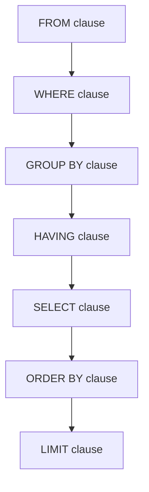

# MySQL SELECT

The `SELECT` statement is the cornerstone of MySQL querying, allowing you to retrieve data from one or more tables in a database. Whether you're building a simple application or working with complex data structures, mastering the `SELECT` statement is essential for effective database interaction.

## Introduction to SELECT

The `SELECT` statement allows you to:
- Retrieve specific columns or all columns from a table
- Filter data based on conditions
- Sort results in specific orders
- Combine data from multiple tables
- Perform calculations on data
- Group and summarize information

## Basic Syntax

The most basic form of the `SELECT` statement follows this structure:

```sql
SELECT column1, column2, ...
FROM table_name;
```

To select all columns, you can use the asterisk symbol:

```sql
SELECT * FROM table_name;
```

## Simple SELECT Examples

Let's start with simple examples using a hypothetical `employees` table:

### Example 1: Selecting All Columns

```sql
SELECT * FROM employees;
```

This returns all columns and all rows from the employees table.

**Output:**
```
+----+------------+-------------+--------+------------+
| id | first_name | last_name   | salary | department |
+----+------------+-------------+--------+------------+
|  1 | John       | Smith       |  65000 | Marketing  |
|  2 | Sarah      | Johnson     |  72000 | Finance    |
|  3 | Michael    | Williams    |  55000 | IT         |
|  4 | Jessica    | Brown       |  67500 | HR         |
|  5 | David      | Miller      |  85000 | IT         |
+----+------------+-------------+--------+------------+
```

### Example 2: Selecting Specific Columns

```sql
SELECT first_name, last_name, department FROM employees;
```

This returns only the specified columns for all employees.

**Output:**
```
+------------+-------------+------------+
| first_name | last_name   | department |
+------------+-------------+------------+
| John       | Smith       | Marketing  |
| Sarah      | Johnson     | Finance    |
| Michael    | Williams    | IT         |
| Jessica    | Brown       | HR         |
| David      | Miller      | IT         |
+------------+-------------+------------+
```

## Filtering Results with WHERE

The `WHERE` clause allows you to filter results based on specific conditions:

```sql
SELECT column1, column2, ...
FROM table_name
WHERE condition;
```

### Example 3: Basic Filtering

```sql
SELECT first_name, last_name, salary
FROM employees
WHERE department = 'IT';
```

This returns only employees from the IT department.

**Output:**
```
+------------+-------------+--------+
| first_name | last_name   | salary |
+------------+-------------+--------+
| Michael    | Williams    |  55000 |
| David      | Miller      |  85000 |
+------------+-------------+--------+
```

### Example 4: Using Comparison Operators

```sql
SELECT first_name, last_name, salary, department
FROM employees
WHERE salary > 70000;
```

This retrieves employees with salaries above $70,000.

**Output:**
```
+------------+-------------+--------+------------+
| first_name | last_name   | salary | department |
+------------+-------------+--------+------------+
| Sarah      | Johnson     |  72000 | Finance    |
| David      | Miller      |  85000 | IT         |
+------------+-------------+--------+------------+
```

## Common Comparison Operators

| Operator | Description           |
|----------|-----------------------|
| `=`      | Equal                 |
| `>`      | Greater than          |
| `<`      | Less than             |
| `>=`     | Greater than or equal |
| `<=`     | Less than or equal    |
| `<>`     | Not equal             |
| `!=`     | Not equal             |

## Logical Operators for Multiple Conditions

You can combine multiple conditions using logical operators:

- `AND`: Both conditions must be true
- `OR`: At least one condition must be true
- `NOT`: Negates the condition

### Example 5: Using AND Operator

```sql
SELECT first_name, last_name, salary, department
FROM employees
WHERE department = 'IT' AND salary > 60000;
```

This returns IT employees with salaries above $60,000.

**Output:**
```
+------------+-------------+--------+------------+
| first_name | last_name   | salary | department |
+------------+-------------+--------+------------+
| David      | Miller      |  85000 | IT         |
+------------+-------------+--------+------------+
```

### Example 6: Using OR Operator

```sql
SELECT first_name, last_name, department, salary
FROM employees
WHERE department = 'Marketing' OR salary > 80000;
```

This returns employees who either work in Marketing or have a salary above $80,000.

**Output:**
```
+------------+-------------+------------+--------+
| first_name | last_name   | department | salary |
+------------+-------------+------------+--------+
| John       | Smith       | Marketing  |  65000 |
| David      | Miller      | IT         |  85000 |
+------------+-------------+------------+--------+
```

## Sorting Results with ORDER BY

The `ORDER BY` clause allows you to sort results in ascending or descending order:

```sql
SELECT column1, column2, ...
FROM table_name
ORDER BY column1 [ASC|DESC], column2 [ASC|DESC], ...;
```

### Example 7: Basic Sorting

```sql
SELECT first_name, last_name, salary
FROM employees
ORDER BY salary DESC;
```

This returns all employees sorted by salary in descending order.

**Output:**
```
+------------+-------------+--------+
| first_name | last_name   | salary |
+------------+-------------+--------+
| David      | Miller      |  85000 |
| Sarah      | Johnson     |  72000 |
| Jessica    | Brown       |  67500 |
| John       | Smith       |  65000 |
| Michael    | Williams    |  55000 |
+------------+-------------+--------+
```

### Example 8: Multiple Sort Criteria

```sql
SELECT first_name, last_name, department, salary
FROM employees
ORDER BY department ASC, salary DESC;
```

This sorts employees first by department (alphabetically) and then by salary (highest to lowest).

**Output:**
```
+------------+-------------+------------+--------+
| first_name | last_name   | department | salary |
+------------+-------------+------------+--------+
| Sarah      | Johnson     | Finance    |  72000 |
| Jessica    | Brown       | HR         |  67500 |
| David      | Miller      | IT         |  85000 |
| Michael    | Williams    | IT         |  55000 |
| John       | Smith       | Marketing  |  65000 |
+------------+-------------+------------+--------+
```

## LIMIT Clause for Restricting Results

The `LIMIT` clause restricts the number of records returned:

```sql
SELECT column1, column2, ...
FROM table_name
LIMIT number;
```

### Example 9: Using LIMIT

```sql
SELECT first_name, last_name, salary
FROM employees
ORDER BY salary DESC
LIMIT 3;
```

This returns the three highest paid employees.

**Output:**
```
+------------+-------------+--------+
| first_name | last_name   | salary |
+------------+-------------+--------+
| David      | Miller      |  85000 |
| Sarah      | Johnson     |  72000 |
| Jessica    | Brown       |  67500 |
+------------+-------------+--------+
```

## Using DISTINCT to Get Unique Values

The `DISTINCT` keyword removes duplicate values from the results:

```sql
SELECT DISTINCT column1, column2, ...
FROM table_name;
```

### Example 10: Using DISTINCT

```sql
SELECT DISTINCT department FROM employees;
```

This returns a list of unique departments.

**Output:**
```
+------------+
| department |
+------------+
| Marketing  |
| Finance    |
| IT         |
| HR         |
+------------+
```

## Working with NULL Values

MySQL uses the `NULL` value to represent missing or unknown data. To check for NULL values, use the `IS NULL` or `IS NOT NULL` operators:

### Example 11: Finding NULL Values

```sql
SELECT first_name, last_name, manager_id
FROM employees
WHERE manager_id IS NULL;
```

This returns employees who don't have a manager (assuming a `manager_id` column exists).

### Example 12: Finding Non-NULL Values

```sql
SELECT first_name, last_name, phone_number
FROM employees
WHERE phone_number IS NOT NULL;
```

This returns employees who have a phone number recorded.

## Using Column Aliases

You can rename columns in the result set using aliases:

```sql
SELECT column1 AS alias1, column2 AS alias2, ...
FROM table_name;
```

### Example 13: Using Aliases

```sql
SELECT 
  first_name AS "First Name", 
  last_name AS "Last Name",
  salary AS "Annual Salary"
FROM employees;
```

This renames the columns in the result set to be more readable.

**Output:**
```
+------------+-----------+---------------+
| First Name | Last Name | Annual Salary |
+------------+-----------+---------------+
| John       | Smith     |         65000 |
| Sarah      | Johnson   |         72000 |
| Michael    | Williams  |         55000 |
| Jessica    | Brown     |         67500 |
| David      | Miller    |         85000 |
+------------+-----------+---------------+
```

## Practical Examples

### Example 14: Customer Order Summary

Let's say we have a `customers` table and an `orders` table in an e-commerce database:

```sql
SELECT 
  c.customer_id,
  c.first_name, 
  c.last_name,
  COUNT(o.order_id) AS total_orders,
  SUM(o.order_amount) AS total_spent
FROM customers c
JOIN orders o ON c.customer_id = o.customer_id
GROUP BY c.customer_id, c.first_name, c.last_name
ORDER BY total_spent DESC
LIMIT 5;
```

This returns the top 5 customers by total spending, along with how many orders they've placed.

### Example 15: Product Performance Analysis

```sql
SELECT 
  p.product_name,
  p.category,
  SUM(order_items.quantity) AS units_sold,
  SUM(order_items.quantity * p.price) AS revenue
FROM products p
JOIN order_items ON p.product_id = order_items.product_id
GROUP BY p.product_id, p.product_name, p.category
ORDER BY revenue DESC;
```

This analyzes product performance by calculating units sold and revenue for each product.

## The Query Execution Flowchart

The following diagram shows the logical order in which a SELECT statement is processed:



Understanding this order is important when troubleshooting complex queries.

## Common Mistakes and Best Practices

### Mistakes to Avoid
1. Using `SELECT *` in production code (retrieves unnecessary data)
2. Not adding proper WHERE clauses (returns too many rows)
3. Using non-indexed columns in WHERE clauses (poor performance)
4. Not escaping special characters in string literals

### Best Practices
1. Always select only the columns you need
2. Use meaningful aliases for better readability
3. Use proper indentation and formatting for complex queries
4. Add comments for complex logic
5. Test queries with a limited dataset before running on large tables

## Summary

The MySQL `SELECT` statement is the foundation of data retrieval in MySQL databases. We've covered:

- Basic syntax and simple queries
- Filtering with WHERE clauses and comparison operators
- Logical operators for complex conditions
- Sorting results with ORDER BY
- Limiting results with LIMIT
- Finding unique values with DISTINCT
- Handling NULL values
- Using column aliases
- Real-world practical examples

These concepts form the building blocks for more advanced database queries, allowing you to effectively extract and analyze data from your MySQL databases.

## Exercises

1. Create a SELECT query that returns employees with salaries between $60,000 and $80,000.
2. Write a query to find all employees not working in the Finance or HR departments.
3. Create a query that returns the average salary by department, sorted from highest to lowest.
4. Write a query that returns the top 3 highest paid employees from each department.
5. Create a query that counts the number of employees hired in each year (assuming there's a hire_date column).

## Additional Resources

- [MySQL Documentation on SELECT Statement](https://dev.mysql.com/doc/refman/8.0/en/select.html)
- [MySQL Tutorial](https://www.mysqltutorial.org/mysql-select-statement/)
- [W3Schools SQL SELECT Tutorial](https://www.w3schools.com/sql/sql_select.asp)

Happy querying!