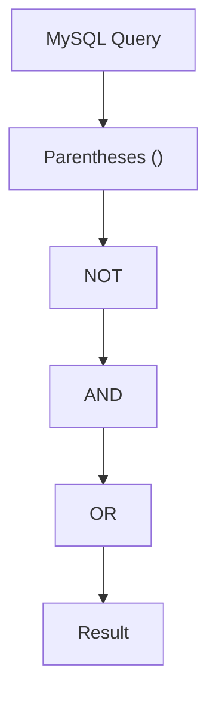

# MySQL AND, OR, NOT Operators

When working with databases, you often need to filter data based on multiple conditions. MySQL provides three powerful logical operators — `AND`, `OR`, and `NOT` — that allow you to combine or negate conditions in your queries. Understanding these operators is essential for creating effective database queries.

## Introduction to Logical Operators

Logical operators help you create complex conditions in your `WHERE` clause, enabling precise data filtering. Here's a quick overview:

- **AND**: Returns records if all the conditions separated by AND are TRUE
- **OR**: Returns records if any of the conditions separated by OR is TRUE
- **NOT**: Returns records if the condition is NOT TRUE (negates a condition)

Let's explore each of these operators with examples to see how they work in practice.

## The AND Operator

The `AND` operator displays a record if **all** the conditions separated by `AND` are TRUE. Think of it as requiring every condition to be met for a row to be included in your results.

### Syntax

```sql
SELECT column1, column2, ...
FROM table_name
WHERE condition1 AND condition2 AND condition3 ...;
```

### Examples

Let's use a sample `employees` table for our examples:

```sql
SELECT * FROM employees
WHERE salary > 50000 AND department = 'Marketing';
```

**Output:**
```
+----+------------+------------+------------+----------+
| id | first_name | last_name  | department | salary   |
+----+------------+------------+------------+----------+
| 3  | Sarah      | Johnson    | Marketing  | 65000.00 |
| 8  | Michael    | Rodriguez  | Marketing  | 61500.00 |
+----+------------+------------+------------+----------+
```

This query returns only employees who work in the Marketing department AND earn more than $50,000.

You can use more than two conditions:

```sql
SELECT * FROM employees
WHERE salary > 50000 
  AND department = 'Marketing' 
  AND hire_date > '2020-01-01';
```

This returns employees meeting all three conditions: Marketing department, salary over $50,000, and hired after January 1, 2020.

## The OR Operator

The `OR` operator displays a record if **any** of the conditions separated by `OR` is TRUE. A row will be included in your results if at least one condition is satisfied.

### Syntax

```sql
SELECT column1, column2, ...
FROM table_name
WHERE condition1 OR condition2 OR condition3 ...;
```

### Examples

Using our `employees` table:

```sql
SELECT * FROM employees
WHERE department = 'Marketing' OR department = 'Sales';
```

**Output:**
```
+----+------------+------------+------------+----------+
| id | first_name | last_name  | department | salary   |
+----+------------+------------+------------+----------+
| 1  | John       | Smith      | Sales      | 48000.00 |
| 3  | Sarah      | Johnson    | Marketing  | 65000.00 |
| 5  | Robert     | Brown      | Sales      | 53500.00 |
| 8  | Michael    | Rodriguez  | Marketing  | 61500.00 |
+----+------------+------------+------------+----------+
```

This query returns employees who work in either Marketing OR Sales departments.

Another example:

```sql
SELECT * FROM employees
WHERE salary > 70000 OR (department = 'IT' AND experience > 5);
```

This returns employees with salary greater than $70,000 OR those who work in IT with more than 5 years of experience.

## The NOT Operator

The `NOT` operator displays a record if the condition is NOT TRUE. It negates the condition it precedes.

### Syntax

```sql
SELECT column1, column2, ...
FROM table_name
WHERE NOT condition;
```

### Examples

Using our `employees` table:

```sql
SELECT * FROM employees
WHERE NOT department = 'IT';
```

**Output:**
```
+----+------------+------------+------------+----------+
| id | first_name | last_name  | department | salary   |
+----+------------+------------+------------+----------+
| 1  | John       | Smith      | Sales      | 48000.00 |
| 3  | Sarah      | Johnson    | Marketing  | 65000.00 |
| 5  | Robert     | Brown      | Sales      | 53500.00 |
| 7  | Emily      | Davis      | HR         | 52000.00 |
| 8  | Michael    | Rodriguez  | Marketing  | 61500.00 |
+----+------------+------------+------------+----------+
```

This query returns all employees except those in the IT department.

Another example:

```sql
SELECT * FROM employees
WHERE NOT (salary < 50000);
```

This returns all employees with salary greater than or equal to $50,000. It's equivalent to `WHERE salary >= 50000`.

## Combining Logical Operators

You can combine multiple logical operators to create complex conditions. When doing so, it's important to use parentheses to establish the order of evaluation.

### Examples

```sql
SELECT * FROM employees
WHERE (department = 'Marketing' OR department = 'Sales') AND salary > 50000;
```

**Output:**
```
+----+------------+------------+------------+----------+
| id | first_name | last_name  | department | salary   |
+----+------------+------------+------------+----------+
| 3  | Sarah      | Johnson    | Marketing  | 65000.00 |
| 5  | Robert     | Brown      | Sales      | 53500.00 |
| 8  | Michael    | Rodriguez  | Marketing  | 61500.00 |
+----+------------+------------+------------+----------+
```

This query returns employees from Marketing OR Sales departments, but only if they earn more than $50,000.

Without parentheses, the query might be interpreted differently:

```sql
SELECT * FROM employees
WHERE department = 'Marketing' OR department = 'Sales' AND salary > 50000;
```

In this case, MySQL would evaluate the `AND` condition first (due to operator precedence), returning all Marketing employees, plus Sales employees earning over $50,000.

## Operator Precedence

When combining operators, MySQL follows this precedence order:
1. Parentheses `()`
2. `NOT`
3. `AND`
4. `OR`

To avoid confusion and ensure your query works as expected, use parentheses to explicitly group conditions.



## Real-World Applications

### E-commerce Product Filtering

Imagine you're building an e-commerce website that allows users to filter products:

```sql
SELECT * FROM products
WHERE 
    (category = 'Electronics' OR category = 'Computers')
    AND price BETWEEN 100 AND 500
    AND NOT (stock = 0 OR discontinued = TRUE);
```

This query finds:
- Products in Electronics OR Computers categories
- With prices between $100 and $500
- That are in stock and not discontinued

### Customer Segmentation

For a marketing campaign targeting specific customer segments:

```sql
SELECT * FROM customers
WHERE 
    (total_purchases > 1000 OR membership_level = 'Premium')
    AND signup_date > '2022-01-01'
    AND NOT region = 'Europe';
```

This query finds high-value customers or premium members who signed up recently and are not from Europe.

## Common Mistakes and Best Practices

### Missing Parentheses

Without proper parentheses, your query might not do what you expect:

```sql
-- Probably not what you want
SELECT * FROM employees
WHERE department = 'Marketing' OR department = 'Sales' AND salary > 50000;

-- More likely what you intended
SELECT * FROM employees
WHERE (department = 'Marketing' OR department = 'Sales') AND salary > 50000;
```

### Confusing NOT Logic

Be careful with `NOT` operators, especially with multiple conditions:

```sql
-- Returns employees who are either not in Marketing OR have salary <= 50000
SELECT * FROM employees
WHERE NOT (department = 'Marketing' AND salary > 50000);

-- Equivalent to:
SELECT * FROM employees
WHERE department != 'Marketing' OR salary <= 50000;
```

### Best Practices

1. **Use parentheses liberally**: Even when not strictly necessary, they make your queries more readable and prevent mistakes
2. **Break complex conditions into parts**: For very complex filters, consider using temporary tables or multiple queries
3. **Test with sample data**: Always test your conditions with known data to verify they work as expected

## Summary

Logical operators in MySQL are powerful tools for filtering data based on multiple conditions:

- **AND**: Used when all conditions must be true
- **OR**: Used when at least one condition must be true
- **NOT**: Used to negate a condition
- **Parentheses**: Used to control the order of evaluation

By mastering these operators, you can create precise, efficient queries that extract exactly the data you need from your database.

## Exercises

Test your understanding with these exercises:

1. Write a query to find all employees in the Marketing department who earn more than $60,000 and were hired after 2019.

2. Find all products that are either in the "Electronics" category with a price less than $100, or in the "Books" category with a price less than $20.

3. Retrieve all customers who are not from the USA and have either placed more than 5 orders or spent more than $1000 total.

4. Create a query that finds employees who are not in the IT department and have been with the company for less than 2 years.

5. Write a query to find products that are in stock (stock > 0) and are either on sale OR have a rating greater than 4.5.

## Additional Resources

- [MySQL Documentation on Logical Operators](https://dev.mysql.com/doc/refman/8.0/en/logical-operators.html)
- [MySQL Boolean Operators Tutorial](https://www.mysqltutorial.org/mysql-boolean/)
- [SQL Boolean Expressions](https://www.w3schools.com/sql/sql_operators.asp)