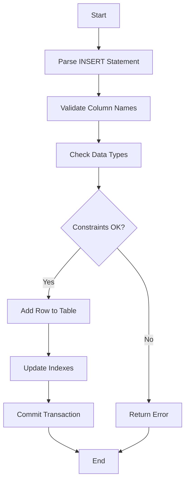

# MySQL INSERT Statement

The INSERT statement is one of the most fundamental operations in MySQL. It allows you to add new records (rows) to your database tables. Whether you're building a user registration system, a product catalog, or any application that stores data, mastering the INSERT statement is essential.

## Introduction to INSERT

The INSERT statement adds new data to a table in your MySQL database. It's part of the Data Manipulation Language (DML) in SQL, which deals with managing data stored in the database.

Before you can insert data, you need:
1. A table to insert data into
2. The data values that match the table structure
3. Appropriate permissions to perform insert operations

## Basic Syntax

The basic syntax of the INSERT statement is:

```sql
INSERT INTO table_name (column1, column2, column3, ...)
VALUES (value1, value2, value3, ...);
```

Let's break this down:
- `INSERT INTO table_name`: Specifies the table where you want to add data
- `(column1, column2, column3, ...)`: Lists the columns you want to populate
- `VALUES (value1, value2, value3, ...)`: Provides the values for those columns

## Simple INSERT Example

Let's create a basic example. First, imagine we have a `students` table:

```sql
CREATE TABLE students (
    student_id INT AUTO_INCREMENT PRIMARY KEY,
    first_name VARCHAR(50),
    last_name VARCHAR(50),
    email VARCHAR(100),
    enrollment_date DATE
);
```

Now let's insert a single record:

```sql
INSERT INTO students (first_name, last_name, email, enrollment_date)
VALUES ('John', 'Doe', 'john.doe@example.com', '2023-09-01');
```

After executing this statement, we'll have:

| student_id | first_name | last_name | email               | enrollment_date |
|------------|------------|-----------|---------------------|----------------|
| 1          | John       | Doe       | john.doe@example.com| 2023-09-01     |

Notice that we didn't specify the `student_id` since it's an AUTO_INCREMENT field that MySQL will automatically assign.

## Inserting Multiple Records at Once

You can insert multiple records in a single INSERT statement by providing multiple value sets:

```sql
INSERT INTO students (first_name, last_name, email, enrollment_date)
VALUES 
('Jane', 'Smith', 'jane.smith@example.com', '2023-09-02'),
('Michael', 'Johnson', 'michael.j@example.com', '2023-09-03'),
('Emily', 'Brown', 'emily.b@example.com', '2023-09-04');
```

This is more efficient than executing multiple separate INSERT statements.

## Inserting Values for All Columns

If you're providing values for all columns in the table (in the same order they appear in the table definition), you can omit the column list:

```sql
INSERT INTO students
VALUES (NULL, 'Robert', 'Wilson', 'robert.w@example.com', '2023-09-05');
```

Here, `NULL` is used for the `student_id` column, allowing MySQL to generate the ID automatically.

However, **it's considered a best practice to always explicitly list your columns** to make your code more maintainable and less prone to errors when the table structure changes.

## Inserting Specific Columns

You don't need to insert values into every column. Columns that you omit will:
- Use their default value if one is defined
- Use `NULL` if they allow NULL values
- Raise an error if they don't allow NULL and have no default value

```sql
INSERT INTO students (first_name, last_name)
VALUES ('Sarah', 'Johnson');
```

In this example, `email` and `enrollment_date` will be NULL (assuming they allow NULL values).

## Inserting Data from SELECT Statements

You can also insert data that comes from a query on another table:

```sql
INSERT INTO current_students (first_name, last_name, email)
SELECT first_name, last_name, email
FROM students
WHERE enrollment_date > '2023-01-01';
```

This is useful for copying or moving data between tables.

## Handling Duplicate Keys

When inserting data, you might encounter duplicate key errors if you try to insert a value that conflicts with a unique or primary key constraint. MySQL provides several ways to handle this:

### IGNORE Keyword

The `IGNORE` keyword tells MySQL to ignore rows that would cause duplicate key errors:

```sql
INSERT IGNORE INTO students (student_id, first_name, last_name)
VALUES (1, 'David', 'Miller');
```

If student_id 1 already exists, this row will be silently ignored.

### ON DUPLICATE KEY UPDATE

This clause lets you update the existing row when a duplicate key error occurs:

```sql
INSERT INTO students (student_id, first_name, last_name, email)
VALUES (1, 'David', 'Miller', 'david.m@example.com')
ON DUPLICATE KEY UPDATE
    first_name = VALUES(first_name),
    last_name = VALUES(last_name),
    email = VALUES(email);
```

This will update the existing record if student_id 1 already exists.

## Practical Examples

### Example 1: User Registration System

When a user registers on a website, you might insert their information into a users table:

```sql
CREATE TABLE users (
    user_id INT AUTO_INCREMENT PRIMARY KEY,
    username VARCHAR(50) UNIQUE,
    email VARCHAR(100) UNIQUE,
    password_hash VARCHAR(255),
    registration_date DATETIME DEFAULT CURRENT_TIMESTAMP,
    last_login DATETIME
);

-- Insert a new user
INSERT INTO users (username, email, password_hash)
VALUES ('new_user', 'user@example.com', 'hashed_password_here');
```

### Example 2: E-commerce Product Entry

Adding a new product to an e-commerce catalog:

```sql
CREATE TABLE products (
    product_id INT AUTO_INCREMENT PRIMARY KEY,
    product_name VARCHAR(100),
    category_id INT,
    price DECIMAL(10, 2),
    stock_quantity INT DEFAULT 0,
    description TEXT,
    added_date DATETIME DEFAULT CURRENT_TIMESTAMP
);

-- Adding a new product
INSERT INTO products (product_name, category_id, price, stock_quantity, description)
VALUES ('Wireless Headphones', 3, 89.99, 45, 'High-quality wireless headphones with noise cancellation');
```

### Example 3: Transaction Logging

Recording financial transactions:

```sql
CREATE TABLE transactions (
    transaction_id INT AUTO_INCREMENT PRIMARY KEY,
    account_id INT,
    transaction_type ENUM('deposit', 'withdrawal', 'transfer'),
    amount DECIMAL(12, 2),
    transaction_date DATETIME DEFAULT CURRENT_TIMESTAMP,
    description VARCHAR(255)
);

-- Record a new transaction
INSERT INTO transactions (account_id, transaction_type, amount, description)
VALUES (1001, 'deposit', 500.00, 'Monthly salary deposit');
```

## Common INSERT Errors and How to Fix Them

### 1. Column count doesn't match value count

```sql
-- Error: Column count doesn't match value count
INSERT INTO students (first_name, last_name, email)
VALUES ('John', 'Doe');
```

**Fix**: Ensure the number of values matches the number of columns specified.

### 2. Data type mismatch

```sql
-- Error: Incorrect integer value
INSERT INTO students (student_id, first_name)
VALUES ('ABC', 'John');
```

**Fix**: Make sure the data types of your values match the column definitions.

### 3. Unique constraint violations

```sql
-- Error: Duplicate entry for key 'PRIMARY'
INSERT INTO students (student_id, first_name)
VALUES (1, 'John');
```

**Fix**: Use a different primary key value or consider using ON DUPLICATE KEY UPDATE.

## Performance Considerations

1. **Batch Inserts**: Use multi-row insert syntax for better performance when adding multiple records.

2. **Disable Indexes Temporarily**: For large bulk inserts, consider temporarily disabling indexes:
   ```sql
   ALTER TABLE students DISABLE KEYS;
   -- Multiple INSERT statements here
   ALTER TABLE students ENABLE KEYS;
   ```

3. **Use Prepared Statements**: For repeated inserts, prepared statements improve performance by compiling the query once:
   ```sql
   PREPARE stmt FROM 'INSERT INTO students (first_name, last_name) VALUES (?, ?)';
   SET @a = 'John';
   SET @b = 'Doe';
   EXECUTE stmt USING @a, @b;
   ```

## Best Practices for INSERT Statements

1. **Always specify column names** to make your code more maintainable.

2. **Use parameterized queries** in your application code to prevent SQL injection.

3. **Consider transactions** for multiple related inserts to maintain data integrity.

4. **Validate data** before inserting it into the database.

5. **Handle errors appropriately** in your application code.

## Visual Representation of the INSERT Process



## Summary

The MySQL INSERT statement is a fundamental operation for adding data to your database tables. In this tutorial, we've covered:

- Basic INSERT syntax for adding single and multiple records
- Inserting data into specific columns
- Handling duplicate keys with IGNORE and ON DUPLICATE KEY UPDATE
- Inserting data from SELECT statements
- Practical examples for common use cases
- Common errors and how to fix them
- Performance considerations and best practices

Mastering the INSERT statement is essential for building applications that store data in MySQL databases. As you continue learning MySQL, you'll see how INSERT works with other SQL commands to create powerful data-driven applications.

## Exercises

1. Create a `books` table with columns for `book_id`, `title`, `author`, `publication_year`, and `genre`. Then insert at least 3 books.

2. Create an `orders` table and an `order_items` table with appropriate columns. Write INSERT statements that add an order and its related items in a single transaction.

3. Practice inserting data using a SELECT statement: create a `vip_customers` table and populate it with customers from another table who have spent over a certain amount.

4. Try inserting a record that violates a constraint, then modify your INSERT statement to handle the duplicate key appropriately.

## Additional Resources

- [MySQL Official Documentation on INSERT Statement](https://dev.mysql.com/doc/refman/8.0/en/insert.html)
- [MySQL Data Types Reference](https://dev.mysql.com/doc/refman/8.0/en/data-types.html)
- [MySQL Constraints](https://dev.mysql.com/doc/refman/8.0/en/constraints.html)

Remember that practice is key to mastering SQL. Try creating your own tables and experimenting with different INSERT scenarios to solidify your understanding.