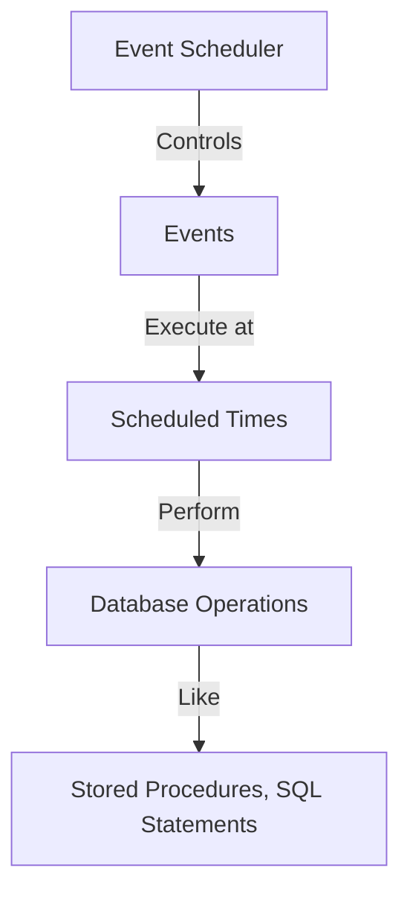

# MySQL Event Scheduler

## Introduction

The MySQL Event Scheduler is a powerful feature that allows you to create and schedule tasks (known as "events") that run automatically according to a specified schedule. Think of it as a built-in cron service that runs inside your MySQL server. Events can be used to perform a wide variety of tasks, from cleaning up old data to generating reports, updating statistics, or any other routine database maintenance operations.

In this tutorial, we'll explore how the MySQL Event Scheduler works, how to configure it, and how to create and manage events to automate your database tasks.

## What is the MySQL Event Scheduler?

The Event Scheduler is a MySQL process that executes scheduled events. An event is simply a named database object containing one or more SQL statements that run at a specific time or at recurring intervals. Events are sometimes referred to as "temporal triggers" because they're triggered by time rather than by table operations.



## Checking and Enabling the Event Scheduler

Before you can use events, you need to make sure the Event Scheduler is running. By default, the Event Scheduler is turned OFF in MySQL.

To check the status of the Event Scheduler, run:

```sql
SHOW VARIABLES LIKE 'event_scheduler';
```

This will return something like:

```
+----------------+-------+
| Variable_name  | Value |
+----------------+-------+
| event_scheduler| OFF   |
+----------------+-------+
```

To enable the Event Scheduler, you can use:

```sql
SET GLOBAL event_scheduler = ON;
```

Alternatively, you can set it in your MySQL configuration file (`my.cnf` or `my.ini`) by adding:

```
[mysqld]
event_scheduler=ON
```

Then restart your MySQL server.

You can also check if the Event Scheduler is running using:

```sql
SHOW PROCESSLIST;
```

If the Event Scheduler is running, you should see an entry like this:

```
+----+---------------+-----------+------+---------+------+------------+------------------+
| Id | User          | Host      | db   | Command | Time | State      | Info             |
+----+---------------+-----------+------+---------+------+------------+------------------+
| 1  | event_scheduler| localhost | NULL | Daemon  | 3252 | Waiting on | NULL             |
|    |               |           |      |         |      | empty queue|                  |
+----+---------------+-----------+------+---------+------+------------+------------------+
```

## Creating MySQL Events

Events are created using the `CREATE EVENT` statement. Here's the basic syntax:

```sql
CREATE EVENT [IF NOT EXISTS] event_name
ON SCHEDULE schedule
[ON COMPLETION [NOT] PRESERVE]
[ENABLE | DISABLE | DISABLE ON SLAVE]
[COMMENT 'comment']
DO event_body;
```

Let's break down the components:

- `event_name`: A unique name for your event
- `ON SCHEDULE`: When and how often the event should run
- `ON COMPLETION`: Whether to preserve the event after it completes
- `ENABLE | DISABLE | DISABLE ON SLAVE`: Event's initial status
- `COMMENT`: Optional description of the event
- `DO event_body`: SQL statements to execute when the event runs

### Types of Schedules

MySQL supports two types of schedules:

1. **One-time events** - Execute only once at a specified date and time
2. **Recurring events** - Execute repeatedly according to a schedule

#### One-time Events

For one-time events, use `AT timestamp`:

```sql
CREATE EVENT one_time_event
ON SCHEDULE AT TIMESTAMP '2023-12-31 23:59:59'
DO
  INSERT INTO yearly_summary (year, total_sales)
  SELECT 2023, SUM(sale_amount) FROM sales WHERE YEAR(sale_date) = 2023;
```

This event will run once at the end of 2023 to update the yearly summary table.

#### Recurring Events

For recurring events, use `EVERY interval [STARTS timestamp] [ENDS timestamp]`:

```sql
CREATE EVENT daily_cleanup
ON SCHEDULE EVERY 1 DAY
STARTS CURRENT_TIMESTAMP
ENDS CURRENT_TIMESTAMP + INTERVAL 30 DAY
DO
  DELETE FROM temp_logs WHERE created_at < NOW() - INTERVAL 7 DAY;
```

This event will run every day for the next 30 days, deleting logs that are older than 7 days.

### Interval Types

MySQL supports multiple interval units:

- YEAR
- QUARTER
- MONTH
- DAY
- HOUR
- MINUTE
- WEEK
- SECOND
- YEAR_MONTH
- DAY_HOUR
- DAY_MINUTE
- DAY_SECOND
- HOUR_MINUTE
- HOUR_SECOND
- MINUTE_SECOND

## Practical Examples

Let's dive into some practical examples of MySQL events for common scenarios.

### Example 1: Daily Data Archiving

This event archives old records from a high-traffic table to an archive table:

```sql
DELIMITER //

CREATE EVENT daily_order_archive
ON SCHEDULE EVERY 1 DAY
STARTS CURRENT_TIMESTAMP + INTERVAL 1 DAY
DO
BEGIN
  INSERT INTO orders_archive
  SELECT * FROM orders 
  WHERE order_date < NOW() - INTERVAL 90 DAY;
  
  DELETE FROM orders 
  WHERE order_date < NOW() - INTERVAL 90 DAY;
  
  -- Log the activity
  INSERT INTO maintenance_logs (activity, execution_time, records_affected)
  VALUES ('Order archiving', NOW(), ROW_COUNT());
END //

DELIMITER ;
```

### Example 2: Hourly Data Aggregation

This event calculates and stores hourly statistics:

```sql
DELIMITER //

CREATE EVENT hourly_traffic_stats
ON SCHEDULE EVERY 1 HOUR
DO
BEGIN
  INSERT INTO traffic_hourly_stats (hour_timestamp, page_views, unique_visitors)
  SELECT 
    DATE_FORMAT(NOW() - INTERVAL 1 HOUR, '%Y-%m-%d %H:00:00') as hour_start,
    COUNT(*) as page_views,
    COUNT(DISTINCT visitor_id) as unique_visitors
  FROM site_visits
  WHERE visit_time >= DATE_FORMAT(NOW() - INTERVAL 1 HOUR, '%Y-%m-%d %H:00:00')
  AND visit_time < DATE_FORMAT(NOW(), '%Y-%m-%d %H:00:00');
END //

DELIMITER ;
```

### Example 3: Monthly Report Generation

This event calls a stored procedure to generate monthly reports:

```sql
DELIMITER //

CREATE EVENT monthly_sales_report
ON SCHEDULE EVERY 1 MONTH
STARTS '2023-08-01 00:05:00'
DO
BEGIN
  CALL generate_monthly_sales_report(DATE_FORMAT(NOW() - INTERVAL 1 MONTH, '%Y-%m-01'));
  
  -- Send notification (pseudocode for the concept)
  INSERT INTO admin_notifications (type, message, created_at)
  VALUES ('REPORT', CONCAT('Monthly sales report for ', DATE_FORMAT(NOW() - INTERVAL 1 MONTH, '%Y-%m'), ' is ready'), NOW());
END //

DELIMITER ;
```

## Managing Events

Now that you know how to create events, let's explore how to manage them.

### Viewing Events

To view all events in your database:

```sql
SHOW EVENTS;
```

To view events from a specific database:

```sql
SHOW EVENTS FROM database_name;
```

To get detailed information about an event:

```sql
SHOW CREATE EVENT event_name;
```

### Altering Events

You can modify an existing event using the `ALTER EVENT` statement:

```sql
ALTER EVENT daily_cleanup
ON SCHEDULE EVERY 2 DAY
COMMENT 'Run cleanup every two days instead of daily';
```

### Enabling and Disabling Events

To temporarily disable an event:

```sql
ALTER EVENT daily_cleanup
DISABLE;
```

And to enable it again:

```sql
ALTER EVENT daily_cleanup
ENABLE;
```

### Dropping Events

To completely remove an event:

```sql
DROP EVENT IF EXISTS daily_cleanup;
```

## Best Practices

Here are some best practices to follow when working with MySQL Event Scheduler:

1. **Use meaningful names**: Give your events descriptive names that indicate their purpose.

2. **Include error handling**: Wrap your event logic in error handling blocks to prevent failures.

   ```sql
   CREATE EVENT error_handled_event
   ON SCHEDULE EVERY 1 DAY
   DO
   BEGIN
     DECLARE CONTINUE HANDLER FOR SQLEXCEPTION
     BEGIN
       INSERT INTO error_logs (event_name, error_time)
       VALUES ('error_handled_event', NOW());
     END;
     
     -- Your event logic here
   END;
   ```

3. **Add logging**: Log the execution of events for debugging and auditing.

4. **Use transactions**: For events that modify multiple tables, use transactions to ensure data consistency.

5. **Consider using stored procedures**: Define your complex logic in stored procedures and call them from events.

6. **Limit resource-intensive operations**: Schedule resource-intensive events during off-peak hours.

7. **Set appropriate intervals**: Don't schedule events to run too frequently as this might impact server performance.

8. **Monitor performance**: Regularly check your server's performance when events are running.

## Common Issues and Troubleshooting

### Event Not Running

If your event isn't running as expected:

1. Ensure the Event Scheduler is enabled
2. Check event status (`SHOW EVENTS`)
3. Verify your schedule syntax
4. Check for errors in your event body
5. Ensure the user has sufficient privileges

### Privileges Required

To work with events, users need the `EVENT` privilege:

```sql
GRANT EVENT ON database_name.* TO 'username'@'host';
```

Administrators typically need:

```sql
GRANT EVENT, SELECT, INSERT, UPDATE, DELETE ON database_name.* TO 'admin'@'host';
```

## Summary

The MySQL Event Scheduler is a powerful tool for automating database tasks on a schedule. It allows you to create one-time or recurring events that execute SQL statements automatically.

Key points we've covered:

- The Event Scheduler must be enabled before events can run
- Events can be scheduled to run once or on a recurring basis
- Events are ideal for routine tasks like data archiving, maintenance, and reporting
- Events can be managed using `SHOW`, `ALTER`, and `DROP` statements
- Best practices include error handling, logging, and appropriate scheduling

By leveraging MySQL events, you can automate repetitive tasks, improve database maintenance, and ensure timely processing of your data.

## Additional Resources and Practice Exercises

### Resources

- [MySQL 8.0 Reference Manual - Event Scheduler](https://dev.mysql.com/doc/refman/8.0/en/event-scheduler.html)
- [MySQL Date and Time Functions](https://dev.mysql.com/doc/refman/8.0/en/date-and-time-functions.html)

### Practice Exercises

1. Create an event that runs every Sunday at midnight to calculate weekly statistics and store them in a summary table.

2. Create an event that cleans up temporary data older than 24 hours every 4 hours.

3. Create a monitoring event that checks for low disk space and logs warnings if available space falls below a threshold.

4. Create an event that rotates log tables monthly by creating new tables with a timestamp suffix and archiving old data.

5. Design an event system for a project of your choice that includes at least three different scheduled tasks with different intervals.