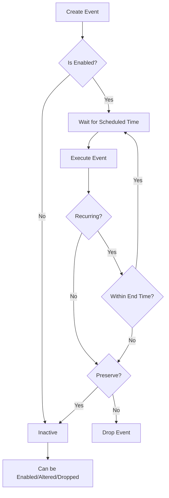

# MySQL CREATE EVENT

## Introduction

In the world of database management, automation is crucial for maintaining efficient systems. MySQL Events provide a powerful way to schedule tasks to run automatically at specific intervals or at designated times. The `CREATE EVENT` statement is your gateway to setting up these scheduled operations in MySQL.

Think of MySQL Events as database-level cron jobs - they allow you to execute SQL statements or stored procedures automatically according to a schedule, without requiring external scheduling tools or applications.

In this guide, we'll explore how to create events in MySQL, understand their syntax, and see how they can be applied in real-world scenarios.

## Prerequisites

Before diving into MySQL Events, make sure you have:

- MySQL Server 5.1.6 or higher installed
- Appropriate permissions to create events (the `EVENT` privilege)
- The Event Scheduler turned on

## Event Scheduler: The Engine Behind Events

Before creating any events, you need to ensure that MySQL's Event Scheduler is running. The Event Scheduler is the component of MySQL that executes all scheduled events.

You can check its status and enable it with:

```sql
-- Check Event Scheduler status
SHOW VARIABLES LIKE 'event_scheduler';

-- Enable the Event Scheduler
SET GLOBAL event_scheduler = ON;
```

If the Event Scheduler is disabled, your events won't execute even if they're defined correctly.

## CREATE EVENT Syntax

Here's the basic syntax for creating an event in MySQL:

```sql
CREATE EVENT [IF NOT EXISTS] event_name
ON SCHEDULE schedule
[ON COMPLETION [NOT] PRESERVE]
[ENABLE | DISABLE | DISABLE ON SLAVE]
[COMMENT 'comment']
DO event_body;
```

Let's break down each component:

- `event_name`: A unique identifier for your event
- `ON SCHEDULE`: Defines when and how often the event should execute
- `ON COMPLETION`: Determines whether the event is dropped or preserved after its last scheduled execution
- `ENABLE | DISABLE`: Controls whether the event is active
- `COMMENT`: An optional description for the event
- `DO event_body`: The SQL statements to be executed when the event runs

## Schedule Types

MySQL Events support two schedule types:

### 1. One-time Events

Execute only once at a specific time:

```sql
ON SCHEDULE AT timestamp
```

### 2. Recurring Events

Execute repeatedly at specified intervals:

```sql
ON SCHEDULE EVERY interval
[STARTS timestamp] [ENDS timestamp]
```

The `interval` can be specified in various time units: `YEAR`, `QUARTER`, `MONTH`, `DAY`, `HOUR`, `MINUTE`, or `SECOND`.

## Simple Examples

### Creating a One-time Event

Let's create an event that will run once at a specific time:

```sql
CREATE EVENT one_time_event
ON SCHEDULE AT '2023-12-31 23:59:59'
DO
  INSERT INTO year_end_logs (message, created_at) 
  VALUES ('Year 2023 has ended', NOW());
```

This event will execute once at the end of 2023, inserting a record into the `year_end_logs` table.

### Creating a Recurring Event

Now, let's create an event that runs every day:

```sql
CREATE EVENT daily_cleanup
ON SCHEDULE EVERY 1 DAY
DO
  DELETE FROM temp_data WHERE created_at < DATE_SUB(NOW(), INTERVAL 7 DAY);
```

This event will run daily, deleting records older than 7 days from the `temp_data` table.

## Advanced Event Creation

### Using START and END Times

You can specify when a recurring event should start and stop:

```sql
CREATE EVENT business_hours_monitor
ON SCHEDULE EVERY 1 HOUR
STARTS '2023-09-01 09:00:00'
ENDS '2023-12-31 17:00:00'
DO
  INSERT INTO system_stats (cpu_usage, memory_usage, timestamp)
  SELECT cpu_usage_percent, memory_usage_percent, NOW()
  FROM system_metrics_current;
```

This event runs hourly within the defined period, capturing system statistics.

### Preserving Events After Completion

By default, one-time events are dropped after execution. To keep them:

```sql
CREATE EVENT yearly_report
ON SCHEDULE AT '2023-12-31 23:59:59'
ON COMPLETION PRESERVE
DO
  CALL generate_annual_report(2023);
```

The `ON COMPLETION PRESERVE` clause ensures the event remains in the database after execution.

### Creating a Disabled Event

Sometimes you may want to create an event but not activate it immediately:

```sql
CREATE EVENT weekend_maintenance
ON SCHEDULE EVERY 1 WEEK
STARTS '2023-09-02 02:00:00'  -- Starting on a Saturday
DISABLE
DO
  CALL perform_database_maintenance();
```

This event is defined but won't run until you explicitly enable it with `ALTER EVENT`.

## Using Multiple Statements in Event Body

For more complex operations, you can use a BEGIN...END compound statement:

```sql
DELIMITER //

CREATE EVENT complex_event
ON SCHEDULE EVERY 12 HOUR
DO
BEGIN
  -- Delete old records
  DELETE FROM log_table WHERE created_at < DATE_SUB(NOW(), INTERVAL 30 DAY);
  
  -- Update statistics
  UPDATE stat_summary 
  SET last_cleanup = NOW(),
      records_removed = records_removed + ROW_COUNT();
  
  -- Insert audit record
  INSERT INTO maintenance_audit (action_type, execution_time)
  VALUES ('log cleanup', NOW());
END//

DELIMITER ;
```

## Real-world Applications

### 1. Database Maintenance

Events are perfect for routine maintenance tasks:

```sql
CREATE EVENT optimize_tables_weekly
ON SCHEDULE EVERY 1 WEEK
STARTS CURRENT_TIMESTAMP + INTERVAL 1 DAY
DO
BEGIN
  OPTIMIZE TABLE customers;
  OPTIMIZE TABLE orders;
  OPTIMIZE TABLE products;
  INSERT INTO admin_log (message) VALUES ('Weekly table optimization completed');
END;
```

### 2. Reporting and Analytics

Automatically generate reports at specific intervals:

```sql
CREATE EVENT monthly_sales_report
ON SCHEDULE EVERY 1 MONTH
STARTS DATE_FORMAT(DATE_ADD(LAST_DAY(NOW()), INTERVAL 1 DAY), '%Y-%m-01 00:05:00')
DO
BEGIN
  INSERT INTO sales_reports (report_month, total_sales, avg_order_value, report_generated_at)
  SELECT 
    DATE_FORMAT(NOW() - INTERVAL 1 MONTH, '%Y-%m') AS report_month,
    SUM(order_total) AS total_sales,
    AVG(order_total) AS avg_order_value,
    NOW() AS report_generated_at
  FROM orders
  WHERE order_date BETWEEN 
    DATE_FORMAT(NOW() - INTERVAL 1 MONTH, '%Y-%m-01') AND 
    LAST_DAY(NOW() - INTERVAL 1 MONTH);
END;
```

### 3. Data Archiving

Move old data to archive tables automatically:

```sql
CREATE EVENT archive_old_messages
ON SCHEDULE EVERY 1 DAY
STARTS CURRENT_DATE + INTERVAL 1 DAY + INTERVAL 1 HOUR
DO
BEGIN
  -- Insert old messages to archive
  INSERT INTO messages_archive
  SELECT * FROM messages
  WHERE created_at < DATE_SUB(NOW(), INTERVAL 90 DAY);
  
  -- Delete archived messages from main table
  DELETE FROM messages 
  WHERE created_at < DATE_SUB(NOW(), INTERVAL 90 DAY);
  
  -- Log the operation
  INSERT INTO system_log (operation, affected_rows, timestamp)
  VALUES ('Message archiving', ROW_COUNT(), NOW());
END;
```

## Event Lifecycle and Management

MySQL Events require ongoing management. Here's a diagram showing the lifecycle of an event:



To manage existing events, you can:

- List all events: `SHOW EVENTS;`
- View event details: `SHOW CREATE EVENT event_name;`
- Alter an event: `ALTER EVENT event_name ...`
- Drop an event: `DROP EVENT [IF EXISTS] event_name;`

## Best Practices

1. **Name events descriptively**: Include information about function and frequency.
2. **Add comments**: Document the purpose of your events.
3. **Consider server load**: Schedule resource-intensive events during off-peak hours.
4. **Include error handling**: Use compound statements with error handling where possible.
5. **Monitor execution**: Log the start and end times of your events.
6. **Keep events simple**: Complex logic is better in stored procedures that events call.
7. **Don't overlap schedules**: Be careful with events that might run longer than their schedule interval.

## Common Issues and Solutions

### Events Not Running

If your events aren't executing:

1. Check if the Event Scheduler is running: `SHOW VARIABLES LIKE 'event_scheduler';`
2. Verify the event exists and is enabled: `SHOW EVENTS;`
3. Check for syntax errors in the event body
4. Ensure the MySQL user has proper permissions

### Handling Errors in Events

Events silently fail by default. To capture errors:

```sql
CREATE EVENT error_handling_example
ON SCHEDULE EVERY 1 DAY
DO
BEGIN
  DECLARE EXIT HANDLER FOR SQLEXCEPTION
  BEGIN
    INSERT INTO event_errors (event_name, error_time)
    VALUES ('error_handling_example', NOW());
  END;
  
  -- Your event code here
  INSERT INTO daily_stats SELECT * FROM calculate_daily_metrics();
END;
```

## Summary

MySQL's `CREATE EVENT` statement is a powerful tool for automating database tasks without external scheduling systems. Events can run once or on a recurring schedule, and can perform virtually any SQL operation that you have permissions for.

Key points to remember:
- Events require the Event Scheduler to be enabled
- They can be one-time or recurring
- Event bodies can contain simple statements or complex procedures
- Proper management includes naming, documentation, and monitoring
- Events help automate maintenance, reporting, and data lifecycle tasks

By leveraging MySQL Events effectively, you can build more autonomous, self-maintaining database systems that reduce manual intervention and improve reliability.

## Additional Resources

- Practice creating different types of events for various maintenance tasks
- Try combining events with stored procedures for more complex operations
- Experiment with error handling in event bodies
- Learn to monitor event execution through logging mechanisms
- Explore the differences between MySQL Events and alternative scheduling methods

With events, you can elevate your database from a passive data store to an active component of your application architecture, capable of managing itself according to your rules and schedules.