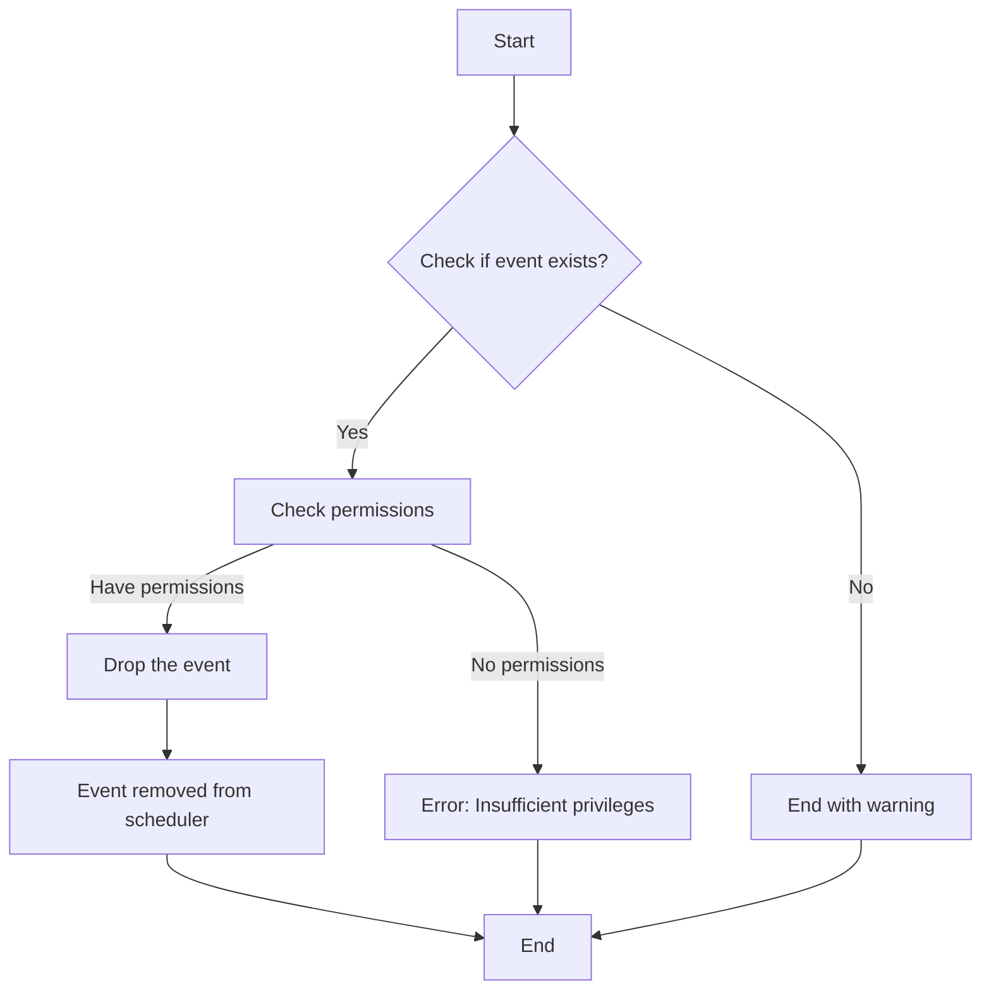

# MySQL DROP EVENT

In MySQL's event scheduling system, there may come a time when you need to remove events that are no longer required. The `DROP EVENT` statement provides a clean way to permanently delete events from your database server. This guide will walk you through the syntax, usage, and best practices for removing MySQL events.

## Introduction to DROP EVENT

Events in MySQL are tasks scheduled to run automatically at specific times or intervals. They're useful for database maintenance, data archiving, or any recurring tasks. However, when these events are no longer needed, keeping them can clutter your event scheduler and potentially impact performance.

The `DROP EVENT` statement completely removes an event from the MySQL event scheduler, eliminating both its definition and any pending executions.

## Basic Syntax

The basic syntax of the `DROP EVENT` statement is:

```sql
DROP EVENT [IF EXISTS] event_name;
```

Where:
- `[IF EXISTS]` is an optional clause that prevents an error if the event doesn't exist
- `event_name` is the name of the event you want to drop

## Using DROP EVENT

### Simple Example

Let's assume we have an event called `daily_cleanup` that we no longer need:

```sql
DROP EVENT daily_cleanup;
```

If the event exists, it will be permanently removed from the event scheduler.

### Using IF EXISTS

To avoid errors when trying to drop an event that might not exist, use the `IF EXISTS` clause:

```sql
DROP EVENT IF EXISTS daily_cleanup;
```

This command will:
- Drop the event if it exists
- Do nothing and return a warning if the event doesn't exist

**Output when event doesn't exist:**
```
Query OK, 0 rows affected, 1 warning (0.00 sec)

Warning: 1305 Event 'daily_cleanup' does not exist
```

## Prerequisites for Dropping Events

Before you can drop an event, you need to make sure you have the appropriate privileges:

1. You must have the `EVENT` privilege for the database that contains the event
2. You must be either the event creator or have the `SUPER` privilege

If you try to drop an event without proper permissions, MySQL will return an error:

```
ERROR 1305 (42000): PROCEDURE test.daily_cleanup does not exist
```

## Practical Examples

### Example 1: Verifying Before Dropping

It's a good practice to verify the event exists before dropping it:

```sql
-- First, check if the event exists
SHOW EVENTS WHERE Name = 'hourly_report';

-- Then drop it if needed
DROP EVENT IF EXISTS hourly_report;
```

### Example 2: Dropping Multiple Events

If you need to drop multiple events related to a specific task, you might do:

```sql
-- Drop a series of related events
DROP EVENT IF EXISTS data_archive_daily;
DROP EVENT IF EXISTS data_archive_weekly;
DROP EVENT IF EXISTS data_archive_monthly;
```

### Example 3: Drop and Recreate for Updates

Sometimes, it's easier to drop and recreate an event rather than modifying it:

```sql
-- Drop the existing event
DROP EVENT IF EXISTS user_stats_update;

-- Create a new version with updated logic
CREATE EVENT user_stats_update
ON SCHEDULE EVERY 1 DAY
STARTS CURRENT_TIMESTAMP
DO
  BEGIN
    -- Updated procedure logic here
    UPDATE user_statistics 
    SET login_count = (SELECT COUNT(*) FROM login_history WHERE DATE(login_time) = CURDATE());
  END;
```

### Example 4: Cleanup All Events in Development

In a development environment, you might want to clean up all events for a fresh start:

```sql
-- First, get a list of all events
SELECT EVENT_NAME FROM information_schema.EVENTS WHERE EVENT_SCHEMA = 'your_database';

-- Then you can drop each one
-- (You'd typically loop through these in a script)
DROP EVENT IF EXISTS event1;
DROP EVENT IF EXISTS event2;
-- etc.
```

## Flow of Dropping Events



## Best Practices

1. **Always use `IF EXISTS`**: This prevents scripts from failing when events don't exist.

2. **Document event changes**: Keep a log of which events have been dropped and why.

3. **Check dependencies**: Before dropping an event, ensure no processes depend on its execution.

4. **Use transactions when appropriate**: If you're dropping and recreating events, consider wrapping operations in transactions.

5. **Verify after dropping**: Use `SHOW EVENTS` to confirm the event has been removed.

```sql
SHOW EVENTS WHERE Name = 'event_name';
```

6. **Backup event definitions**: Before dropping important events, save their definition:

```sql
SHOW CREATE EVENT event_name;
```

## Common Issues

### Permission Errors

If you encounter permission errors, ensure you have the proper privileges:

```sql
GRANT EVENT ON database_name.* TO 'username'@'host';
```

### Event Not Found

Double-check the event name and database. Event names are case-sensitive in some MySQL configurations.

### System Variables

Make sure the event scheduler is running:

```sql
SHOW VARIABLES LIKE 'event_scheduler';
SET GLOBAL event_scheduler = ON;
```

## Summary

The `DROP EVENT` statement is a straightforward but powerful tool for managing MySQL's event scheduler. By removing outdated or unnecessary events, you keep your database system lean and focused on current requirements.

Key points to remember:
- Use `DROP EVENT IF EXISTS` to avoid errors
- Verify permissions before attempting to drop events
- Consider checking or backing up event definitions before dropping them
- Follow best practices like documentation and verification

## Exercise Problems

1. Create a simple event that updates a timestamp column every minute, then drop it using the appropriate command.

2. Write a script that checks if an event exists before attempting to drop it.

3. Create three related events, then write the commands to drop all of them in one transaction.

4. Practice creating an event, modifying it by dropping and recreating, and finally dropping it completely.

## Additional Resources

- [MySQL Official Documentation on Events](https://dev.mysql.com/doc/refman/8.0/en/events-overview.html)
- [MySQL Event Scheduler Reference](https://dev.mysql.com/doc/refman/8.0/en/event-scheduler.html)
- [MySQL Security and Privileges](https://dev.mysql.com/doc/refman/8.0/en/privileges-provided.html)

By mastering the `DROP EVENT` statement, you've added another important tool to your MySQL administration toolkit, helping you maintain a clean and efficient event scheduling system.