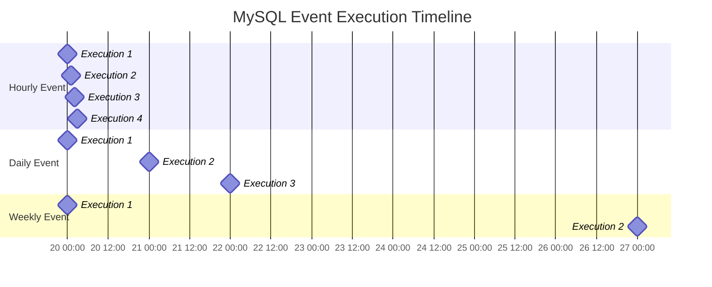

# MySQL Recurring Events

## Introduction

Recurring events are one of MySQL's most powerful features for database automation. They allow you to schedule database operations that automatically execute at regular intervals without manual intervention. This makes them ideal for routine maintenance tasks like archiving old data, generating reports, updating statistics, or performing regular cleanup operations.

In this guide, we'll explore how to create and manage recurring events in MySQL, starting from the basics and progressing to more advanced configurations.

## Prerequisites

Before diving into recurring events, make sure you have:

- MySQL 5.1.6 or higher installed
- Appropriate privileges (`EVENT` privilege) to create and manage events
- The MySQL Event Scheduler enabled on your server

## Understanding the Event Scheduler

The Event Scheduler is a MySQL process that executes scheduled events. Before creating events, check if it's running:

```sql
SHOW VARIABLES LIKE 'event_scheduler';
```

Output:
```
+----------------+-------+
| Variable_name  | Value |
+----------------+-------+
| event_scheduler | OFF  |
+----------------+-------+
```

If it's OFF, enable it with:

```sql
SET GLOBAL event_scheduler = ON;
```

You can also enable it permanently by adding the following to your MySQL configuration file:

```
event_scheduler = ON
```

## Creating Basic Recurring Events

The basic syntax for creating a recurring event is:

```sql
CREATE EVENT event_name
ON SCHEDULE schedule
DO
    event_body;
```

Let's break down each component:

- `event_name`: A unique name for your event
- `ON SCHEDULE`: Defines when and how often the event runs
- `event_body`: The SQL statement(s) to execute when the event runs

### Example: Simple Hourly Event

Let's create a simple event that logs activity every hour:

```sql
CREATE EVENT hourly_log
ON SCHEDULE EVERY 1 HOUR
DO
    INSERT INTO activity_logs (message, created_at) 
    VALUES ('Hourly check completed', NOW());
```

This event will run every hour and insert a new record into the `activity_logs` table.

## Schedule Types for Recurring Events

MySQL supports several schedule types for recurring events:

### 1. Fixed Interval Recurrence

This is the most common type, where events recur at a fixed interval:

```sql
ON SCHEDULE EVERY interval
[STARTS timestamp] [ENDS timestamp]
```

Example with start and end times:

```sql
CREATE EVENT daily_cleanup
ON SCHEDULE EVERY 1 DAY
STARTS CURRENT_DATE + INTERVAL 1 DAY
ENDS CURRENT_DATE + INTERVAL 1 YEAR
DO
    DELETE FROM temp_sessions WHERE created_at < NOW() - INTERVAL 7 DAY;
```

This event will:
- Run once a day
- Start tomorrow
- Continue for one year
- Delete temporary sessions older than a week

### 2. Multiple Interval Units

You can specify intervals using various units:

```sql
CREATE EVENT weekly_report
ON SCHEDULE EVERY 1 WEEK
DO
    CALL generate_weekly_report();
```

Available interval units:
- SECOND/SECONDS
- MINUTE/MINUTES
- HOUR/HOURS
- DAY/DAYS
- WEEK/WEEKS
- MONTH/MONTHS
- QUARTER/QUARTERS
- YEAR/YEARS

### 3. Combined Intervals

You can combine multiple interval units:

```sql
CREATE EVENT complex_interval_event
ON SCHEDULE EVERY 2 DAY 12 HOUR
STARTS '2023-01-01 00:00:00'
DO
    INSERT INTO interval_log (message) 
    VALUES (CONCAT('Event executed at ', NOW()));
```

This event runs every 2 days and 12 hours starting from January 1, 2023.

## Practical Examples of Recurring Events

Let's explore some real-world use cases for MySQL recurring events:

### 1. Database Maintenance: Removing Old Data

```sql
CREATE EVENT purge_old_logs
ON SCHEDULE EVERY 1 DAY
STARTS CURRENT_DATE + INTERVAL 1 DAY + INTERVAL 1 HOUR
DO
    BEGIN
        -- Delete logs older than 90 days
        DELETE FROM system_logs WHERE created_at < NOW() - INTERVAL 90 DAY;
        
        -- Archive logs between 30-90 days to archive table
        INSERT INTO archived_logs 
        SELECT * FROM application_logs 
        WHERE created_at BETWEEN NOW() - INTERVAL 90 DAY AND NOW() - INTERVAL 30 DAY;
        
        -- Delete the archived logs from main table
        DELETE FROM application_logs 
        WHERE created_at < NOW() - INTERVAL 30 DAY;
    END;
```

### 2. Regular Statistics Calculation

```sql
CREATE EVENT update_site_statistics
ON SCHEDULE EVERY 1 HOUR
DO
    BEGIN
        -- Calculate new user count
        UPDATE site_statistics 
        SET hourly_new_users = (
            SELECT COUNT(*) 
            FROM users 
            WHERE created_at > NOW() - INTERVAL 1 HOUR
        );
        
        -- Calculate active sessions
        UPDATE site_statistics 
        SET active_sessions = (
            SELECT COUNT(*) 
            FROM sessions 
            WHERE last_activity > NOW() - INTERVAL 15 MINUTE
        );
    END;
```

### 3. Time-Based Data Aggregation

```sql
CREATE EVENT daily_sales_aggregation
ON SCHEDULE EVERY 1 DAY
STARTS CURRENT_DATE + INTERVAL 1 DAY + INTERVAL 1 MINUTE
DO
    BEGIN
        INSERT INTO sales_summary (date, total_sales, total_orders, avg_order_value)
        SELECT 
            DATE(created_at) AS date,
            SUM(amount) AS total_sales,
            COUNT(*) AS total_orders,
            AVG(amount) AS avg_order_value
        FROM orders
        WHERE created_at BETWEEN 
            CURRENT_DATE - INTERVAL 1 DAY AND CURRENT_DATE
        GROUP BY DATE(created_at);
    END;
```

## Managing Recurring Events

### Viewing Existing Events

To see all events in the current database:

```sql
SHOW EVENTS;
```

Output:
```
+----------+----------------+---------+------------------------+--------------------+---------------------+----------------+----------------+----------------+
| Db       | Name           | Definer | Time zone             | Type               | Execute at          | Interval value | Interval field | Starts         |
+----------+----------------+---------+------------------------+--------------------+---------------------+----------------+----------------+----------------+
| mydb     | hourly_log     | root@%  | SYSTEM                | RECURRING          | NULL                | 1              | HOUR           | NULL           |
| mydb     | daily_cleanup  | root@%  | SYSTEM                | RECURRING          | NULL                | 1              | DAY            | 2023-07-20.... |
+----------+----------------+---------+------------------------+--------------------+---------------------+----------------+----------------+----------------+
```

For more detailed information:

```sql
SELECT * FROM information_schema.EVENTS WHERE EVENT_SCHEMA = 'your_database';
```

### Modifying an Event

To alter an existing event:

```sql
ALTER EVENT hourly_log
ON SCHEDULE EVERY 2 HOUR
COMMENT 'Now runs every 2 hours instead of hourly';
```

### Enabling and Disabling Events

To temporarily disable an event without deleting it:

```sql
ALTER EVENT daily_cleanup
DISABLE;
```

To enable it again:

```sql
ALTER EVENT daily_cleanup
ENABLE;
```

### Deleting an Event

When an event is no longer needed:

```sql
DROP EVENT IF EXISTS hourly_log;
```

## Advanced Techniques

### 1. Self-Managing Events

Events can modify their own schedule or even create new events:

```sql
CREATE EVENT adaptive_cleanup
ON SCHEDULE EVERY 1 DAY
DO
    BEGIN
        DECLARE row_count INT;
        
        -- Check how many records need cleanup
        SELECT COUNT(*) INTO row_count 
        FROM temp_data 
        WHERE created_at < NOW() - INTERVAL 7 DAY;
        
        -- If more than 10000 rows, change schedule to run twice daily
        IF row_count > 10000 THEN
            ALTER EVENT adaptive_cleanup
            ON SCHEDULE EVERY 12 HOUR;
        -- If less than 1000 rows, change to run weekly
        ELSEIF row_count < 1000 THEN
            ALTER EVENT adaptive_cleanup
            ON SCHEDULE EVERY 7 DAY;
        END IF;
        
        -- Perform the actual cleanup
        DELETE FROM temp_data 
        WHERE created_at < NOW() - INTERVAL 7 DAY
        LIMIT 5000;
    END;
```

### 2. Error Handling in Events

```sql
CREATE EVENT safe_cleanup
ON SCHEDULE EVERY 1 DAY
DO
    BEGIN
        DECLARE EXIT HANDLER FOR SQLEXCEPTION
        BEGIN
            INSERT INTO event_errors (event_name, error_time, message)
            VALUES ('safe_cleanup', NOW(), 'Error occurred during cleanup');
        END;
        
        -- Your regular event code here
        DELETE FROM temp_data WHERE created_at < NOW() - INTERVAL 7 DAY;
    END;
```

### 3. Creating Monthly Reports on a Specific Day

```sql
CREATE EVENT monthly_first_day_report
ON SCHEDULE 
    EVERY 1 MONTH
    STARTS DATE_ADD(DATE_ADD(DATE(LAST_DAY(NOW())), 
                   INTERVAL 1 DAY),
                   INTERVAL 1 HOUR)
DO
    CALL generate_monthly_report();
```

This event runs on the first day of each month at 1:00 AM.

## Best Practices for Recurring Events

1. **Naming Convention**: Use descriptive names like `daily_user_cleanup` or `hourly_stats_update` that indicate both frequency and purpose.

2. **Error Logging**: Implement error handling to log failures, as events run silently in the background.

3. **Performance Considerations**: 
   - Schedule resource-intensive events during off-peak hours
   - Use `LIMIT` clauses for large data operations
   - Consider breaking very large operations into smaller chunks

4. **Monitoring**: Regularly check the event execution history:

```sql
CREATE TABLE event_execution_log (
    id INT AUTO_INCREMENT PRIMARY KEY,
    event_name VARCHAR(100),
    start_time DATETIME,
    end_time DATETIME,
    status ENUM('success', 'error'),
    affected_rows INT,
    notes TEXT
);

-- Then in your events:
CREATE EVENT daily_cleanup
ON SCHEDULE EVERY 1 DAY
DO
    BEGIN
        DECLARE start_time DATETIME;
        DECLARE rows_affected INT;
        
        SET start_time = NOW();
        
        -- Perform the actual work
        DELETE FROM old_data WHERE created_at < NOW() - INTERVAL 30 DAY;
        
        -- Get affected rows
        SET rows_affected = ROW_COUNT();
        
        -- Log the execution
        INSERT INTO event_execution_log 
            (event_name, start_time, end_time, status, affected_rows)
        VALUES 
            ('daily_cleanup', start_time, NOW(), 'success', rows_affected);
    END;
```

5. **Idempotency**: Design events to be idempotent (safe to run multiple times) in case of reschedules or manual runs.

## Common Issues and Solutions

### Issue: Events Stop Running

**Possible causes:**
- Event scheduler is turned off
- Event reached its END date
- Event was disabled

**Solution:**
Check the event scheduler status and event details:

```sql
SHOW VARIABLES LIKE 'event_scheduler';
SHOW EVENTS;
```

### Issue: Event Creating Too Much Load

**Solution:**
Reschedule to off-peak hours or optimize the SQL:

```sql
ALTER EVENT heavy_analysis_event
ON SCHEDULE EVERY 1 DAY
STARTS CURRENT_DATE + INTERVAL 1 DAY + INTERVAL 3 HOUR;
```

## Visualizing Recurring Event Schedules

Here's how recurring events execute over time:



## Summary

MySQL recurring events provide a powerful mechanism for automating database maintenance tasks and scheduled operations. They can be configured to run at various intervals, from seconds to years, with precise control over start and end times.

Key benefits include:
- Automation of routine maintenance tasks
- Scheduled data processing without application intervention
- Consistent execution of time-sensitive operations
- Reduced manual DBA workload

Remember that events run within the MySQL server process, making them ideal for database-focused operations but not suitable for external system interactions.

## Practice Exercises

1. Create an event that updates a `last_updated` timestamp in a settings table every midnight.

2. Design an event that archives records older than 6 months from a `transactions` table to a `transactions_archive` table, running on the first day of each month.

3. Implement a hierarchical event system where a "controller" event runs every day and determines which "worker" events should run based on database conditions.

4. Create an event that sends an email digest (using a stored procedure) of daily activities every weekday at 5 PM, but not on weekends.

## Additional Resources

- [MySQL Official Documentation on Events](https://dev.mysql.com/doc/refman/8.0/en/events.html)
- [MySQL Event Scheduler Reference](https://dev.mysql.com/doc/refman/8.0/en/events-overview.html)
- [Performance Best Practices for MySQL Events](https://dev.mysql.com/doc/refman/8.0/en/stored-program-restrictions.html)

With these tools and techniques, you can leverage MySQL's recurring events to automate database maintenance and ensure your applications run smoothly with minimal manual intervention.