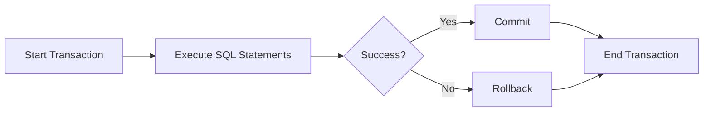

# MySQL Transaction Basics

In the world of database systems, ensuring data accuracy and reliability is paramount. MySQL transactions provide a mechanism to maintain data integrity by grouping multiple operations into a single unit of work. This tutorial will introduce you to the fundamentals of MySQL transactions, how they work, and how to implement them in your applications.

## What Is a Transaction?

A transaction is a sequence of one or more SQL statements that are executed as a single unit of work. Either all the statements in a transaction succeed, or none of them take effect. This all-or-nothing behavior is essential for maintaining data integrity.

Think of a transaction like transferring money between bank accounts:

1. Deduct money from account A
2. Add money to account B

Both steps must succeed for the transfer to be valid. If the system fails after the first step but before the second, you'd have money disappear without appearing in the destination account - clearly not acceptable!

## ACID Properties

MySQL transactions follow the ACID properties:

- **Atomicity**: All operations in a transaction complete successfully, or none of them do.
- **Consistency**: Data remains in a consistent state before and after the transaction.
- **Isolation**: Transactions operate independently without interference.
- **Durability**: Once a transaction is committed, changes persist even in the event of a system failure.



## Basic Transaction Commands

MySQL transactions are controlled using the following commands:

1. `START TRANSACTION` or `BEGIN`: Initiates a new transaction
2. `COMMIT`: Saves all changes made during the current transaction
3. `ROLLBACK`: Undoes all changes made during the current transaction
4. `SAVEPOINT`: Creates points within a transaction to which you can later roll back
5. `ROLLBACK TO SAVEPOINT`: Rolls back a transaction to a specific savepoint
6. `RELEASE SAVEPOINT`: Removes a savepoint

## Creating Your First Transaction

Let's create a simple transaction that transfers $100 from one account to another:

```sql
-- Start the transaction
START TRANSACTION;

-- Deduct $100 from account 1
UPDATE accounts SET balance = balance - 100 WHERE account_id = 1;

-- Add $100 to account 2
UPDATE accounts SET balance = balance + 100 WHERE account_id = 2;

-- If everything is okay, make the changes permanent
COMMIT;
```

If an error occurs during transaction execution, you can undo all changes:

```sql
-- Start the transaction
START TRANSACTION;

-- Deduct $100 from account 1
UPDATE accounts SET balance = balance - 100 WHERE account_id = 1;

-- Check if account 1 has enough funds
SELECT @remaining_balance := balance FROM accounts WHERE account_id = 1;

-- If insufficient funds, roll back the transaction
IF @remaining_balance < 0 THEN
  ROLLBACK;
  SELECT 'Transaction cancelled: Insufficient funds';
ELSE
  -- Add $100 to account 2
  UPDATE accounts SET balance = balance + 100 WHERE account_id = 2;
  COMMIT;
  SELECT 'Transaction completed successfully';
END IF;
```

## Using Savepoints

Savepoints allow you to roll back parts of a transaction while keeping others:

```sql
START TRANSACTION;

-- Create a new customer
INSERT INTO customers(name, email) VALUES('John Doe', 'john@example.com');
SAVEPOINT customer_created;

-- Try to create an order
INSERT INTO orders(customer_id, product_id, quantity) VALUES(LAST_INSERT_ID(), 101, 5);
SAVEPOINT order_created;

-- If inventory check fails
-- We can keep the customer but remove the order
ROLLBACK TO SAVEPOINT customer_created;

-- Then try a different product or quantity
INSERT INTO orders(customer_id, product_id, quantity) VALUES(LAST_INSERT_ID(), 102, 1);

-- Finally commit everything
COMMIT;
```

## Auto-commit Mode

By default, MySQL runs in auto-commit mode, meaning each SQL statement is treated as a separate transaction that is automatically committed. To work with transactions, you need to:

1. Either disable auto-commit mode temporarily:
   ```sql
   SET autocommit = 0;
   -- Your SQL statements here
   COMMIT;
   -- Re-enable auto-commit if desired
   SET autocommit = 1;
   ```

2. Or explicitly start a transaction:
   ```sql
   START TRANSACTION;
   -- Your SQL statements here
   COMMIT;
   ```

## Transaction Isolation Levels

MySQL supports different isolation levels that control how transactions interact with each other:

1. `READ UNCOMMITTED`: Lowest isolation level; allows dirty reads
2. `READ COMMITTED`: Prevents dirty reads
3. `REPEATABLE READ`: MySQL's default; prevents non-repeatable reads
4. `SERIALIZABLE`: Highest isolation level; prevents phantom reads

You can set the isolation level with:

```sql
SET SESSION TRANSACTION ISOLATION LEVEL READ COMMITTED;
```

## Real-World Example: E-commerce Order Processing

Let's look at a practical e-commerce scenario:

```sql
START TRANSACTION;

-- 1. Create a new order
INSERT INTO orders (customer_id, order_date, total_amount) 
VALUES (123, NOW(), 599.99);

-- Save the order_id
SET @order_id = LAST_INSERT_ID();

-- 2. Add order items
INSERT INTO order_items (order_id, product_id, quantity, price) 
VALUES (@order_id, 456, 1, 499.99);

INSERT INTO order_items (order_id, product_id, quantity, price) 
VALUES (@order_id, 789, 2, 50.00);

-- 3. Update inventory
UPDATE products SET stock_quantity = stock_quantity - 1 
WHERE product_id = 456;

UPDATE products SET stock_quantity = stock_quantity - 2 
WHERE product_id = 789;

-- 4. Check if we have enough inventory
SELECT @stock_456 := stock_quantity FROM products WHERE product_id = 456;
SELECT @stock_789 := stock_quantity FROM products WHERE product_id = 789;

IF @stock_456 < 0 OR @stock_789 < 0 THEN
  -- Not enough inventory, cancel the order
  ROLLBACK;
  SELECT 'Order cancelled due to insufficient inventory';
ELSE
  -- Everything looks good, complete the order
  COMMIT;
  SELECT 'Order processed successfully';
END IF;
```

## Common Pitfalls and Best Practices

### Things to Watch Out For:

1. **Long-Running Transactions**: Keep transactions short to avoid locking resources for extended periods.
2. **Deadlocks**: Be consistent in the order in which your applications access tables to reduce deadlock risk.
3. **Transaction Size**: Don't include too many statements in a single transaction.
4. **Error Handling**: Always properly handle errors and implement rollback logic.

### Best Practices:

1. **Explicit Transactions**: Always use explicit `START TRANSACTION` and `COMMIT` statements.
2. **Appropriate Isolation Level**: Choose the right level based on your application needs.
3. **Transaction Comments**: Consider adding comments to complex transactions.
   ```sql
   START TRANSACTION; -- Begin customer registration process
   ```
4. **Connection Management**: Close connections properly to avoid leaving transactions open.

## Performance Considerations

Transactions add overhead to database operations due to:
- Transaction log maintenance
- Lock management
- Memory usage for maintaining transaction state

For high-performance applications, consider these tips:
- Keep transactions short and focused
- Use read-only transactions when possible (`START TRANSACTION READ ONLY;`)
- Be mindful of the chosen storage engine (InnoDB supports transactions, MyISAM doesn't)

## Summary

MySQL transactions are a powerful feature that helps maintain data integrity by ensuring that related operations either all succeed or all fail. They follow the ACID properties and provide mechanisms like commits, rollbacks, and savepoints to control transaction flow.

Key points to remember:
- Use `START TRANSACTION` to begin a transaction
- Use `COMMIT` to save changes permanently
- Use `ROLLBACK` to undo changes
- Keep transactions short and focused
- Choose appropriate isolation levels

By effectively using MySQL transactions, you can build robust applications that maintain data consistency even in the face of errors or system failures.

## Exercises

1. Create a transaction that adds a new user and gives them a default role. Ensure that if the role assignment fails, the user is not created.

2. Implement a transaction with savepoints that manages a shopping cart checkout process with inventory checks.

3. Practice setting different isolation levels and observe their effects on concurrent transactions.

4. Create a transaction that handles funds transfer between accounts with proper error handling for insufficient funds.

## Additional Resources

- [MySQL Documentation on Transactions](https://dev.mysql.com/doc/refman/8.0/en/sql-transactional-statements.html)
- [Understanding Transaction Isolation Levels](https://dev.mysql.com/doc/refman/8.0/en/innodb-transaction-isolation-levels.html)
- [MySQL InnoDB Storage Engine](https://dev.mysql.com/doc/refman/8.0/en/innodb-storage-engine.html)