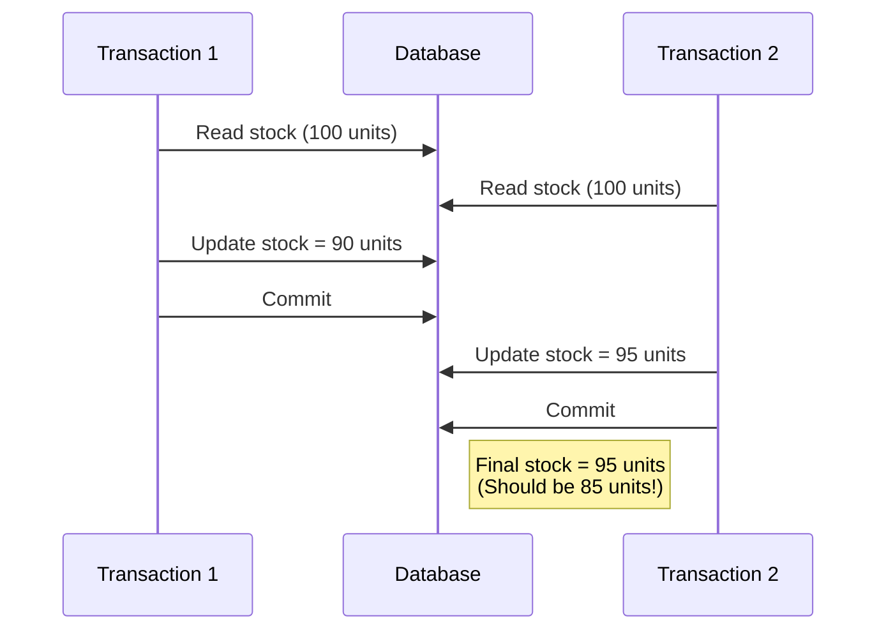
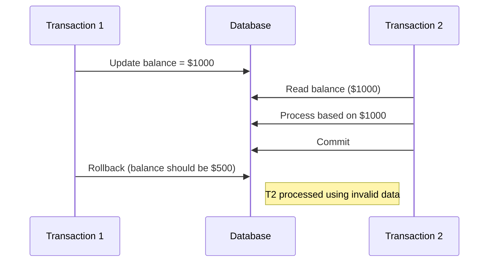

# MySQL ACID Properties

## Introduction

When working with databases, especially in applications where data integrity is crucial (banking systems, e-commerce platforms, etc.), understanding ACID properties is essential. ACID stands for **Atomicity**, **Consistency**, **Isolation**, and **Durability** - four properties that guarantee reliable transaction processing in MySQL.

These properties ensure that database transactions are processed reliably regardless of errors, power failures, or other issues. Let's explore each property in detail and understand how MySQL implements them.

## What are Transactions?

Before diving into ACID properties, let's quickly refresh what a transaction is:

A transaction is a sequence of one or more SQL operations that are executed as a single unit of work. Either all operations are completed successfully (committed), or none of them take effect (rolled back).

```sql
START TRANSACTION;
UPDATE accounts SET balance = balance - 100 WHERE account_id = 123;
UPDATE accounts SET balance = balance + 100 WHERE account_id = 456;
COMMIT;
```

## The ACID Properties

### Atomicity

**Atomicity** ensures that a transaction is treated as a single, indivisible unit of work. Either all operations within the transaction are completed successfully, or none of them take effect.

#### How Atomicity Works

1. If any part of a transaction fails, the entire transaction fails
2. The database is left unchanged if a failure occurs
3. MySQL uses rollback functionality to ensure atomicity

#### Example: Bank Transfer

Let's consider a simple bank transfer where money moves from one account to another:

```sql
START TRANSACTION;

-- Deduct $500 from account A
UPDATE accounts SET balance = balance - 500 WHERE account_id = 1;

-- Add $500 to account B
UPDATE accounts SET balance = balance + 500 WHERE account_id = 2;

-- If both operations succeed
COMMIT;

-- If any operation fails
-- ROLLBACK; (MySQL would do this automatically in case of error)
```

If the second operation fails (perhaps account #2 doesn't exist), atomicity ensures the first operation is also undone, keeping both accounts in sync. The transaction is atomic - it either completes entirely or not at all.

### Consistency

**Consistency** ensures that a transaction can only bring the database from one valid state to another, maintaining all predefined rules, including constraints, cascades, and triggers.

#### How Consistency Works

1. Transactions can only operate within defined constraints and rules
2. The database remains in a consistent state before and after transaction execution
3. All integrity constraints are maintained

#### Example: Enforcing Balance Rules

Consider a banking application with a rule that account balances cannot go below zero:

```sql
START TRANSACTION;

-- Check if there's enough balance
SELECT balance FROM accounts WHERE account_id = 1;
-- Assume result shows balance = 300

-- Try to withdraw $500 (more than available)
UPDATE accounts SET balance = balance - 500 WHERE account_id = 1;

-- This violates our business rule that balance cannot be negative
-- MySQL will enforce consistency if we have a CHECK constraint:

/*
CREATE TABLE accounts (
    account_id INT PRIMARY KEY,
    balance DECIMAL(10,2) CHECK (balance >= 0)
);
*/

-- Transaction fails and rolls back automatically
```

In this example, consistency is preserved because the CHECK constraint prevents the transaction from leaving the database in an inconsistent state with a negative balance.

### Isolation

**Isolation** ensures that concurrent execution of transactions leaves the database in the same state as if the transactions were executed sequentially.

#### How Isolation Works

1. Transactions cannot see the intermediate state of other concurrent transactions
2. MySQL implements isolation using different isolation levels
3. Higher isolation levels prevent more concurrency issues but may reduce performance

#### Isolation Levels in MySQL

MySQL supports four transaction isolation levels:

1. **READ UNCOMMITTED**: Allows dirty reads, non-repeatable reads, and phantom reads
2. **READ COMMITTED**: Prevents dirty reads, but allows non-repeatable reads and phantom reads
3. **REPEATABLE READ** (MySQL default): Prevents dirty reads and non-repeatable reads, but allows phantom reads
4. **SERIALIZABLE**: Prevents all concurrency issues but with the highest performance cost

#### Example: Concurrent Access

Let's look at a scenario with two concurrent transactions:

```sql
-- Session 1
START TRANSACTION;
UPDATE products SET stock = stock - 1 WHERE product_id = 101;

-- At this point, Session 2 executes:
START TRANSACTION;
SELECT stock FROM products WHERE product_id = 101; 
-- With REPEATABLE READ isolation, Session 2 sees the stock value before Session 1's update

-- Session 1 completes
COMMIT;

-- Session 2 continues
SELECT stock FROM products WHERE product_id = 101;
-- Still sees the original value (before Session 1's update) due to REPEATABLE READ

COMMIT;
```

To change the isolation level for a session:

```sql
SET SESSION TRANSACTION ISOLATION LEVEL READ COMMITTED;
```

### Durability

**Durability** guarantees that once a transaction is committed, it will remain so, even in the event of a system failure or power outage.

#### How Durability Works

1. Committed data is physically written to the database storage
2. MySQL uses transaction logs to ensure committed changes survive system crashes
3. Changes are not lost even if there's a power failure or system crash

#### How MySQL Implements Durability

MySQL achieves durability through:

1. **Double-write buffer**: Prevents partial page writes
2. **Transaction logs (binary logs)**: Records all changes
3. **InnoDB redo logs**: Used for crash recovery

#### Example: Ensuring Data Persists

```sql
START TRANSACTION;

INSERT INTO critical_records (customer_id, amount, transaction_date) 
VALUES (1001, 9999.99, NOW());

COMMIT;
```

After the COMMIT statement, MySQL ensures this data is permanently stored and will survive even if the system crashes immediately afterward. When the system restarts, the database engine uses its recovery mechanisms to ensure all committed transactions are reflected in the database.

## Configuring ACID Properties in MySQL

You can configure some aspects of ACID behavior in MySQL through configuration parameters:

```sql
-- Check the current isolation level
SELECT @@TRANSACTION_ISOLATION;

-- Set the default isolation level
SET GLOBAL TRANSACTION ISOLATION LEVEL REPEATABLE READ;

-- Enable or disable autocommit
SET autocommit = 0;  -- Disable autocommit
SET autocommit = 1;  -- Enable autocommit (default)
```

## Practical Example: E-commerce Order Processing

Let's look at a complete example of an e-commerce order processing system that relies on ACID properties:

```sql
START TRANSACTION;

-- 1. Check if product is in stock
SELECT stock FROM products WHERE product_id = 123;
-- Assume result is 5 (we have 5 items in stock)

-- 2. Create order record
INSERT INTO orders (order_id, customer_id, order_date, status)
VALUES (1001, 5001, NOW(), 'PROCESSING');

-- 3. Add order items
INSERT INTO order_items (order_id, product_id, quantity, price)
VALUES (1001, 123, 2, 29.99);

-- 4. Update product stock
UPDATE products SET stock = stock - 2 WHERE product_id = 123;

-- 5. Record payment
INSERT INTO payments (order_id, amount, payment_date, status)
VALUES (1001, 59.98, NOW(), 'COMPLETED');

-- If all operations succeeded, commit the transaction
COMMIT;
```

This transaction demonstrates all four ACID properties:
- **Atomicity**: All operations (creating order, updating stock, recording payment) happen together or not at all
- **Consistency**: Stock levels remain accurate, and all relationships between tables are maintained
- **Isolation**: Other transactions won't see partially created orders
- **Durability**: Once committed, the order cannot be lost

## Common Issues and How ACID Properties Help

### Lost Updates

Without proper isolation, concurrent transactions might override each other's changes:



ACID's isolation property prevents this through proper locking or versioning mechanisms.

### Dirty Reads

Transactions reading uncommitted data from other transactions:



ACID's isolation levels (except READ UNCOMMITTED) prevent dirty reads.

## Summary

The ACID properties of MySQL transactions are fundamental to ensuring data integrity in your database applications:

- **Atomicity**: Transactions are all-or-nothing operations
- **Consistency**: Transactions maintain database integrity
- **Isolation**: Concurrent transactions don't interfere with each other
- **Durability**: Committed data is permanent

Understanding and leveraging these properties helps you build more reliable and robust database applications. While enforcing ACID properties might slightly impact performance, the data integrity benefits far outweigh the costs, especially in business-critical applications.

## Additional Resources

- Experiment with different isolation levels to understand their effects on concurrency
- Practice implementing transactions in your applications
- Learn about performance implications of different transaction configurations

## Exercises

1. Write a transaction that transfers money between two accounts while ensuring the total balance remains the same.
2. Create a scenario that demonstrates a dirty read and show how to prevent it.
3. Implement a transaction with appropriate error handling that processes an order and updates inventory.
4. Compare the performance of the same operations using different isolation levels.

By understanding ACID properties, you'll build applications that maintain data integrity even under challenging conditions like concurrent access and system failures.