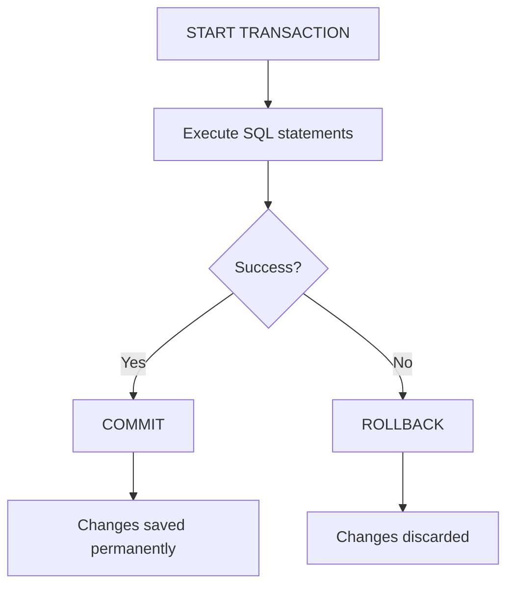

# MySQL START TRANSACTION

## Introduction

When working with databases, ensuring data integrity and consistency is paramount. MySQL transactions help you accomplish this by grouping a series of database operations into a single logical unit of work. The `START TRANSACTION` statement is the cornerstone of transaction management in MySQL, allowing you to explicitly begin a transaction.

In this tutorial, you'll learn how to use the `START TRANSACTION` statement, understand its syntax, and see practical examples of how it helps maintain data integrity in real-world applications.

## What is a Transaction?

Before diving into the `START TRANSACTION` statement, let's understand what a transaction is:

A transaction is a sequence of one or more SQL operations that are executed as a single unit of work. Either all operations succeed (commit) or all fail (rollback), ensuring database integrity.

## START TRANSACTION Syntax

The basic syntax for starting a transaction in MySQL is:

```sql
START TRANSACTION;
-- or
BEGIN;
-- or 
BEGIN WORK;
```

All three statements are equivalent in MySQL and serve the same purpose: they explicitly start a new transaction.

## How Transactions Work in MySQL

When you start a transaction, MySQL begins tracking your changes without making them permanent until you issue a `COMMIT` statement. If something goes wrong, you can use `ROLLBACK` to undo all changes made during the transaction.



## Basic Example of Using START TRANSACTION

Let's see a basic example of using `START TRANSACTION` with `COMMIT` and `ROLLBACK`:

```sql
-- Start a new transaction
START TRANSACTION;

-- Insert a new record
INSERT INTO customers (name, email) 
VALUES ('John Doe', 'john@example.com');

-- Update an existing record
UPDATE orders 
SET status = 'shipped' 
WHERE order_id = 1001;

-- If everything went well, commit the transaction
COMMIT;

-- If something went wrong, you would use:
-- ROLLBACK;
```

In this example, both the insertion and update will be treated as a single unit of work. Either both operations succeed or neither does.

## Transaction Isolation Levels

MySQL allows you to specify the isolation level for your transaction, which controls how changes made by one transaction are visible to other concurrent transactions.

You can set the isolation level when starting a transaction:

```sql
-- Start a transaction with a specific isolation level
START TRANSACTION ISOLATION LEVEL READ COMMITTED;

-- Perform your database operations
SELECT * FROM products WHERE price > 100;

-- End the transaction
COMMIT;
```

MySQL supports four isolation levels:

1. `READ UNCOMMITTED` - Allows dirty reads (seeing uncommitted changes from other transactions)
2. `READ COMMITTED` - Prevents dirty reads but allows non-repeatable reads
3. `REPEATABLE READ` - Prevents dirty reads and non-repeatable reads (MySQL's default)
4. `SERIALIZABLE` - The highest isolation level, prevents all concurrency issues

## READ ONLY and WRITE Options

MySQL also allows you to specify whether a transaction is read-only or allows writes:

```sql
-- Start a read-only transaction
START TRANSACTION READ ONLY;

-- You can only run SELECT statements in this transaction
-- Attempting to modify data will result in an error

-- Start a transaction that allows writes
START TRANSACTION READ WRITE;

-- You can run both SELECT and data modification statements
```

## Practical Examples

### Example 1: Bank Transfer

One of the classic examples of transaction usage is a bank transfer between accounts:

```sql
-- Start a transaction for a bank transfer
START TRANSACTION;

-- Deduct money from one account
UPDATE accounts 
SET balance = balance - 1000 
WHERE account_id = 123;

-- Add money to another account
UPDATE accounts 
SET balance = balance + 1000 
WHERE account_id = 456;

-- Verify both operations succeeded
SELECT @rows_affected := ROW_COUNT();
IF @rows_affected = 1 THEN
    COMMIT;
    SELECT 'Transfer completed successfully' AS message;
ELSE
    ROLLBACK;
    SELECT 'Transfer failed, transaction rolled back' AS message;
END IF;
```

In this bank transfer example, it's critical that either both updates happen or neither happens. If the system crashed after the first update but before the second, we'd have "lost" money without transactions!

### Example 2: Order Processing System

Consider an e-commerce order processing system:

```sql
START TRANSACTION;

-- Insert order header
INSERT INTO orders (customer_id, order_date, total_amount)
VALUES (101, NOW(), 599.99);

-- Get the new order ID
SET @order_id = LAST_INSERT_ID();

-- Insert order items
INSERT INTO order_items (order_id, product_id, quantity, price)
VALUES (@order_id, 1001, 2, 199.99),
       (@order_id, 1002, 1, 200.01);

-- Update product inventory
UPDATE products 
SET stock = stock - 2 
WHERE product_id = 1001;

UPDATE products 
SET stock = stock - 1 
WHERE product_id = 1002;

-- Check inventory status after updates
SELECT stock INTO @remaining_stock 
FROM products 
WHERE product_id IN (1001, 1002) 
AND stock < 0;

-- If we have negative stock, roll back
IF @remaining_stock < 0 THEN
    ROLLBACK;
    SELECT 'Order failed: Insufficient inventory' AS message;
ELSE
    COMMIT;
    SELECT 'Order processed successfully' AS message;
END IF;
```

This example demonstrates how transactions ensure that orders only go through if inventory is available, maintaining data integrity across multiple tables.

## Common Pitfalls and Best Practices

### Automatic Commits

By default, MySQL operates in autocommit mode, where each SQL statement is treated as a transaction and automatically committed. To use transactions effectively, you need to:

1. Ensure autocommit is disabled for your transaction, or
2. Explicitly use `START TRANSACTION` to begin a transaction

You can check and disable autocommit with:

```sql
-- Check autocommit status
SELECT @@autocommit;

-- Disable autocommit
SET autocommit = 0;

-- Enable autocommit
SET autocommit = 1;
```

### Transaction Timeouts

Be cautious about long-running transactions as they can:

1. Lock tables and rows for extended periods
2. Cause deadlocks with other transactions
3. Consume significant database resources

MySQL has a `lock_wait_timeout` setting that controls how long transactions wait for locks:

```sql
-- Check current timeout setting (in seconds)
SELECT @@innodb_lock_wait_timeout;

-- Set a different timeout for the current session
SET innodb_lock_wait_timeout = 50;
```

### Detecting and Handling Errors

Always check for errors and handle them appropriately in transactions:

```sql
START TRANSACTION;

-- Try to perform operations
INSERT INTO users (username, email) VALUES ('newuser', 'user@example.com');

-- Check for errors
IF ROW_COUNT() = 0 OR (SELECT @error_occurred := @@error_count) > 0 THEN
    ROLLBACK;
    SELECT 'Transaction failed, rolled back' AS message;
ELSE
    COMMIT;
    SELECT 'Transaction succeeded' AS message;
END IF;
```

## Storage Engine Considerations

Not all MySQL storage engines support transactions. The most commonly used engines and their transaction support are:

- InnoDB: Full transaction support (default in MySQL 5.5+)
- MyISAM: No transaction support
- MEMORY: No transaction support
- ARCHIVE: No transaction support

Always ensure you're using InnoDB or another transactional storage engine when you need transaction support.

## Summary

MySQL's `START TRANSACTION` statement is a powerful tool for ensuring data integrity in your database operations. By grouping SQL statements into atomic units of work, you can maintain consistency even in the face of errors or system failures.

Key points to remember:

- Use `START TRANSACTION` to begin a transaction explicitly
- Group related operations that should succeed or fail together
- Use `COMMIT` to make changes permanent when all operations succeed
- Use `ROLLBACK` to discard changes when something goes wrong
- Consider isolation levels for controlling visibility of changes
- Be aware of autocommit settings and transaction timeouts

By mastering transactions in MySQL, you'll build more robust and reliable database applications that maintain data integrity even in complex scenarios.

## Exercises

1. Create a transaction that transfers funds between two bank accounts, ensuring the balance doesn't go negative.
2. Write a transaction for a user registration system that creates user profiles across multiple tables.
3. Implement a transaction with different isolation levels and observe how concurrent access behaves differently.
4. Create a transaction that implements a shopping cart checkout process, handling inventory, orders, and customer information.
5. Try to identify cases in your own applications where using transactions would improve data integrity.

## Additional Resources

- [MySQL Official Documentation on Transactions](https://dev.mysql.com/doc/refman/8.0/en/commit.html)
- [MySQL Transaction Isolation Levels](https://dev.mysql.com/doc/refman/8.0/en/innodb-transaction-isolation-levels.html)
- [InnoDB and the ACID Model](https://dev.mysql.com/doc/refman/8.0/en/mysql-acid.html)