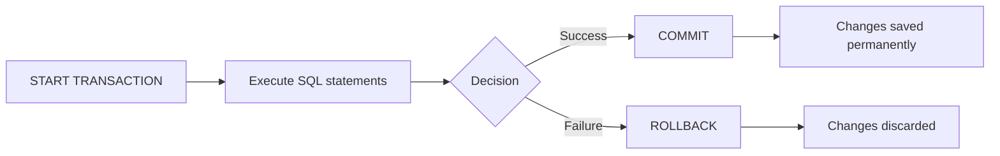

# MySQL COMMIT

## Introduction

In MySQL, a transaction is a sequence of one or more SQL statements that are executed as a single unit of work. The `COMMIT` statement is a crucial component of transaction management, as it permanently saves all changes made during the current transaction to the database.

When working with transactions in MySQL, you need to understand how to properly commit your changes to ensure data integrity and consistency. This guide will explain the `COMMIT` statement, its syntax, usage patterns, and best practices to help you effectively manage database transactions.

## What is COMMIT?

The `COMMIT` statement marks the successful end of a transaction by permanently saving all changes made since the beginning of the transaction. Once a `COMMIT` is executed:

1. All changes become permanent and visible to other database users
2. Locks acquired during the transaction are released
3. Savepoints established during the transaction are erased
4. A new transaction begins automatically if in autocommit-disabled mode

## Basic Syntax

The syntax for the `COMMIT` statement is straightforward:

```sql
COMMIT;
```

Alternatively, you can use:

```sql
COMMIT WORK;
```

Both statements have exactly the same effect - the `WORK` keyword is optional and provided for ANSI SQL compatibility.

## How Transactions Work with COMMIT

To understand `COMMIT`, we need to first grasp the transaction workflow:



## Using COMMIT in Transactions

### Basic Transaction Example

Here's a simple example of using `COMMIT` in a transaction:

```sql
-- Start a transaction
START TRANSACTION;

-- Insert a new customer
INSERT INTO customers (first_name, last_name, email) 
VALUES ('John', 'Doe', 'john.doe@example.com');

-- Update customer's credit limit
UPDATE customers 
SET credit_limit = 10000 
WHERE email = 'john.doe@example.com';

-- Permanently save changes
COMMIT;
```

After executing the `COMMIT` statement, both the insert and update operations become permanent in the database.

### Checking Autocommit Status

By default, MySQL operates in autocommit mode, where each statement is automatically committed. You can check the status with:

```sql
SELECT @@autocommit;
```

If it returns `1`, autocommit is enabled. If it returns `0`, autocommit is disabled.

### Disabling Autocommit

To work effectively with transactions, you might want to disable autocommit:

```sql
SET autocommit = 0;
```

Now, you must explicitly use `COMMIT` to save your changes or `ROLLBACK` to discard them.

## Practical Examples

### Example 1: Financial Transfer

This example shows a bank transfer transaction between two accounts:

```sql
-- Start a transaction
START TRANSACTION;

-- Get current balances (optional, for verification)
SELECT balance FROM accounts WHERE account_id = 1001;
SELECT balance FROM accounts WHERE account_id = 1002;

-- Withdraw $500 from account 1001
UPDATE accounts 
SET balance = balance - 500 
WHERE account_id = 1001;

-- Deposit $500 to account 1002
UPDATE accounts 
SET balance = balance + 500 
WHERE account_id = 1002;

-- Check if account 1001 has sufficient funds
SELECT @new_balance := balance FROM accounts WHERE account_id = 1001;

-- Commit only if balance is not negative
-- In a real application, you would use IF statements or stored procedures for this
-- For demonstration, we'll assume the balance is sufficient
COMMIT;

-- If we needed to cancel:
-- ROLLBACK;
```

### Example 2: Order Processing System

This example demonstrates a transaction for processing an order:

```sql
-- Start a transaction
START TRANSACTION;

-- Insert order header
INSERT INTO orders (customer_id, order_date, status) 
VALUES (103, CURDATE(), 'Processing');

-- Get the inserted order ID
SET @new_order_id = LAST_INSERT_ID();

-- Insert order items
INSERT INTO order_items (order_id, product_id, quantity, price) 
VALUES (@new_order_id, 501, 2, 29.99);

INSERT INTO order_items (order_id, product_id, quantity, price) 
VALUES (@new_order_id, 508, 1, 15.50);

-- Update inventory
UPDATE products 
SET stock_quantity = stock_quantity - 2 
WHERE product_id = 501;

UPDATE products 
SET stock_quantity = stock_quantity - 1 
WHERE product_id = 508;

-- Everything is successful, commit the transaction
COMMIT;
```

## Error Handling and COMMIT

When working with transactions, proper error handling is essential. Here's an example using stored procedures and error handling:

```sql
DELIMITER //

CREATE PROCEDURE transfer_funds(
    IN sender_id INT,
    IN receiver_id INT,
    IN amount DECIMAL(10,2)
)
BEGIN
    DECLARE sender_balance DECIMAL(10,2);
    DECLARE exit_handler BOOLEAN DEFAULT FALSE;
    
    DECLARE CONTINUE HANDLER FOR SQLEXCEPTION 
    BEGIN
        SET exit_handler = TRUE;
        ROLLBACK;
        SELECT 'Error occurred. Transaction rolled back.' AS message;
    END;
    
    START TRANSACTION;
    
    -- Get sender balance
    SELECT balance INTO sender_balance FROM accounts WHERE account_id = sender_id;
    
    -- Check if sufficient funds
    IF sender_balance >= amount THEN
        -- Withdraw from sender
        UPDATE accounts SET balance = balance - amount WHERE account_id = sender_id;
        
        -- Deposit to receiver
        UPDATE accounts SET balance = balance + amount WHERE account_id = receiver_id;
        
        IF NOT exit_handler THEN
            COMMIT;
            SELECT 'Transaction completed successfully.' AS message;
        END IF;
    ELSE
        ROLLBACK;
        SELECT 'Insufficient funds. Transaction cancelled.' AS message;
    END IF;
    
END //

DELIMITER ;

-- Usage example
CALL transfer_funds(1001, 1002, 500.00);
```

## Implicit vs. Explicit Commits

MySQL performs certain statements with an implicit commit, meaning they automatically end any active transaction. It's important to be aware of these:

- Data definition language (DDL) statements such as `CREATE`, `ALTER`, `DROP`
- Account management statements like `CREATE USER`, `GRANT`
- Lock statements like `LOCK TABLES`
- Some administrative statements such as `ANALYZE TABLE`

Example of implicit commit:

```sql
START TRANSACTION;

-- These statements are part of the transaction
INSERT INTO products (name, price) VALUES ('Widget', 19.99);
UPDATE inventory SET quantity = 100 WHERE product_id = 5;

-- This statement causes an implicit commit of the previous statements
-- and starts a new transaction
CREATE TABLE new_products (
    id INT PRIMARY KEY,
    name VARCHAR(100)
);

-- This statement is part of a new transaction
INSERT INTO new_products (id, name) VALUES (1, 'Gadget');

-- Explicitly commit the second transaction
COMMIT;
```

## Best Practices for Using COMMIT

1. **Keep transactions short**: Long-running transactions can hold locks and degrade database performance.

2. **Group related operations**: Include only logically related operations in a single transaction.

3. **Error handling**: Always include error handling to ensure transactions are properly committed or rolled back.

4. **Check constraints before committing**: Validate that all business rules are satisfied before committing.

5. **Be aware of implicit commits**: Know which statements might automatically commit your transaction.

6. **Use explicit transaction control**: Even with autocommit enabled, use explicit `START TRANSACTION` and `COMMIT` for clarity.

7. **Use savepoints for complex transactions**: For long transactions, consider using savepoints as fallback positions.

## Transaction Isolation and COMMIT

MySQL provides different transaction isolation levels that affect how and when committed data becomes visible to other transactions:

```sql
-- Check current isolation level
SELECT @@transaction_isolation;

-- Set session isolation level
SET SESSION TRANSACTION ISOLATION LEVEL READ COMMITTED;

START TRANSACTION;
-- operations here
COMMIT;
```

The isolation levels from least to most strict are:
- `READ UNCOMMITTED`: Can see uncommitted changes from other transactions
- `READ COMMITTED`: Only sees committed changes
- `REPEATABLE READ`: Default in MySQL, ensures consistent reads
- `SERIALIZABLE`: Highest isolation with maximum consistency

## Summary

The `COMMIT` statement is a fundamental component of MySQL's transaction processing system. It permanently saves all changes made during a transaction to the database, making them visible to all database users and releasing any locks acquired during the transaction.

Understanding when and how to commit transactions is essential for maintaining data integrity while building database applications. By following the best practices outlined in this guide, you'll be able to effectively manage transactions in your MySQL applications.

## Additional Resources

For further learning about MySQL transactions and the `COMMIT` statement:

- MySQL official documentation on [COMMIT and ROLLBACK Statements](https://dev.mysql.com/doc/refman/8.0/en/commit.html)
- Explore the `SAVEPOINT` statement to handle partial transactions
- Learn about transaction isolation levels for advanced transaction control

## Exercises

1. Create a transaction that inserts a new employee and their associated department information, then commit the changes.

2. Write a transaction for an inventory management system that updates product quantities after a sale and logs the transaction, then commit it.

3. Create a stored procedure that transfers funds between accounts using transactions and proper error handling.

4. Experiment with different transaction isolation levels and observe how they affect concurrent transactions' visibility.