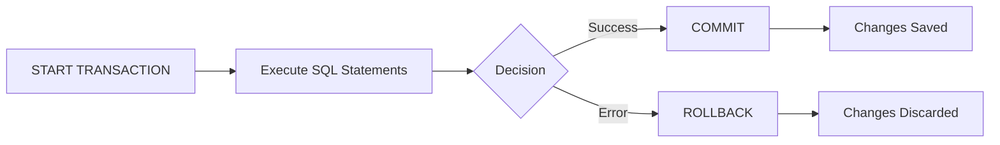

# MySQL ROLLBACK

When working with databases in real-world applications, you'll often need a way to undo operations if something goes wrong. MySQL's `ROLLBACK` command provides this critical safety net by allowing you to discard all changes made during the current transaction.

## Introduction to ROLLBACK

A `ROLLBACK` statement is used to undo all changes made in the current transaction and restore the database to the state it was in since the last `COMMIT` or since the transaction started. Think of it like an "undo" button for your database operations.

The basic syntax is straightforward:

```sql
ROLLBACK;
```

## Why Use ROLLBACK?

ROLLBACK serves several important purposes:

1. **Error recovery** - If something goes wrong during a transaction, you can roll back to a consistent state
2. **Testing** - You can try operations without permanently affecting data
3. **Data integrity** - Ensures all-or-nothing operations to maintain logical consistency

## How ROLLBACK Works

When you execute statements within a transaction, MySQL doesn't immediately make the changes permanent. Instead, it:

1. Records the changes in a transaction log
2. Applies them tentatively to the database
3. Waits for either a `COMMIT` (to make changes permanent) or `ROLLBACK` (to discard them)

Here's a simple diagram showing the transaction flow:



## Basic ROLLBACK Example

Let's see a simple example of how `ROLLBACK` works:

```sql
-- Start a new transaction
START TRANSACTION;

-- Insert a new record
INSERT INTO employees (employee_id, name, department) 
VALUES (1001, 'John Smith', 'Marketing');

-- Oops! We made a mistake
ROLLBACK;

-- The employee record was not inserted
SELECT * FROM employees WHERE employee_id = 1001;
-- Returns no results
```

In this example, the `INSERT` statement is executed, but the `ROLLBACK` command discards the change, so the new employee record never actually gets saved to the database.

## Savepoints with ROLLBACK

For more complex transactions, you can create savepoints and roll back to specific points rather than discarding the entire transaction:

```sql
-- Start transaction
START TRANSACTION;

-- Insert first record
INSERT INTO products (product_id, name, price) VALUES (101, 'Laptop', 999.99);

-- Create a savepoint
SAVEPOINT after_laptop;

-- Insert second record
INSERT INTO products (product_id, name, price) VALUES (102, 'Smartphone', 699.99);

-- Oops! We want to keep the laptop but not the smartphone
ROLLBACK TO SAVEPOINT after_laptop;

-- Commit the transaction - only the laptop is saved
COMMIT;
```

## Automatic Rollback on Errors

MySQL automatically performs a rollback if:

1. An error occurs during a transaction (for certain error types)
2. The server shuts down unexpectedly
3. The client connection is lost during a transaction

However, not all errors trigger an automatic rollback. This depends on the storage engine and the specific error.

## Real-World Example: Bank Transfer

Let's look at a classic banking scenario where `ROLLBACK` is essential:

```sql
START TRANSACTION;

-- Variables for the transfer
SET @from_account = 1001;
SET @to_account = 2002;
SET @transfer_amount = 500.00;

-- Check if sending account has sufficient funds
SELECT @current_balance := balance FROM accounts WHERE account_id = @from_account;

-- Conditional logic to verify funds
SET @sufficient_funds = (@current_balance >= @transfer_amount);

-- Deduct from sending account
UPDATE accounts 
SET balance = balance - @transfer_amount 
WHERE account_id = @from_account;

-- Add to receiving account
UPDATE accounts 
SET balance = balance + @transfer_amount 
WHERE account_id = @to_account;

-- Check if both operations affected the correct number of rows
SET @rows_updated = ROW_COUNT();

-- If any conditions fail, roll back the transaction
IF @sufficient_funds = 0 OR @rows_updated != 1 THEN
    ROLLBACK;
    SELECT 'Transaction failed: Insufficient funds or account not found' AS message;
ELSE
    COMMIT;
    SELECT 'Transfer successful' AS message;
END IF;
```

This example demonstrates how `ROLLBACK` ensures that either both parts of a transfer succeed, or neither does - maintaining data integrity.

## ROLLBACK with Different Storage Engines

It's important to note that `ROLLBACK` only works with transactional storage engines like InnoDB. With non-transactional engines like MyISAM, the `ROLLBACK` statement does not undo changes.

```sql
-- Create a table with InnoDB storage engine (supports transactions)
CREATE TABLE transactional_table (
    id INT PRIMARY KEY,
    data VARCHAR(100)
) ENGINE=InnoDB;

-- Create a table with MyISAM storage engine (doesn't support transactions)
CREATE TABLE nontransactional_table (
    id INT PRIMARY KEY,
    data VARCHAR(100)
) ENGINE=MyISAM;

-- Start transaction
START TRANSACTION;

-- Insert data in both tables
INSERT INTO transactional_table VALUES (1, 'This will be rolled back');
INSERT INTO nontransactional_table VALUES (1, 'This will NOT be rolled back');

-- Rollback
ROLLBACK;

-- Check data
SELECT * FROM transactional_table;      -- Returns empty result
SELECT * FROM nontransactional_table;   -- Returns one row with id=1
```

## Best Practices for Using ROLLBACK

1. **Always use transactions** for operations that need to be atomic (all-or-nothing).
2. **Test your rollback logic** to ensure it works as expected.
3. **Be aware of lock implications** - transactions hold locks until committed or rolled back.
4. **Keep transactions short** to minimize lock contention.
5. **Use savepoints** for complex transactions where partial rollbacks might be needed.
6. **Check your storage engine** - only use `ROLLBACK` with transactional engines.

## Common Errors and Troubleshooting

### 1. Rolling back after commit

Once you've issued a `COMMIT`, you can't roll back those changes:

```sql
START TRANSACTION;
UPDATE products SET price = price * 1.1;  -- Increase prices by 10%
COMMIT;
ROLLBACK;  -- This won't undo the price increase!
```

### 2. Implicit commits

Some statements like `CREATE TABLE` or `DROP TABLE` cause implicit commits, preventing rollback:

```sql
START TRANSACTION;
INSERT INTO customers VALUES (101, 'New Customer');
CREATE TABLE new_table (id INT);  -- Causes implicit commit!
ROLLBACK;  -- Won't undo the INSERT or the CREATE TABLE
```

### 3. Non-transactional tables

As mentioned earlier, operations on non-transactional tables (like MyISAM) can't be rolled back:

```sql
START TRANSACTION;
UPDATE myisam_table SET status = 'processing';  -- Can't be rolled back!
-- Rest of transaction...
```

## Summary

MySQL's `ROLLBACK` command is a powerful feature that helps you maintain data integrity by providing an "undo" mechanism for database operations. By understanding how to use `ROLLBACK` properly, you can:

- Safely test complex database operations
- Recover from errors without corrupting data
- Ensure atomic transactions where multiple changes succeed or fail together
- Create more robust database applications

Remember that `ROLLBACK` only works with transactional storage engines like InnoDB, and it's most effective when used as part of a well-planned transaction strategy.

## Exercises

1. Create a `customers` table and write a transaction that adds a new customer but rolls back if their credit limit is too high.
2. Write a transaction with multiple savepoints that processes an order, and practice rolling back to different stages.
3. Try to roll back an operation on a MyISAM table, then verify what happened to the data.
4. Write a transaction that transfers funds between accounts with proper error handling and rollback conditions.

## Additional Resources

- The [MySQL Documentation on Transactions](https://dev.mysql.com/doc/refman/8.0/en/commit.html)
- For more complex scenarios, look into MySQL's [XA Transactions](https://dev.mysql.com/doc/refman/8.0/en/xa-statements.html)
- Investigate [Isolation Levels](https://dev.mysql.com/doc/refman/8.0/en/innodb-transaction-isolation-levels.html) to understand how transactions interact with each other

By incorporating `ROLLBACK` into your transaction handling strategies, you'll build more robust and error-resistant database applications.