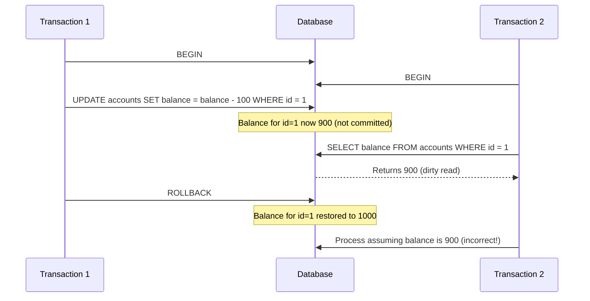
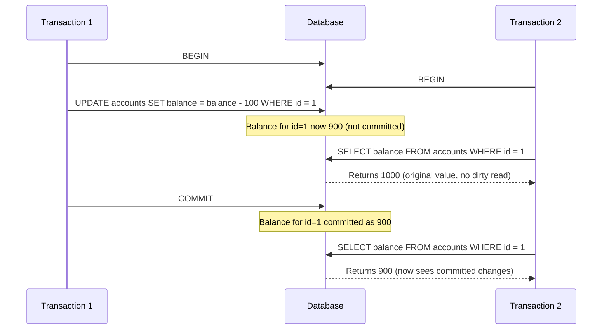
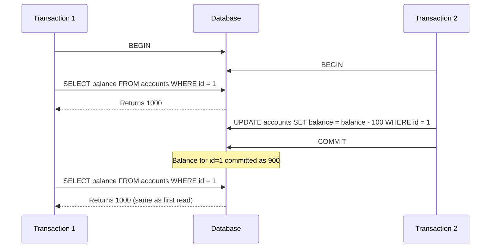
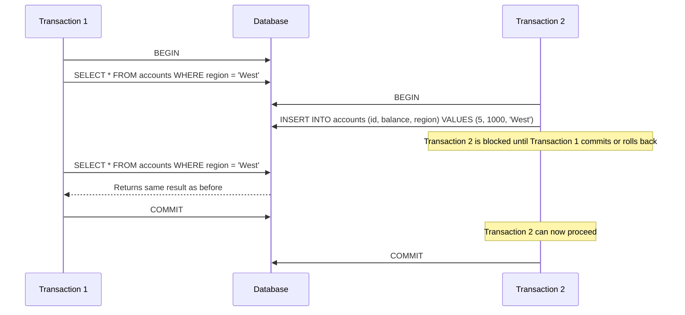

# MySQL Transaction Isolation

When multiple transactions run concurrently in a database system, MySQL needs to ensure that data integrity is maintained. Transaction isolation levels determine how the changes made by one transaction affect other concurrent transactions. Understanding these isolation levels is crucial for developing applications that interact with databases correctly and efficiently.

## What is Transaction Isolation?

Transaction isolation is one of the four key properties of ACID transactions (Atomicity, Consistency, Isolation, Durability). The isolation property ensures that concurrent execution of transactions leaves the database in the same state as if the transactions were executed sequentially.

Without proper isolation, several data anomalies can occur:

- **Dirty Reads**: A transaction reads data written by a concurrent uncommitted transaction.
- **Non-repeatable Reads**: A transaction re-reads data it has previously read and finds that data has been modified by another transaction.
- **Phantom Reads**: A transaction re-executes a query returning a set of rows that satisfy a search condition and finds that the set of rows has changed due to another transaction.

## MySQL Isolation Levels

MySQL supports four isolation levels, each offering different trade-offs between data consistency and performance:

1. **READ UNCOMMITTED** - Lowest isolation, highest performance
2. **READ COMMITTED** - Prevents dirty reads
3. **REPEATABLE READ** - Prevents dirty and non-repeatable reads (MySQL default)
4. **SERIALIZABLE** - Highest isolation, lowest performance

Let's explore each level in detail.

### READ UNCOMMITTED

At this level, transactions can see data written by other transactions even before they commit. This leads to dirty reads.



#### Example: Setting and Using READ UNCOMMITTED

```sql
-- Session 1
SET SESSION TRANSACTION ISOLATION LEVEL READ UNCOMMITTED;
START TRANSACTION;
SELECT * FROM products WHERE id = 1;
-- Output: id: 1, name: 'Widget', price: 10.00

-- Session 2 (simultaneously)
START TRANSACTION;
UPDATE products SET price = 12.00 WHERE id = 1;
-- (Not committed yet)

-- Back to Session 1
SELECT * FROM products WHERE id = 1;
-- Output: id: 1, name: 'Widget', price: 12.00 (Dirty read! Session 2 hasn't committed)
COMMIT;

-- Session 2
ROLLBACK; -- Price goes back to 10.00
```

### READ COMMITTED

This level ensures that a transaction cannot read data that has not been committed by other transactions, preventing dirty reads.



#### Example: Setting and Using READ COMMITTED

```sql
-- Session 1
SET SESSION TRANSACTION ISOLATION LEVEL READ COMMITTED;
START TRANSACTION;
SELECT * FROM products WHERE id = 1;
-- Output: id: 1, name: 'Widget', price: 10.00

-- Session 2 (simultaneously)
START TRANSACTION;
UPDATE products SET price = 12.00 WHERE id = 1;
-- (Not committed yet)

-- Back to Session 1
SELECT * FROM products WHERE id = 1;
-- Output: id: 1, name: 'Widget', price: 10.00 (No dirty read, still sees original value)

-- Session 2
COMMIT; -- Price is now committed as 12.00

-- Back to Session 1
SELECT * FROM products WHERE id = 1;
-- Output: id: 1, name: 'Widget', price: 12.00 (Now sees the committed value)
-- This is a non-repeatable read, as the same query gives different results within the same transaction
COMMIT;
```

### REPEATABLE READ (MySQL Default)

This level ensures that if a transaction reads a row, it will continue to see the same data for that row throughout the transaction, even if other transactions modify it and commit.



#### Example: Setting and Using REPEATABLE READ

```sql
-- Session 1
SET SESSION TRANSACTION ISOLATION LEVEL REPEATABLE READ;
START TRANSACTION;
SELECT * FROM products WHERE price < 20;
-- Output: 
-- id: 1, name: 'Widget', price: 10.00
-- id: 2, name: 'Gadget', price: 15.00

-- Session 2 (simultaneously)
START TRANSACTION;
UPDATE products SET price = 25.00 WHERE id = 2;
COMMIT;

-- Back to Session 1
SELECT * FROM products WHERE price < 20;
-- Output: (still shows the original snapshot)
-- id: 1, name: 'Widget', price: 10.00
-- id: 2, name: 'Gadget', price: 15.00

-- Session 2 inserts a new product
INSERT INTO products VALUES (3, 'Doohickey', 18.00);
COMMIT;

-- Back to Session 1
SELECT * FROM products WHERE price < 20;
-- Output: (original snapshot plus potential phantoms)
-- id: 1, name: 'Widget', price: 10.00
-- id: 2, name: 'Gadget', price: 15.00
-- id: 3, name: 'Doohickey', price: 18.00 (This may appear in MySQL as a phantom read)
COMMIT;
```

:::note
In MySQL's InnoDB engine, REPEATABLE READ actually prevents most phantom reads through its implementation of multi-version concurrency control (MVCC), which differs from the SQL standard definition.
:::

### SERIALIZABLE

This highest isolation level ensures transactions are executed as if they were run one after another, with no concurrency. It prevents all concurrency issues but can cause significant performance penalties.



#### Example: Setting and Using SERIALIZABLE

```sql
-- Session 1
SET SESSION TRANSACTION ISOLATION LEVEL SERIALIZABLE;
START TRANSACTION;
SELECT * FROM products WHERE category = 'electronics';
-- Output: id: 1, name: 'Widget', category: 'electronics'

-- Session 2 (simultaneously)
SET SESSION TRANSACTION ISOLATION LEVEL SERIALIZABLE;
START TRANSACTION;

-- This will block until Session 1's transaction completes
INSERT INTO products VALUES (4, 'Thingamajig', 'electronics', 30.00);

-- Back to Session 1
-- Continue working, then commit
COMMIT;

-- Now Session 2's insert is processed
COMMIT;
```

## Setting Transaction Isolation Level

You can set the isolation level in MySQL in several ways:

### For the Current Session

```sql
SET SESSION TRANSACTION ISOLATION LEVEL READ COMMITTED;
```

### For All New Sessions

```sql
SET GLOBAL TRANSACTION ISOLATION LEVEL REPEATABLE READ;
```

### For a Single Transaction

```sql
START TRANSACTION ISOLATION LEVEL SERIALIZABLE;
-- Your transaction SQL here
COMMIT;
```

### Checking Current Isolation Level

```sql
SELECT @@transaction_isolation;
-- or
SELECT @@global.transaction_isolation, @@session.transaction_isolation;
```

## Real-World Application: Online Banking System

Let's see how different isolation levels impact a banking application with concurrent transactions:

### Scenario: Fund Transfer Between Accounts

We have two transactions:
1. A fund transfer from Account A to Account B
2. A balance check for Account A

#### With READ UNCOMMITTED (Bad for Banking)

```sql
-- Session 1: Transfer funds
SET SESSION TRANSACTION ISOLATION LEVEL READ UNCOMMITTED;
START TRANSACTION;
UPDATE accounts SET balance = balance - 100 WHERE account_id = 'A';
-- At this point, money is deducted from A but not yet added to B

-- Session 2: Check balance (simultaneously)
SET SESSION TRANSACTION ISOLATION LEVEL READ UNCOMMITTED;
START TRANSACTION;
SELECT balance FROM accounts WHERE account_id = 'A';
-- Output: Shows balance minus 100, even though transfer isn't complete
-- This is problematic! Account holder might see incorrect balance.
COMMIT;

-- Back to Session 1
UPDATE accounts SET balance = balance + 100 WHERE account_id = 'B';
COMMIT;
```

#### With SERIALIZABLE (Safest for Banking)

```sql
-- Session 1: Transfer funds
SET SESSION TRANSACTION ISOLATION LEVEL SERIALIZABLE;
START TRANSACTION;
SELECT balance FROM accounts WHERE account_id = 'A' FOR UPDATE;
-- Locks row A for update
UPDATE accounts SET balance = balance - 100 WHERE account_id = 'A';
UPDATE accounts SET balance = balance + 100 WHERE account_id = 'B';

-- Session 2: Check balance (simultaneously)
SET SESSION TRANSACTION ISOLATION LEVEL SERIALIZABLE;
START TRANSACTION;
-- This will wait until Session 1 commits or rolls back
SELECT balance FROM accounts WHERE account_id = 'A';
COMMIT;

-- Back to Session 1
COMMIT;
-- Now Session 2 sees the updated balance
```

The `FOR UPDATE` clause is important here as it explicitly locks the rows being accessed, preventing other transactions from modifying them until the current transaction completes.

## Performance Considerations

There's a trade-off between isolation level and performance:

| Isolation Level   | Concurrency | Performance | Data Consistency |
|-------------------|-------------|-------------|------------------|
| READ UNCOMMITTED  | Highest     | Highest     | Lowest           |
| READ COMMITTED    | High        | Good        | Medium           |
| REPEATABLE READ   | Medium      | Medium      | Good             |
| SERIALIZABLE      | Lowest      | Lowest      | Highest          |

## Choosing the Right Isolation Level

Consider these factors when choosing an isolation level:

1. **Data Consistency Requirements**: Banking applications typically need REPEATABLE READ or SERIALIZABLE, while less critical applications might use READ COMMITTED.

2. **Concurrency Needs**: High-traffic applications may benefit from READ COMMITTED to enhance performance.

3. **Read vs. Write Operations**: Read-heavy workloads can often use lower isolation levels than write-heavy ones.

4. **Performance Constraints**: If performance is critical, using a lower isolation level with explicit locking where needed might be appropriate.

## Summary

Transaction isolation levels in MySQL provide different balances between data consistency and performance. Here's what to remember:

- **READ UNCOMMITTED**: Allows dirty reads, best avoided in most production systems.
- **READ COMMITTED**: Prevents dirty reads but allows non-repeatable reads and phantom reads.
- **REPEATABLE READ**: MySQL's default, prevents dirty reads and non-repeatable reads.
- **SERIALIZABLE**: Highest isolation, prevents all concurrency issues but with lowest performance.

Understanding these levels is crucial for developing applications that need to maintain data integrity while providing optimal performance. Choose your isolation level based on your application's specific requirements for data consistency, concurrency, and performance.

## Additional Resources and Exercises

### Resources

- [MySQL Documentation on Transaction Isolation](https://dev.mysql.com/doc/refman/8.0/en/innodb-transaction-isolation-levels.html)
- [MySQL InnoDB MVCC Implementation](https://dev.mysql.com/doc/refman/8.0/en/innodb-multi-versioning.html)

### Exercises

1. **Basic Isolation Testing**: Create a test database with a simple table and try out each isolation level, observing the differences in behavior when concurrent transactions access the same data.

2. **Deadlock Investigation**: With SERIALIZABLE isolation, create a scenario where two transactions cause a deadlock. What happens? How does MySQL resolve it?

3. **Performance Comparison**: Create a benchmark that compares the throughput of a system under different isolation levels with a mix of read and write operations.

4. **Banking Application**: Implement a simple banking system with account transfers. Test it under different isolation levels and document the anomalies that occur at each level.

5. **Row Locking**: Experiment with explicit row locking (`SELECT ... FOR UPDATE` and `SELECT ... LOCK IN SHARE MODE`) and see how they affect concurrent transactions under different isolation levels.