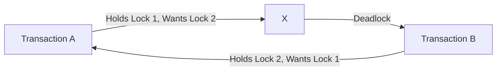

# MySQL Deadlocks

## Introduction

When working with MySQL databases in a concurrent environment, you might encounter a situation where multiple transactions are waiting for each other to release locks, resulting in a standstill. This scenario is known as a **deadlock**. Understanding deadlocks is crucial for developing robust database applications that can handle concurrent operations efficiently.

In this tutorial, we'll explore what MySQL deadlocks are, why they occur, how to identify them, and strategies to prevent and resolve them.

## What is a Deadlock?

A deadlock is a situation where two or more transactions are unable to proceed because each is waiting for the other to release resources. Think of it as a "traffic gridlock" in your database where neither transaction can move forward.



### Example of a Deadlock

Consider this simple scenario:

1. Transaction A obtains a lock on Row 1
2. Transaction B obtains a lock on Row 2
3. Transaction A now tries to lock Row 2 (but must wait for Transaction B)
4. Transaction B tries to lock Row 1 (but must wait for Transaction A)

Neither transaction can proceed, resulting in a deadlock.

## Identifying Deadlocks

MySQL automatically detects deadlocks in InnoDB and will terminate one of the transactions to break the deadlock. Typically, MySQL chooses the transaction that has modified the fewest rows.

When a deadlock occurs, MySQL generates an error like this:

```
ERROR 1213 (40001): Deadlock found when trying to get lock; try restarting transaction
```

To get more information about the latest deadlock, you can use:

```sql
SHOW ENGINE INNODB STATUS;
```

This command provides detailed information in the "LATEST DETECTED DEADLOCK" section, including:

- The transactions involved
- The SQL statements that led to the deadlock
- Lock information
- Which transaction was rolled back

## Code Example: Creating a Deadlock

Let's create a simple deadlock scenario to understand how it happens:

First, let's create a test table:

```sql
CREATE TABLE accounts (
    id INT PRIMARY KEY,
    user_name VARCHAR(100),
    balance DECIMAL(10,2)
);

INSERT INTO accounts VALUES (1, 'Alice', 1000.00);
INSERT INTO accounts VALUES (2, 'Bob', 500.00);
```

Now, let's simulate a deadlock with two connections:

**Connection 1:**
```sql
START TRANSACTION;
UPDATE accounts SET balance = balance - 100 WHERE id = 1;
-- Wait a few seconds before executing the next line
UPDATE accounts SET balance = balance + 100 WHERE id = 2;
COMMIT;
```

**Connection 2:**
```sql
START TRANSACTION;
UPDATE accounts SET balance = balance - 50 WHERE id = 2;
-- Execute this before Connection 1 completes
UPDATE accounts SET balance = balance + 50 WHERE id = 1;
COMMIT;
```

If you execute these in the right sequence with a small delay, one of the connections will encounter a deadlock error:

```
ERROR 1213 (40001): Deadlock found when trying to get lock; try restarting transaction
```

## Why Do Deadlocks Occur?

Deadlocks typically occur due to:

1. **Conflicting Lock Orders**: Transactions acquiring locks in different orders
2. **Lock Escalation**: When a transaction starts with row-level locks but then needs page or table locks
3. **Long-running Transactions**: Holding locks for extended periods
4. **High Concurrency**: Many transactions competing for the same resources
5. **Poor Database Design**: Lack of proper indexing or normalization

## Preventing Deadlocks

### 1. Consistent Access Order

Always access tables and rows in the same order in all transactions:

```sql
-- Good practice: Consistent order
START TRANSACTION;
UPDATE accounts SET balance = balance - 100 WHERE id = 1;
UPDATE accounts SET balance = balance + 100 WHERE id = 2;
COMMIT;

-- In another transaction, maintain the same order
START TRANSACTION;
UPDATE accounts SET balance = balance - 50 WHERE id = 1;
UPDATE accounts SET balance = balance + 50 WHERE id = 2;
COMMIT;
```

### 2. Keep Transactions Small and Short

Minimize the size and duration of transactions:

```sql
-- Bad: Long transaction holding locks
START TRANSACTION;
UPDATE large_table SET status = 'processed';
-- Long processing time
CALL some_complex_procedure();
UPDATE another_table SET status = 'done';
COMMIT;

-- Better: Split into smaller transactions
START TRANSACTION;
UPDATE large_table SET status = 'processing' WHERE id = 1;
COMMIT;

-- Do processing without holding transactions

START TRANSACTION;
UPDATE large_table SET status = 'processed' WHERE id = 1;
UPDATE another_table SET status = 'done' WHERE id = 1;
COMMIT;
```

### 3. Use Low Isolation Levels When Possible

Lower isolation levels generally acquire fewer locks:

```sql
SET SESSION TRANSACTION ISOLATION LEVEL READ COMMITTED;
START TRANSACTION;
-- Your operations here
COMMIT;
```

### 4. Use Timeouts to Detect Lock Contention

```sql
SET innodb_lock_wait_timeout = 50;  -- 50 seconds
```

### 5. Consider Using Optimistic Locking

Instead of database locks, use version numbers or timestamps:

```sql
-- Table with version column
CREATE TABLE products (
    id INT PRIMARY KEY,
    name VARCHAR(100),
    price DECIMAL(10,2),
    version INT
);

-- Read the current version
SELECT id, price, version FROM products WHERE id = 1;

-- Update with version check
UPDATE products 
SET price = 25.99, version = version + 1 
WHERE id = 1 AND version = 3;

-- If 0 rows affected, someone else updated it first
```

## Handling Deadlocks in Your Application

Since deadlocks can still occur despite preventive measures, your application should be prepared to handle them:

```javascript
// Pseudocode for handling deadlocks in an application
function executeTransaction() {
  const maxRetries = 3;
  let retries = 0;
  
  while (retries < maxRetries) {
    try {
      // Begin transaction
      db.execute("START TRANSACTION");
      
      // Perform database operations
      db.execute("UPDATE accounts SET balance = balance - 100 WHERE id = 1");
      db.execute("UPDATE accounts SET balance = balance + 100 WHERE id = 2");
      
      // Commit if successful
      db.execute("COMMIT");
      return true;
    } catch (error) {
      // Check if it's a deadlock error
      if (error.code === 1213) {
        // Rollback and retry
        db.execute("ROLLBACK");
        retries++;
        console.log(`Deadlock detected, retrying (attempt ${retries})`);
      } else {
        // For other errors, rollback and rethrow
        db.execute("ROLLBACK");
        throw error;
      }
    }
  }
  
  throw new Error("Failed after maximum retry attempts due to deadlocks");
}
```

## Real-World Application: Bank Transfer System

Let's consider a more complex example of a banking system where deadlocks could occur:

```sql
-- Create tables
CREATE TABLE accounts (
    account_id INT PRIMARY KEY,
    user_name VARCHAR(100),
    balance DECIMAL(10,2)
);

CREATE TABLE transactions (
    transaction_id INT AUTO_INCREMENT PRIMARY KEY,
    from_account INT,
    to_account INT,
    amount DECIMAL(10,2),
    transaction_time TIMESTAMP DEFAULT CURRENT_TIMESTAMP,
    FOREIGN KEY (from_account) REFERENCES accounts(account_id),
    FOREIGN KEY (to_account) REFERENCES accounts(account_id)
);

-- Insert sample data
INSERT INTO accounts VALUES (101, 'Alice', 1000.00);
INSERT INTO accounts VALUES (102, 'Bob', 500.00);
```

### Potential Deadlock Scenario:
- Transaction 1: Transfer money from Alice to Bob
- Transaction 2: Transfer money from Bob to Alice

**Deadlock-prone approach:**

Connection 1:
```sql
START TRANSACTION;
-- First update sender account
UPDATE accounts SET balance = balance - 100 WHERE account_id = 101;
-- Then update receiver account (might deadlock here)
UPDATE accounts SET balance = balance + 100 WHERE account_id = 102;
-- Record transaction
INSERT INTO transactions (from_account, to_account, amount) VALUES (101, 102, 100);
COMMIT;
```

Connection 2:
```sql
START TRANSACTION;
-- First update sender account
UPDATE accounts SET balance = balance - 50 WHERE account_id = 102;
-- Then update receiver account (might deadlock here)
UPDATE accounts SET balance = balance + 50 WHERE account_id = 101;
-- Record transaction
INSERT INTO transactions (from_account, to_account, amount) VALUES (102, 101, 50);
COMMIT;
```

### Deadlock-Safe Approach:
Always update accounts in order of account_id:

```sql
-- Function to transfer money safely
DELIMITER //
CREATE PROCEDURE safe_transfer(
    IN sender_id INT,
    IN receiver_id INT,
    IN transfer_amount DECIMAL(10,2)
)
BEGIN
    DECLARE sender_balance DECIMAL(10,2);
    
    START TRANSACTION;
    
    -- Always lock the smaller account ID first
    IF sender_id < receiver_id THEN
        -- Update sender
        SELECT balance INTO sender_balance FROM accounts WHERE account_id = sender_id FOR UPDATE;
        
        IF sender_balance >= transfer_amount THEN
            UPDATE accounts SET balance = balance - transfer_amount WHERE account_id = sender_id;
            -- Update receiver
            UPDATE accounts SET balance = balance + transfer_amount WHERE account_id = receiver_id;
            -- Record transaction
            INSERT INTO transactions (from_account, to_account, amount) 
            VALUES (sender_id, receiver_id, transfer_amount);
            
            COMMIT;
            SELECT 'Transfer successful' AS result;
        ELSE
            ROLLBACK;
            SELECT 'Insufficient funds' AS result;
        END IF;
    ELSE
        -- Update receiver first (smaller ID)
        UPDATE accounts SET balance = balance + transfer_amount WHERE account_id = receiver_id;
        -- Update sender
        SELECT balance INTO sender_balance FROM accounts WHERE account_id = sender_id FOR UPDATE;
        
        IF sender_balance >= transfer_amount THEN
            UPDATE accounts SET balance = balance - transfer_amount WHERE account_id = sender_id;
            -- Record transaction
            INSERT INTO transactions (from_account, to_account, amount) 
            VALUES (sender_id, receiver_id, transfer_amount);
            
            COMMIT;
            SELECT 'Transfer successful' AS result;
        ELSE
            ROLLBACK;
            SELECT 'Insufficient funds' AS result;
        END IF;
    END IF;
END //
DELIMITER ;

-- Usage
CALL safe_transfer(101, 102, 100);
CALL safe_transfer(102, 101, 50);
```

## Advanced Deadlock Analysis

For persistent deadlock issues, MySQL provides tools to help you diagnose the problem:

### Using Performance Schema to Monitor Locks

```sql
-- Enable lock instrumentation
UPDATE performance_schema.setup_instruments
SET enabled = 'YES' WHERE name LIKE 'wait/lock/metadata%';

-- Query to see current locks
SELECT * FROM performance_schema.metadata_locks;
```

### Configuring InnoDB to Log All Deadlocks

```sql
-- Set system variable to log all deadlocks
SET GLOBAL innodb_print_all_deadlocks = 1;
```

This will log all deadlocks to the MySQL error log, which you can examine for patterns.

## Summary

Deadlocks are an inevitable part of working with concurrent database systems. While they can't be completely eliminated in a busy system, understanding their causes and implementing proper prevention strategies can significantly reduce their occurrence.

Key takeaways:
- Deadlocks occur when transactions are waiting for resources held by each other
- MySQL automatically detects and resolves deadlocks by rolling back one transaction
- Prevention strategies include: consistent access order, short transactions, and proper isolation levels
- Your application should be designed to handle and recover from deadlocks gracefully
- Proper monitoring and logging help identify recurring deadlock patterns

## Additional Resources and Exercises

### Resources
- MySQL Documentation: [InnoDB Deadlocks](https://dev.mysql.com/doc/refman/8.0/en/innodb-deadlocks.html)
- MySQL Documentation: [Deadlock Detection and Rollback](https://dev.mysql.com/doc/refman/8.0/en/innodb-deadlock-detection.html)

### Exercises

1. **Deadlock Recreation**: Try to recreate the deadlock scenario from this tutorial and observe the error messages.

2. **Deadlock Prevention**: Modify the deadlock-prone code to prevent deadlocks using one of the strategies discussed.

3. **Deadlock Analysis**: Run a deadlock scenario and analyze the output of `SHOW ENGINE INNODB STATUS` to understand what caused the deadlock.

4. **Retry Mechanism**: Implement a retry mechanism in your preferred programming language that handles deadlocks by automatically retrying the transaction.

5. **Advanced**: Create a test case with three or more transactions that can deadlock with each other, and then implement a solution that eliminates the possibility of deadlocks.