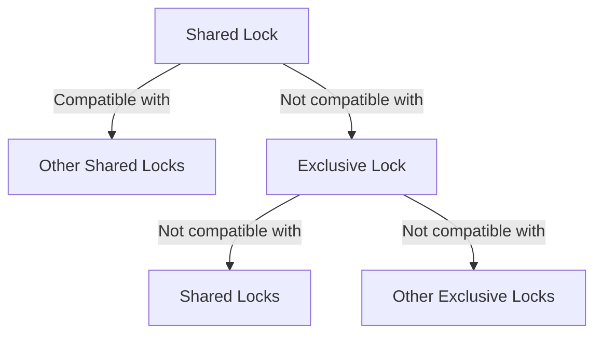

# MySQL Locking

## Introduction

In a multi-user database environment, multiple transactions may attempt to access and modify the same data simultaneously. Without proper controls, this concurrent access can lead to data inconsistency issues such as lost updates, dirty reads, and phantom reads. MySQL provides locking mechanisms to prevent these problems and ensure data consistency and integrity.

Locking is a mechanism that restricts access to data during transactions, preventing other transactions from accessing or modifying that data until the lock is released. Understanding how MySQL manages locks is crucial for developing efficient and reliable applications.

## Why Locking is Important

Imagine a banking system where two users are trying to withdraw money from the same account simultaneously. Without locks:

1. User A reads the balance: $1000
2. User B reads the balance: $1000
3. User A withdraws $500, setting balance to $500
4. User B withdraws $700, setting balance to $300

The final balance is $300, but it should be $500 ($1000 - $500 - $700 = -$200, with proper overdraft protection, it should be $0 or rejected). This is a classic example of a race condition that proper locking prevents.

## Types of Locks in MySQL

MySQL implements several types of locks to manage concurrent access:

### 1. Table-Level Locks

Table-level locks prevent other transactions from accessing the entire table while the lock is held.

#### Types of Table Locks:

- **READ lock**: Allows multiple transactions to read the table but prevents any writes
- **WRITE lock**: Prevents any other transaction from reading or writing to the table

#### Example of Table Locks:

```sql
-- Acquire a READ lock
LOCK TABLES employees READ;

-- Read operations are allowed
SELECT * FROM employees;

-- Write operations will block
-- INSERT INTO employees VALUES (101, 'John Doe', 'Manager');

-- Release all locks
UNLOCK TABLES;

-- Acquire a WRITE lock
LOCK TABLES employees WRITE;

-- Both read and write operations are allowed for the lock holder
SELECT * FROM employees;
INSERT INTO employees VALUES (101, 'John Doe', 'Manager');

-- Release all locks
UNLOCK TABLES;
```

### 2. Row-Level Locks

Row-level locks are more granular than table locks and only lock specific rows rather than the entire table. InnoDB, MySQL's default storage engine, primarily uses row-level locks.

#### Types of Row Locks:

- **Shared locks (S)**: Used for read operations, multiple transactions can hold shared locks on the same row
- **Exclusive locks (X)**: Used for write operations, only one transaction can hold an exclusive lock on a row
- **Intention locks**: Indicate the intention to acquire row-level locks within a table

#### Example of Row-Level Locks (InnoDB):

```sql
-- Transaction 1
START TRANSACTION;
-- This implicitly acquires a shared lock
SELECT * FROM accounts WHERE account_id = 123 FOR SHARE;
-- Process data...
COMMIT;

-- Transaction 2
START TRANSACTION;
-- This implicitly acquires an exclusive lock
SELECT * FROM accounts WHERE account_id = 123 FOR UPDATE;
-- Update data
UPDATE accounts SET balance = balance - 500 WHERE account_id = 123;
COMMIT;
```

### 3. Record Locks

Record locks in InnoDB lock individual index records. They're automatically acquired when performing operations like `UPDATE` or `DELETE` that modify specific rows.

### 4. Gap Locks

Gap locks lock the gaps between index records to prevent other transactions from inserting new rows that would match a specific search condition.

### 5. Next-Key Locks

A combination of record lock and gap lock, next-key locks prevent phantom reads in transactions with the `REPEATABLE READ` isolation level.

## Lock Modes and Compatibility

Different lock types have different compatibility with each other. For example:

- Multiple transactions can hold shared locks on the same row
- An exclusive lock is incompatible with any other lock on the same row
- Table locks are incompatible with any locks that would conflict with access

Here's a simplified compatibility matrix:



## Lock Acquisition Syntax

MySQL provides several ways to explicitly acquire locks:

### Table Locks

```sql
-- Lock for reading
LOCK TABLES table_name READ;

-- Lock for writing
LOCK TABLES table_name WRITE;

-- Release all locks
UNLOCK TABLES;
```

### Row Locks in SELECT Statements

```sql
-- Shared lock (for reading)
SELECT * FROM table_name WHERE id = 1 FOR SHARE;

-- Exclusive lock (for updating)
SELECT * FROM table_name WHERE id = 1 FOR UPDATE;

-- With nowait option (fails immediately if row is locked)
SELECT * FROM table_name WHERE id = 1 FOR UPDATE NOWAIT;

-- With timeout option (fails after timeout if row is locked)
SELECT * FROM table_name WHERE id = 1 FOR UPDATE SKIP LOCKED;
```

## Practical Examples

### Example 1: Preventing Lost Updates

In this example, we'll implement a banking transaction that safely updates an account balance:

```sql
-- Start a transaction
START TRANSACTION;

-- Get the current balance and lock the row
SELECT @current_balance := balance 
FROM accounts 
WHERE account_id = 123 
FOR UPDATE;

-- Check if enough funds
SET @withdrawal_amount = 500;
SET @new_balance = @current_balance - @withdrawal_amount;

IF @new_balance >= 0 THEN
    -- Process withdrawal
    UPDATE accounts SET balance = @new_balance WHERE account_id = 123;
    
    -- Log the transaction
    INSERT INTO transaction_log (account_id, amount, type, transaction_date)
    VALUES (123, @withdrawal_amount, 'WITHDRAWAL', NOW());
    
    -- Commit transaction
    COMMIT;
    SELECT 'Transaction successful' AS message;
ELSE
    -- Rollback transaction
    ROLLBACK;
    SELECT 'Insufficient funds' AS message;
END IF;
```

### Example 2: Inventory Management

This example shows how to handle inventory updates when processing orders:

```sql
START TRANSACTION;

-- Check product availability and lock the rows
SELECT p.product_id, p.product_name, p.stock_quantity, oi.quantity as ordered_quantity
FROM products p
JOIN order_items oi ON p.product_id = oi.product_id
WHERE oi.order_id = 5001
FOR UPDATE;

-- Check if we can fulfill the order (this would be done in application code)
-- Here we'll just assume we can proceed

-- Update inventory
UPDATE products p
JOIN order_items oi ON p.product_id = oi.product_id
SET p.stock_quantity = p.stock_quantity - oi.quantity
WHERE oi.order_id = 5001;

-- Update order status
UPDATE orders
SET status = 'PROCESSING', 
    updated_at = NOW()
WHERE order_id = 5001;

COMMIT;
```

### Example 3: Handling Deadlocks

Deadlocks occur when two transactions each hold a lock that the other needs. MySQL automatically detects and resolves deadlocks by aborting one of the transactions.

Here's how transactions might deadlock:

```sql
-- Transaction 1
START TRANSACTION;
UPDATE accounts SET balance = balance - 100 WHERE account_id = 101;
-- T1 holds lock on account 101

-- Transaction 2 (in a different session)
START TRANSACTION;
UPDATE accounts SET balance = balance - 200 WHERE account_id = 102;
-- T2 holds lock on account 102

-- Back in Transaction 1
UPDATE accounts SET balance = balance + 100 WHERE account_id = 102;
-- T1 waits for lock on account 102 (held by T2)

-- Back in Transaction 2
UPDATE accounts SET balance = balance + 200 WHERE account_id = 101;
-- T2 waits for lock on account 101 (held by T1)
-- DEADLOCK! MySQL will detect this and roll back one transaction
```

To avoid deadlocks, always access resources in the same order:

```sql
-- Better approach: Transaction 1
START TRANSACTION;
-- Always access lower account numbers first
UPDATE accounts SET balance = balance - 100 WHERE account_id = 101;
UPDATE accounts SET balance = balance + 100 WHERE account_id = 102;
COMMIT;

-- Better approach: Transaction 2
START TRANSACTION;
-- Always access lower account numbers first
UPDATE accounts SET balance = balance - 200 WHERE account_id = 101;
UPDATE accounts SET balance = balance + 200 WHERE account_id = 102;
COMMIT;
```

## Best Practices for Locking

1. **Keep transactions short**: Minimize the time locks are held to reduce contention.
2. **Use appropriate isolation levels**: Use the lowest isolation level that meets your requirements.
3. **Access resources in a consistent order**: Prevents deadlocks.
4. **Avoid user interaction during transactions**: Don't wait for user input while holding locks.
5. **Consider using optimistic locking** for low-contention scenarios:

```sql
START TRANSACTION;
-- Read the current version
SELECT @version := version FROM products WHERE product_id = 101;

-- Update only if version hasn't changed
UPDATE products 
SET price = 29.99, 
    version = version + 1 
WHERE product_id = 101 
AND version = @version;

-- Check if update succeeded
IF ROW_COUNT() = 0 THEN
    ROLLBACK;
    SELECT 'Concurrency conflict detected - please retry' AS message;
ELSE
    COMMIT;
    SELECT 'Update successful' AS message;
END IF;
```

6. **Monitor lock wait timeouts**: Adjust the `innodb_lock_wait_timeout` parameter if needed.

## Lock Information and Troubleshooting

MySQL provides several tools to monitor and troubleshoot locks:

### Viewing Current Locks

```sql
-- For MySQL 8.0+
SELECT * FROM performance_schema.data_locks;

-- For older versions
SHOW ENGINE INNODB STATUS;
```

### Viewing Lock Waits

```sql
-- For MySQL 8.0+
SELECT * FROM performance_schema.data_lock_waits;

-- Check processlist for blocked queries
SELECT * FROM information_schema.processlist 
WHERE state = 'Waiting for table metadata lock' 
   OR state LIKE 'Waiting for%lock';
```

## Summary

Locking is a crucial mechanism in MySQL that ensures data consistency and integrity in concurrent environments. MySQL provides various locking types and levels, from table-level to row-level locks, each with its own use cases and trade-offs.

Key takeaways:
- Table locks are coarse-grained and useful for operations that affect the entire table
- Row locks are fine-grained and allow for better concurrency
- Explicit locking with `FOR SHARE` and `FOR UPDATE` provides precise control over concurrency
- Always keep transactions short and access resources in a consistent order to avoid deadlocks
- Use the appropriate isolation level based on your consistency requirements

Understanding MySQL's locking mechanisms helps you build applications that are both reliable and efficient, even under high concurrency.

## Additional Resources and Exercises

### Exercises

1. Write a transaction that safely transfers funds between two accounts using proper locking.
2. Implement an inventory reservation system that prevents overselling products.
3. Investigate a deadlock scenario and modify the transactions to prevent it.
4. Compare the performance difference between table locks and row locks for different workloads.

### Further Reading

- MySQL Documentation: [InnoDB Locking](https://dev.mysql.com/doc/refman/8.0/en/innodb-locking.html)
- MySQL Documentation: [Locks Set by Different SQL Statements in InnoDB](https://dev.mysql.com/doc/refman/8.0/en/innodb-locks-set.html)
- MySQL Documentation: [Transaction Isolation Levels](https://dev.mysql.com/doc/refman/8.0/en/innodb-transaction-isolation-levels.html)