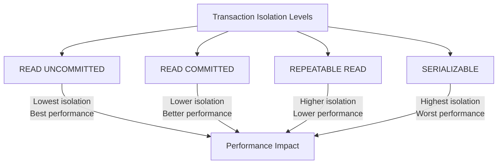

# MySQL Transaction Performance

Transactions are a fundamental concept in database management that ensures data integrity, but they can also impact your application's performance. In this guide, we'll explore how to optimize MySQL transactions for better performance while maintaining data consistency.

## Introduction to Transaction Performance

Transactions in MySQL allow you to group multiple SQL operations into a single logical unit of work. While transactions are essential for data integrity, they can introduce overhead that affects your database performance. Understanding the performance implications of transactions is crucial for building efficient applications.

When a transaction is executed, MySQL has to maintain additional information to ensure ACID properties (Atomicity, Consistency, Isolation, Durability). This creates overhead in terms of:

1. Memory usage
2. Disk I/O operations
3. Locking mechanisms
4. Log maintenance

Let's dive into understanding and optimizing these aspects.

## Transaction Isolation Levels and Performance

MySQL offers four transaction isolation levels, each with different performance characteristics:



Let's examine how each isolation level affects performance:

### READ UNCOMMITTED

This level provides the best performance but lowest isolation:

```sql
SET SESSION TRANSACTION ISOLATION LEVEL READ UNCOMMITTED;
START TRANSACTION;
-- Fast operations here but with potential dirty reads
SELECT * FROM products WHERE category = 'electronics';
COMMIT;
```

**Performance impact:** Minimal locking overhead, but allows dirty reads (reading uncommitted data from other transactions).

### READ COMMITTED

```sql
SET SESSION TRANSACTION ISOLATION LEVEL READ COMMITTED;
START TRANSACTION;
-- Operations with moderate performance and protection against dirty reads
SELECT * FROM products WHERE category = 'electronics';
COMMIT;
```

**Performance impact:** Moderate locking overhead, prevents dirty reads but allows non-repeatable reads and phantom reads.

### REPEATABLE READ (MySQL default)

```sql
SET SESSION TRANSACTION ISOLATION LEVEL REPEATABLE READ;
START TRANSACTION;
-- Operations with consistent reads but more locking overhead
SELECT * FROM products WHERE category = 'electronics';
COMMIT;
```

**Performance impact:** Higher locking overhead, prevents dirty reads and non-repeatable reads but allows phantom reads.

### SERIALIZABLE

```sql
SET SESSION TRANSACTION ISOLATION LEVEL SERIALIZABLE;
START TRANSACTION;
-- Operations with complete isolation but maximum locking
SELECT * FROM products WHERE category = 'electronics';
COMMIT;
```

**Performance impact:** Maximum locking overhead, prevents all concurrency phenomena but can significantly reduce throughput due to increased lock contention.

## Transaction Size and Duration

### Keep Transactions Small and Short

One of the most important rules for transaction performance:

```sql
-- Bad practice: Long-running transaction
START TRANSACTION;
-- Performing many operations...
UPDATE large_table SET status = 'processed';  -- Affects millions of rows
-- More operations...
COMMIT;

-- Good practice: Smaller batched transaction
START TRANSACTION;
UPDATE large_table SET status = 'processed' WHERE id BETWEEN 1 AND 10000;
COMMIT;

START TRANSACTION;
UPDATE large_table SET status = 'processed' WHERE id BETWEEN 10001 AND 20000;
COMMIT;
-- And so on...
```

Long-running transactions:
- Hold locks longer
- Use more memory
- Increase the risk of deadlocks
- Block other transactions
- Can cause the InnoDB history list to grow

### Practical Example: Processing Records in Batches

Here's a real-world example of processing a large number of orders in batches:

```sql
-- Process orders in batches of 1000
DELIMITER //
CREATE PROCEDURE process_orders_in_batches()
BEGIN
    DECLARE done INT DEFAULT FALSE;
    DECLARE batch_start INT DEFAULT 0;
    DECLARE batch_size INT DEFAULT 1000;
    DECLARE total_orders INT;
    
    -- Get total count of unprocessed orders
    SELECT COUNT(*) INTO total_orders FROM orders WHERE processed = 0;
    
    batch_loop: WHILE batch_start < total_orders DO
        START TRANSACTION;
        
        -- Process batch of orders
        UPDATE orders
        SET processed = 1, 
            process_date = NOW()
        WHERE processed = 0
        ORDER BY order_id
        LIMIT batch_size;
        
        COMMIT;
        
        SET batch_start = batch_start + batch_size;
        
        -- Small pause to reduce server load (optional)
        DO SLEEP(0.1);
    END WHILE;
END//
DELIMITER ;

-- Call the procedure
CALL process_orders_in_batches();
```

## Connection Pooling and Transaction Performance

Connection pooling significantly improves transaction performance by reusing database connections:

```javascript
// Example using Node.js with mysql2 connection pooling
const mysql = require('mysql2');

const pool = mysql.createPool({
  host: 'localhost',
  user: 'user',
  password: 'password',
  database: 'my_db',
  waitForConnections: true,
  connectionLimit: 10,
  queueLimit: 0
});

// Using the pool for a transaction
pool.getConnection((err, connection) => {
  if (err) throw err;
  
  connection.beginTransaction(err => {
    if (err) {
      connection.release();
      throw err;
    }
    
    connection.query('UPDATE accounts SET balance = balance - 100 WHERE id = 1', (err) => {
      if (err) {
        return connection.rollback(() => {
          connection.release();
          throw err;
        });
      }
      
      connection.query('UPDATE accounts SET balance = balance + 100 WHERE id = 2', (err) => {
        if (err) {
          return connection.rollback(() => {
            connection.release();
            throw err;
          });
        }
        
        connection.commit(err => {
          if (err) {
            return connection.rollback(() => {
              connection.release();
              throw err;
            });
          }
          
          connection.release();
          console.log('Transaction completed successfully.');
        });
      });
    });
  });
});
```

## Optimizing Locking Behavior

### Using Row-Level Locking

InnoDB uses row-level locking by default, but you need to ensure your queries can utilize it:

```sql
-- This query uses an indexed column, allowing for row-level locking
START TRANSACTION;
UPDATE customers SET last_login = NOW() WHERE id = 1234;
COMMIT;

-- This query forces a table scan, potentially causing a table lock
START TRANSACTION;
UPDATE customers SET last_login = NOW() WHERE name LIKE 'John%';
COMMIT;
```

### Using SELECT ... FOR UPDATE Wisely

The `SELECT ... FOR UPDATE` statement locks rows for the duration of the transaction:

```sql
-- This locks only the rows that match the criteria
START TRANSACTION;
SELECT * FROM inventory WHERE product_id = 101 FOR UPDATE;
-- Now update with confidence that no other transaction can change these rows
UPDATE inventory SET quantity = quantity - 10 WHERE product_id = 101;
COMMIT;
```

### Practical Example: Inventory Management

Here's a real-world inventory management example with proper locking:

```sql
-- Function to process an order with proper locking
DELIMITER //
CREATE PROCEDURE process_order(IN p_order_id INT, IN p_product_id INT, IN p_quantity INT)
BEGIN
    DECLARE current_stock INT;
    
    START TRANSACTION;
    
    -- Lock the inventory row for this product
    SELECT stock_quantity INTO current_stock 
    FROM inventory 
    WHERE product_id = p_product_id 
    FOR UPDATE;
    
    IF current_stock >= p_quantity THEN
        -- Update inventory
        UPDATE inventory 
        SET stock_quantity = stock_quantity - p_quantity 
        WHERE product_id = p_product_id;
        
        -- Mark order as processed
        UPDATE orders 
        SET status = 'processed', 
            processed_at = NOW() 
        WHERE order_id = p_order_id;
        
        COMMIT;
        SELECT 'Order processed successfully' AS result;
    ELSE
        ROLLBACK;
        SELECT 'Insufficient stock' AS result;
    END IF;
END//
DELIMITER ;

-- Usage
CALL process_order(12345, 101, 5);
```

## Monitoring Transaction Performance

To optimize transactions, you need to monitor their performance. MySQL provides several tools for this:

### Using Performance Schema

```sql
-- Enable performance schema if not already enabled
SET GLOBAL performance_schema = ON;

-- Monitor transaction activity
SELECT * FROM performance_schema.events_transactions_summary_by_thread_by_event_name;

-- Check for long-running transactions
SELECT trx_id, trx_state, trx_started, trx_mysql_thread_id, trx_query 
FROM information_schema.innodb_trx 
WHERE trx_state = 'RUNNING' 
ORDER BY trx_started;
```

### Using SHOW ENGINE INNODB STATUS

```sql
-- View detailed InnoDB status including transaction info
SHOW ENGINE INNODB STATUS;
```

## Performance Best Practices

Here's a summary of best practices for MySQL transaction performance:

1. **Use the appropriate isolation level** for your needs
2. **Keep transactions small and short**
3. **Batch large operations** into smaller transactions
4. **Use proper indexes** to support row-level locking
5. **Minimize the number of statements** in a transaction
6. **Avoid mixing DDL and DML** in the same transaction
7. **Use connection pooling**
8. **Monitor long-running transactions**
9. **Consider read-only transactions** when possible:

```sql
-- Use START TRANSACTION READ ONLY for read-only operations
START TRANSACTION READ ONLY;
SELECT * FROM products WHERE category = 'electronics';
SELECT AVG(price) FROM products;
COMMIT;
```

## Common Performance Issues and Solutions

### Deadlocks

Deadlocks occur when transactions wait for each other's locks:

```sql
-- Transaction 1
START TRANSACTION;
UPDATE accounts SET balance = balance - 100 WHERE id = 1;
-- At this point, Transaction 2 updates account 2
UPDATE accounts SET balance = balance + 100 WHERE id = 2;
COMMIT;

-- Transaction 2 (running concurrently)
START TRANSACTION;
UPDATE accounts SET balance = balance - 100 WHERE id = 2;
-- At this point, Transaction 1 updates account 1
UPDATE accounts SET balance = balance + 100 WHERE id = 1;
COMMIT;
```

**Solution:** Always access tables and rows in the same order in all transactions:

```sql
-- Both transactions should access accounts in ascending order by id
START TRANSACTION;
UPDATE accounts SET balance = balance - 100 WHERE id = 1;
UPDATE accounts SET balance = balance + 100 WHERE id = 2;
COMMIT;
```

### Lock Wait Timeouts

```sql
-- Error example: Lock wait timeout exceeded
ERROR 1205 (HY000): Lock wait timeout exceeded; try restarting transaction
```

**Solutions:**
1. Increase the lock wait timeout:
```sql
SET innodb_lock_wait_timeout = 120; -- Default is 50 seconds
```

2. Break long transactions into smaller ones
3. Review and optimize queries that hold locks for a long time

## Summary

Optimizing MySQL transaction performance requires balancing the need for data integrity with performance considerations. By understanding isolation levels, keeping transactions small and short, using appropriate locking strategies, and following best practices, you can significantly improve your database performance while maintaining data consistency.

Remember these key points:
- Choose the right isolation level for your use case
- Keep transactions small and short
- Use proper indexes to support row-level locking
- Monitor transaction performance regularly
- Implement connection pooling
- Batch large operations into smaller transactions

## Additional Resources

To further enhance your understanding of MySQL transaction performance:

1. Study the MySQL documentation on transaction isolation levels
2. Explore InnoDB locking mechanisms in depth
3. Learn about deadlock detection and prevention
4. Practice optimizing real-world transaction scenarios

## Exercises

1. Compare the performance of the same set of operations using different isolation levels.
2. Write a procedure that processes large sets of data in batched transactions.
3. Identify and fix potential deadlock scenarios in a given transaction code.
4. Set up monitoring for long-running transactions in your database.
5. Optimize a complex transaction by reducing its size and duration while maintaining its functionality.