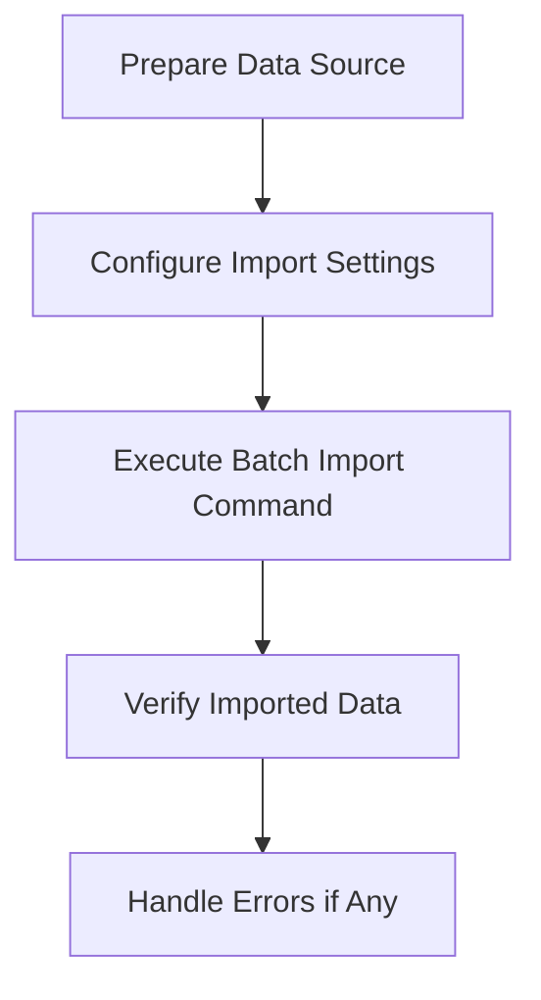

# MySQL Batch Import

## Introduction

When working with databases, you'll often need to import large volumes of data from external sources into your MySQL database. While importing small datasets can be straightforward, efficiently handling large datasets requires batch import techniques. Batch importing allows you to load data in chunks rather than one row at a time, significantly improving performance and reducing resource usage.

In this tutorial, we'll explore various methods to perform batch imports in MySQL, from basic approaches to more advanced techniques. By the end, you'll have a solid understanding of how to efficiently import data into your MySQL database in batch mode.

## Understanding Batch Import Basics

Batch importing refers to the process of loading multiple records at once rather than inserting them individually. This approach offers several advantages:

- **Improved performance**: Significantly faster than individual inserts
- **Reduced overhead**: Fewer database transactions
- **Lower resource consumption**: More efficient use of memory and CPU

Before diving into specific techniques, let's understand the general workflow of a batch import:



## Method 1: LOAD DATA INFILE

The most efficient way to perform batch imports in MySQL is using the `LOAD DATA INFILE` statement. This command is specifically designed to quickly read and insert large amounts of data from text files.

### Basic Syntax

```sql
LOAD DATA INFILE 'file_path'
INTO TABLE table_name
[FIELDS TERMINATED BY 'character']
[LINES TERMINATED BY 'character']
[IGNORE number LINES]
[column_list];
```

### Practical Example

Let's say you have a CSV file named `customers.csv` with the following content:

```
id,name,email,registration_date
1,John Doe,john@example.com,2023-01-15
2,Jane Smith,jane@example.com,2023-01-16
3,Robert Johnson,robert@example.com,2023-01-18
```

First, create a table to store this data:

```sql
CREATE TABLE customers (
    id INT PRIMARY KEY,
    name VARCHAR(100),
    email VARCHAR(100),
    registration_date DATE
);
```

Now, use `LOAD DATA INFILE` to import the data:

```sql
LOAD DATA INFILE '/path/to/customers.csv'
INTO TABLE customers
FIELDS TERMINATED BY ','
LINES TERMINATED BY '\n'
IGNORE 1 LINES
(id, name, email, registration_date);
```

This command will:
1. Read the file `/path/to/customers.csv`
2. Import data into the `customers` table
3. Recognize fields separated by commas
4. Recognize lines separated by newline characters
5. Skip the header row
6. Map the columns in order to the specified fields

### Local File Import

If the file is on your local machine rather than the server, use `LOAD DATA LOCAL INFILE`:

```sql
LOAD DATA LOCAL INFILE '/path/to/customers.csv'
INTO TABLE customers
FIELDS TERMINATED BY ','
LINES TERMINATED BY '\n'
IGNORE 1 LINES
(id, name, email, registration_date);
```

:::note
To use `LOCAL`, your MySQL configuration must allow local file loading. You may need to enable this feature by setting `local_infile=1` in your MySQL configuration or when connecting to the server.
:::

## Method 2: Using INSERT with Multiple Values

Another way to perform batch imports is by using a single `INSERT` statement with multiple value sets.

### Basic Syntax

```sql
INSERT INTO table_name (column1, column2, ...)
VALUES 
    (value1_1, value1_2, ...),
    (value2_1, value2_2, ...),
    (value3_1, value3_2, ...),
    ...;
```

### Practical Example

```sql
INSERT INTO customers (id, name, email, registration_date)
VALUES 
    (1, 'John Doe', 'john@example.com', '2023-01-15'),
    (2, 'Jane Smith', 'jane@example.com', '2023-01-16'),
    (3, 'Robert Johnson', 'robert@example.com', '2023-01-18');
```

While this method is not as efficient as `LOAD DATA INFILE` for very large datasets, it's useful for:
- Moderate-sized batches (hundreds or a few thousand records)
- Situations where data comes from application code rather than files
- Cases where you need precise control over the import process

## Method 3: Using Source or MySQL Import Utility

For SQL dump files, you can use the `source` command within the MySQL client or the `mysql` command-line utility.

### Using Source Command

If you're already in the MySQL client:

```sql
SOURCE /path/to/dump_file.sql;
```

### Using MySQL Import Utility

From your command line:

```bash
mysql -u username -p database_name < /path/to/dump_file.sql
```

### Practical Example

Let's say you have a SQL dump file named `product_data.sql` containing:

```sql
INSERT INTO products (product_id, name, price) VALUES
(101, 'Laptop', 999.99),
(102, 'Smartphone', 499.99),
(103, 'Tablet', 299.99),
(104, 'Headphones', 99.99);

INSERT INTO product_categories (product_id, category_id) VALUES
(101, 1),
(101, 3),
(102, 2),
(103, 2),
(104, 4);
```

You can import this file using:

```bash
mysql -u root -p your_database < /path/to/product_data.sql
```

## Method 4: Programmatic Batch Import

When integrating batch imports into applications, you can use prepared statements and transactions to efficiently insert data.

### Using PHP Example

```php
<?php
// Database connection
$conn = new mysqli("localhost", "username", "password", "database");

// Check connection
if ($conn->connect_error) {
    die("Connection failed: " . $conn->connect_error);
}

// Start transaction
$conn->begin_transaction();

try {
    // Prepare statement
    $stmt = $conn->prepare("INSERT INTO customers (id, name, email, registration_date) VALUES (?, ?, ?, ?)");
    
    // Batch data
    $customers = [
        [1, 'John Doe', 'john@example.com', '2023-01-15'],
        [2, 'Jane Smith', 'jane@example.com', '2023-01-16'],
        [3, 'Robert Johnson', 'robert@example.com', '2023-01-18']
    ];
    
    // Bind and execute for each batch
    foreach ($customers as $customer) {
        $stmt->bind_param("isss", $customer[0], $customer[1], $customer[2], $customer[3]);
        $stmt->execute();
    }
    
    // Commit transaction
    $conn->commit();
    echo "Batch import successful!";
} catch (Exception $e) {
    // Rollback on error
    $conn->rollback();
    echo "Batch import failed: " . $e->getMessage();
}

// Close connection
$stmt->close();
$conn->close();
?>
```

### Using Python Example

```python
import mysql.connector

# Connect to database
conn = mysql.connector.connect(
    host="localhost",
    user="username",
    password="password",
    database="database"
)

cursor = conn.cursor()

try:
    # Start transaction
    conn.start_transaction()
    
    # Prepare data
    customers = [
        (1, 'John Doe', 'john@example.com', '2023-01-15'),
        (2, 'Jane Smith', 'jane@example.com', '2023-01-16'),
        (3, 'Robert Johnson', 'robert@example.com', '2023-01-18')
    ]
    
    # Execute batch insert
    cursor.executemany(
        "INSERT INTO customers (id, name, email, registration_date) VALUES (%s, %s, %s, %s)",
        customers
    )
    
    # Commit transaction
    conn.commit()
    print("Batch import successful!")
except Exception as e:
    # Rollback on error
    conn.rollback()
    print(f"Batch import failed: {str(e)}")
finally:
    cursor.close()
    conn.close()
```

## Best Practices for Efficient Batch Importing

To maximize the performance of your batch imports, consider the following best practices:

### 1. Temporarily Disable Constraints and Indexes

Before importing large datasets, consider temporarily disabling foreign key checks and indexes:

```sql
-- Before import
SET FOREIGN_KEY_CHECKS = 0;
ALTER TABLE your_table DISABLE KEYS;

-- Your import commands here
LOAD DATA INFILE '...' INTO TABLE your_table...

-- After import
SET FOREIGN_KEY_CHECKS = 1;
ALTER TABLE your_table ENABLE KEYS;
```

### 2. Use Optimized File Formats

When preparing data files for import:
- Use consistent delimiters
- Escape special characters properly
- Consider compressing large files (MySQL can read directly from compressed files)

### 3. Split Very Large Datasets

For extremely large datasets (several gigabytes), consider splitting them into multiple files and importing them separately.

### 4. Monitor and Adjust Buffer Settings

Adjust MySQL configuration settings for better import performance:

```sql
SET GLOBAL innodb_buffer_pool_size = 1073741824; -- 1GB
SET GLOBAL innodb_flush_log_at_trx_commit = 2;
```

:::caution
Always test configuration changes in a non-production environment first, as these settings can significantly affect server behavior.
:::

### 5. Use Transactions for Multiple Statements

Wrap multiple insert operations in transactions to improve performance and ensure data consistency:

```sql
START TRANSACTION;
-- Multiple INSERT statements here
COMMIT;
```

## Handling Errors and Validation

During batch imports, you may encounter various errors. Here are some strategies to handle them:

### 1. Using IGNORE Option

The `IGNORE` option tells MySQL to continue importing despite errors:

```sql
LOAD DATA INFILE '/path/to/data.csv'
IGNORE
INTO TABLE your_table
FIELDS TERMINATED BY ',';
```

### 2. Using Local Validation

Validate your data before importing:

```python
import pandas as pd
import numpy as np

# Read data
df = pd.read_csv('data.csv')

# Validate
df['email'] = df['email'].str.lower()  # Standardize emails
df = df.replace('', np.nan)  # Convert empty strings to NULL
df = df.dropna(subset=['required_field'])  # Remove rows with missing required values

# Save cleaned data
df.to_csv('cleaned_data.csv', index=False)
```

### 3. Error Logging

To log errors during imports:

```sql
LOAD DATA INFILE '/path/to/data.csv'
INTO TABLE your_table
FIELDS TERMINATED BY ','
LINES TERMINATED BY '\n'
(column1, column2, @column3)
SET column3 = NULLIF(@column3, '');
```

## Real-World Example: E-commerce Product Import

Let's walk through a complete example of importing products for an e-commerce site.

### 1. Prepare the Database Tables

```sql
CREATE TABLE products (
    product_id INT PRIMARY KEY,
    name VARCHAR(200) NOT NULL,
    description TEXT,
    price DECIMAL(10, 2) NOT NULL,
    stock_quantity INT DEFAULT 0,
    created_at TIMESTAMP DEFAULT CURRENT_TIMESTAMP
);

CREATE TABLE product_categories (
    product_id INT,
    category_id INT,
    PRIMARY KEY (product_id, category_id),
    FOREIGN KEY (product_id) REFERENCES products(product_id)
);
```

### 2. Prepare the Import File (products.csv)

```
product_id,name,description,price,stock_quantity
1001,"Gaming Laptop 15\"","High-performance gaming laptop with RTX graphics",1299.99,45
1002,"Wireless Earbuds","Noise-canceling wireless earbuds with 24h battery",129.99,120
1003,"Smart Watch","Fitness tracker with heart rate monitor",199.99,78
1004,"4K Monitor","32-inch 4K UHD monitor for professionals",449.99,32
```

### 3. Prepare Category Mappings (categories.csv)

```
product_id,category_id
1001,1
1001,5
1002,2
1002,7
1003,3
1004,4
1004,5
```

### 4. Perform the Import

```sql
-- Temporarily disable constraints
SET FOREIGN_KEY_CHECKS = 0;

-- Import products
LOAD DATA INFILE '/path/to/products.csv'
INTO TABLE products
FIELDS TERMINATED BY ',' ENCLOSED BY '"'
LINES TERMINATED BY '\n'
IGNORE 1 LINES
(product_id, name, description, price, stock_quantity);

-- Import categories
LOAD DATA INFILE '/path/to/categories.csv'
INTO TABLE product_categories
FIELDS TERMINATED BY ','
LINES TERMINATED BY '\n'
IGNORE 1 LINES;

-- Re-enable constraints
SET FOREIGN_KEY_CHECKS = 1;
```

### 5. Verify the Import

```sql
SELECT p.product_id, p.name, p.price, COUNT(pc.category_id) AS category_count
FROM products p
LEFT JOIN product_categories pc ON p.product_id = pc.product_id
GROUP BY p.product_id, p.name, p.price;
```

Expected output:

```
product_id | name             | price   | category_count
-----------+------------------+---------+---------------
1001       | Gaming Laptop 15"| 1299.99 | 2
1002       | Wireless Earbuds | 129.99  | 2
1003       | Smart Watch      | 199.99  | 1
1004       | 4K Monitor       | 449.99  | 2
```

## Summary

In this tutorial, we've explored various methods for batch importing data into MySQL databases:

1. **LOAD DATA INFILE**: The most efficient method for importing data from text files
2. **Multiple-value INSERT statements**: Good for moderate-sized batches
3. **Source and MySQL utility**: Effective for SQL dump files
4. **Programmatic batch imports**: Useful for application integration

We've also covered best practices for optimizing batch imports, handling errors, and implementing real-world scenarios. By applying these techniques, you can significantly improve the performance and reliability of your data import processes.

## Exercises

1. Create a sample CSV file with at least 10 records and import it into a new table using `LOAD DATA INFILE`.
2. Write a transaction-based batch insert script that imports data and validates each record before insertion.
3. Compare the performance of individual inserts vs. batch inserts by timing how long it takes to import 1000 records using both methods.
4. Create a script that reads data from a JSON file and imports it into MySQL using batch techniques.
5. Implement error handling that logs problematic records to a separate table during the import process.

## Additional Resources

- [MySQL Official Documentation on LOAD DATA](https://dev.mysql.com/doc/refman/8.0/en/load-data.html)
- [MySQL Performance Tuning for Data Loading](https://dev.mysql.com/doc/refman/8.0/en/insert-optimization.html)
- [MySQL Transaction Management](https://dev.mysql.com/doc/refman/8.0/en/commit.html)

Happy batch importing!