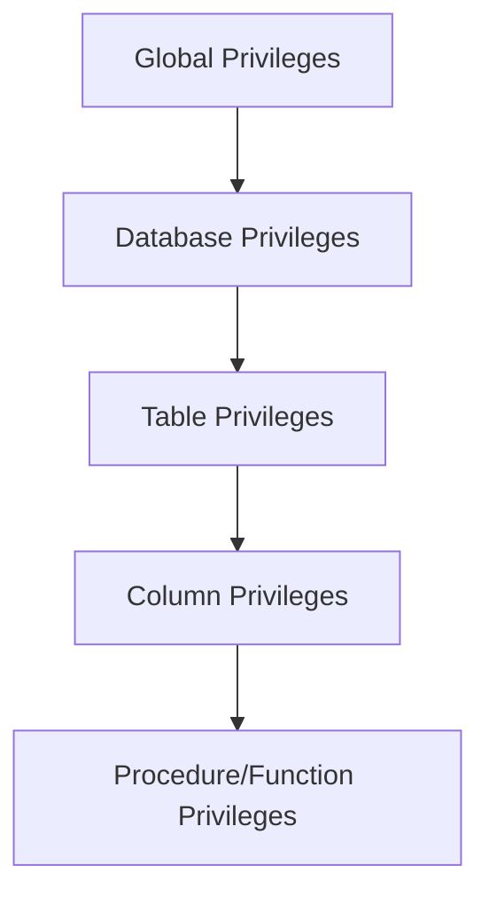

# MySQL Privileges

## Introduction

Database security is a critical aspect of MySQL administration. One of the key components of this security model is the privilege system that controls what actions users can perform on the database server. MySQL privileges determine who can connect to the server and what operations they can execute on databases, tables, columns, and other database objects.

In this guide, we'll explore the MySQL privilege system in detail, covering how to create users, grant and revoke permissions, view existing privileges, and implement security best practices. By understanding and properly configuring MySQL privileges, you'll ensure that your database is both secure and accessible to authorized users.

## Understanding the MySQL Privilege System

MySQL's privilege system operates on a principle of controlled access. By default, when MySQL is first installed, it creates a root user with complete privileges over the entire server. However, in production environments, you'll want to create multiple users with only the permissions they need for their specific roles.

### Privilege Levels

MySQL privileges are organized in a hierarchical structure, from broadest to most specific:



- **Global privileges**: Apply to all databases on the server
- **Database privileges**: Apply to all objects within a specific database
- **Table privileges**: Apply to all columns in a specific table
- **Column privileges**: Apply to specific columns within a table
- **Procedure/Function privileges**: Apply to stored routines

### Common MySQL Privileges

Here are some of the most commonly used privileges in MySQL:

| Privilege | Description |
|-----------|-------------|
| `ALL PRIVILEGES` | Grants all privileges except `GRANT OPTION` |
| `SELECT` | Allows reading data from tables |
| `INSERT` | Allows adding new rows to tables |
| `UPDATE` | Allows modifying existing rows |
| `DELETE` | Allows removing rows from tables |
| `CREATE` | Allows creating new databases and tables |
| `DROP` | Allows dropping (deleting) databases and tables |
| `RELOAD` | Allows reloading server settings and flushing tables |
| `PROCESS` | Allows viewing server processes |
| `GRANT OPTION` | Allows granting privileges to other users |

## Managing Users and Privileges

### Creating a New MySQL User

Let's start by creating a new MySQL user:

```sql
CREATE USER 'newuser'@'localhost' IDENTIFIED BY 'password123';
```

This command creates a user named 'newuser' who can only connect from 'localhost' with the password 'password123'.

Note: In a production environment, you should use a strong, unique password.

### Granting Privileges

Once you've created a user, they won't be able to do much until you grant them privileges. Here are some examples:

#### Grant All Privileges on a Database

```sql
GRANT ALL PRIVILEGES ON database_name.* TO 'newuser'@'localhost';
```

This grants all privileges to 'newuser' on all tables within the 'database_name' database.

#### Grant Specific Privileges on a Database

```sql
GRANT SELECT, INSERT, UPDATE ON database_name.* TO 'newuser'@'localhost';
```

This grants only SELECT, INSERT, and UPDATE privileges on all tables in 'database_name'.

#### Grant Privileges on a Specific Table

```sql
GRANT SELECT, UPDATE ON database_name.table_name TO 'newuser'@'localhost';
```

This grants SELECT and UPDATE privileges only on the 'table_name' table.

#### Grant Column-Level Privileges

```sql
GRANT SELECT (column1, column2), UPDATE (column1) ON database_name.table_name TO 'newuser'@'localhost';
```

This grants SELECT privileges on 'column1' and 'column2', and UPDATE privileges only on 'column1'.

### Apply the Privilege Changes

After granting privileges, you need to apply the changes:

```sql
FLUSH PRIVILEGES;
```

This command reloads the grant tables in the MySQL server, making your privilege changes take effect immediately.

### Revoking Privileges

If you need to remove privileges from a user, use the `REVOKE` command:

```sql
REVOKE UPDATE ON database_name.* FROM 'newuser'@'localhost';
```

This removes the UPDATE privilege on the 'database_name' database from 'newuser'.

To revoke all privileges:

```sql
REVOKE ALL PRIVILEGES ON *.* FROM 'newuser'@'localhost';
```

### Viewing User Privileges

To see what privileges a user has, use:

```sql
SHOW GRANTS FOR 'newuser'@'localhost';
```

Output might look like:

```
+--------------------------------------------------------------------+
| Grants for newuser@localhost                                        |
+--------------------------------------------------------------------+
| GRANT SELECT, INSERT, UPDATE ON `database_name`.* TO 'newuser'@'localhost' |
+--------------------------------------------------------------------+
```

### Modifying User Passwords

To change a user's password:

```sql
ALTER USER 'newuser'@'localhost' IDENTIFIED BY 'new_password';
```

### Deleting a User

To remove a user completely:

```sql
DROP USER 'newuser'@'localhost';
```

## Practical Examples

Let's look at some real-world scenarios and how to implement appropriate privileges for them.

### Example 1: Read-Only User for Reports

Imagine you need a user that can only read data for generating reports but shouldn't be able to modify anything:

```sql
CREATE USER 'report_user'@'localhost' IDENTIFIED BY 'password123';
GRANT SELECT ON reports_database.* TO 'report_user'@'localhost';
FLUSH PRIVILEGES;
```

### Example 2: Application User

For a web application that needs to read and write to a database but shouldn't be able to modify the structure:

```sql
CREATE USER 'app_user'@'%' IDENTIFIED BY 'secure_password';
GRANT SELECT, INSERT, UPDATE, DELETE ON app_database.* TO 'app_user'@'%';
FLUSH PRIVILEGES;
```

Note: The `%` wildcard in the hostname allows connections from any host. Be cautious with this in production environments.

### Example 3: Database Administrator for a Specific Database

For a DBA who needs full control over a specific database but not the entire server:

```sql
CREATE USER 'db_admin'@'localhost' IDENTIFIED BY 'admin_password';
GRANT ALL PRIVILEGES ON specific_database.* TO 'db_admin'@'localhost';
FLUSH PRIVILEGES;
```

### Example 4: User with Limited Access to Specific Columns

For a user who should only access certain columns in a customer table:

```sql
CREATE USER 'support_staff'@'localhost' IDENTIFIED BY 'support_pass';
GRANT SELECT (customer_name, email, phone) ON crm_database.customers TO 'support_staff'@'localhost';
FLUSH PRIVILEGES;
```

## Security Best Practices

When managing MySQL privileges, follow these best practices to maintain a secure environment:

1. **Principle of Least Privilege**: Grant users only the permissions they absolutely need.

2. **Regular Audits**: Periodically review user privileges with `SHOW GRANTS`.

3. **Avoid Using the Root Account**: Create specific admin accounts for different purposes instead.

4. **Use Strong Passwords**: Implement password policies that require complex passwords.

5. **Restrict Host Access**: Limit connections to specific IP addresses when possible.

6. **Revoke Unnecessary Privileges**: Remove privileges that are no longer needed.

7. **Avoid Using Wildcards**: Be specific with database and table names when granting privileges.

8. **Never Store Passwords in Plain Text**: Use secure methods to store connection credentials in your applications.

## Troubleshooting Common Privilege Issues

### Access Denied Errors

If a user receives an "Access Denied" error, check:

1. Is the username and host correct?
2. Is the password correct?
3. Does the user have the necessary privileges?

You can verify with:

```sql
SELECT user, host FROM mysql.user WHERE user = 'username';
SHOW GRANTS FOR 'username'@'hostname';
```

### Changes Not Taking Effect

If privilege changes don't seem to be working:

1. Make sure you ran `FLUSH PRIVILEGES;` after making changes.
2. Confirm you're modifying the correct user (check the host part).
3. Have the user disconnect and reconnect to the MySQL server.

## Summary

MySQL's privilege system provides a robust framework for controlling access to your database server. By understanding the different privilege levels and implementing a principle of least privilege, you can maintain a secure environment while still allowing users to perform their necessary tasks.

Key points to remember:

- Privileges can be granted at global, database, table, and column levels
- Always use the principle of least privilege
- Regularly audit user privileges
- Use strong passwords and limit connection hosts
- Apply changes with `FLUSH PRIVILEGES`

By properly managing MySQL privileges, you create a more secure database environment that protects your data while allowing authorized access where needed.

## Additional Resources and Exercises

### Resources

- [MySQL Official Documentation on Privileges](https://dev.mysql.com/doc/refman/8.0/en/privileges-provided.html)
- [MySQL Security Best Practices](https://dev.mysql.com/doc/refman/8.0/en/security.html)

### Exercises

1. Create a user named 'analyst' who can only SELECT from all tables in a database called 'sales_data'.

2. Create a user named 'web_app' that can SELECT, INSERT, and UPDATE on all tables in 'customer_database', but cannot DELETE or alter the database structure.

3. Review the privileges of all users on your MySQL server and identify any overly permissive settings.

4. Create a user who can only access a database during business hours (hint: look into MySQL's temporal privilege options).

5. Set up a user who can only see certain rows in a table based on a condition (hint: research MySQL views combined with privileges).

By working through these exercises, you'll gain practical experience managing MySQL privileges in different scenarios, reinforcing the concepts covered in this guide.