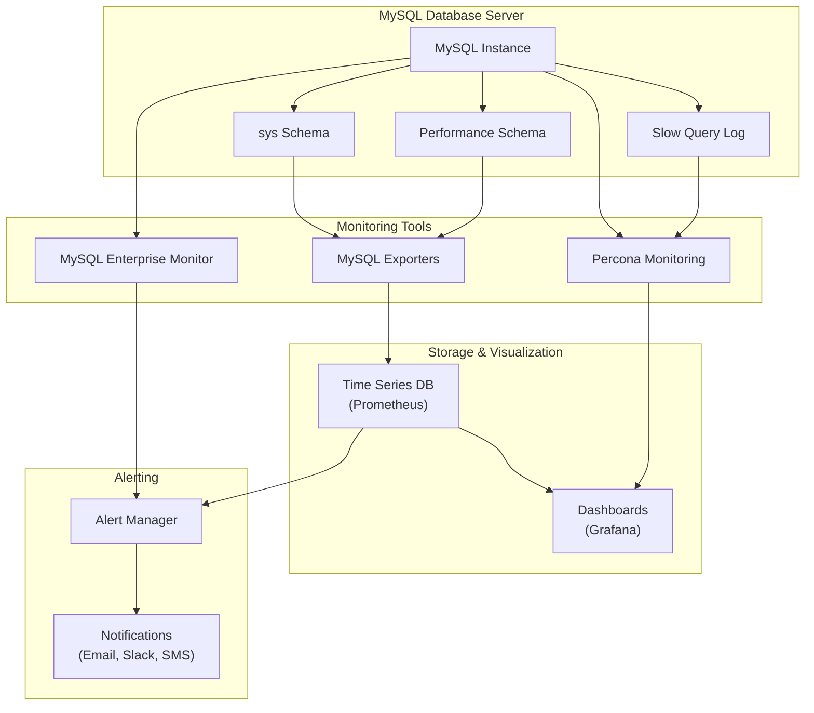

# MySQL Monitoring

## Introduction

Database monitoring is a critical aspect of MySQL administration. Without proper monitoring, performance issues can go unnoticed until they cause significant problems like slow response times or system crashes. Effective MySQL monitoring helps administrators identify bottlenecks, optimize performance, and maintain database health in production environments.

In this guide, we'll explore various methods and tools for monitoring MySQL servers, from built-in commands to specialized tools and services. You'll learn how to track key performance metrics, set up alerting systems, and implement monitoring best practices.

## Why Monitor MySQL?

Monitoring your MySQL database servers helps you:

- **Detect performance issues early** before they impact end-users
- **Track resource utilization** (CPU, memory, disk I/O, network)
- **Identify slow queries** that may need optimization
- **Plan capacity** for future growth and scaling
- **Ensure high availability** and minimize downtime
- **Troubleshoot problems** when they occur

## Essential MySQL Monitoring Commands

### 1. Checking Server Status

The `SHOW STATUS` command provides valuable information about the current state of the MySQL server:

```sql
SHOW GLOBAL STATUS;
```

This returns many status variables. You can filter for specific information:

```sql
SHOW GLOBAL STATUS LIKE 'Connections';
```

Output:
```
+---------------+-------+
| Variable_name | Value |
+---------------+-------+
| Connections   | 325   |
+---------------+-------+
```

### 2. Process List

To see which processes are currently running on your MySQL server:

```sql
SHOW PROCESSLIST;
```

Output:
```
+----+------+-----------+------+---------+------+-------+------------------+
| Id | User | Host      | db   | Command | Time | State | Info             |
+----+------+-----------+------+---------+------+-------+------------------+
| 1  | root | localhost | test | Query   | 0    | init  | SHOW PROCESSLIST |
| 2  | root | localhost | test | Sleep   | 5    |       | NULL             |
+----+------+-----------+------+---------+------+-------+------------------+
```

### 3. InnoDB Status

For InnoDB-specific information:

```sql
SHOW ENGINE INNODB STATUS\G
```

This provides detailed information about InnoDB operations, transactions, locks, and more.

### 4. Query Performance

The `performance_schema` and `sys` schema (MySQL 5.7+) offer powerful insights:

```sql
-- Find queries with full table scans
SELECT * FROM sys.statements_with_full_table_scans ORDER BY total_latency DESC LIMIT 10;

-- Find most time-consuming queries
SELECT * FROM sys.statements_with_runtimes_in_95th_percentile LIMIT 10;
```

## Key Metrics to Monitor

### 1. Connection Metrics

```sql
-- Current connections
SHOW STATUS LIKE 'Threads_connected';

-- Connection attempts
SHOW STATUS LIKE 'Connections';

-- Maximum concurrent connections reached
SHOW STATUS LIKE 'Max_used_connections';

-- Connection errors
SHOW STATUS LIKE 'Connection_errors%';
```

### 2. Query Performance Metrics

```sql
-- Slow queries
SHOW GLOBAL STATUS LIKE 'Slow_queries';

-- Questions executed
SHOW GLOBAL STATUS LIKE 'Questions';

-- Queries per second
-- (Monitor the change in Questions status variable over time)
```

### 3. Buffer and Cache Metrics

```sql
-- Buffer pool utilization
SHOW GLOBAL STATUS LIKE 'Innodb_buffer_pool%';

-- Query cache (if enabled)
SHOW GLOBAL STATUS LIKE 'Qcache%';
```

### 4. Storage Engine Metrics

```sql
-- InnoDB metrics
SHOW GLOBAL STATUS LIKE 'Innodb%';

-- MyISAM metrics (if using MyISAM tables)
SHOW GLOBAL STATUS LIKE 'Key%';
```

## Setting Up MySQL Slow Query Log

The slow query log captures queries that take longer than a specified amount of time to execute:

```sql
-- Enable slow query log
SET GLOBAL slow_query_log = 'ON';

-- Set threshold for slow queries (in seconds)
SET GLOBAL long_query_time = 2;

-- Log queries that don't use indexes
SET GLOBAL log_queries_not_using_indexes = 'ON';
```

To make these settings permanent, add them to your MySQL configuration file (`my.cnf` or `my.ini`):

```ini
[mysqld]
slow_query_log = 1
slow_query_log_file = /var/log/mysql/slow-query.log
long_query_time = 2
log_queries_not_using_indexes = 1
```

## Analyzing Slow Queries

After collecting slow queries, you can analyze them using the `mysqldumpslow` utility:

```bash
# Show the top 10 slowest queries
mysqldumpslow -t 10 /var/log/mysql/slow-query.log
```

Output:
```
Reading mysql slow query log from /var/log/mysql/slow-query.log
Count: 28  Time=10.32s (289s)  Lock=0.00s (0s)  Rows=1000.0 (28000), root[root]@localhost
  SELECT * FROM large_table WHERE non_indexed_column = N
```

For more detailed analysis, consider using tools like [Percona's pt-query-digest](https://www.percona.com/doc/percona-toolkit/LATEST/pt-query-digest.html).

## Monitoring Tools

### 1. MySQL Enterprise Monitor

The official monitoring solution from Oracle provides comprehensive monitoring and advisory services for MySQL servers.

### 2. Percona Monitoring and Management (PMM)

An open-source platform for managing and monitoring MySQL performance:

```bash
# Install PMM Client on your database server
wget https://downloads.percona.com/pmm2/yum/pmm2-client-latest.el7.x86_64.rpm
sudo rpm -iv pmm2-client-latest.el7.x86_64.rpm

# Configure PMM Client
sudo pmm-admin config --server-insecure-tls --server-url=https://pmm-server:443
sudo pmm-admin add mysql --username=pmm --password=password
```

### 3. Prometheus and Grafana

A popular open-source combination for monitoring and visualizing MySQL metrics:

First, set up the MySQL exporter:

```bash
# Install the MySQL Prometheus exporter
wget https://github.com/prometheus/mysqld_exporter/releases/download/v0.14.0/mysqld_exporter-0.14.0.linux-amd64.tar.gz
tar xvfz mysqld_exporter-0.14.0.linux-amd64.tar.gz
cd mysqld_exporter-0.14.0.linux-amd64

# Create a MySQL user for monitoring
mysql> CREATE USER 'exporter'@'localhost' IDENTIFIED BY 'password' WITH MAX_USER_CONNECTIONS 3;
mysql> GRANT PROCESS, REPLICATION CLIENT, SELECT ON *.* TO 'exporter'@'localhost';

# Run the exporter
export DATA_SOURCE_NAME='exporter:password@(localhost:3306)/'
./mysqld_exporter
```

Then configure Prometheus to scrape the exporter and visualize the data in Grafana.

## Real-world Monitoring Example

Let's walk through a scenario where monitoring helps identify and solve a performance issue.

### Scenario: Identifying Connection Issues

You notice that users are reporting intermittent connection failures to your application.

**Step 1:** Check connection metrics:

```sql
SHOW GLOBAL STATUS LIKE 'Max_used_connections';
SHOW GLOBAL VARIABLES LIKE 'max_connections';
SHOW GLOBAL STATUS LIKE 'Connection_errors%';
```

Output:
```
+----------------------+-------+
| Variable_name        | Value |
+----------------------+-------+
| Max_used_connections | 145   |
+----------------------+-------+

+-----------------+-------+
| Variable_name   | Value |
+-----------------+-------+
| max_connections | 151   |
+-----------------+-------+

+-------------------------------+-------+
| Variable_name                 | Value |
+-------------------------------+-------+
| Connection_errors_max_connections | 423   |
+-------------------------------+-------+
```

**Step 2:** Analyze the output:
- Max used connections (145) is very close to the maximum allowed (151)
- There are 423 errors due to reaching the maximum connection limit

**Step 3:** Implement a solution:

1. Increase the maximum connections in your MySQL configuration:

```ini
[mysqld]
max_connections = 300
```

2. Investigate why so many connections are being used:

```sql
-- Check for sleeping connections that might be leaking
SELECT count(*) FROM information_schema.processlist WHERE command = 'Sleep';
```

3. Add connection pooling to your application to efficiently manage database connections.

4. Set up an alert when connections reach 80% of the maximum to proactively address connection issues.

## Setting Up Automated Monitoring and Alerts

For effective monitoring, set up automated checks and alerts:

### 1. Using the MySQL Shell

```bash
# Create a simple monitoring script
cat > mysql_monitor.sh << 'EOF'
#!/bin/bash
MYSQL_USER="monitor"
MYSQL_PASS="password"
MAX_CONN=$(mysql -u$MYSQL_USER -p$MYSQL_PASS -Bse "SHOW VARIABLES LIKE 'max_connections';" | awk '{print $2}')
USED_CONN=$(mysql -u$MYSQL_USER -p$MYSQL_PASS -Bse "SHOW STATUS LIKE 'Threads_connected';" | awk '{print $2}')
CONN_PERCENT=$((USED_CONN * 100 / MAX_CONN))

if [ $CONN_PERCENT -gt 80 ]; then
  echo "ALERT: MySQL connections at $CONN_PERCENT% of max ($USED_CONN/$MAX_CONN)"
  # Send email or trigger other alert mechanisms here
fi
EOF

chmod +x mysql_monitor.sh
```

### 2. Using Prometheus Alerting Rules

```yaml
groups:
- name: mysql_alerts
  rules:
  - alert: MySQLHighConnectionUsage
    expr: mysql_global_status_threads_connected / mysql_global_variables_max_connections * 100 > 80
    for: 5m
    labels:
      severity: warning
    annotations:
      summary: "MySQL high connection usage"
      description: "MySQL connection usage is {{ $value }}% on {{ $labels.instance }}"
```

## Best Practices for MySQL Monitoring

1. **Monitor different layers**: Database server, OS, query performance, and application interaction

2. **Set baselines**: Establish normal performance patterns to easily identify deviations

3. **Use visualization**: Tools like Grafana make trends and issues more apparent

4. **Implement alerting**: Set up notifications for critical thresholds

5. **Automate regular checks**: Schedule recurring checks for important metrics

6. **Retain historical data**: Keep performance history to analyze long-term trends

7. **Document your monitoring**: Keep track of what you're monitoring and why

8. **Test your monitoring**: Verify that alerts trigger correctly during issues

## MySQL Monitoring Architecture Diagram



## Summary

MySQL monitoring is a critical aspect of database administration that ensures optimal performance, helps identify issues before they become critical, and maintains the health of your database systems. By monitoring key metrics like connections, query performance, and resource utilization, you can:

- Proactively address potential bottlenecks
- Optimize database performance
- Ensure high availability for your applications
- Plan capacity for future growth

The tools and techniques covered in this guide—from built-in MySQL commands to specialized monitoring platforms—provide a comprehensive approach to MySQL monitoring. Remember that effective monitoring is an ongoing process that requires regular attention and adjustment as your database environment evolves.

## Additional Resources

- [MySQL Performance Schema Documentation](https://dev.mysql.com/doc/refman/8.0/en/performance-schema.html)
- [Percona Monitoring and Management Documentation](https://www.percona.com/doc/percona-monitoring-and-management/index.html)
- [MySQL Enterprise Monitor User Guide](https://dev.mysql.com/doc/mysql-monitor/en/)
- [Prometheus and MySQL Monitoring](https://prometheus.io/docs/instrumenting/exporters/)

## Exercises

1. Set up the slow query log on your MySQL server and analyze the results after 24 hours of operation.

2. Create a Grafana dashboard showing key MySQL metrics like connections, query rate, and buffer pool usage.

3. Write a monitoring script that checks for table fragmentation and sends an alert when tables need optimization.

4. Configure Prometheus alerts for when your MySQL server's memory usage exceeds 85% or when the buffer pool hit rate falls below 95%.

5. Compare your database's performance metrics before and after query optimization to quantify the improvements.