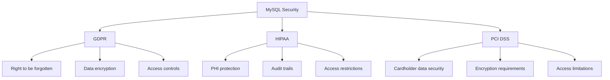

# MySQL Security

## Introduction

Database security is a critical aspect of any application deployment. As a database administrator or developer, protecting your MySQL databases from unauthorized access, data breaches, and other security threats should be one of your top priorities. This guide will walk you through the essential security practices for MySQL databases, helping you build a robust security posture from the ground up.

Security in MySQL involves multiple layers, from user authentication and access control to encryption and network security. By implementing proper security measures, you can protect sensitive data, maintain compliance with regulations like GDPR or HIPAA, and prevent costly security incidents.

## Why MySQL Security Matters

Before diving into the technical aspects, let's understand why MySQL security deserves special attention:

1. **Data Protection**: Your database often contains sensitive information like user credentials, personal data, or business-critical information.
2. **Compliance Requirements**: Many industries have strict regulations regarding data protection.
3. **Business Continuity**: Security breaches can lead to downtime, loss of customer trust, and financial damages.
4. **Default Configurations**: MySQL's default settings aren't always optimized for security.

## User Authentication and Access Control

### Creating Secure User Accounts

The first line of defense in your MySQL security strategy is proper user management. Let's create a secure user with appropriate privileges:

```sql
-- Create a new user with a strong password
CREATE USER 'app_user'@'localhost' IDENTIFIED BY 'StrongP@ssw0rd123!';

-- Grant only necessary privileges
GRANT SELECT, INSERT, UPDATE ON mydatabase.* TO 'app_user'@'localhost';

-- Make the privileges take effect
FLUSH PRIVILEGES;
```

Key points for user management:

- Use strong passwords (mix of uppercase, lowercase, numbers, and special characters)
- Limit connection sources (use hostnames or specific IP addresses instead of '%')
- Apply the principle of least privilege (grant only required permissions)

### Removing Anonymous Users and Test Databases

MySQL installations sometimes include anonymous users and test databases that can pose security risks:

```sql
-- Remove anonymous users
DELETE FROM mysql.user WHERE User='';

-- Remove test database
DROP DATABASE IF EXISTS test;
DELETE FROM mysql.db WHERE Db='test' OR Db='test\\_%';

-- Apply changes
FLUSH PRIVILEGES;
```

### Password Validation Plugin

MySQL provides a plugin to enforce password security policies:

```sql
-- Install the validate_password plugin (MySQL 5.7+)
INSTALL PLUGIN validate_password SONAME 'validate_password.so';

-- Check current password policy
SHOW VARIABLES LIKE 'validate_password%';

-- Configure password policy
SET GLOBAL validate_password_policy = 'STRONG';
SET GLOBAL validate_password_length = 12;
```

For MySQL 8.0+, the plugin is installed by default and configured through the `validate_password` component:

```sql
-- Check component status in MySQL 8.0+
SELECT * FROM mysql.component;

-- Configure password policy in MySQL 8.0+
SET GLOBAL validate_password.policy = 'STRONG';
SET GLOBAL validate_password.length = 12;
```

## Privilege Management

### The Principle of Least Privilege

One of the most important security principles is providing users with only the minimum privileges they need:

```sql
-- Instead of granting all privileges
-- GRANT ALL PRIVILEGES ON *.* TO 'user'@'localhost';

-- Grant specific privileges on specific tables
GRANT SELECT, INSERT ON database_name.table_name TO 'user'@'localhost';

-- For an application that only needs to read
GRANT SELECT ON database_name.* TO 'readonly_user'@'localhost';
```

### Reviewing and Revoking Privileges

Regularly review and audit user privileges to ensure they remain appropriate:

```sql
-- View user privileges
SHOW GRANTS FOR 'username'@'hostname';

-- Remove unnecessary privileges
REVOKE ALL PRIVILEGES ON database_name.* FROM 'user'@'localhost';

-- Grant more specific privileges
GRANT SELECT ON database_name.table_name TO 'user'@'localhost';
```

### Role-Based Access Control (MySQL 8.0+)

MySQL 8.0 introduces roles for easier privilege management:

```sql
-- Create roles
CREATE ROLE 'app_read', 'app_write';

-- Assign privileges to roles
GRANT SELECT ON app_db.* TO 'app_read';
GRANT INSERT, UPDATE, DELETE ON app_db.* TO 'app_write';

-- Create users
CREATE USER 'reader'@'localhost' IDENTIFIED BY 'password';
CREATE USER 'writer'@'localhost' IDENTIFIED BY 'password';

-- Assign roles to users
GRANT 'app_read' TO 'reader'@'localhost';
GRANT 'app_read', 'app_write' TO 'writer'@'localhost';

-- Set default role
SET DEFAULT ROLE 'app_read' TO 'reader'@'localhost';
SET DEFAULT ROLE ALL TO 'writer'@'localhost';
```

## Encryption and Data Protection

### Securing Connections with SSL/TLS

MySQL supports encrypted connections using SSL/TLS:

```sql
-- Check if SSL is enabled
SHOW VARIABLES LIKE '%ssl%';

-- Create a user that requires SSL
CREATE USER 'secure_user'@'%' IDENTIFIED BY 'password' REQUIRE SSL;

-- Or require a specific cipher
CREATE USER 'very_secure_user'@'%' IDENTIFIED BY 'password' 
REQUIRE CIPHER 'TLS_AES_256_GCM_SHA384';
```

When connecting from a client, you'll need to specify SSL options:

```bash
mysql --ssl-ca=ca.pem --ssl-cert=client-cert.pem --ssl-key=client-key.pem -h hostname -u username -p
```

In your application code (using a Node.js example):

```javascript
const mysql = require('mysql2');

const connection = mysql.createConnection({
  host: 'localhost',
  user: 'secure_user',
  password: 'password',
  database: 'mydatabase',
  ssl: {
    ca: fs.readFileSync('/path/to/ca.pem'),
    key: fs.readFileSync('/path/to/client-key.pem'),
    cert: fs.readFileSync('/path/to/client-cert.pem')
  }
});
```

### Data-at-Rest Encryption

MySQL offers tablespace encryption to protect data stored on disk:

```sql
-- Enable encryption (requires keyring plugin)
SET GLOBAL innodb_file_per_table = ON;

-- Create a table with encryption
CREATE TABLE secure_data (
    id INT PRIMARY KEY,
    sensitive_info TEXT
) ENCRYPTION = 'Y';
```

For MySQL Enterprise Edition, you can use Transparent Data Encryption (TDE) for more comprehensive encryption.

## Network Security

### Binding to Specific Interfaces

Configure MySQL to listen only on specific network interfaces by modifying the `bind-address` in your MySQL configuration file:

```ini
# Listen only on localhost
bind-address = 127.0.0.1

# Or listen on a specific interface
bind-address = 192.168.1.5
```

### Using Firewalls

Supplement MySQL security with firewalls to control access to your database server. On Linux, you can use iptables:

```bash
# Allow MySQL connections (port 3306) only from trusted IP
sudo iptables -A INPUT -p tcp -s trusted_ip_address --dport 3306 -j ACCEPT

# Drop all other MySQL connection attempts
sudo iptables -A INPUT -p tcp --dport 3306 -j DROP
```

## Auditing and Monitoring

### Enabling the Audit Log

For MySQL Enterprise Edition, you can enable the built-in audit log plugin:

```sql
-- Install the audit log plugin
INSTALL PLUGIN audit_log SONAME 'audit_log.so';

-- Configure audit logging
SET GLOBAL audit_log_format = 'JSON';
SET GLOBAL audit_log_policy = 'ALL';
```

For community edition, you might consider tools like McAfee MySQL Audit or MariaDB Audit Plugin.

### Monitoring Failed Login Attempts

Create a simple monitoring system to track failed login attempts:

```sql
-- Create a table to log failed attempts
CREATE TABLE failed_logins (
    id INT AUTO_INCREMENT PRIMARY KEY,
    user VARCHAR(100),
    host VARCHAR(100),
    attempt_time TIMESTAMP DEFAULT CURRENT_TIMESTAMP
);

-- Create a trigger on the mysql.user table (requires privileges)
-- This is a simplified example and may require additional setup
DELIMITER //
CREATE TRIGGER log_failed_login AFTER UPDATE ON mysql.user
FOR EACH ROW
BEGIN
    IF NEW.failed_login_attempts > OLD.failed_login_attempts THEN
        INSERT INTO failed_logins (user, host)
        VALUES (NEW.user, NEW.host);
    END IF;
END; //
DELIMITER ;
```

## Security Best Practices

### Regular Security Updates

Always keep your MySQL server updated with the latest security patches:

```bash
# For Debian/Ubuntu
sudo apt update
sudo apt upgrade mysql-server

# For RHEL/CentOS
sudo yum update mysql-server

# For macOS (Homebrew)
brew update
brew upgrade mysql
```

### Secure MySQL Configuration

Modify your MySQL configuration file (`my.cnf` or `my.ini`) with these security-enhancing settings:

```ini
[mysqld]
# Disable loading data from local files
local-infile=0

# Skip name resolution (use IP addresses)
skip-name-resolve

# Limit connections per account
max_user_connections=25

# Secure file privileges
secure_file_priv=/var/lib/mysql-files
```

### Regular Backups

Ensure regular backups as part of your security strategy:

```bash
# Create a secure backup
mysqldump --single-transaction --routines --triggers --all-databases > backup.sql

# Encrypted backup with compression
mysqldump --single-transaction --routines --triggers --all-databases | \
  gzip | openssl enc -aes-256-cbc -salt -out backup.sql.gz.enc
```

### Security Scanning

Use security scanning tools to identify vulnerabilities:

```bash
# Using mysqlrouter (included with MySQL)
mysqlrouter --bootstrap root@localhost
```

## Real-World Security Scenarios

### Scenario 1: E-commerce Database

In an e-commerce application, different components need different levels of access:

```sql
-- Create roles for different application components
CREATE ROLE 'inventory_manager', 'order_processor', 'reporting';

-- Set up inventory management privileges
GRANT SELECT, UPDATE ON ecommerce.products TO 'inventory_manager';
GRANT SELECT, UPDATE ON ecommerce.inventory TO 'inventory_manager';

-- Set up order processing privileges
GRANT SELECT, INSERT ON ecommerce.orders TO 'order_processor';
GRANT SELECT, UPDATE ON ecommerce.customers TO 'order_processor';
GRANT SELECT ON ecommerce.products TO 'order_processor';

-- Set up reporting privileges (read-only)
GRANT SELECT ON ecommerce.* TO 'reporting';

-- Create application users and assign roles
CREATE USER 'inventory_app'@'app_server_ip' IDENTIFIED BY 'strong_password';
GRANT 'inventory_manager' TO 'inventory_app'@'app_server_ip';

CREATE USER 'orders_app'@'app_server_ip' IDENTIFIED BY 'different_strong_password';
GRANT 'order_processor' TO 'orders_app'@'app_server_ip';

CREATE USER 'reports'@'reporting_server_ip' IDENTIFIED BY 'another_strong_password';
GRANT 'reporting' TO 'reports'@'reporting_server_ip';
```

### Scenario 2: Handling PII (Personally Identifiable Information)

When dealing with personal data, consider column-level encryption:

```sql
-- Create a table with encrypted PII
CREATE TABLE customers (
    id INT AUTO_INCREMENT PRIMARY KEY,
    name VARCHAR(100),
    -- Encrypt sensitive data
    ssn VARBINARY(255),
    credit_card VARBINARY(255),
    -- Non-sensitive data remains normal
    registration_date DATE
);

-- Insert with encryption (using AES_ENCRYPT)
INSERT INTO customers (name, ssn, credit_card, registration_date)
VALUES (
    'John Doe',
    AES_ENCRYPT('123-45-6789', 'encryption_key'),
    AES_ENCRYPT('4111-1111-1111-1111', 'encryption_key'),
    '2023-01-15'
);

-- Query with decryption
SELECT 
    id, 
    name, 
    CAST(AES_DECRYPT(ssn, 'encryption_key') AS CHAR) AS ssn,
    CAST(AES_DECRYPT(credit_card, 'encryption_key') AS CHAR) AS credit_card,
    registration_date
FROM customers;
```

Note: In production, you'd want a more secure key management solution rather than hardcoding keys.

## Common Security Vulnerabilities and Prevention

### SQL Injection

SQL injection remains one of the most common database security threats. Always use prepared statements:

```javascript
// Unsafe (vulnerable to SQL injection)
const query = `SELECT * FROM users WHERE username = '${username}'`;

// Safe (using prepared statements)
const query = 'SELECT * FROM users WHERE username = ?';
connection.execute(query, [username], (err, results) => {
  // Handle results
});
```

### Preventing Brute Force Attacks

Implement account locking after multiple failed attempts:

```sql
CREATE TABLE login_attempts (
    id INT AUTO_INCREMENT PRIMARY KEY,
    username VARCHAR(50) NOT NULL,
    attempt_time TIMESTAMP DEFAULT CURRENT_TIMESTAMP
);

-- Before authenticating a user, check for too many recent attempts
DELIMITER //
CREATE PROCEDURE check_login_attempts(IN check_user VARCHAR(50))
BEGIN
    DECLARE attempt_count INT;
    
    -- Count attempts in the last 15 minutes
    SELECT COUNT(*) INTO attempt_count
    FROM login_attempts
    WHERE username = check_user
    AND attempt_time > NOW() - INTERVAL 15 MINUTE;
    
    -- If too many attempts, deny access
    IF attempt_count >= 5 THEN
        SIGNAL SQLSTATE '45000' 
        SET MESSAGE_TEXT = 'Account temporarily locked. Try again later.';
    END IF;
    
    -- Log this attempt
    INSERT INTO login_attempts (username) VALUES (check_user);
END //
DELIMITER ;
```

## Compliance Considerations

Different regulations have specific requirements for database security:



### GDPR Example

For GDPR compliance, you might implement the "right to be forgotten":

```sql
-- Create a procedure for user data deletion
DELIMITER //
CREATE PROCEDURE forget_user(IN user_id INT)
BEGIN
    START TRANSACTION;
    
    -- Delete user's personal information
    DELETE FROM user_profiles WHERE user_id = user_id;
    
    -- Anonymize user in orders table
    UPDATE orders SET user_id = NULL WHERE user_id = user_id;
    
    -- Log the erasure request
    INSERT INTO compliance_log (action, description)
    VALUES ('erasure', CONCAT('User ', user_id, ' data erased per GDPR request'));
    
    COMMIT;
END //
DELIMITER ;
```

## Database Security Checklist

Use this checklist to regularly audit your MySQL security:

1. ✅ Strong password policies enforced
2. ✅ No anonymous users exist
3. ✅ All users follow least-privilege principle
4. ✅ MySQL listening only on necessary interfaces
5. ✅ SSL/TLS configured for connections
6. ✅ Regular security updates applied
7. ✅ Audit logging enabled
8. ✅ Backups encrypted and tested
9. ✅ Sensitive data encrypted at rest
10. ✅ Firewall rules protecting database server

## Summary

MySQL security is a multi-layered approach involving:

1. **Strong Authentication**: Creating secure users with strong passwords
2. **Access Control**: Implementing the principle of least privilege
3. **Encryption**: Securing data both in transit and at rest
4. **Network Security**: Restricting access through binding and firewalls
5. **Auditing**: Monitoring for suspicious activities
6. **Regular Updates**: Keeping your MySQL server patched against vulnerabilities

By implementing these security measures, you can significantly reduce the risk of data breaches, unauthorized access, and other security incidents. Remember that security is an ongoing process that requires regular attention and updates to remain effective.

## Additional Resources

Here are some resources to further develop your MySQL security knowledge:

1. [MySQL Security Guide (Official Documentation)](https://dev.mysql.com/doc/refman/8.0/en/security.html)
2. [OWASP Database Security Cheat Sheet](https://cheatsheetseries.owasp.org/cheatsheets/Database_Security_Cheat_Sheet.html)
3. [MySQL Enterprise Security Features](https://www.mysql.com/products/enterprise/security.html)

## Practice Exercises

1. Create a secure user schema for a blogging platform with different user roles (admin, editor, author, reader)
2. Implement a procedure to regularly rotate user passwords
3. Set up SSL/TLS for encrypted connections to your MySQL server
4. Create a security audit report for an existing MySQL installation
5. Design and implement encrypted storage for sensitive customer information

By regularly practicing these security principles, you'll develop the habits needed to create and maintain secure MySQL databases in your applications.