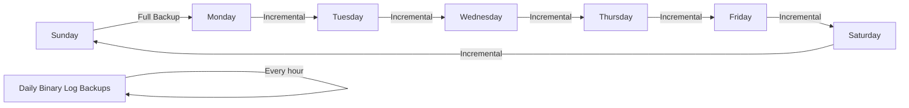

# MySQL Backup Recovery

## Introduction

Data is one of the most valuable assets for any organization. Losing database information due to hardware failures, software bugs, human errors, or malicious attacks can be catastrophic. This is where proper backup and recovery procedures become crucial.

In this guide, we'll explore MySQL backup and recovery strategies, providing you with the knowledge to protect your data effectively. Whether you're managing a small personal database or an enterprise-level system, understanding these concepts is essential for any database administrator.

## Why Backup Matters

Before diving into the how-to's, let's understand why database backups are critical:

- **Data Protection**: Safeguards against accidental deletion, corruption, or hardware failures
- **Business Continuity**: Ensures operations can continue even after a catastrophic event
- **Compliance**: Many industries have regulations requiring regular data backups
- **Migration Support**: Facilitates moving databases between servers or environments
- **Historical Records**: Provides point-in-time snapshots of your data for auditing or analysis

## Types of MySQL Backups

MySQL supports several backup methods, each with its own advantages:

### 1. Logical Backups

Logical backups contain SQL statements that can recreate your database objects and data. They are:

- Human-readable
- Portable across different MySQL versions
- More flexible for selective data restoration
- Typically slower to restore than physical backups

### 2. Physical Backups

Physical backups are copies of the actual files that make up your database. They are:

- Faster to create and restore (especially for large databases)
- More suitable for point-in-time recovery
- Less portable across different MySQL versions or platforms
- Usually require the database to be offline during backup (unless using specialized tools)

### 3. Online vs. Offline Backups

- **Online backups** (hot backups): Created while the database is running
- **Offline backups** (cold backups): Require the database to be shut down temporarily

## Backup Tools and Methods

Let's explore the most common tools and methods for MySQL backups:

### mysqldump (Logical Backup)

`mysqldump` is MySQL's built-in utility for creating logical backups. It's simple to use and available in all MySQL installations.

#### Basic mysqldump Example

To backup a single database:

```bash
mysqldump -u username -p database_name > backup.sql
```

To backup multiple databases:

```bash
mysqldump -u username -p --databases db1 db2 db3 > multiple_dbs.sql
```

To backup all databases:

```bash
mysqldump -u username -p --all-databases > all_databases.sql
```

#### Adding Options for Better Backups

```bash
mysqldump -u username -p \
  --single-transaction \  # For InnoDB tables, ensures consistent backup
  --routines \            # Include stored procedures and functions
  --triggers \            # Include triggers
  --events \              # Include event scheduler events
  --add-drop-table \      # Add DROP TABLE statements before CREATE
  database_name > comprehensive_backup.sql
```

### MySQL Enterprise Backup (Physical Backup)

For production environments, MySQL Enterprise Backup (part of MySQL Enterprise Edition) provides hot backups with minimal impact on performance:

```bash
mysqlbackup --user=admin --password --backup-dir=/backup \
  --with-timestamp backup-and-apply-log
```

### Percona XtraBackup (Open Source Physical Backup)

An open-source alternative for physical backups:

```bash
xtrabackup --backup --target-dir=/path/to/backup
```

### Binary Log Backups

Binary logs record all changes to your data, enabling point-in-time recovery:

```bash
# Enable binary logging in my.cnf
# [mysqld]
# log-bin=mysql-bin
# binlog_format=ROW

# Flush binary logs to start a new one
mysql> FLUSH BINARY LOGS;

# List binary logs
mysql> SHOW BINARY LOGS;
```

## Creating a Backup Strategy

A comprehensive backup strategy typically includes:

1. **Regular full backups**: Complete copies of your databases
2. **Incremental backups**: Only changes since the last backup
3. **Binary log backups**: For point-in-time recovery
4. **Offsite storage**: Copies stored in a different physical location
5. **Backup verification**: Regular testing of restore procedures

Here's a simple backup schedule example:



## Automating Backups

Scheduled backups ensure consistency and remove human error. Here's how to automate backups with cron:

```bash
# Edit crontab
crontab -e

# Add a daily backup at 2 AM
0 2 * * * /usr/bin/mysqldump -u username -ppassword database_name | gzip > /backup/database_$(date +\%Y\%m\%d).sql.gz

# Add weekly full backup on Sundays
0 1 * * 0 /usr/bin/mysqldump -u username -ppassword --all-databases | gzip > /backup/all_databases_$(date +\%Y\%m\%d).sql.gz
```

## Recovery Methods

Now let's look at how to restore your data after a failure:

### Restoring from mysqldump

To restore a database from a mysqldump file:

```bash
# Create an empty database first (if needed)
mysql -u username -p -e "CREATE DATABASE IF NOT EXISTS database_name;"

# Restore the backup
mysql -u username -p database_name < backup.sql
```

### Restoring from MySQL Enterprise Backup

```bash
mysqlbackup --defaults-file=/etc/my.cnf \
  --datadir=/var/lib/mysql \
  --backup-dir=/backup/2023-07-15 \
  copy-back
```

### Point-in-Time Recovery

This process combines a full backup with binary log replay:

1. Restore the full backup
2. Determine which binary logs to apply
3. Use the `mysqlbinlog` utility to apply changes up to a specific point

```bash
# First, restore the full backup
mysql -u username -p database_name < full_backup.sql

# Then apply binary logs up to a specific time
mysqlbinlog --start-datetime="2023-07-15 08:00:00" \
  --stop-datetime="2023-07-15 09:15:00" \
  /var/lib/mysql/mysql-bin.000123 | mysql -u username -p
```

## Common Recovery Scenarios

Let's explore some real-world recovery scenarios:

### Scenario 1: Recovering a Dropped Table

Imagine a developer accidentally drops an important table:

```sql
-- Accidental drop
DROP TABLE customers;
```

Recovery steps:

```bash
# 1. Identify when the accident happened
mysql> SHOW BINARY LOGS;

# 2. Restore the database to a point just before the DROP
mysql -u username -p database_name < last_full_backup.sql

# 3. Apply binary logs up to the moment before the DROP
mysqlbinlog --stop-position=123456 mysql-bin.000123 | mysql -u username -p
```

### Scenario 2: Server Crash Recovery

If your MySQL server crashes due to hardware failure:

1. Fix hardware issues or provision a new server
2. Install MySQL with the same version
3. Restore your data:

```bash
# Restore data directory from backup
mysqlbackup --copy-back --backup-dir=/path/to/backup

# Or restore from logical backup
mysql -u root -p < all_databases.sql

# Apply any binary logs if needed
mysqlbinlog mysql-bin.000* | mysql -u root -p
```

### Scenario 3: Selective Data Recovery

To recover specific data without full restore:

```bash
# Extract just the table definition and data
mysqldump -u username -p database_name table_name > table_backup.sql

# Edit the SQL file to keep only what you need

# Restore just that table
mysql -u username -p database_name < table_backup.sql
```

## Best Practices for MySQL Backup and Recovery

1. **Document your backup strategy** and recovery procedures
2. **Test recovery procedures** regularly with practice runs
3. **Monitor backup jobs** and alert on failures
4. **Encrypt sensitive backup data** to protect it at rest
5. **Implement backup rotation** to balance storage needs with retention policies
6. **Use consistent backup naming conventions** for easier management
7. **Maintain backups in multiple locations** for disaster recovery
8. **Verify backup integrity** after creation
9. **Consider database size and downtime requirements** when choosing backup methods
10. **Keep MySQL and backup software updated** for security and feature improvements

## Troubleshooting Backup and Recovery Issues

### Problem: mysqldump Taking Too Long

Solution:
- Use `--single-transaction` instead of `--lock-tables`
- Split large backups into smaller chunks
- Schedule backups during low-traffic periods

### Problem: Restore Process Fails

Solution:
- Check MySQL error logs for specific errors
- Verify MySQL version compatibility
- Ensure sufficient disk space and permissions
- For syntax errors, examine the backup file for corruption

### Problem: Binary Logs Missing

Solution:
- Verify binary logging is enabled
- Check binary log retention settings
- Implement a binary log backup strategy

## Summary

MySQL backup and recovery is a critical aspect of database administration. In this guide, we've covered:

- The importance of regular database backups
- Different backup types and tools available in MySQL
- Step-by-step backup creation processes
- Recovery strategies for various scenarios
- Best practices and troubleshooting tips

Remember that the best time to implement a backup strategy is before you need it. Regular testing of your recovery procedures ensures you'll be prepared when data loss occurs.

## Additional Resources

- [MySQL Official Documentation on Backup and Recovery](https://dev.mysql.com/doc/refman/8.0/en/backup-and-recovery.html)
- Percona's blog has excellent articles on MySQL backup strategies
- MySQL High Availability by Charles Bell, Mats Kindahl, and Lars Thalmann (O'Reilly)

## Exercises

1. Set up a daily backup schedule for a sample database using `mysqldump` and cron
2. Create a backup and then intentionally delete a table in your test database - practice recovering it
3. Experiment with point-in-time recovery by making a series of changes, then recovering to a specific point
4. Compare backup file sizes and creation times between using compression and not using compression
5. Write a simple shell script that backs up databases and rotates old backups

By mastering MySQL backup and recovery techniques, you'll ensure your data remains safe and your services stay available even when unexpected problems occur.