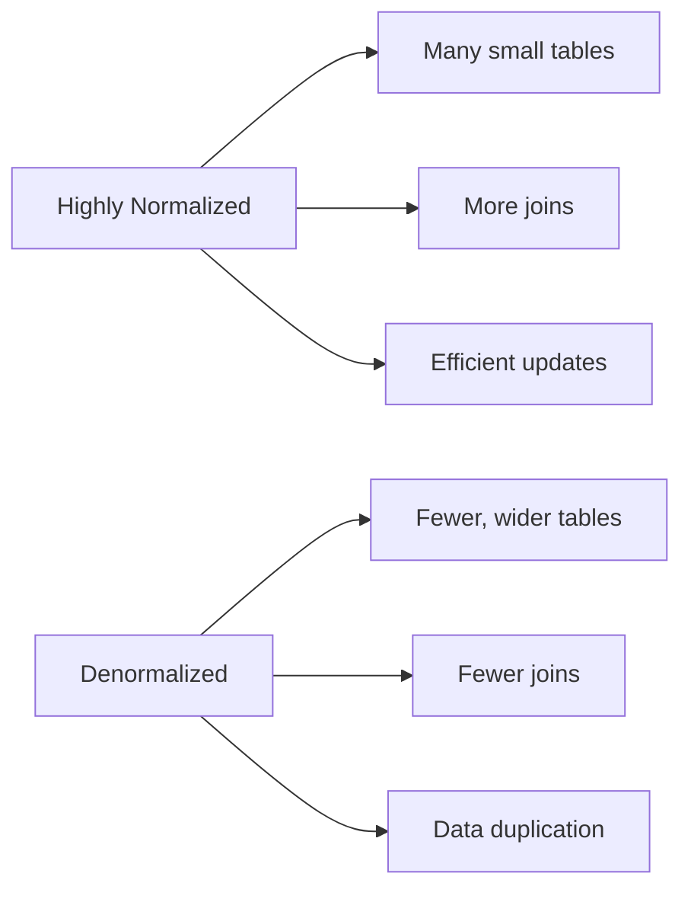

# MySQL Performance Tuning

## Introduction

MySQL is one of the most popular relational database management systems used in web applications, from small personal blogs to large enterprise solutions. However, as your database grows and your application receives more traffic, you may notice performance degradation. This is where MySQL performance tuning comes into play.

Performance tuning is the process of optimizing your MySQL configuration, database schema, and queries to ensure your database operates efficiently. In this guide, we'll explore various techniques to enhance MySQL performance, even if you're just getting started with database administration.

## Why Performance Tuning Matters

Before diving into specific techniques, let's understand why performance tuning is crucial:

1. **User Experience**: Slow database responses lead to slow applications, which frustrates users.
2. **Resource Utilization**: Efficient queries consume fewer CPU, memory, and I/O resources.
3. **Scalability**: Well-tuned databases can handle more concurrent users without requiring hardware upgrades.
4. **Cost Savings**: Better performance means you can serve more users with the same hardware.

## Key Areas for MySQL Performance Tuning

### 1. Server Configuration

MySQL's configuration file (usually `my.cnf` or `my.ini`) contains settings that significantly impact performance.

#### Key Configuration Parameters

```
# Memory-related settings
innodb_buffer_pool_size = 1G      # Allocate memory for InnoDB
query_cache_size = 0              # Usually best to disable in MySQL 5.7+
max_connections = 150             # Adjust based on your application needs

# InnoDB settings
innodb_file_per_table = 1         # Separate tablespace files for each table
innodb_flush_log_at_trx_commit = 1 # For ACID compliance (can be adjusted)
innodb_flush_method = O_DIRECT    # Avoid double buffering

# Binary logging
expire_logs_days = 7              # Purge binary logs after 7 days
```

:::tip
The optimal configuration depends on your server's resources and workload. Start with conservative values and adjust based on monitoring.
:::

#### Finding Your Configuration File

```bash
mysql --help | grep "Default options" -A 1
```

This command shows the location of the default MySQL configuration file on your system.

### 2. Indexing Strategies

Proper indexing is perhaps the single most important factor in query performance.

#### Creating Effective Indexes

```sql
-- Creating a basic index
CREATE INDEX idx_user_email ON users(email);

-- Creating a composite index for queries that filter by multiple columns
CREATE INDEX idx_product_category_price ON products(category_id, price);

-- Creating a covering index that includes all columns in a query
CREATE INDEX idx_order_details ON orders(customer_id, order_date) INCLUDE (status, total);
```

#### Index Best Practices

1. **Index columns used in WHERE clauses**: This allows MySQL to quickly locate relevant rows.
2. **Create composite indexes wisely**: Place the most selective column first (the one that filters out the most rows).
3. **Don't over-index**: Each index adds overhead to write operations.
4. **Consider covering indexes**: These include all columns needed by a query, eliminating the need to access the table.

#### Finding Missing Indexes

You can use the `EXPLAIN` statement to identify queries that could benefit from indexing:

```sql
EXPLAIN SELECT * FROM customers WHERE last_name = 'Smith';
```

Example output:

```
+----+-------------+-----------+------------+------+---------------+------+---------+------+------+----------+-------------+
| id | select_type | table     | partitions | type | possible_keys | key  | key_len | ref  | rows | filtered | Extra       |
+----+-------------+-----------+------------+------+---------------+------+---------+------+------+----------+-------------+
|  1 | SIMPLE      | customers | NULL       | ALL  | NULL          | NULL | NULL    | NULL | 1000 |    10.00 | Using where |
+----+-------------+-----------+------------+------+---------------+------+---------+------+------+----------+-------------+
```

When you see `type: ALL` and no keys being used, it's a strong indicator that an index would help.

### 3. Query Optimization

Even with proper indexing, poorly written queries can still perform badly.

#### Query Optimization Techniques

1. **Select only required columns**:

```sql
-- Instead of this
SELECT * FROM products WHERE category_id = 5;

-- Use this
SELECT product_id, name, price FROM products WHERE category_id = 5;
```

2. **Limit results when you don't need all rows**:

```sql
SELECT * FROM orders ORDER BY order_date DESC LIMIT 100;
```

3. **Use JOINs efficiently**:

```sql
-- Use proper join types
SELECT c.name, COUNT(o.order_id) 
FROM customers c
LEFT JOIN orders o ON c.customer_id = o.customer_id
GROUP BY c.name;
```

4. **Avoid functions on indexed columns**:

```sql
-- This prevents index usage
SELECT * FROM employees WHERE YEAR(hire_date) = 2021;

-- Better alternative
SELECT * FROM employees WHERE hire_date BETWEEN '2021-01-01' AND '2021-12-31';
```

#### Analyzing Slow Queries

MySQL's slow query log helps identify problematic queries:

```sql
-- Enable slow query log
SET GLOBAL slow_query_log = 'ON';
SET GLOBAL long_query_time = 1;  -- Log queries taking more than 1 second
SET GLOBAL slow_query_log_file = '/var/log/mysql/mysql-slow.log';

-- Check current settings
SHOW VARIABLES LIKE 'slow_query%';
SHOW VARIABLES LIKE 'long_query_time';
```

### 4. Schema Optimization

Your database schema design significantly impacts performance.

#### Normalization vs. Denormalization

- **Normalization** eliminates redundancy but can require more joins
- **Denormalization** adds controlled redundancy for performance



#### Data Type Selection

Choose appropriate data types to optimize storage and performance:

```sql
-- Instead of this
CREATE TABLE users (
    id BIGINT,                 -- Excessive for most apps
    name VARCHAR(255),         -- Too large if names are typically shorter
    is_active VARCHAR(5),      -- Poor choice for boolean data
    description TEXT           -- Stored separately from table
);

-- Use this
CREATE TABLE users (
    id INT UNSIGNED,           -- More efficient if you won't exceed 4 billion users
    name VARCHAR(100),         -- More reasonable size
    is_active TINYINT(1),      -- Boolean (0 or 1)
    description TEXT           -- Keep if you need large text fields
);
```

### 5. Caching Strategies

MySQL provides several caching mechanisms to improve performance.

#### Query Cache (for MySQL 5.7 and earlier)

```sql
-- Check if query cache is enabled
SHOW VARIABLES LIKE 'query_cache_type';

-- Set query cache size (if enabled)
SET GLOBAL query_cache_size = 67108864; -- 64MB
```

:::note
In MySQL 8.0, the query cache was removed. For newer versions, consider using application-level caching or a caching service like Redis.
:::

#### Buffer Pool Configuration (InnoDB)

```sql
-- Check current buffer pool size
SHOW VARIABLES LIKE 'innodb_buffer_pool_size';

-- Set buffer pool size (adjust based on available RAM)
SET GLOBAL innodb_buffer_pool_size = 1073741824; -- 1GB
```

### 6. Monitoring and Benchmarking

Regular monitoring helps identify performance issues before they become critical.

#### Key Metrics to Monitor

1. **Query execution time**
2. **Number of slow queries**
3. **Buffer pool hit ratio**
4. **Disk I/O statistics**
5. **Connection count**

#### Using Performance Schema

MySQL's Performance Schema provides detailed monitoring information:

```sql
-- Enable Performance Schema
SET GLOBAL performance_schema = ON;

-- Find queries with highest average execution time
SELECT 
    digest_text AS query,
    count_star AS exec_count,
    avg_timer_wait/1000000000 AS avg_exec_time_ms
FROM performance_schema.events_statements_summary_by_digest
ORDER BY avg_timer_wait DESC
LIMIT 10;
```

#### Using MySQL Workbench

MySQL Workbench provides a user-friendly interface for monitoring performance metrics and creating visual execution plans.

## Real-World Performance Tuning Example

Let's walk through a real-world example of tuning a slow-performing e-commerce database.

### Initial Scenario

You notice that the product listing page is loading slowly. The current query is:

```sql
SELECT p.*, c.name AS category_name, AVG(r.rating) AS avg_rating 
FROM products p 
LEFT JOIN categories c ON p.category_id = c.id 
LEFT JOIN reviews r ON p.id = r.product_id 
WHERE p.price < 100 
GROUP BY p.id
ORDER BY p.created_at DESC;
```

### Step 1: Analyze the Query

```sql
EXPLAIN SELECT p.*, c.name AS category_name, AVG(r.rating) AS avg_rating 
FROM products p 
LEFT JOIN categories c ON p.category_id = c.id 
LEFT JOIN reviews r ON p.id = r.product_id 
WHERE p.price < 100 
GROUP BY p.id
ORDER BY p.created_at DESC;
```

Suppose the output shows that:
1. There's no index on `price` or `created_at`
2. The `GROUP BY` operation is using a temporary table
3. The sort is happening without an index

### Step 2: Add Appropriate Indexes

```sql
-- Index for filtering by price
CREATE INDEX idx_product_price ON products(price);

-- Index for sorting by creation date
CREATE INDEX idx_product_date ON products(created_at);

-- Composite index that might help both filtering and sorting
CREATE INDEX idx_product_price_date ON products(price, created_at);
```

### Step 3: Optimize the Query

```sql
-- Select only needed columns instead of p.*
SELECT p.id, p.name, p.description, p.price, p.image_url, 
       c.name AS category_name, 
       AVG(r.rating) AS avg_rating 
FROM products p 
LEFT JOIN categories c ON p.category_id = c.id 
LEFT JOIN reviews r ON p.id = r.product_id 
WHERE p.price < 100 
GROUP BY p.id, p.name, p.description, p.price, p.image_url, c.name
ORDER BY p.created_at DESC;
```

### Step 4: Implement Caching

For frequently accessed product listings, implement application-level caching to reduce database load.

### Step 5: Monitor and Fine-tune

After implementing these changes, continue monitoring performance and make additional adjustments as needed.

## Common Performance Issues and Solutions

| Issue | Possible Cause | Solution |
|-------|---------------|----------|
| Slow SELECT queries | Missing indexes | Add appropriate indexes on queried columns |
| High disk I/O | Insufficient buffer pool size | Increase `innodb_buffer_pool_size` |
| Connection timeouts | Too many connections | Increase `max_connections` or optimize connection pooling |
| Slow INSERT/UPDATE | Excessive indexes | Remove unnecessary indexes |
| Query cache not working | Invalid query cache settings | Adjust cache settings or implement application caching |
| Table locking issues | MyISAM tables under high concurrency | Convert to InnoDB for row-level locking |

## Summary

MySQL performance tuning is both an art and a science. It involves:

1. **Server configuration**: Adjust MySQL settings based on your hardware and workload
2. **Indexing**: Create appropriate indexes for your query patterns
3. **Query optimization**: Write efficient SQL that leverages your indexes
4. **Schema design**: Choose appropriate data types and normalization levels
5. **Caching**: Implement caching strategies to reduce database load
6. **Monitoring**: Continuously track performance metrics and identify bottlenecks

Remember that performance tuning is an iterative process. Start with the simplest optimizations, measure their impact, and then proceed to more complex techniques as needed.

## Additional Resources

Here are some resources to deepen your understanding of MySQL performance tuning:

1. **MySQL Documentation**: The official [MySQL Performance Schema documentation](https://dev.mysql.com/doc/refman/8.0/en/performance-schema.html)
2. **High Performance MySQL** by Baron Schwartz (book)
3. **MySQL Workbench**: Official tool with built-in performance reports
4. **EXPLAIN format=JSON**: More detailed query execution information: `EXPLAIN FORMAT=JSON SELECT * FROM table WHERE x=1;`

## Practice Exercises

1. Enable the slow query log on your MySQL server and analyze the results after a day of operation.
2. Use EXPLAIN to examine the execution plan of your application's top 5 most frequently executed queries.
3. Create a test database with a million rows and benchmark the performance difference between indexed and non-indexed queries.
4. Experiment with different `innodb_buffer_pool_size` settings and measure their impact on your application's performance.
5. Identify and optimize a query in your application that uses a function on an indexed column.

By applying these techniques and continuously monitoring your database performance, you'll be able to keep your MySQL database running smoothly even as your application grows.