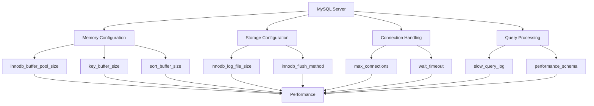

# MySQL Server Configuration

When setting up a MySQL database server, proper configuration is essential for ensuring optimal performance, security, and reliability. This guide will introduce you to MySQL server configuration concepts and techniques that every database administrator should know.

## Introduction to MySQL Configuration

MySQL server settings control everything from memory usage and connection handling to security features and query processing. Proper configuration can dramatically improve your database's performance and stability, while poor configuration can lead to slow queries, crashes, and even data loss.

The configuration is typically stored in files like `my.cnf` (on Linux/Unix) or `my.ini` (on Windows), but can also be modified at runtime for some parameters. In this guide, we'll focus on understanding the configuration file structure and the most important parameters to configure.

## The MySQL Configuration File

### Configuration File Locations

MySQL looks for configuration files in several locations, in a specific order:

| Platform | Default Configuration File Locations |
| --- | --- |
| Linux/Unix | `/etc/my.cnf`, `/etc/mysql/my.cnf`, `/usr/local/etc/my.cnf`, `~/.my.cnf` |
| Windows | `C:\Windows\my.ini`, `C:\my.ini`, `C:\Program Files\MySQL\MySQL Server 8.0\my.ini` |

You can check which configuration file your MySQL server is using with this command:

```sql
SHOW VARIABLES LIKE 'datadir';
```

### Configuration File Structure

The configuration file is organized into sections, indicated by square brackets. The most common sections include:

```ini
[mysqld]
# Server-specific settings go here

[mysql]
# MySQL client settings go here

[client]
# Settings used by all client programs

[mysqldump]
# Settings for the mysqldump utility
```

For most server configurations, you'll be working with the `[mysqld]` section.

## Essential Configuration Parameters

Let's explore the most important configuration parameters that beginners should understand:

### Memory Settings

```ini
[mysqld]
# The size of the buffer used for index blocks
key_buffer_size = 256M

# Memory allocated for caching table data
innodb_buffer_pool_size = 1G 

# Memory used for query caching (deprecated in MySQL 8.0+)
query_cache_size = 0

# Size of the buffer used for storing sort results
sort_buffer_size = 4M

# Buffer for joins that don't use indexes
join_buffer_size = 4M
```

The `innodb_buffer_pool_size` is particularly important since it caches both data and indexes for InnoDB tables (the default storage engine). A general guideline is to allocate 70-80% of available memory on a dedicated database server.

### Connection Settings

```ini
[mysqld]
# Maximum simultaneous connections allowed
max_connections = 151

# Maximum packet size MySQL can use
max_allowed_packet = 16M

# Maximum number of connections waiting to be processed
back_log = 50

# Time in seconds MySQL waits for activity on an interactive connection
interactive_timeout = 3600

# Time in seconds MySQL waits for activity on a non-interactive connection
wait_timeout = 600
```

Setting `max_connections` appropriately is crucial—too low and users might be unable to connect, too high and the server might run out of resources.

### Storage Engine Settings

For InnoDB (the default and recommended storage engine):

```ini
[mysqld]
# Directory where InnoDB creates its tablespace files
innodb_data_home_dir = /var/lib/mysql

# Size of each log file in the InnoDB redo log group
innodb_log_file_size = 256M

# Number of log files in the InnoDB redo log group
innodb_log_files_in_group = 2

# Controls I/O operations for data
innodb_flush_method = O_DIRECT

# Buffer size for data being written to log
innodb_log_buffer_size = 16M
```

### Query and Performance Settings

```ini
[mysqld]
# Log slow queries to help identify performance issues
slow_query_log = 1
slow_query_log_file = /var/log/mysql/slow-query.log
long_query_time = 2

# Enable the performance schema for monitoring
performance_schema = ON

# Set the transaction isolation level
transaction_isolation = REPEATABLE-READ
```

The slow query log is invaluable for identifying problematic queries that need optimization.

## Practical Example: Basic MySQL Configuration

Let's walk through a complete basic configuration example for a small to medium website:

```ini
[mysqld]
# BASIC SETTINGS
user = mysql
pid-file = /var/run/mysqld/mysqld.pid
socket = /var/run/mysqld/mysqld.sock
port = 3306
basedir = /usr
datadir = /var/lib/mysql
tmpdir = /tmp
lc-messages-dir = /usr/share/mysql

# MEMORY SETTINGS - Adjust these based on your server's memory
innodb_buffer_pool_size = 1G
innodb_log_file_size = 256M
key_buffer_size = 128M
max_connections = 100
sort_buffer_size = 4M
read_buffer_size = 2M
read_rnd_buffer_size = 2M
join_buffer_size = 2M

# QUERY CACHE - Disabled in MySQL 8.0+
query_cache_size = 0
query_cache_type = 0

# LOGGING
log_error = /var/log/mysql/error.log
slow_query_log = 1
slow_query_log_file = /var/log/mysql/slow-query.log
long_query_time = 2

# CHARACTER SET
character-set-server = utf8mb4
collation-server = utf8mb4_general_ci

# SECURITY
max_allowed_packet = 16M
sql_mode = STRICT_TRANS_TABLES,NO_ZERO_IN_DATE,NO_ZERO_DATE,ERROR_FOR_DIVISION_BY_ZERO,NO_ENGINE_SUBSTITUTION
```

## How to Apply Configuration Changes

After modifying the configuration file, you need to restart the MySQL server to apply the changes:

### On Linux (using systemd):

```bash
sudo systemctl restart mysql
# or
sudo systemctl restart mysqld
```

### On Windows:

```bash
net stop mysql
net start mysql
```

Some parameters can be changed dynamically (without restarting) using the `SET GLOBAL` command:

```sql
SET GLOBAL max_connections = 200;
```

To make these changes persist across restarts, you still need to update the configuration file.

## Checking Current MySQL Configuration

To see the current values of system variables:

```sql
SHOW VARIABLES;
```

To see specific variables:

```sql
SHOW VARIABLES LIKE 'max_connections';
SHOW VARIABLES LIKE '%buffer%';
```

To check status variables (runtime metrics):

```sql
SHOW STATUS;
SHOW STATUS LIKE 'Threads_connected';
```

## Configuration Best Practices

1. **Start with moderate values**: Begin with conservative settings and adjust based on actual usage patterns.

2. **Monitor and tune**: Use performance monitoring tools to identify bottlenecks and tune your configuration accordingly.

3. **Document changes**: Keep track of configuration changes and their impact on performance.

4. **Don't over-allocate memory**: Ensure the total memory allocated to MySQL doesn't exceed your server's available RAM.

5. **Test in a staging environment first**: Always test significant configuration changes in a non-production environment.

## Common Performance Tuning Scenarios

### Scenario 1: High-Traffic Web Application

For a database supporting a busy website:

```ini
[mysqld]
innodb_buffer_pool_size = 70% of server RAM
innodb_buffer_pool_instances = 8
innodb_read_io_threads = 8
innodb_write_io_threads = 8
innodb_flush_log_at_trx_commit = 2
innodb_flush_method = O_DIRECT
max_connections = 500
table_open_cache = 4000
```

### Scenario 2: Data Warehouse / Analytics

For a database primarily used for reporting and analysis:

```ini
[mysqld]
innodb_buffer_pool_size = 70% of server RAM
join_buffer_size = 32M
sort_buffer_size = 32M
read_rnd_buffer_size = 16M
tmp_table_size = 64M
max_heap_table_size = 64M
innodb_doublewrite = 0  # Only if using reliable storage with good battery backup
```

## Visualizing Database Configuration Impact

Here's a simple diagram showing how different configuration parameters affect database performance:



## Summary

Proper MySQL configuration is a balancing act that requires understanding of your application's needs, your server's resources, and MySQL's internal workings. Key points to remember:

- The main configuration file is typically named `my.cnf` or `my.ini` depending on your operating system
- Memory settings like `innodb_buffer_pool_size` have the greatest impact on performance
- Connection settings must be tuned according to your application's needs
- Logging slow queries helps identify performance bottlenecks
- Configuration should be monitored and adjusted as your application grows

With the knowledge from this guide, you should now be able to create a basic MySQL configuration that provides a solid foundation for your database server.

## Additional Resources

- [MySQL Server System Variables Documentation](https://dev.mysql.com/doc/refman/8.0/en/server-system-variables.html)
- [MySQL Performance Tuning Primer Script](https://github.com/major/MySQLTuner-perl)
- [InnoDB Performance Optimization Basics](https://dev.mysql.com/doc/refman/8.0/en/innodb-performance.html)

## Exercises

1. Create a MySQL configuration file suitable for a development environment with limited resources (2GB RAM).

2. Given a server with 16GB RAM, calculate and provide appropriate values for `innodb_buffer_pool_size`, `key_buffer_size`, and other memory-related parameters.

3. Research and explain the impact of changing the `innodb_flush_log_at_trx_commit` parameter from its default value.

4. Configure MySQL to log all queries that take more than 1 second to execute, and explain how to analyze these logs to improve performance.

5. Create a test database and experiment with different values for `sort_buffer_size` to see how it affects the performance of queries with large ORDER BY clauses.