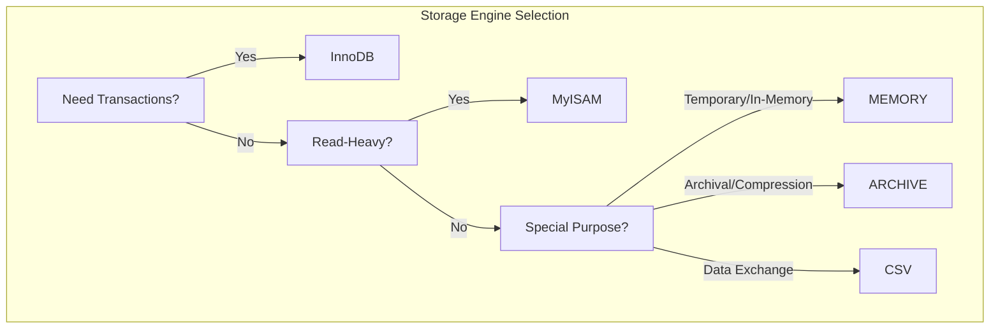

# MySQL Storage Engines

## Introduction

In MySQL, a storage engine is a software component that handles the operations of storing, retrieving, and managing data in a database. Think of storage engines as different types of engines in cars – each designed for specific purposes with their own advantages and limitations. MySQL's pluggable storage engine architecture allows you to select the most appropriate storage engine for each table in your database, optimizing performance based on your specific requirements.

In this tutorial, we'll explore different MySQL storage engines, their characteristics, and how to choose the right one for your application needs.

## Understanding Storage Engines in MySQL

Storage engines are responsible for:

1. **Data Storage**: How data is physically stored on disk
2. **Data Retrieval**: How data is read from storage
3. **Indexing**: How indexes are implemented to speed up queries
4. **Transaction Control**: How transactions are managed (if supported)
5. **Locking Mechanisms**: How concurrent access is handled

Let's look at how to check available storage engines and the default engine in your MySQL server.

## Checking Available Storage Engines

To see which storage engines are available on your MySQL server, you can use the `SHOW ENGINES` command:

```sql
SHOW ENGINES;
```

Output (example):

```
+--------------------+---------+----------------------------------------------------------------+--------------+------+------------+
| Engine             | Support | Comment                                                        | Transactions | XA   | Savepoints |
+--------------------+---------+----------------------------------------------------------------+--------------+------+------------+
| InnoDB             | DEFAULT | Supports transactions, row-level locking, and foreign keys     | YES          | YES  | YES        |
| MRG_MYISAM         | YES     | Collection of identical MyISAM tables                          | NO           | NO   | NO         |
| MEMORY             | YES     | Hash based, stored in memory, useful for temporary tables      | NO           | NO   | NO         |
| BLACKHOLE          | YES     | /dev/null storage engine (anything you write to it disappears) | NO           | NO   | NO         |
| MyISAM             | YES     | MyISAM storage engine                                          | NO           | NO   | NO         |
| CSV                | YES     | CSV storage engine                                             | NO           | NO   | NO         |
| ARCHIVE            | YES     | Archive storage engine                                         | NO           | NO   | NO         |
| PERFORMANCE_SCHEMA | YES     | Performance Schema                                             | NO           | NO   | NO         |
| FEDERATED          | NO      | Federated MySQL storage engine                                 | NULL         | NULL | NULL       |
+--------------------+---------+----------------------------------------------------------------+--------------+------+------------+
```

To check which engine is set as default:

```sql
SHOW VARIABLES LIKE 'default_storage_engine';
```

Output:

```
+------------------------+--------+
| Variable_name          | Value  |
+------------------------+--------+
| default_storage_engine | InnoDB |
+------------------------+--------+
```

## Major MySQL Storage Engines

Let's explore the most commonly used storage engines:

### 1. InnoDB

InnoDB is the default storage engine as of MySQL 5.5 and is designed for maximum performance when processing high volumes of data with high concurrency.

#### Key Features:

- **ACID Compliance**: Fully supports transactions
- **Row-Level Locking**: Better concurrency handling
- **Foreign Key Constraints**: Supports referential integrity
- **Crash Recovery**: Automatic recovery after a crash
- **Buffer Pool**: In-memory caching for improved performance

#### When to use InnoDB:
- Web applications with high concurrency
- Applications requiring transactions
- Systems needing foreign key constraints
- Any data that cannot tolerate corruption or loss

#### Example: Creating an InnoDB table

```sql
CREATE TABLE customers (
    id INT AUTO_INCREMENT PRIMARY KEY,
    name VARCHAR(100) NOT NULL,
    email VARCHAR(100) UNIQUE,
    created_at TIMESTAMP DEFAULT CURRENT_TIMESTAMP
) ENGINE=InnoDB;
```

### 2. MyISAM

MyISAM was the default storage engine before MySQL 5.5. It's simple, fast for read operations, but lacks transaction support.

#### Key Features:

- **Table-Level Locking**: Entire table is locked during writes
- **Full-Text Indexing**: Better for full-text search (in older MySQL versions)
- **No Transaction Support**: Cannot roll back changes
- **No Foreign Keys**: Doesn't enforce referential integrity
- **Smaller Disk Footprint**: Often uses less space than InnoDB

#### When to use MyISAM:
- Read-heavy applications with minimal writes
- Applications that don't require transactions
- Legacy systems already using MyISAM
- Systems where disk space is a concern

#### Example: Creating a MyISAM table

```sql
CREATE TABLE blog_posts (
    id INT AUTO_INCREMENT PRIMARY KEY,
    title VARCHAR(200) NOT NULL,
    content TEXT,
    tags VARCHAR(255),
    views INT DEFAULT 0,
    published_at TIMESTAMP
) ENGINE=MyISAM;
```

### 3. MEMORY (HEAP)

The MEMORY storage engine creates tables stored in memory, which makes them extremely fast but temporary.

#### Key Features:

- **In-Memory Storage**: All data stored in RAM
- **Hash Indexes**: Very fast lookups
- **Table-Level Locking**: Limited concurrency
- **Volatile**: Data is lost when server restarts
- **No BLOB/TEXT Fields**: Limited data types support

#### When to use MEMORY:
- Temporary tables and intermediate results
- Lookup or mapping tables that are small and static
- Caching frequently accessed data

#### Example: Creating a MEMORY table

```sql
CREATE TABLE active_sessions (
    session_id VARCHAR(100) PRIMARY KEY,
    user_id INT NOT NULL,
    login_time TIMESTAMP DEFAULT CURRENT_TIMESTAMP,
    last_activity TIMESTAMP
) ENGINE=MEMORY;
```

### 4. ARCHIVE

ARCHIVE is designed for storing large amounts of data without indexes in a highly compressed format.

#### Key Features:

- **High Compression**: Reduces storage requirements
- **Insert-Only**: No UPDATE or DELETE operations
- **No Indexes**: Except for PRIMARY KEY (MySQL 5.1+)
- **Row-Level Locking**: Better concurrency for inserts

#### When to use ARCHIVE:
- Historical data that is rarely accessed
- Logging systems
- Archival of old data that must be retained

#### Example: Creating an ARCHIVE table

```sql
CREATE TABLE access_logs_2022 (
    log_id INT AUTO_INCREMENT PRIMARY KEY,
    access_time TIMESTAMP DEFAULT CURRENT_TIMESTAMP,
    ip_address VARCHAR(45),
    page_accessed VARCHAR(255),
    user_agent TEXT
) ENGINE=ARCHIVE;
```

### 5. CSV

The CSV storage engine stores data in comma-separated values text files.

#### Key Features:

- **Plain Text Files**: Easy to export/import
- **No Indexes**: Sequential scans only
- **No NULL Values**: All columns must have values

#### When to use CSV:
- Data interchange with other applications
- Simple data logging where external tools need direct access

#### Example: Creating a CSV table

```sql
CREATE TABLE exported_data (
    id INT NOT NULL,
    name VARCHAR(50) NOT NULL,
    value DECIMAL(10,2) NOT NULL
) ENGINE=CSV;
```

## Comparing Storage Engines

Here's a quick comparison of the main storage engines:



| Feature | InnoDB | MyISAM | MEMORY | ARCHIVE | CSV |
|---------|--------|--------|--------|---------|-----|
| Transactions | ✓ | ✗ | ✗ | ✗ | ✗ |
| Foreign Keys | ✓ | ✗ | ✗ | ✗ | ✗ |
| Locking Level | Row | Table | Table | Row | Table |
| Crash Recovery | ✓ | Limited | N/A | ✓ | ✗ |
| Full-Text Search | ✓ | ✓ | ✗ | ✗ | ✗ |
| Data Compression | ✓ | ✓ | ✗ | ✓ | ✗ |
| Memory Usage | Higher | Lower | Highest | Low | Low |
| Disk Usage | Higher | Lower | N/A | Lowest | Medium |

## Working with Storage Engines

### Creating Tables with Specific Storage Engines

When creating a table, you can specify the storage engine:

```sql
CREATE TABLE products (
    id INT AUTO_INCREMENT PRIMARY KEY,
    name VARCHAR(100),
    price DECIMAL(10,2)
) ENGINE=InnoDB;
```

### Converting Between Storage Engines

You can change the storage engine of an existing table:

```sql
ALTER TABLE products ENGINE = MyISAM;
```

### Checking a Table's Storage Engine

To check which engine a table is using:

```sql
SHOW TABLE STATUS WHERE Name = 'products';
```

Output:

```
+----------+--------+---------+------------+------+----------------+-------------+-----------------+--------------+-----------+----------------+---------------------+-------------+------------+-------------------+----------+----------------+---------+
| Name     | Engine | Version | Row_format | Rows | Avg_row_length | Data_length | Max_data_length | Index_length | Data_free | Auto_increment | Create_time         | Update_time | Check_time | Collation         | Checksum | Create_options | Comment |
+----------+--------+---------+------------+------+----------------+-------------+-----------------+--------------+-----------+----------------+---------------------+-------------+------------+-------------------+----------+----------------+---------+
| products | InnoDB |      10 | Dynamic    |    0 |              0 |       16384 |               0 |        16384 |         0 |              1 | 2023-09-15 14:30:45 | NULL        | NULL       | utf8mb4_0900_ai_ci |     NULL |                |         |
+----------+--------+---------+------------+------+----------------+-------------+-----------------+--------------+-----------+----------------+---------------------+-------------+------------+-------------------+----------+----------------+---------+
```

## Real-World Examples

### Example 1: E-commerce Database with Multiple Engines

In a real e-commerce application, you might use different storage engines for different tables:

```sql
-- Products catalog - frequently read, less frequently updated
CREATE TABLE products (
    id INT AUTO_INCREMENT PRIMARY KEY,
    name VARCHAR(200) NOT NULL,
    description TEXT,
    price DECIMAL(10,2) NOT NULL,
    stock INT NOT NULL DEFAULT 0,
    category_id INT,
    INDEX (category_id),
    FOREIGN KEY (category_id) REFERENCES categories(id)
) ENGINE=InnoDB;

-- Order transactions - ACID compliant
CREATE TABLE orders (
    id INT AUTO_INCREMENT PRIMARY KEY,
    user_id INT NOT NULL,
    order_date TIMESTAMP DEFAULT CURRENT_TIMESTAMP,
    status ENUM('pending', 'processing', 'shipped', 'delivered', 'cancelled') DEFAULT 'pending',
    total DECIMAL(10,2) NOT NULL,
    FOREIGN KEY (user_id) REFERENCES users(id)
) ENGINE=InnoDB;

-- Current session data - fast, in-memory
CREATE TABLE active_carts (
    session_id VARCHAR(64) PRIMARY KEY,
    user_id INT,
    created_at TIMESTAMP DEFAULT CURRENT_TIMESTAMP,
    cart_data JSON
) ENGINE=MEMORY;

-- Historical access logs - compressed archive
CREATE TABLE access_logs (
    id BIGINT AUTO_INCREMENT PRIMARY KEY,
    timestamp TIMESTAMP DEFAULT CURRENT_TIMESTAMP,
    ip_address VARCHAR(45),
    user_id INT,
    page VARCHAR(255),
    referrer VARCHAR(255)
) ENGINE=ARCHIVE;
```

### Example 2: Performance Comparison

Let's examine a simple benchmark that shows how different storage engines perform in read and write operations:

```sql
-- Create test tables with identical structure but different engines
CREATE TABLE test_innodb (id INT AUTO_INCREMENT PRIMARY KEY, data VARCHAR(100)) ENGINE=InnoDB;
CREATE TABLE test_myisam (id INT AUTO_INCREMENT PRIMARY KEY, data VARCHAR(100)) ENGINE=MyISAM;
CREATE TABLE test_memory (id INT AUTO_INCREMENT PRIMARY KEY, data VARCHAR(100)) ENGINE=MEMORY;

-- Insert 100,000 records into each table and measure time
-- Results will vary by system, but generally:
-- MEMORY will be fastest for inserts
-- MyISAM will be faster than InnoDB for inserts
-- For reads with proper indexing, differences are smaller
-- InnoDB will handle concurrent writes better
```

## Best Practices for Choosing Storage Engines

1. **Default to InnoDB** for most new applications:
   - ACID compliance
   - Row-level locking
   - Modern optimizations

2. **Consider MyISAM** for:
   - Legacy applications that rely on its features
   - Read-only or read-mostly tables
   - Tables requiring full-text search (in MySQL versions < 5.6)

3. **Use MEMORY** for:
   - Temporary tables
   - Cache tables
   - Quick lookups in relatively static data

4. **Use ARCHIVE** for:
   - Historical data that's rarely accessed
   - Log tables that need high compression

5. **Use mixed engines** where it makes sense:
   - Don't feel obligated to use a single engine for all tables
   - Match the engine to each table's specific requirements

## Common Issues and Troubleshooting

### Issue 1: MyISAM Table Corruption

MyISAM tables can become corrupted after system crashes. To repair:

```sql
-- Check table for errors
CHECK TABLE my_table;

-- Repair a corrupted MyISAM table
REPAIR TABLE my_table;
```

### Issue 2: InnoDB Performance Tuning

InnoDB's buffer pool is critical for performance. Adjust the buffer pool size:

```sql
-- Check current buffer pool size
SHOW VARIABLES LIKE 'innodb_buffer_pool_size';

-- Set buffer pool size (consult with your DBA first)
SET GLOBAL innodb_buffer_pool_size = 1073741824; -- Set to 1GB
```

### Issue 3: Locked Tables with MyISAM

MyISAM uses table-level locking, which can cause contention:

```sql
-- Show currently locked tables
SHOW OPEN TABLES WHERE In_use > 0;
```

## Summary

MySQL's storage engine architecture gives you flexibility to optimize your database for specific workloads. Here's what we covered:

- Storage engines are components that handle how data is stored and retrieved
- InnoDB is the default engine offering transaction support and row-level locking
- MyISAM is optimized for read operations but lacks transaction support
- MEMORY provides ultra-fast in-memory tables for temporary data
- ARCHIVE offers high compression for historical data
- CSV allows easy data interchange with other applications

Each storage engine has specific use cases, and you can mix them in a single database to optimize for different requirements. For most new applications, InnoDB is the recommended default choice due to its robustness and feature set.

## Exercises

1. Create a database for a blog with appropriate storage engines for posts, comments, user sessions, and historical analytics data.
2. Write a script to convert all MyISAM tables in a database to InnoDB.
3. Create a benchmark test comparing the read and write performance of InnoDB and MyISAM for your specific workload.
4. Implement a hybrid system that uses MEMORY tables as a cache for frequently accessed data from InnoDB tables.

## Additional Resources

- [MySQL Official Documentation on Storage Engines](https://dev.mysql.com/doc/refman/8.0/en/storage-engines.html)
- [MySQL Performance Tuning Guide](https://dev.mysql.com/doc/refman/8.0/en/optimization.html)
- [InnoDB Storage Engine Documentation](https://dev.mysql.com/doc/refman/8.0/en/innodb-storage-engine.html)

MySQL storage engines are a fundamental concept to understand as you work with databases. By choosing the right engine for each use case, you can significantly improve your application's performance, reliability, and efficiency.