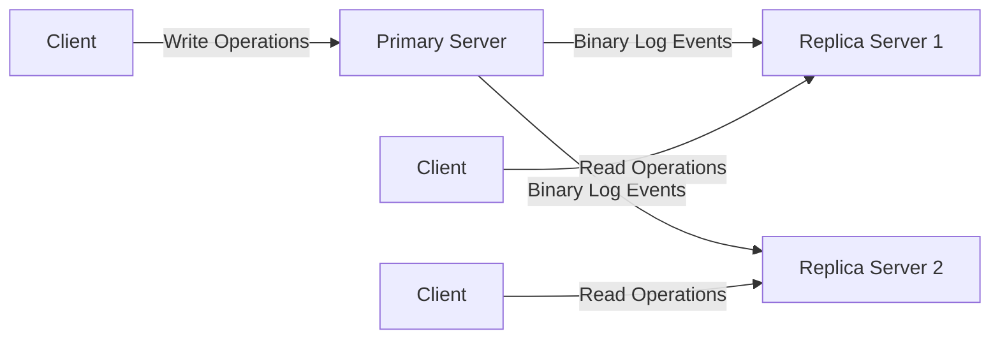
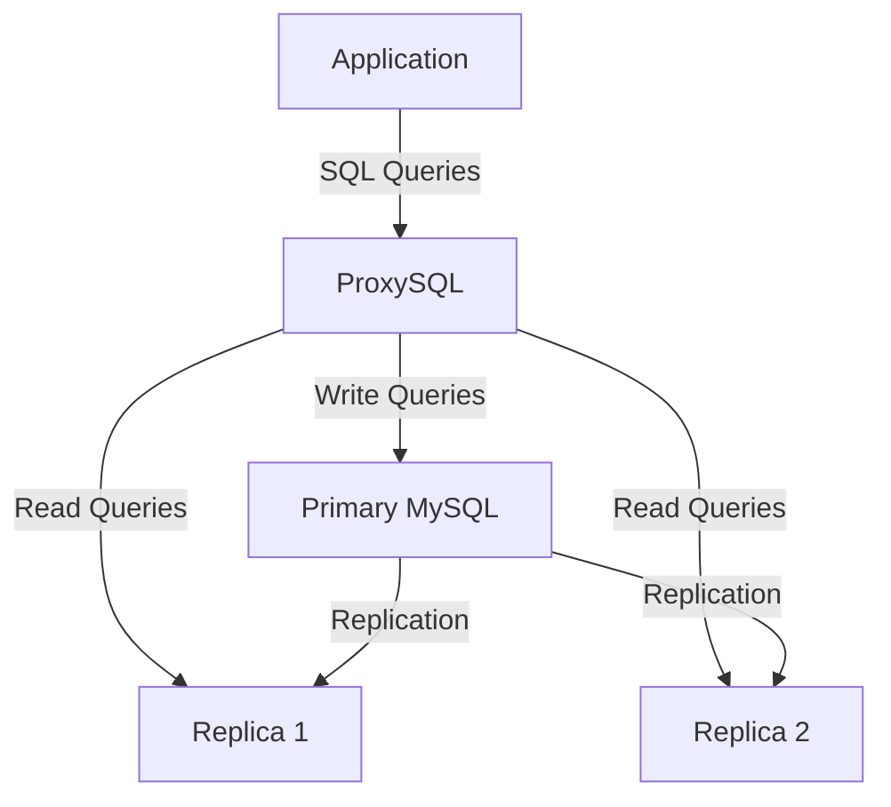

# MySQL Replication

## Introduction

MySQL replication is a process that allows you to maintain identical copies of a database across multiple servers. One server acts as the source (traditionally called "master" but now often referred to as "primary") while one or more servers act as replicas (traditionally called "slaves"). The primary server records all changes to your data in special files called binary logs. Replica servers then read these binary logs and execute the recorded changes on their own copies of the data.

Replication is a fundamental technique in database administration that provides several benefits:

- **High Availability**: If the primary server fails, a replica can be promoted to take its place
- **Scaling Read Operations**: Read queries can be distributed across multiple replicas
- **Data Backup**: Replicas provide additional copies of your data for backup purposes
- **Data Analysis**: Analytical queries can run on replicas without affecting the primary server's performance

In this tutorial, we'll explore how MySQL replication works, how to set it up, and some common scenarios where it's useful.

## How MySQL Replication Works

Before diving into the setup, let's understand the basic replication process:



1. A client sends write operations (INSERT, UPDATE, DELETE) to the primary server
2. The primary server records these changes in its binary log
3. Replica servers connect to the primary and request binary log events
4. The primary sends these events to the replicas
5. Replicas apply the changes to their own data
6. Clients can now read data from any of the servers

## Types of MySQL Replication

MySQL supports several replication methods:

### 1. Binary Log File Position Based Replication

This is the traditional method where replicas track their position in the primary's binary log.

### 2. Global Transaction Identifier (GTID) Based Replication

A more modern approach that uses unique transaction identifiers for tracking replication state.

### 3. Semi-Synchronous Replication

The primary waits for at least one replica to acknowledge receipt of transaction events before committing.

### 4. Asynchronous Replication

The default method where the primary doesn't wait for replica acknowledgment.

## Setting Up MySQL Replication (Binary Log Position Based)

Let's walk through setting up basic primary-replica replication:

### Step 1: Configure the Primary Server

First, we need to edit the MySQL configuration file on the primary server:

```ini
# For MySQL 8.0+ in /etc/mysql/my.cnf or similar
[mysqld]
server-id=1
log_bin=mysql-bin
binlog_format=ROW
binlog_do_db=example_db  # Optional: replicate only this database
```

Key parameters explained:
- `server-id`: A unique identifier for this server (must be different for each server)
- `log_bin`: Enables binary logging and sets the filename prefix
- `binlog_format`: Sets the binary logging format (ROW is recommended)
- `binlog_do_db`: Optional parameter to replicate only specific databases

After modifying the configuration, restart MySQL:

```bash
sudo systemctl restart mysql
```

### Step 2: Create a Replication User on the Primary

Connect to MySQL on the primary server and create a user with replication privileges:

```sql
CREATE USER 'repl_user'@'%' IDENTIFIED BY 'StrongPassword';
GRANT REPLICATION SLAVE ON *.* TO 'repl_user'@'%';
FLUSH PRIVILEGES;
```

### Step 3: Get Binary Log Position

We need to know the current binary log position to configure the replica:

```sql
FLUSH TABLES WITH READ LOCK;
SHOW MASTER STATUS;
```

You'll see output similar to:

```
+------------------+----------+--------------+------------------+
| File             | Position | Binlog_Do_DB | Binlog_Ignore_DB |
+------------------+----------+--------------+------------------+
| mysql-bin.000003 | 73       | example_db   |                  |
+------------------+----------+--------------+------------------+
```

Take note of the `File` and `Position` values. These will be used to configure the replica.

If you're setting up a new replica, you'll need to take a backup of the primary data:

```bash
# Keep the connection where you executed FLUSH TABLES WITH READ LOCK open
# In a new terminal, create a backup
mysqldump -u root -p --all-databases --master-data=2 > dbdump.sql

# Return to the first terminal and release the lock
UNLOCK TABLES;
```

### Step 4: Configure the Replica Server

Edit the MySQL configuration on the replica:

```ini
[mysqld]
server-id=2
log_bin=mysql-bin
relay_log=mysql-relay-bin
read_only=1
```

Restart MySQL on the replica:

```bash
sudo systemctl restart mysql
```

### Step 5: Import Data into the Replica (If Needed)

If you're setting up a new replica, import the data:

```bash
mysql -u root -p < dbdump.sql
```

### Step 6: Configure Replication on the Replica

Connect to MySQL on the replica server and configure replication:

```sql
CHANGE MASTER TO
  MASTER_HOST='primary_server_ip',
  MASTER_USER='repl_user',
  MASTER_PASSWORD='StrongPassword',
  MASTER_LOG_FILE='mysql-bin.000003', -- From SHOW MASTER STATUS
  MASTER_LOG_POS=73; -- From SHOW MASTER STATUS

START SLAVE;
```

Note: In MySQL 8.0.22 and later, `CHANGE MASTER TO` is deprecated in favor of `CHANGE REPLICATION SOURCE TO` and `START SLAVE` is replaced by `START REPLICA`.

### Step 7: Verify Replication Status

Check the replication status on the replica:

```sql
SHOW SLAVE STATUS\G
```

Look for:
- `Slave_IO_Running: Yes`
- `Slave_SQL_Running: Yes`
- No errors in `Last_Error`

## GTID-Based Replication

For more robust replication, GTID-based replication is recommended. Here's how to set it up:

### Primary Configuration

```ini
[mysqld]
server-id=1
log_bin=mysql-bin
binlog_format=ROW
gtid_mode=ON
enforce_gtid_consistency=ON
```

### Replica Configuration

```ini
[mysqld]
server-id=2
log_bin=mysql-bin
relay_log=mysql-relay-bin
read_only=1
gtid_mode=ON
enforce_gtid_consistency=ON
```

### Configuring Replication on the Replica

```sql
CHANGE MASTER TO
  MASTER_HOST='primary_server_ip',
  MASTER_USER='repl_user',
  MASTER_PASSWORD='StrongPassword',
  MASTER_AUTO_POSITION=1;

START SLAVE;
```

This configuration tells the replica to use GTID auto-positioning to determine which transactions to fetch from the primary.

## Real-World Applications

### Scaling Read Operations

In applications where read operations significantly outnumber writes, you can distribute read traffic across multiple replicas:

```python
# Example Python code using a connection pool
import mysql.connector.pooling

# Configure pool with multiple replica servers
dbconfig = {
    "database": "example_db",
    "user": "app_user",
    "password": "app_password"
}

# Write operations go to the primary
primary_pool = mysql.connector.pooling.MySQLConnectionPool(
    pool_name="primary_pool",
    pool_size=5,
    host="primary-server",
    **dbconfig
)

# Read operations are distributed among replicas
replica_pool = mysql.connector.pooling.MySQLConnectionPool(
    pool_name="replica_pool",
    pool_size=10,
    host=["replica1", "replica2", "replica3"],
    **dbconfig
)

# For write operations
primary_conn = primary_pool.get_connection()
cursor = primary_conn.cursor()
cursor.execute("INSERT INTO users (username) VALUES (%s)", ("newuser",))
primary_conn.commit()

# For read operations
replica_conn = replica_pool.get_connection()
cursor = replica_conn.cursor()
cursor.execute("SELECT * FROM users WHERE active = 1")
users = cursor.fetchall()
```

### High-Availability Setup

For a basic high-availability setup, you can use tools like ProxySQL to automatically route traffic:



ProxySQL can be configured to monitor the primary server's health and automatically reroute traffic to a promoted replica in case of failure.

## Common Replication Issues and Solutions

### 1. Replication Lag

When a replica falls behind the primary in applying changes.

**Solution**: Monitor `Seconds_Behind_Master` in `SHOW SLAVE STATUS` output and consider:
- Adding more server resources to the replica
- Using semi-synchronous replication
- Optimizing queries on the primary

### 2. Replication Errors

When the replication stops due to errors.

**Solution**:
- Check `Last_Error` in `SHOW SLAVE STATUS`
- For data inconsistencies, use `--skip-slave-start` and `SQL_SLAVE_SKIP_COUNTER`
- Consider using tools like Percona's pt-table-checksum to verify data consistency

### 3. Data Drift

When data on the primary and replicas becomes inconsistent.

**Solution**:
- Regularly validate data using checksums
- Consider using tools like `pt-table-checksum` and `pt-table-sync`
- Implement proper error handling in applications

## Monitoring Replication

Regularly check the replication status:

```sql
-- On the replica server
SHOW SLAVE STATUS\G
```

Key metrics to monitor:
- `Seconds_Behind_Master`: How far behind the replica is
- `Slave_IO_Running` and `Slave_SQL_Running`: Should both be "Yes"
- `Last_Error`: Any errors that have occurred
- `Master_Log_File` and `Read_Master_Log_Pos`: Current position in replication

## Summary

MySQL replication is a powerful feature that enables you to create redundant copies of your database, scale read operations, and improve availability. In this tutorial, we've covered:

- The basics of how MySQL replication works
- Different types of replication (binary log position-based vs. GTID-based)
- Step-by-step setup for primary-replica replication
- Real-world applications including read scaling and high availability
- Common replication issues and their solutions
- Basic monitoring techniques

While replication significantly improves your database infrastructure, it's important to monitor it regularly and have procedures in place for handling failures.

## Additional Resources

To deepen your understanding of MySQL replication:

1. Explore the [MySQL official documentation on replication](https://dev.mysql.com/doc/refman/8.0/en/replication.html)
2. Learn about Group Replication for multi-primary setups
3. Explore automated failover solutions like MySQL Router and Orchestrator
4. Study backup strategies that leverage replication

## Practice Exercises

1. Set up a primary server with two replicas and verify that data changes propagate correctly
2. Simulate a primary server failure and manually promote a replica to become the new primary
3. Configure different replication filtering rules to replicate only specific tables
4. Implement a simple load balancing solution using a programming language of your choice
5. Write a monitoring script that alerts you when replication lag exceeds a threshold

By mastering MySQL replication, you'll be able to build more resilient and scalable database systems for your applications.