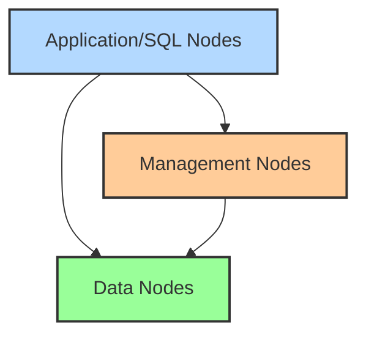

# MySQL Clustering

## Introduction

MySQL Clustering is an advanced technology that enables you to distribute your database across multiple servers to achieve high availability, improved performance, and scalability. As applications grow and user demands increase, a single database server might not be sufficient to handle the load or provide the reliability required for business-critical applications.

MySQL Clustering solves these challenges by creating a distributed architecture where your data is stored across multiple nodes, ensuring that if one server fails, your application continues to function without interruption. It also enables horizontal scaling, allowing you to add more servers to handle increasing loads rather than continuously upgrading a single server.

In this guide, we'll explore MySQL Clustering concepts, the different clustering solutions available, implementation steps, and best practices to help you design a robust database infrastructure for your applications.

## What is MySQL Clustering?

MySQL Clustering refers to a distributed architecture where multiple MySQL servers work together to provide:

1. **High Availability**: If one database node fails, others can take over to avoid downtime
2. **Scalability**: Handle more read/write operations by distributing the load across multiple servers
3. **Data Redundancy**: Store multiple copies of data across different physical machines for protection against hardware failures
4. **Geographic Distribution**: Place database servers in different locations to improve access speed for global users

The primary MySQL clustering solution is **MySQL NDB Cluster**, which is designed for applications requiring high availability and real-time performance. However, there are other clustering approaches like replication-based clustering that we'll also cover.

## MySQL Clustering Solutions

### MySQL NDB Cluster

NDB (Network Database) Cluster is the original clustering technology developed for MySQL. It uses a shared-nothing architecture where data is distributed and replicated across multiple nodes.

Key components of an NDB Cluster:



1. **SQL Nodes**: Standard MySQL servers that provide SQL interfaces to applications
2. **Data Nodes**: Store and replicate data (the NDBCluster storage engine)
3. **Management Nodes**: Manage the cluster configuration, node membership, and failover operations

### MySQL Group Replication

Group Replication is a newer MySQL clustering technology that provides:

- Built-in conflict detection and resolution
- Automatic primary election
- Group membership management

It's suitable for creating high availability solutions with automatic failover.

### MySQL InnoDB Cluster

InnoDB Cluster combines several technologies:

- MySQL Group Replication
- MySQL Router
- MySQL Shell

It provides an integrated, easy-to-set-up high availability solution with automatic failover and routing capabilities.

## Setting Up MySQL NDB Cluster

Let's walk through setting up a basic MySQL NDB Cluster with 1 management node, 2 data nodes, and 1 SQL node. While production environments would typically have more nodes for redundancy, this example will help you understand the components.

### Step 1: Prepare Your Servers

For this example, we'll use these hostnames:
- Management Node: `mgmt-node` (192.168.0.10)
- Data Node 1: `data-node1` (192.168.0.11)
- Data Node 2: `data-node2` (192.168.0.12)
- SQL Node: `sql-node` (192.168.0.13)

On each server, install MySQL Cluster software:

```bash
# For Debian/Ubuntu
sudo apt-get update
sudo apt-get install mysql-cluster-community-server

# For CentOS/RHEL
sudo yum install mysql-cluster-community-server
```

### Step 2: Configure the Management Node

Create configuration directory:

```bash
sudo mkdir -p /var/lib/mysql-cluster
```

Create the configuration file `/var/lib/mysql-cluster/config.ini`:

```ini
[ndbd default]
# Options affecting ndbd processes on all data nodes:
NoOfReplicas=2      # Number of replicas
DataMemory=80M      # Memory allocated for data storage
IndexMemory=18M     # Memory allocated for index storage

[tcp default]
portnumber=2202     # This is the default port for data nodes

# Management node
[ndb_mgmd]
hostname=192.168.0.10  # Management node hostname
datadir=/var/lib/mysql-cluster  # Directory for log files

# Data nodes
[ndbd]
hostname=192.168.0.11  # Data node 1 hostname
datadir=/usr/local/mysql/data   # Directory for data files

[ndbd]
hostname=192.168.0.12  # Data node 2 hostname
datadir=/usr/local/mysql/data   # Directory for data files

# SQL node
[mysqld]
hostname=192.168.0.13  # SQL node hostname
```

Start the management server:

```bash
ndb_mgmd -f /var/lib/mysql-cluster/config.ini --configdir=/var/lib/mysql-cluster/
```

### Step 3: Configure Data Nodes

On each data node, create `/etc/my.cnf` with:

```ini
[mysqld]
# Options for mysqld process:
ndbcluster                      # Run NDB storage engine

[mysql_cluster]
# Options for NDB Cluster processes:
ndb-connectstring=192.168.0.10  # Location of management server
```

Start each data node:

```bash
ndbd
```

### Step 4: Configure the SQL Node

Create `/etc/my.cnf` on the SQL node:

```ini
[mysqld]
# Options for mysqld process:
ndbcluster                      # Run NDB storage engine

[mysql_cluster]
# Options for NDB Cluster processes:
ndb-connectstring=192.168.0.10  # Location of management server
```

Start the MySQL server:

```bash
systemctl start mysql
```

### Step 5: Verify the Cluster Status

On the management node, run:

```bash
ndb_mgm
```

Inside the management client, check the status:

```
show
```

Expected output:

```
Connected to Management Server at: 192.168.0.10:1186
Cluster Configuration
---------------------
[ndbd(NDB)]     2 node(s)
id=2    @192.168.0.11  (mysql-5.7.37 ndb-7.6.21, starting, Nodegroup: 0)
id=3    @192.168.0.12  (mysql-5.7.37 ndb-7.6.21, starting, Nodegroup: 0)

[ndb_mgmd(MGM)] 1 node(s)
id=1    @192.168.0.10  (mysql-5.7.37 ndb-7.6.21)

[mysqld(API)]   1 node(s)
id=4    @192.168.0.13  (mysql-5.7.37 ndb-7.6.21)
```

## Using MySQL NDB Cluster

Once your cluster is running, you can connect to the SQL node and create tables using the NDB storage engine:

```sql
CREATE TABLE customers (
    id INT PRIMARY KEY,
    name VARCHAR(50),
    email VARCHAR(100)
) ENGINE=NDB;
```

This table will be automatically distributed and replicated across your data nodes. Let's insert some test data:

```sql
INSERT INTO customers VALUES 
(1, 'John Smith', 'john@example.com'),
(2, 'Jane Doe', 'jane@example.com'),
(3, 'Bob Johnson', 'bob@example.com');
```

You can verify that the data is accessible:

```sql
SELECT * FROM customers;
```

Output:
```
+----+-------------+------------------+
| id | name        | email            |
+----+-------------+------------------+
|  1 | John Smith  | john@example.com |
|  2 | Jane Doe    | jane@example.com |
|  3 | Bob Johnson | bob@example.com  |
+----+-------------+------------------+
3 rows in set (0.00 sec)
```

## Setting Up MySQL Group Replication

Group Replication is another clustering approach that's easier to set up for many use cases. Here's how to configure a basic 3-node Group Replication cluster:

### Step 1: Configure Each MySQL Server

On each server, edit `/etc/my.cnf` with:

```ini
[mysqld]
# Server identification
server_id=1  # Use 2, 3 for other nodes
bind-address=0.0.0.0

# Replication configuration
gtid_mode=ON
enforce_gtid_consistency=ON

# Group Replication configuration
plugin_load='group_replication.so'
group_replication_group_name="aaaaaaaa-bbbb-cccc-dddd-eeeeeeeeeeee"
group_replication_start_on_boot=off
group_replication_local_address="192.168.0.1:33061"  # Use node's IP
group_replication_group_seeds="192.168.0.1:33061,192.168.0.2:33061,192.168.0.3:33061"
group_replication_bootstrap_group=off
```

### Step 2: Start Group Replication on First Node

Connect to MySQL on the first node and run:

```sql
SET GLOBAL group_replication_bootstrap_group=ON;
START GROUP_REPLICATION;
SET GLOBAL group_replication_bootstrap_group=OFF;
```

### Step 3: Join Other Nodes to the Group

On each remaining node:

```sql
START GROUP_REPLICATION;
```

### Step 4: Verify Group Replication Status

On any node:

```sql
SELECT * FROM performance_schema.replication_group_members;
```

Output:
```
+---------------------------+--------------------------------------+-------------+-------------+--------------+-------------+----------------+
| CHANNEL_NAME              | MEMBER_ID                            | MEMBER_HOST | MEMBER_PORT | MEMBER_STATE | MEMBER_ROLE | MEMBER_VERSION |
+---------------------------+--------------------------------------+-------------+-------------+--------------+-------------+----------------+
| group_replication_applier | 3a4e8b21-f83b-11ea-a272-0242c0a8d002 | node1       |        3306 | ONLINE       | PRIMARY     | 8.0.23         |
| group_replication_applier | 4c2d23a8-f83b-11ea-8973-0242c0a8d003 | node2       |        3306 | ONLINE       | SECONDARY   | 8.0.23         |
| group_replication_applier | 560986aa-f83b-11ea-a7c1-0242c0a8d004 | node3       |        3306 | ONLINE       | SECONDARY   | 8.0.23         |
+---------------------------+--------------------------------------+-------------+-------------+--------------+-------------+----------------+
```

## Real-World Applications of MySQL Clustering

### Case Study 1: E-commerce Platform

An e-commerce platform needs to handle high traffic during sales events without downtime:

- **SQL Nodes**: 4 servers handle application queries
- **Data Nodes**: 6 nodes (3 node groups with 2 replicas each)
- **Management Nodes**: 2 for redundancy

This configuration provides:
- Load balancing across SQL nodes during peak times
- Automatic failover if hardware failures occur
- Ability to add more SQL nodes during high-demand periods

### Case Study 2: Global SaaS Application

A SaaS application with users worldwide needs fast access from different regions:

- **Regional Clusters**: Separate clusters in North America, Europe, and Asia
- **Cross-Region Replication**: For disaster recovery and global reporting
- **Read-Local, Write-Global**: Users read from their local region but writes go to a primary region

This approach minimizes latency for users while maintaining data consistency.

## Performance Considerations

### Memory Management

NDB Cluster stores all data in memory, so proper memory sizing is critical:

```
Total Memory Needed = (DataMemory + IndexMemory) * NumberOfReplicas
```

For example, if you have 10GB of data, 2GB of indexes, and 2 replicas:
```
Total Memory = (10GB + 2GB) * 2 = 24GB
```

### Network Configuration

Cluster nodes communicate extensively, so consider:

- Use dedicated network interfaces for cluster communication
- Configure jumbo frames (9000 MTU) for improved throughput
- Minimize network latency between nodes (preferably < 2ms)

### Monitoring and Management

Use these tools to monitor your cluster health:

- `ndb_mgm` for basic status checks
- MySQL Enterprise Monitor for comprehensive monitoring
- Custom scripts checking cluster events and alerts

## Common Challenges and Solutions

### Split-Brain Scenarios

**Problem**: Network partition separates cluster nodes, creating two "clusters" that can't communicate.

**Solution**: 
- Implement proper quorum mechanisms (arbitration)
- Configure node groups carefully
- Use odd numbers of nodes for voting

### Backup and Recovery

Perform regular backups of your cluster:

```bash
# Create a backup
ndb_mgm -e "START BACKUP"

# Restore from backup (ID 1)
ndb_restore -b 1 -n 2 -m -r /path/to/backup
```

## Summary

MySQL Clustering provides powerful solutions for high availability, scalability, and performance needs. The key options we've covered are:

1. **MySQL NDB Cluster**: Best for applications requiring high availability and real-time performance
2. **MySQL Group Replication**: Simpler setup with automatic failover capabilities
3. **MySQL InnoDB Cluster**: Integrated solution combining Group Replication with routing and management tools

When implementing MySQL Clustering, consider:
- Your specific availability and performance requirements
- Hardware resources, especially memory for NDB Cluster
- Network infrastructure between nodes
- Management and monitoring needs

By properly planning and implementing MySQL Clustering, you can create database systems that remain available even during hardware failures and can scale to handle growing workloads.

## Additional Resources

- [MySQL NDB Cluster Official Documentation](https://dev.mysql.com/doc/refman/8.0/en/mysql-cluster.html)
- [MySQL Group Replication Documentation](https://dev.mysql.com/doc/refman/8.0/en/group-replication.html)
- [MySQL InnoDB Cluster Documentation](https://dev.mysql.com/doc/refman/8.0/en/mysql-innodb-cluster-introduction.html)

## Exercises

1. Set up a two-node MySQL NDB Cluster using virtual machines or containers.
2. Create a table using the NDB engine and test what happens when you shut down one data node.
3. Implement a three-node Group Replication setup and experiment with failover scenarios.
4. Compare the performance of a standard InnoDB table versus an NDB table for read-heavy workloads.
5. Design a clustering strategy for a hypothetical application that needs to handle 10,000 transactions per second with 99.999% uptime.