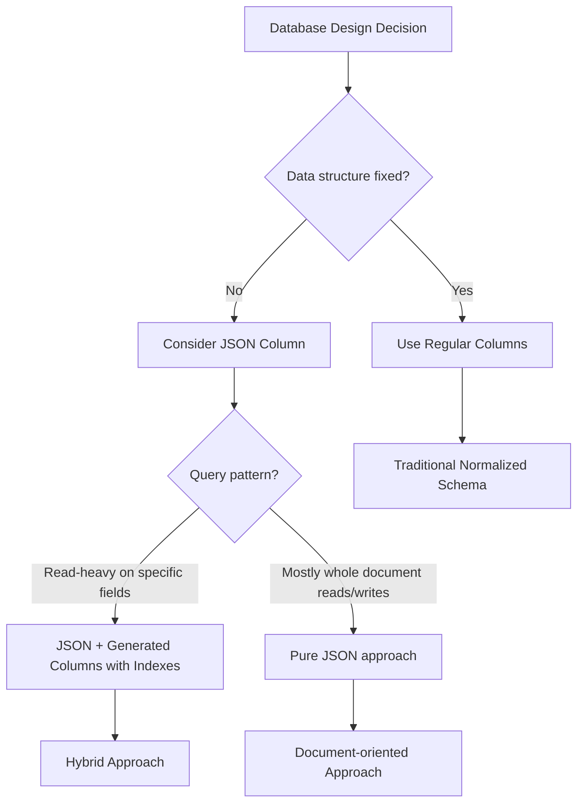

# MySQL JSON Support

## Introduction

Since MySQL 5.7.8, the database system has introduced native support for JSON (JavaScript Object Notation) data, enabling developers to combine the flexibility of NoSQL databases with the reliability and transactional capabilities of a relational database system. This feature bridges the gap between structured and unstructured data storage patterns.

JSON support in MySQL allows you to:

- Store JSON documents in a dedicated data type
- Validate JSON documents for proper formatting
- Access and manipulate JSON data efficiently
- Index JSON values for faster queries

In this tutorial, we'll explore how to use MySQL's JSON capabilities effectively in your applications, from basic storage to advanced querying and manipulation techniques.

## Understanding the JSON Data Type

The `JSON` data type in MySQL stores JSON documents in a binary format that allows for quick access to document elements. Unlike storing JSON as plain text in a VARCHAR or TEXT column, the native JSON type provides:

- Automatic validation of JSON document format
- Optimized storage space
- Efficient access to document values
- Special functions for JSON manipulation

### Creating Tables with JSON Columns

Let's start by creating a simple table with a JSON column:

```sql
CREATE TABLE products (
    id INT PRIMARY KEY AUTO_INCREMENT,
    name VARCHAR(100),
    attributes JSON
);
```

This creates a table where the `attributes` column can store JSON documents.

## Inserting JSON Data

You can insert JSON data either as a string or using the `JSON_OBJECT()` function:

### Method 1: JSON as String

```sql
INSERT INTO products (name, attributes) 
VALUES ('Smartphone', '{"color": "black", "memory": "128GB", "cameras": 3}');
```

### Method 2: Using JSON_OBJECT Function

```sql
INSERT INTO products (name, attributes) 
VALUES ('Laptop', JSON_OBJECT('processor', 'i7', 'ram', '16GB', 'storage', '1TB SSD'));
```

### Method 3: Using JSON_ARRAY Function

```sql
INSERT INTO products (name, attributes) 
VALUES ('Smart Watch', 
        JSON_OBJECT(
            'colors', JSON_ARRAY('black', 'silver', 'gold'),
            'features', JSON_ARRAY('heart rate', 'gps', 'water resistant')
        )
);
```

## Querying JSON Data

MySQL provides several functions to extract and manipulate JSON data within SQL queries.

### Basic Extraction with JSON_EXTRACT

The most common way to extract data from JSON is using the `JSON_EXTRACT()` function or the `->` operator:

```sql
-- Using JSON_EXTRACT
SELECT id, name, JSON_EXTRACT(attributes, '$.color') AS color
FROM products
WHERE JSON_EXTRACT(attributes, '$.color') = 'black';

-- Using -> operator (shorthand)
SELECT id, name, attributes->'$.color' AS color
FROM products
WHERE attributes->'$.color' = 'black';
```

### Unquoting JSON Results with ->>

The `->` operator returns JSON format (with quotes for strings), while the `->>` operator automatically unquotes string values:

```sql
SELECT id, name, attributes->>'$.color' AS color
FROM products;
```

Example output:
```
+----+------------+-------+
| id | name       | color |
+----+------------+-------+
|  1 | Smartphone | black |
+----+------------+-------+
```

### Working with JSON Arrays

To access elements in a JSON array, you use the array index in the path:

```sql
SELECT name, attributes->'$.colors[0]' AS primary_color
FROM products
WHERE JSON_CONTAINS(attributes->'$.colors', '"black"');
```

## Modifying JSON Data

MySQL provides functions to update JSON data without replacing the entire document.

### JSON_INSERT

Adds a new property if it doesn't exist (but won't modify existing values):

```sql
UPDATE products 
SET attributes = JSON_INSERT(attributes, '$.weight', '180g', '$.dimensions', JSON_OBJECT('height', '15cm', 'width', '7cm'))
WHERE name = 'Smartphone';
```

### JSON_SET

Sets or replaces properties (adds new ones or changes existing ones):

```sql
UPDATE products 
SET attributes = JSON_SET(attributes, '$.color', 'red', '$.warranty', '2 years')
WHERE name = 'Smartphone';
```

### JSON_REPLACE

Only replaces existing properties (won't add new ones):

```sql
UPDATE products 
SET attributes = JSON_REPLACE(attributes, '$.color', 'blue')
WHERE name = 'Smartphone';
```

### JSON_REMOVE

Removes properties from JSON documents:

```sql
UPDATE products 
SET attributes = JSON_REMOVE(attributes, '$.warranty')
WHERE name = 'Smartphone';
```

## Indexing JSON Values

One of the most powerful features of MySQL's JSON support is the ability to create indexes on JSON values, significantly improving query performance.

### Creating Function-Based Indexes

To index a JSON property, you need to create a generated column and then index it:

```sql
ALTER TABLE products
ADD COLUMN color VARCHAR(50) GENERATED ALWAYS AS (attributes->>'$.color') STORED,
ADD INDEX idx_color (color);
```

Now queries filtering on the color will use the index:

```sql
SELECT * FROM products WHERE attributes->>'$.color' = 'black';
```

## JSON Aggregate Functions

MySQL supports JSON aggregation with the `JSON_ARRAYAGG()` and `JSON_OBJECTAGG()` functions.

### JSON_ARRAYAGG

Creates a JSON array from a column of values:

```sql
SELECT JSON_ARRAYAGG(name) AS product_names
FROM products;
```

Example output:
```
+------------------------------------------------+
| product_names                                  |
+------------------------------------------------+
| ["Smartphone", "Laptop", "Smart Watch"]        |
+------------------------------------------------+
```

### JSON_OBJECTAGG

Creates a JSON object from key-value pairs:

```sql
SELECT JSON_OBJECTAGG(name, attributes->>'$.color') AS product_colors
FROM products;
```

Example output:
```
+-----------------------------------------------------+
| product_colors                                      |
+-----------------------------------------------------+
| {"Smartphone": "black", "Laptop": null, "Smart Watch": null} |
+-----------------------------------------------------+
```

## Real-World Example: Product Catalog

Let's build a more comprehensive example of a product catalog using JSON to store variable attributes:

```sql
-- Create a product catalog table with JSON for variable attributes
CREATE TABLE product_catalog (
    product_id INT AUTO_INCREMENT PRIMARY KEY,
    category VARCHAR(50) NOT NULL,
    name VARCHAR(100) NOT NULL,
    base_price DECIMAL(10, 2) NOT NULL,
    specifications JSON NOT NULL,
    available BOOLEAN DEFAULT TRUE,
    created_at TIMESTAMP DEFAULT CURRENT_TIMESTAMP
);

-- Add some diverse products
INSERT INTO product_catalog (category, name, base_price, specifications)
VALUES 
    ('Electronics', 'Ultra HD Smart TV', 899.99, 
     JSON_OBJECT(
        'screen_size', '55 inches',
        'resolution', '4K',
        'connectivity', JSON_ARRAY('HDMI', 'USB', 'Bluetooth', 'WiFi'),
        'features', JSON_ARRAY('Voice Control', 'HDR', 'Screen Mirroring'),
        'energy_rating', 'A+'
     )),
    ('Furniture', 'Ergonomic Office Chair', 249.95, 
     JSON_OBJECT(
        'material', 'Mesh and Metal',
        'max_weight', '150kg',
        'adjustable', JSON_OBJECT('height', true, 'armrests', true, 'recline', true),
        'colors_available', JSON_ARRAY('Black', 'Gray', 'Blue')
     )),
    ('Clothing', 'Waterproof Hiking Jacket', 129.50, 
     JSON_OBJECT(
        'sizes', JSON_ARRAY('S', 'M', 'L', 'XL'),
        'material', 'Gore-Tex',
        'features', JSON_ARRAY('Waterproof', 'Windproof', 'Breathable'),
        'care', JSON_OBJECT('machine_washable', true, 'temperature', '30°C')
     ));
```

Now let's create some practical queries for this catalog:

### Find all products with specific features

```sql
-- Find products that are waterproof
SELECT name, base_price
FROM product_catalog
WHERE JSON_CONTAINS(specifications->'$.features', '"Waterproof"');
```

### Index and search by multiple JSON properties

```sql
-- First create generated columns and indexes
ALTER TABLE product_catalog
ADD COLUMN material VARCHAR(100) GENERATED ALWAYS AS (specifications->>'$.material') STORED,
ADD INDEX idx_material (material);

-- Query using the indexed column
SELECT name, base_price, material
FROM product_catalog
WHERE material = 'Gore-Tex';
```

### Find products with specific sizes or compatibility features

```sql
-- Find products available in size 'M'
SELECT name
FROM product_catalog
WHERE JSON_CONTAINS(specifications->'$.sizes', '"M"');

-- Find products with HDMI connectivity
SELECT name
FROM product_catalog
WHERE JSON_CONTAINS(specifications->'$.connectivity', '"HDMI"');
```

### Aggregate pricing by JSON properties

```sql
SELECT 
    specifications->>'$.material' AS material,
    COUNT(*) AS product_count,
    AVG(base_price) AS average_price
FROM product_catalog
GROUP BY specifications->>'$.material'
HAVING specifications->>'$.material' IS NOT NULL;
```

## JSON Data Validation

MySQL validates JSON documents automatically when storing them. Here's how you can test this feature:

```sql
-- This will fail with a JSON syntax error
INSERT INTO products (name, attributes) 
VALUES ('Bad Product', '{color: "red"}');  -- Missing quotes around property name
```

You'll receive an error like:
```
Error Code: 3140. Invalid JSON text: "Invalid value." at position 1 in value for column 'products.attributes'.
```

## Performance Considerations

When working with JSON in MySQL, keep these performance tips in mind:

1. **Index JSON fields** that you frequently search on using generated columns
2. **Avoid extremely large JSON documents** (consider splitting into multiple columns/tables)
3. **Prefer normalized tables** for data that has a consistent structure
4. **Use JSON** primarily for semi-structured or variable data
5. **Use JSON functions selectively** in WHERE clauses, as they may prevent index usage

## Mermaid Diagram: JSON vs. Traditional Columns



## Summary

MySQL's JSON support provides a powerful hybrid approach that combines the flexibility of document stores with the reliability and transactional features of a relational database. In this tutorial, we've covered:

- Creating tables with JSON columns
- Inserting and formatting JSON data
- Querying and extracting values from JSON documents
- Modifying JSON data with specialized functions
- Indexing JSON values for better performance
- Working with JSON arrays and nested objects
- Practical applications in a product catalog

JSON support in MySQL is ideal for situations where some of your data has a variable structure, such as product attributes, user preferences, or application settings, while still maintaining the benefits of a relational database for your core data.

## Additional Resources and Exercises

### Resources

- [MySQL JSON Functions Reference](https://dev.mysql.com/doc/refman/8.0/en/json-functions.html)
- [MySQL JSON Data Type Documentation](https://dev.mysql.com/doc/refman/8.0/en/json.html)

### Exercises

1. **Exercise 1:** Create a user profile system that stores preferences in JSON format, with columns for required fields and a JSON column for variable preferences.

2. **Exercise 2:** Design a blog post system where each post has different metadata depending on the post type (text, image, video), stored in a JSON column.

3. **Exercise 3:** Design a query to find all products from the product catalog with more than three features and available in at least two sizes.

4. **Exercise 4:** Add a new feature to all electronics products using the JSON_ARRAY_APPEND function.

5. **Exercise 5:** Create a report that shows the distribution of products across different materials and colors, extracting this information from JSON fields.