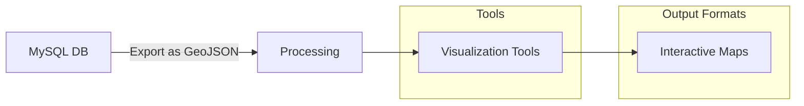

# MySQL Spatial Data

## Introduction

Spatial data represents information about the position, shape, and size of objects in space. MySQL provides robust support for spatial data through its implementation of the OpenGIS geometry model, allowing you to store, analyze, and manipulate geographic information directly within your database.

In this tutorial, we'll explore MySQL's spatial capabilities, from basic geometry types to complex spatial queries and real-world applications. Whether you're building a location-based service, analyzing geographic patterns, or simply want to add location awareness to your application, MySQL's spatial features provide powerful tools to work with geographic and geometric data.

## Understanding Spatial Data Types

MySQL implements several spatial data types based on the OpenGIS geometry model:

1. `POINT` - Represents a single location in space
2. `LINESTRING` - Represents a curve (sequence of points)
3. `POLYGON` - Represents a polygon with possible holes
4. `MULTIPOINT` - Collection of points
5. `MULTILINESTRING` - Collection of linestrings
6. `MULTIPOLYGON` - Collection of polygons
7. `GEOMETRYCOLLECTION` - Collection of any geometry types

Let's see how to create a table with spatial columns:

```sql
CREATE TABLE locations (
    id INT AUTO_INCREMENT PRIMARY KEY,
    name VARCHAR(100) NOT NULL,
    location POINT NOT NULL,
    area POLYGON
);
```

## Creating and Inserting Spatial Data

### Creating POINT Data

To insert a point, you can use the `ST_PointFromText()` function:

```sql
INSERT INTO locations (name, location, area)
VALUES (
    'Central Park',
    ST_PointFromText('POINT(40.785091 -73.968285)'),
    NULL
);
```

Alternatively, you can use `ST_Point()` which is often more convenient:

```sql
INSERT INTO locations (name, location, area)
VALUES (
    'Empire State Building',
    ST_Point(-73.9857, 40.7484),
    NULL
);
```

### Creating POLYGON Data

To create a polygon (for example, to represent a building outline or a neighborhood boundary):

```sql
INSERT INTO locations (name, location, area)
VALUES (
    'Times Square Area',
    ST_Point(-73.9855, 40.7580),
    ST_PolygonFromText('POLYGON((-73.9870 40.7590, -73.9840 40.7590, -73.9840 40.7570, -73.9870 40.7570, -73.9870 40.7590))')
);
```

## Querying Spatial Data

### Basic Retrieval

To retrieve spatial data:

```sql
SELECT id, name, ST_AsText(location) as location
FROM locations;
```

Example output:

```
+----+---------------------+------------------------------+
| id | name                | location                     |
+----+---------------------+------------------------------+
|  1 | Central Park        | POINT(40.785091 -73.968285) |
|  2 | Empire State Building | POINT(-73.9857 40.7484)     |
|  3 | Times Square Area   | POINT(-73.9855 40.7580)     |
+----+---------------------+------------------------------+
```

### Calculating Distance Between Points

One common operation is finding the distance between two points:

```sql
SELECT 
    a.name AS location_a, 
    b.name AS location_b,
    ST_Distance_Sphere(a.location, b.location) / 1000 AS distance_km
FROM 
    locations a,
    locations b
WHERE 
    a.id < b.id;
```

Example output:

```
+---------------------+---------------------+--------------------+
| location_a          | location_b          | distance_km        |
+---------------------+---------------------+--------------------+
| Central Park        | Empire State Building | 4.1523            |
| Central Park        | Times Square Area   | 3.2701            |
| Empire State Building | Times Square Area   | 1.0673            |
+---------------------+---------------------+--------------------+
```

### Finding Points Within a Radius

To find all points within a specific radius of a location:

```sql
SELECT 
    name, 
    ST_Distance_Sphere(location, ST_Point(-73.9855, 40.7580)) / 1000 AS distance_km
FROM 
    locations
WHERE 
    ST_Distance_Sphere(location, ST_Point(-73.9855, 40.7580)) <= 2000; -- 2km radius
```

Example output:

```
+---------------------+--------------------+
| name                | distance_km        |
+---------------------+--------------------+
| Times Square Area   | 0.0000            |
| Empire State Building | 1.0673            |
+---------------------+--------------------+
```

### Spatial Relationship Queries

MySQL provides several functions to determine relationships between geometries:

```sql
-- Check if a point is within a polygon
SELECT 
    name,
    ST_Contains(area, ST_Point(-73.9855, 40.7575)) AS is_within_area
FROM 
    locations
WHERE 
    area IS NOT NULL;
```

Example output:

```
+-------------------+--------------+
| name              | is_within_area |
+-------------------+--------------+
| Times Square Area | 1            |
+-------------------+--------------+
```

## Creating a Spatial Index

For large spatial datasets, you should create spatial indexes to improve query performance:

```sql
CREATE TABLE cities (
    id INT AUTO_INCREMENT PRIMARY KEY,
    name VARCHAR(100) NOT NULL,
    country VARCHAR(100) NOT NULL,
    location POINT NOT NULL,
    SPATIAL INDEX(location)
);
```

With a spatial index, queries that use spatial functions like `ST_Contains()`, `ST_Within()`, and `ST_Distance()` can be much more efficient.

## Real-World Application: Store Locator

Let's build a simple store locator system that finds stores near a given location:

```sql
-- Create a stores table with spatial data
CREATE TABLE stores (
    id INT AUTO_INCREMENT PRIMARY KEY,
    name VARCHAR(100) NOT NULL,
    category VARCHAR(50),
    location POINT NOT NULL,
    SPATIAL INDEX(location)
);

-- Insert some sample stores
INSERT INTO stores (name, category, location) VALUES
('Downtown Grocery', 'Grocery', ST_Point(-73.9934, 40.7420)),
('Central Coffee', 'Cafe', ST_Point(-73.9798, 40.7516)),
('Eastside Electronics', 'Electronics', ST_Point(-73.9723, 40.7589)),
('North Pharmacy', 'Pharmacy', ST_Point(-73.9850, 40.7660)),
('West Bakery', 'Bakery', ST_Point(-74.0060, 40.7470));

-- Function to find nearby stores
DELIMITER //
CREATE PROCEDURE find_nearby_stores(
    IN user_longitude DECIMAL(10, 6),
    IN user_latitude DECIMAL(10, 6),
    IN radius_km DECIMAL(10, 2),
    IN category_filter VARCHAR(50)
)
BEGIN
    SELECT 
        name, 
        category,
        ST_AsText(location) AS location,
        ROUND(ST_Distance_Sphere(
            location, 
            ST_Point(user_longitude, user_latitude)
        ) / 1000, 2) AS distance_km
    FROM 
        stores
    WHERE 
        (category_filter IS NULL OR category = category_filter)
        AND ST_Distance_Sphere(
            location, 
            ST_Point(user_longitude, user_latitude)
        ) <= radius_km * 1000
    ORDER BY 
        distance_km;
END //
DELIMITER ;

-- Example usage: Find cafes within 2km of a location
CALL find_nearby_stores(-73.9800, 40.7500, 2.00, 'Cafe');
```

Example output:

```
+---------------+----------+-------------------------+------------+
| name          | category | location                | distance_km |
+---------------+----------+-------------------------+------------+
| Central Coffee | Cafe    | POINT(-73.9798 40.7516) | 0.18       |
+---------------+----------+-------------------------+------------+
```

## Visualizing MySQL Spatial Data

While MySQL doesn't have built-in visualization capabilities for spatial data, you can export the data and visualize it using external tools. Here's a simple flow of how this might work:



You can export spatial data to GeoJSON format using:

```sql
SELECT 
    JSON_OBJECT(
        'type', 'Feature',
        'geometry', JSON_OBJECT(
            'type', 'Point',
            'coordinates', JSON_ARRAY(
                ST_X(location),
                ST_Y(location)
            )
        ),
        'properties', JSON_OBJECT(
            'name', name,
            'category', category
        )
    ) AS geojson
FROM 
    stores;
```

## Advanced Spatial Operations

### Calculating Areas

For polygons, you can calculate the area:

```sql
SELECT 
    name, 
    ST_Area(area) AS area_sq_degrees,
    ST_Area(area, 'sphere', 'statute mile') AS area_sq_miles
FROM 
    locations
WHERE 
    area IS NOT NULL;
```

### Finding the Nearest Neighbor

A common spatial query is finding the nearest point to a given location:

```sql
SELECT 
    name,
    ROUND(ST_Distance_Sphere(location, ST_Point(-73.9900, 40.7500)) / 1000, 2) AS distance_km
FROM 
    stores
ORDER BY 
    ST_Distance_Sphere(location, ST_Point(-73.9900, 40.7500))
LIMIT 1;
```

### Creating Buffers

Create a buffer zone around a point (e.g., 1km radius):

```sql
SELECT 
    ST_Buffer(
        ST_Point(-73.9855, 40.7580), 
        0.01  -- approximately 1km at this latitude
    ) AS buffer_zone;
```

## Performance Considerations

When working with spatial data in MySQL, keep these performance tips in mind:

1. **Use spatial indexes** for large datasets
2. **Limit the result set** before applying spatial functions
3. **Use bounding box filters** when possible before more complex spatial operations
4. **Consider the coordinate system** carefully (MySQL uses SRID 0 by default)
5. **Monitor query performance** and optimize when needed

## Summary

MySQL's spatial capabilities provide powerful tools for storing and analyzing geographic data directly in your database. We've covered:

- Spatial data types like POINT, LINESTRING, and POLYGON
- Creating and inserting spatial data
- Querying spatial relationships
- Calculating distances and areas
- Creating spatial indexes for performance
- Building a real-world application (store locator)

With these tools, you can add geographic intelligence to your applications, enabling location-based features and spatial analysis.

## Additional Resources

To deepen your knowledge of MySQL spatial data:

1. MySQL Documentation on [Spatial Data Types](https://dev.mysql.com/doc/refman/8.0/en/spatial-types.html)
2. MySQL Documentation on [Spatial Function Reference](https://dev.mysql.com/doc/refman/8.0/en/spatial-function-reference.html)
3. Learn more about the [OpenGIS geometry model](https://www.ogc.org/standards/sfs)

## Practice Exercises

1. Create a table to store hiking trails as LINESTRING objects and calculate their lengths
2. Implement a "geofencing" system that detects when a point enters or exits a defined area
3. Build a query to find all locations within a polygon (e.g., all stores within a city district)
4. Create a heat map of point density by dividing an area into grid cells and counting points per cell
5. Import real geographic data from an external source and analyze spatial patterns