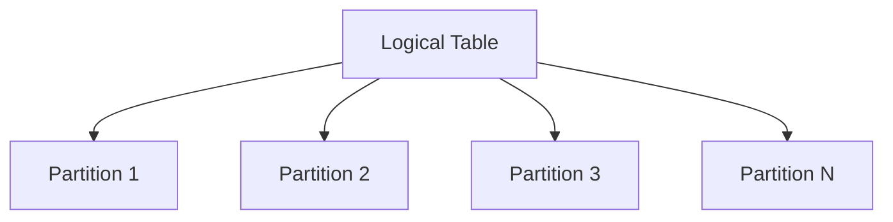

# MySQL Partition Tables

## Introduction

As your database grows, tables can become extremely large, leading to performance degradation for queries, maintenance operations, and backup processes. MySQL's partitioning feature offers a solution to this problem by allowing you to divide large tables into smaller, more manageable pieces called partitions, while still treating the data as a single logical table in your applications.

Partitioning can provide several benefits:

- **Improved query performance**: Queries that access only certain partitions (partition pruning) run faster
- **Simplified maintenance**: Perform operations on individual partitions rather than entire tables
- **Efficient storage management**: Store different partitions on different storage devices
- **Better data lifecycle management**: Easily archive old data by dropping partitions

In this tutorial, we'll explore MySQL partitioning in depth, looking at different partitioning types, how to create and manage partitioned tables, and best practices for using this powerful feature.

## Understanding Table Partitioning

Partitioning divides a table into multiple physical parts based on rules you define, while maintaining a single logical table structure for applications to interact with.



When you query a partitioned table, MySQL determines which partitions need to be accessed based on your query conditions, potentially skipping entire partitions and dramatically improving performance.

## Prerequisites

Before diving into partitioning, ensure:

1. You're using MySQL 5.7 or higher (partitioning support improved significantly in newer versions)
2. Your MySQL server is configured with the partitioning engine enabled
3. You have appropriate permissions to create and alter tables

## Partitioning Types

MySQL supports several partitioning types, each suitable for different scenarios:

### 1. RANGE Partitioning

Partitions data based on ranges of values, ideal for date-based or sequential numeric data.

**Example**: Creating a sales table partitioned by date ranges:

```sql
CREATE TABLE sales (
    id INT NOT NULL,
    sale_date DATE NOT NULL,
    customer_id INT NOT NULL,
    amount DECIMAL(10,2) NOT NULL,
    PRIMARY KEY (id, sale_date)
)
PARTITION BY RANGE (YEAR(sale_date)) (
    PARTITION p2020 VALUES LESS THAN (2021),
    PARTITION p2021 VALUES LESS THAN (2022),
    PARTITION p2022 VALUES LESS THAN (2023),
    PARTITION p2023 VALUES LESS THAN (2024),
    PARTITION future VALUES LESS THAN MAXVALUE
);
```

This creates partitions for sales data by year, with a catch-all partition for future years.

### 2. LIST Partitioning

Partitions data based on specific values, useful for categorical data.

**Example**: Creating a users table partitioned by region:

```sql
CREATE TABLE users (
    id INT NOT NULL,
    username VARCHAR(50) NOT NULL,
    region_code INT NOT NULL,
    signup_date DATE NOT NULL,
    PRIMARY KEY (id, region_code)
)
PARTITION BY LIST (region_code) (
    PARTITION p_america VALUES IN (1, 2, 3, 4),  -- North and South America
    PARTITION p_europe VALUES IN (10, 11, 12, 13), -- European regions
    PARTITION p_asia VALUES IN (20, 21, 22, 23),  -- Asian regions
    PARTITION p_other VALUES IN (30, 31, 32)     -- Other regions
);
```

### 3. HASH Partitioning

Distributes data evenly across partitions using a hash function, ideal for when you don't have natural ranges or lists.

**Example**: Creating an orders table with HASH partitioning:

```sql
CREATE TABLE orders (
    order_id INT NOT NULL,
    order_date DATETIME NOT NULL,
    customer_id INT NOT NULL,
    total_amount DECIMAL(10,2),
    PRIMARY KEY (order_id, customer_id)
)
PARTITION BY HASH (customer_id)
PARTITIONS 4;
```

This creates four partitions with orders distributed based on the hash value of the `customer_id`.

### 4. KEY Partitioning

Similar to HASH partitioning but uses MySQL's internal hashing function. It can use multiple columns and works well with primary keys.

**Example**: Creating a customer_feedback table with KEY partitioning:

```sql
CREATE TABLE customer_feedback (
    feedback_id INT NOT NULL,
    customer_id INT NOT NULL,
    product_id INT NOT NULL,
    feedback_text TEXT,
    PRIMARY KEY (feedback_id, customer_id)
)
PARTITION BY KEY (feedback_id, customer_id)
PARTITIONS 6;
```

## Subpartitioning (Composite Partitioning)

For even more granular control, MySQL allows subpartitioning, where each partition can be further divided.

**Example**: Sales data partitioned by year and then subpartitioned by region:

```sql
CREATE TABLE sales_data (
    id INT NOT NULL,
    sale_date DATE NOT NULL,
    region_id INT NOT NULL,
    amount DECIMAL(10,2),
    PRIMARY KEY (id, sale_date, region_id)
)
PARTITION BY RANGE (YEAR(sale_date))
SUBPARTITION BY HASH (region_id)
SUBPARTITIONS 4 (
    PARTITION p2021 VALUES LESS THAN (2022),
    PARTITION p2022 VALUES LESS THAN (2023),
    PARTITION p2023 VALUES LESS THAN (2024)
);
```

This creates partitions by year, with each year's data further divided into 4 subpartitions based on region_id.

## Partition Pruning and Query Optimization

One of the most significant benefits of partitioning is partition pruning, where MySQL only scans partitions containing relevant data based on your queries.

**Example**: Consider our sales table partitioned by year:

```sql
-- This query only accesses the p2022 partition
SELECT * FROM sales WHERE sale_date BETWEEN '2022-01-01' AND '2022-12-31';

-- This query must check multiple partitions
SELECT * FROM sales WHERE customer_id = 1001;
```

The first query's execution plan will show that only the p2022 partition is scanned, significantly improving performance.

You can verify which partitions are being accessed using `EXPLAIN`:

```sql
EXPLAIN SELECT * FROM sales WHERE sale_date BETWEEN '2022-01-01' AND '2022-12-31';
```

Output might look like:

```
+----+-------------+-------+------------+------+---------------+------+---------+------+------+----------+-------------+
| id | select_type | table | partitions | type | possible_keys | key  | key_len | ref  | rows | filtered | Extra       |
+----+-------------+-------+------------+------+---------------+------+---------+------+------+----------+-------------+
|  1 | SIMPLE      | sales | p2022      | ALL  | NULL          | NULL | NULL    | NULL | 1000 |    100.0 | Using where |
+----+-------------+-------+------------+------+---------------+------+---------+------+------+----------+-------------+
```

Note the `partitions` column showing only `p2022` is accessed.

## Managing Partitions

### Adding Partitions

For RANGE and LIST partitions, you can add new partitions as needed:

```sql
ALTER TABLE sales ADD PARTITION (
    PARTITION p2024 VALUES LESS THAN (2025)
);
```

### Dropping Partitions

You can drop partitions to remove old data quickly without affecting other partitions:

```sql
ALTER TABLE sales DROP PARTITION p2020;
```

This is much faster than deleting rows with `DELETE FROM sales WHERE YEAR(sale_date) = 2020`.

### Reorganizing Partitions

You can reorganize partitions to optimize storage:

```sql
ALTER TABLE sales REORGANIZE PARTITION p2021, p2022 INTO (
    PARTITION p2021_2022 VALUES LESS THAN (2023)
);
```

### Rebuilding Partitions

Rebuild partitions to reclaim space and optimize storage:

```sql
ALTER TABLE sales REBUILD PARTITION p2023;
```

## Practical Use Cases

### Example 1: Log Data Management

For applications that generate large volumes of logs, partitioning by date makes perfect sense:

```sql
CREATE TABLE application_logs (
    log_id BIGINT NOT NULL AUTO_INCREMENT,
    log_date DATE NOT NULL,
    log_level VARCHAR(10) NOT NULL,
    message TEXT,
    source VARCHAR(100),
    PRIMARY KEY (log_id, log_date)
)
PARTITION BY RANGE (TO_DAYS(log_date)) (
    PARTITION p_last_month VALUES LESS THAN (TO_DAYS(DATE_SUB(CURRENT_DATE(), INTERVAL 1 MONTH))),
    PARTITION p_current_month VALUES LESS THAN (TO_DAYS(CURRENT_DATE())),
    PARTITION p_current VALUES LESS THAN MAXVALUE
);
```

To implement a 3-month retention policy, simply drop old partitions monthly:

```sql
-- Automatic cleanup script (could be scheduled)
ALTER TABLE application_logs DROP PARTITION p_last_month;
ALTER TABLE application_logs REORGANIZE PARTITION p_current_month, p_current INTO (
    PARTITION p_last_month VALUES LESS THAN (TO_DAYS(DATE_SUB(CURRENT_DATE(), INTERVAL 1 MONTH))),
    PARTITION p_current_month VALUES LESS THAN (TO_DAYS(CURRENT_DATE())),
    PARTITION p_current VALUES LESS THAN MAXVALUE
);
```

### Example 2: E-commerce Order History

For an e-commerce platform with millions of orders spanning years:

```sql
CREATE TABLE order_history (
    order_id BIGINT NOT NULL,
    customer_id INT NOT NULL,
    order_date DATE NOT NULL,
    total_amount DECIMAL(10,2),
    status VARCHAR(20),
    PRIMARY KEY (order_id, order_date)
)
PARTITION BY RANGE (YEAR(order_date)) (
    PARTITION p2020 VALUES LESS THAN (2021),
    PARTITION p2021 VALUES LESS THAN (2022),
    PARTITION p2022 VALUES LESS THAN (2023),
    PARTITION p2023 VALUES LESS THAN (2024),
    PARTITION p_future VALUES LESS THAN MAXVALUE
);
```

Common queries like "show me orders from 2023" will benefit from partition pruning:

```sql
-- Only accesses p2023 partition
SELECT * FROM order_history 
WHERE order_date BETWEEN '2023-01-01' AND '2023-12-31';
```

### Example 3: Multi-tenant Application Data

For SaaS applications serving multiple customers:

```sql
CREATE TABLE customer_data (
    record_id BIGINT NOT NULL,
    tenant_id INT NOT NULL,
    created_at DATETIME NOT NULL,
    data_json JSON,
    PRIMARY KEY (record_id, tenant_id)
)
PARTITION BY LIST (tenant_id) (
    PARTITION p_tier1 VALUES IN (1, 2, 3, 4, 5),     -- Premium customers
    PARTITION p_tier2 VALUES IN (101, 102, 103, 104), -- Standard customers
    PARTITION p_trial VALUES IN (901, 902, 903)       -- Trial customers
);
```

This allows efficient management of multi-tenant data and quick isolation of specific tenant data.

## Performance Considerations and Best Practices

1. **Choose partition columns wisely**: Always include the partitioning column in the primary key
   
2. **Don't over-partition**: Too many partitions can degrade performance. Usually, a few dozen is reasonable; thousands may cause issues

3. **Monitor partition sizes**: Unbalanced partitions can lead to performance problems

4. **Design with partition pruning in mind**: Structure your queries to leverage the partitioning scheme

5. **Test thoroughly**: Always test performance with and without partitioning using your specific workload

6. **Limit number of partitions accessed**: Queries touching many partitions may be slower than with a non-partitioned table

7. **Consider maintenance implications**: Partitioned tables can complicate backup and restore operations

## Limitations of Partitioning

While powerful, partitioning has some limitations to be aware of:

1. Foreign keys referencing partitioned tables are not supported

2. FULLTEXT indexes cannot be used with partitioned tables

3. Temporary tables cannot be partitioned

4. Partition expressions have restrictions (must be deterministic)

5. Maximum 8192 partitions per table (including subpartitions)

6. All partitions must use the same storage engine

## Summary

MySQL table partitioning is a powerful feature for improving performance and manageability of large tables. By strategically dividing your data into partitions, you can achieve better query performance through partition pruning, implement efficient data lifecycle management, and simplify maintenance operations.

We've covered:
- Different partitioning types (RANGE, LIST, HASH, KEY)
- Creating and managing partitioned tables
- Partition pruning and its performance benefits
- Practical use cases for partitioning
- Best practices and limitations

With partitioning, you can keep your database performing well even as your data grows substantially, but remember to test thoroughly and choose your partitioning strategy based on your specific application needs and query patterns.

## Exercises

1. Create a partitioned table to store temperature sensor readings, with partitioning that optimizes queries for data from specific months.

2. Implement a data archiving solution using RANGE partitioning that automatically moves data older than 6 months to archive partitions.

3. Compare the performance of a large table (>1 million rows) with and without partitioning for various query types.

4. Design a partitioning scheme for a multi-tenant application that needs to quickly isolate and potentially export data for specific customers.

## Additional Resources

- [MySQL Official Documentation on Partitioning](https://dev.mysql.com/doc/refman/8.0/en/partitioning.html)
- [MySQL Partition Maintenance](https://dev.mysql.com/doc/refman/8.0/en/partitioning-maintenance.html)
- [Partition Pruning](https://dev.mysql.com/doc/refman/8.0/en/partitioning-pruning.html)