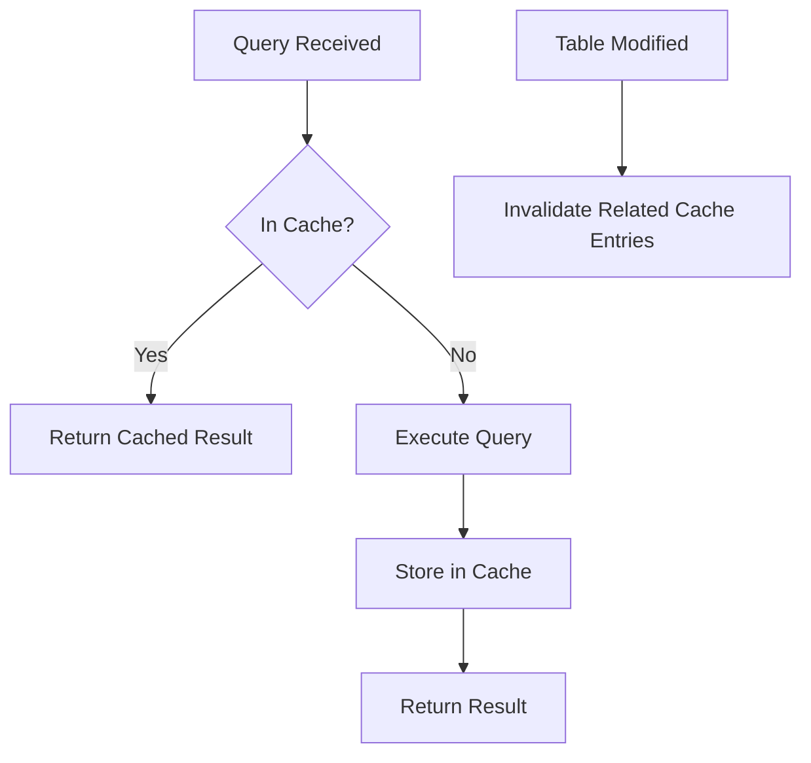

# MySQL Query Cache

## Introduction

The MySQL Query Cache is a powerful feature that can significantly improve database performance by storing the results of SELECT statements along with the query itself. When an identical query is executed again, MySQL can retrieve the results directly from the cache rather than executing the query against the database again.

:::caution Important Note
The Query Cache feature has been deprecated as of MySQL 5.7.20 and removed in MySQL 8.0. This guide is primarily relevant for MySQL 5.7 and earlier versions.
:::

In this tutorial, we'll explore:
- How the Query Cache works
- Setting up and configuring the Query Cache
- When to use (and when not to use) the Query Cache
- Best practices and common pitfalls
- Alternatives in newer MySQL versions

## How Query Cache Works

The Query Cache operates on a simple principle: store query results and return them when the same query is requested again.



When a SELECT query is executed:
1. MySQL checks if the query exists in the cache
2. If it does, the cached result is returned (cache hit)
3. If not, MySQL executes the query, stores the result in the cache, then returns it (cache miss)
4. If any table in the query is modified, all cache entries related to that table are invalidated

## Enabling and Configuring Query Cache

### Checking Query Cache Status

First, let's check if the Query Cache is currently enabled:

```sql
SHOW VARIABLES LIKE 'query_cache%';
```

The output will look similar to:

```
+-------------------------+----------+
| Variable_name           | Value    |
+-------------------------+----------+
| query_cache_limit       | 1048576  |
| query_cache_min_res_unit| 4096     |
| query_cache_size        | 0        |
| query_cache_type        | OFF      |
| query_cache_wlock_invalidate| OFF  |
+-------------------------+----------+
```

### Enabling Query Cache

To enable the Query Cache, you need to modify the MySQL configuration file (`my.cnf` or `my.ini`):

```ini
[mysqld]
query_cache_type = 1
query_cache_size = 32M
```

The key parameters are:
- `query_cache_type`: Controls the operation mode of the query cache
  - `0` or `OFF`: Query cache is disabled
  - `1` or `ON`: Cache all queries except those beginning with SELECT SQL_NO_CACHE
  - `2` or `DEMAND`: Cache only queries that begin with SELECT SQL_CACHE
- `query_cache_size`: Total memory allocated to the query cache (in bytes)
- `query_cache_limit`: Maximum size of individual query results that can be cached

After modifying the configuration, restart MySQL:

```bash
sudo service mysql restart
```

## Using the Query Cache

### Basic Usage

By default (if `query_cache_type=1`), all SELECT queries will be cached:

```sql
SELECT * FROM customers WHERE region = 'North';
```

### Controlling Caching Behavior

You can control the caching behavior for specific queries:

```sql
-- Force a query NOT to be cached
SELECT SQL_NO_CACHE * FROM customers WHERE region = 'North';

-- Force a query to be cached (when query_cache_type=2)
SELECT SQL_CACHE * FROM customers WHERE region = 'North';
```

### Monitoring Query Cache Performance

To check if the Query Cache is working effectively:

```sql
SHOW STATUS LIKE 'Qcache%';
```

The output will show important metrics:

```
+-------------------------+----------+
| Variable_name           | Value    |
+-------------------------+----------+
| Qcache_free_blocks      | 1        |
| Qcache_free_memory      | 33267552 |
| Qcache_hits             | 142      |
| Qcache_inserts          | 201      |
| Qcache_lowmem_prunes    | 0        |
| Qcache_not_cached       | 40       |
| Qcache_queries_in_cache | 93       |
| Qcache_total_blocks     | 201      |
+-------------------------+----------+
```

Key metrics to monitor:
- `Qcache_hits`: Number of query cache hits
- `Qcache_inserts`: Number of queries added to the cache
- `Qcache_lowmem_prunes`: Number of queries removed due to memory constraints
- `Qcache_free_memory`: Available memory in the query cache

## Real-World Examples

### Example 1: E-commerce Product Listing

Consider an e-commerce website that displays product listings. The same query is executed many times:

```sql
SELECT SQL_CACHE p.id, p.name, p.price, c.category_name
FROM products p
JOIN categories c ON p.category_id = c.id
WHERE c.category_name = 'Electronics' 
ORDER BY p.price ASC
LIMIT 20;
```

Without the Query Cache, this query would execute against the database each time a user views the electronics category. With Query Cache enabled, the result is stored after the first execution and returned directly for subsequent identical requests.

### Example 2: Reporting Dashboard

For a reporting dashboard showing daily statistics:

```sql
SELECT SQL_CACHE 
    DATE(order_date) AS day,
    COUNT(*) AS total_orders,
    SUM(order_total) AS revenue
FROM orders
WHERE order_date >= DATE_SUB(CURRENT_DATE(), INTERVAL 30 DAY)
GROUP BY DATE(order_date)
ORDER BY day DESC;
```

This query is resource-intensive but likely produces the same result for all users throughout the day, making it an excellent candidate for caching.

## When to Use Query Cache

The Query Cache is most beneficial when:

1. **Read-heavy workloads**: Applications with many more reads than writes
2. **Identical queries**: Applications that execute the same queries repeatedly
3. **Queries with complex processing**: Queries requiring significant processing time
4. **Stable data**: Tables that are not frequently updated

## When NOT to Use Query Cache

The Query Cache may not be beneficial or could even harm performance when:

1. **Write-heavy workloads**: Frequent writes invalidate cache entries, causing overhead
2. **Unique queries**: Applications where most queries are different (e.g., with varying WHERE clauses)
3. **Large result sets**: Caching large results consumes significant memory
4. **Rapidly changing data**: Tables that are updated frequently

## Query Cache Limitations and Gotchas

1. **Exact String Matching**: Even slight differences in queries (extra spaces, case changes) result in cache misses
2. **Cache Invalidation**: Any write to a table invalidates all cached queries involving that table
3. **Memory Management**: Poorly sized query cache can lead to excessive pruning
4. **Non-deterministic Functions**: Queries with functions like `NOW()`, `RAND()`, etc. are not cached

## Best Practices

1. **Right-Size the Query Cache**: Start with a moderate size (32-64MB) and adjust based on monitoring
2. **Monitor Performance**: Regularly check the Qcache status variables
3. **Use SQL_NO_CACHE for Volatile Data**: Exclude queries for frequently changing data
4. **Consider Table Partitioning**: Limit the scope of cache invalidations
5. **Keep Query Cache Small**: A large query cache can become a performance bottleneck

## Alternatives in MySQL 8.0+

Since the Query Cache was removed in MySQL 8.0, consider these alternatives:

1. **ProxySQL**: An external proxy with query caching capabilities
2. **Application-level caching**: Implement caching in your application layer with Redis or Memcached
3. **MySQL Enterprise Query Cache**: Available in the commercial MySQL Enterprise Edition
4. **Optimized table designs**: Proper indexing and table design
5. **InnoDB Buffer Pool**: Ensure it's properly sized to hold your working set

## Example: Implementing Application-Level Caching

Since MySQL 8.0 removed the Query Cache, here's a simple example of how you might implement caching at the application level using Node.js and Redis:

```javascript
const mysql = require('mysql2/promise');
const redis = require('redis');
const { promisify } = require('util');

// Create Redis client
const redisClient = redis.createClient();
const getAsync = promisify(redisClient.get).bind(redisClient);
const setAsync = promisify(redisClient.set).bind(redisClient);

// Create MySQL connection pool
const pool = mysql.createPool({
  host: 'localhost',
  user: 'user',
  database: 'mydb',
  password: 'password'
});

async function getProductsByCategory(categoryName) {
  // Create a cache key based on the query parameters
  const cacheKey = `products:${categoryName}`;
  
  try {
    // Try to get data from cache
    const cachedData = await getAsync(cacheKey);
    
    if (cachedData) {
      return JSON.parse(cachedData);
    }
    
    // If not in cache, query the database
    const [rows] = await pool.query(
      `SELECT p.id, p.name, p.price, c.category_name
       FROM products p
       JOIN categories c ON p.category_id = c.id
       WHERE c.category_name = ?
       ORDER BY p.price ASC
       LIMIT 20`,
      [categoryName]
    );
    
    // Store in cache for 5 minutes (300 seconds)
    await setAsync(cacheKey, JSON.stringify(rows), 'EX', 300);
    
    return rows;
  } catch (error) {
    console.error('Error:', error);
    throw error;
  }
}
```

## Summary

The MySQL Query Cache was once a powerful tool for optimizing database performance in read-heavy workloads. It worked by storing query results and returning them for identical subsequent queries, bypassing the need for repeated execution.

Key points to remember:
- The feature is deprecated in MySQL 5.7 and removed in MySQL 8.0
- It's most effective for read-heavy workloads with repetitive queries
- It's counterproductive for write-heavy workloads or unique queries
- Proper monitoring and sizing are essential for optimal performance

If you're using a MySQL version that supports Query Cache, it can provide significant performance benefits when used appropriately. For newer MySQL versions, consider application-level caching or specialized tools like ProxySQL as alternatives.

## Additional Resources

- [MySQL Documentation on Query Cache](https://dev.mysql.com/doc/refman/5.7/en/query-cache.html)
- [MySQL Performance Schema](https://dev.mysql.com/doc/refman/8.0/en/performance-schema.html)
- [ProxySQL Query Cache](https://proxysql.com/documentation/query-cache/)
- [Redis Documentation](https://redis.io/documentation)

## Exercises

1. Configure Query Cache on a test MySQL 5.7 instance and measure performance improvements for a read-heavy workload.
2. Write a script to monitor Query Cache efficiency using the `Qcache` status variables.
3. Implement an application-level caching solution using Redis for a simple web application.
4. Design a benchmark to compare the performance of MySQL with Query Cache enabled vs. disabled.
5. Create a table schema and queries that would benefit most from Query Cache, and another set that would benefit least.