# MySQL Character Sets

When building applications that need to support multiple languages or special characters, understanding MySQL character sets and collations becomes essential. This guide will walk you through everything you need to know about working with character sets in MySQL.

## Introduction to Character Sets

A character set is a collection of symbols and encodings. In MySQL, character sets determine how data is stored and retrieved from the database. Different character sets support different languages and special characters.

Collations, on the other hand, are rules that define how the characters in a character set are compared, sorted, and ordered.

### Why Character Sets Matter

Using the wrong character set can lead to several problems:

1. **Data corruption**: Some characters might not display correctly
2. **Search issues**: Text searches may not work as expected
3. **Sort order problems**: Characters might not sort in the expected order for a specific language
4. **Data truncation**: Some characters require more storage space than others

## MySQL's Default Character Set

As of MySQL 8.0, the default character set is `utf8mb4` with a default collation of `utf8mb4_0900_ai_ci`. For older versions, it was often `latin1`.

You can check your MySQL server's default character set with:

```sql
SHOW VARIABLES LIKE 'character_set%';
```

Example output:

```
+--------------------------+--------------------------------+
| Variable_name            | Value                          |
+--------------------------+--------------------------------+
| character_set_client     | utf8mb4                        |
| character_set_connection | utf8mb4                        |
| character_set_database   | utf8mb4                        |
| character_set_filesystem | binary                         |
| character_set_results    | utf8mb4                        |
| character_set_server     | utf8mb4                        |
| character_set_system     | utf8                           |
| character_sets_dir       | /usr/share/mysql/charsets/     |
+--------------------------+--------------------------------+
```

To check collations:

```sql
SHOW VARIABLES LIKE 'collation%';
```

Example output:

```
+----------------------+---------------------------------+
| Variable_name        | Value                           |
+----------------------+---------------------------------+
| collation_connection | utf8mb4_0900_ai_ci              |
| collation_database   | utf8mb4_0900_ai_ci              |
| collation_server     | utf8mb4_0900_ai_ci              |
+----------------------+---------------------------------+
```

## Common MySQL Character Sets

Here are some common character sets used in MySQL:

1. **utf8mb4**: Supports all Unicode characters (including emojis 😊)
2. **utf8**: Supports most Unicode characters (but not emojis or some Chinese characters)
3. **latin1**: Western European languages
4. **ascii**: Only ASCII characters (English and basic punctuation)

## Understanding UTF8 vs UTF8MB4

A common confusion in MySQL is the difference between `utf8` and `utf8mb4`:

- `utf8` in MySQL only supports characters that can be encoded in 1-3 bytes
- `utf8mb4` supports the full UTF-8 implementation, including characters that require 4 bytes (like emojis and some Chinese/Japanese characters)

For modern applications, it's almost always better to use `utf8mb4` to avoid potential character support issues.

```mermaid
graph TD
    A[UTF-8 Standard] -->|Complete implementation| B[utf8mb4 in MySQL]
    A -->|Limited to 3 bytes per character| C[utf8 in MySQL]
    B -->|Supports| D[Emojis 😊]
    B -->|Supports| E[All Unicode characters]
    C -->|Does not support| D
    C -->|Partial support| E
```



## Setting Character Sets

You can set character sets at different levels:

### Server Level

To change the server's default character set, edit your MySQL configuration file (my.cnf or my.ini):

```
[mysqld]
character-set-server = utf8mb4
collation-server = utf8mb4_0900_ai_ci
```

### Database Level

When creating a database:

```sql
CREATE DATABASE mydatabase
CHARACTER SET = utf8mb4
COLLATE = utf8mb4_0900_ai_ci;
```

Or for an existing database:

```sql
ALTER DATABASE mydatabase
CHARACTER SET = utf8mb4
COLLATE = utf8mb4_0900_ai_ci;
```

### Table Level

When creating a table:

```sql
CREATE TABLE employees (
    id INT PRIMARY KEY,
    name VARCHAR(100)
) CHARACTER SET utf8mb4 COLLATE utf8mb4_0900_ai_ci;
```

Or for an existing table:

```sql
ALTER TABLE employees
CHARACTER SET = utf8mb4
COLLATE = utf8mb4_0900_ai_ci;
```

### Column Level

When defining columns:

```sql
CREATE TABLE products (
    id INT PRIMARY KEY,
    name VARCHAR(100) CHARACTER SET utf8mb4 COLLATE utf8mb4_0900_ai_ci,
    description TEXT CHARACTER SET utf8mb4 COLLATE utf8mb4_0900_ai_ci
);
```

Or for existing columns:

```sql
ALTER TABLE products
MODIFY name VARCHAR(100) CHARACTER SET utf8mb4 COLLATE utf8mb4_0900_ai_ci;
```

## Connection Character Sets

When connecting to MySQL, the character set for the connection is also important:

```sql
-- Set character set for the current connection
SET NAMES 'utf8mb4';
```

This command sets the `character_set_client`, `character_set_connection`, and `character_set_results` session variables.

In programming languages, you'll need to specify the character set when establishing a connection:

```javascript
// Node.js example
const connection = mysql.createConnection({
  host: 'localhost',
  user: 'root',
  password: 'password',
  database: 'mydatabase',
  charset: 'utf8mb4'
});
```

```python
# Python with mysql-connector example
import mysql.connector

conn = mysql.connector.connect(
    host="localhost",
    user="root",
    password="password",
    database="mydatabase",
    charset="utf8mb4"
)
```

## Practical Examples

### Example 1: Supporting Multiple Languages in a Customer Database

Let's create a customer database that needs to support names in various languages:

```sql
-- Create a database for our international customers
CREATE DATABASE international_customers 
CHARACTER SET utf8mb4 
COLLATE utf8mb4_0900_ai_ci;

USE international_customers;

-- Create a customers table
CREATE TABLE customers (
    id INT AUTO_INCREMENT PRIMARY KEY,
    first_name VARCHAR(50) NOT NULL,
    last_name VARCHAR(50) NOT NULL,
    email VARCHAR(100) UNIQUE NOT NULL,
    country VARCHAR(50) NOT NULL,
    notes TEXT
);

-- Insert customers with names in different languages
INSERT INTO customers (first_name, last_name, email, country, notes) VALUES
('John', 'Smith', 'john@example.com', 'USA', 'English customer'),
('María', 'González', 'maria@example.com', 'Spain', 'Spanish customer with accented characters'),
('Jürgen', 'Müller', 'jurgen@example.com', 'Germany', 'German customer with umlauts'),
('漱石', '夏目', 'soseki@example.com', 'Japan', 'Japanese customer with Kanji'),
('Sophie', 'Martin', 'sophie@example.com', 'France', 'Customer who loves emojis 😊🎉');

-- Verify all characters are stored correctly
SELECT first_name, last_name, notes FROM customers;
```

### Example 2: Converting Data Between Character Sets

Sometimes you need to convert data between character sets:

```sql
-- Converting a string from one character set to another
SELECT CONVERT('Hello world' USING utf8mb4);

-- Converting a column when selecting
SELECT CONVERT(description USING utf8mb4) AS converted_description
FROM products;

-- Converting data when altering a table (be careful with this!)
ALTER TABLE old_table CONVERT TO CHARACTER SET utf8mb4 COLLATE utf8mb4_0900_ai_ci;
```

### Example 3: Finding Problematic Characters

If you're migrating from an older character set to utf8mb4, you might want to find records with characters that might cause issues:

```sql
-- Find strings that might have problematic characters
SELECT id, column_name
FROM your_table
WHERE column_name <> CONVERT(CONVERT(column_name USING latin1) USING utf8mb4);
```

This query identifies records where conversion between character sets results in different values, indicating potential issues.

## Common Issues and Solutions

### 1. "?" or "□" characters appearing instead of expected text

This usually indicates a character set mismatch between what's stored and how it's being displayed.

**Solution**: Ensure consistent character sets throughout your application stack - database, connection, application code.

### 2. "Incorrect string value" errors

This typically happens when trying to insert characters that aren't supported by the current character set.

**Solution**: Change to utf8mb4 character set to support all Unicode characters.

```sql
ALTER TABLE your_table
CONVERT TO CHARACTER SET utf8mb4 COLLATE utf8mb4_0900_ai_ci;
```

### 3. Index length exceeded errors

MySQL has a 767-byte limit for index key prefixes in older versions. Since utf8mb4 uses up to 4 bytes per character, a VARCHAR(255) could potentially require 1020 bytes.

**Solution**: Reduce the column length or use a partial index:

```sql
-- Instead of indexing the whole column
CREATE INDEX idx_name ON your_table(name(191));
```

### 4. Sorting differences between collations

Different collations can result in different sort orders.

**Solution**: Specify the collation explicitly in your ORDER BY clause:

```sql
SELECT name FROM customers ORDER BY name COLLATE utf8mb4_0900_ai_ci;
```

## Best Practices

1. **Use utf8mb4**: For new applications, always use utf8mb4 as your character set
2. **Be consistent**: Use the same character set throughout your database, tables, and columns
3. **Check your connection settings**: Ensure your application is connecting with the correct character set
4. **Test with real data**: Test your application with the actual characters your users will input
5. **Consider case sensitivity**: Most English-based collations are case-insensitive, but some are case-sensitive
6. **Understand collation effects on comparison/sorting**: Different collations can affect ORDER BY, GROUP BY, DISTINCT, and WHERE clauses

## Summary

Understanding MySQL character sets and collations is crucial for building applications that need to handle multilingual content. The key points to remember:

- Use `utf8mb4` for most modern applications to ensure support for all Unicode characters
- Character sets can be defined at server, database, table, and column levels
- The connection between your application and the database must also use the correct character set
- Different collations affect how text is compared and sorted
- Proper character set configuration prevents data corruption and display problems

## Additional Resources

- [MySQL 8.0 Character Sets and Collations Reference](https://dev.mysql.com/doc/refman/8.0/en/charset.html)
- [MySQL Character Set Support](https://dev.mysql.com/doc/refman/8.0/en/charset-support.html)
- [Collation Issues in MySQL](https://dev.mysql.com/doc/refman/8.0/en/charset-collation-issues.html)

## Exercises

1. Check the default character set and collation on your MySQL server.
2. Create a table that stores people's names from different countries and test inserting names with special characters.
3. Try converting a string between different character sets and observe the results.
4. Write a query that sorts a list of multilingual text in both case-sensitive and case-insensitive ways using different collations.
5. Create a database to store product reviews that include emojis and ensure they display correctly.