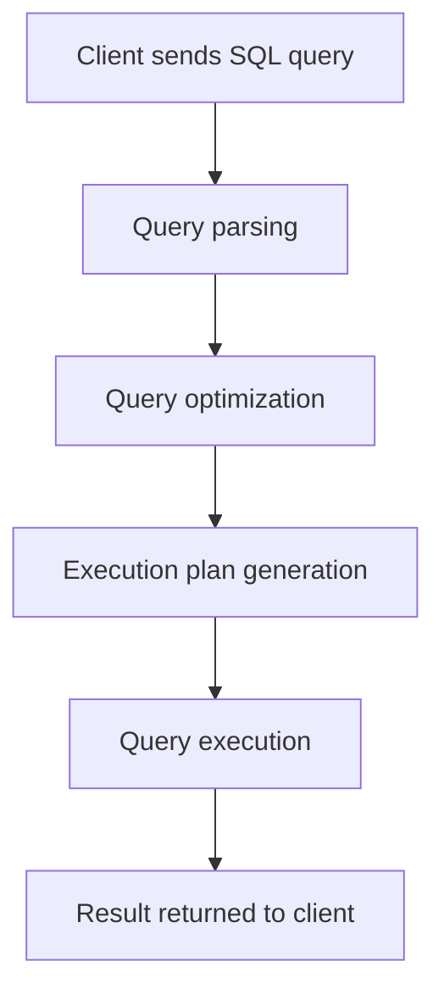

# MySQL Query Optimization

## Introduction

Query optimization is one of the most critical aspects of maintaining a high-performing MySQL database. Even well-designed databases can suffer from poor performance if the queries accessing the data are inefficient. For beginners, understanding how to write optimized SQL queries might seem daunting, but mastering a few core principles can dramatically improve your database performance.

In this guide, we'll explore various techniques to optimize MySQL queries, understand the query execution process, and learn how to identify and resolve performance bottlenecks.

## Why Query Optimization Matters

Before diving into specific techniques, let's understand why query optimization is so important:

- **Faster response times**: Optimized queries execute more quickly, providing better user experience
- **Reduced server load**: Efficient queries consume fewer CPU, memory, and I/O resources
- **Improved scalability**: A well-optimized database can handle more concurrent users
- **Cost savings**: Better performance means you can delay hardware upgrades

## Understanding the Query Execution Process

To optimize queries effectively, it's helpful to understand how MySQL processes them:



When you submit a query, MySQL:
1. Parses the SQL statement for syntax correctness
2. Optimizes the query (determines the best execution plan)
3. Executes the query according to the plan
4. Returns the results

The query optimizer is responsible for determining the most efficient way to execute a query, considering available indexes, table statistics, and other factors.

## Essential Query Optimization Techniques

### 1. Use Proper Indexing

Indexes are perhaps the most powerful tool for query optimization.

#### Example: Creating an Index

```sql
-- Without an index, this query must scan the entire table
SELECT * FROM customers WHERE email = 'example@email.com';

-- Create an index on the email column
CREATE INDEX idx_email ON customers(email);

-- Now the query can use the index for faster lookups
```

#### Types of Indexes to Consider

- **Single-column indexes**: Optimizes queries filtering on one column
- **Composite indexes**: Optimizes queries filtering on multiple columns
- **Covering indexes**: Includes all columns needed by the query, avoiding table lookups

### 2. EXPLAIN Your Queries

The `EXPLAIN` statement is your best friend for query optimization. It shows how MySQL plans to execute your query.

```sql
EXPLAIN SELECT * FROM orders 
WHERE customer_id = 123 
AND order_date BETWEEN '2023-01-01' AND '2023-12-31';
```

Sample output:

```
+----+-------------+--------+------------+------+---------------+------+---------+------+------+----------+-------------+
| id | select_type | table  | partitions | type | possible_keys | key  | key_len | ref  | rows | filtered | Extra       |
+----+-------------+--------+------------+------+---------------+------+---------+------+------+----------+-------------+
|  1 | SIMPLE      | orders | NULL       | ALL  | NULL          | NULL | NULL    | NULL | 1000 |    11.11 | Using where |
+----+-------------+--------+------------+------+---------------+------+---------+------+------+----------+-------------+
```

The most important columns to look at:
- **type**: Shows the join type (ALL is a full table scan, which is typically bad)
- **possible_keys**: Indexes that could be used
- **key**: Index actually used (NULL means no index)
- **rows**: Estimated number of rows examined
- **Extra**: Additional information about how MySQL executes the query

### 3. SELECT Only What You Need

Avoid using `SELECT *` in production code. Instead, select only the columns you actually need.

```sql
-- Less efficient, retrieves unnecessary data
SELECT * FROM products WHERE category_id = 5;

-- More efficient, retrieves only needed columns
SELECT product_id, product_name, price FROM products WHERE category_id = 5;
```

### 4. Optimize WHERE Clauses

The way you write your WHERE clauses can significantly impact performance:

#### Use Full Column Names for Indexed Columns

```sql
-- Might not use index on last_name
SELECT * FROM employees WHERE SUBSTRING(last_name, 1, 3) = 'Smi';

-- Better approach - can use index
SELECT * FROM employees WHERE last_name LIKE 'Smi%';
```

#### Avoid Functions on Indexed Columns

```sql
-- Won't use index on order_date
SELECT * FROM orders WHERE YEAR(order_date) = 2023;

-- Better approach - can use index
SELECT * FROM orders WHERE order_date BETWEEN '2023-01-01' AND '2023-12-31';
```

### 5. Optimize JOINs

Joins can be performance bottlenecks if not handled properly:

#### Use Proper JOIN Types

```sql
-- Example comparing JOIN types
-- INNER JOIN with indexed columns is usually fast
SELECT c.customer_name, o.order_id
FROM customers c
INNER JOIN orders o ON c.customer_id = o.customer_id
WHERE c.country = 'USA';
```

#### Join Order Matters

For complex queries with multiple joins, try different join orders if the optimizer isn't choosing the best plan.

#### Use Smaller Result Sets Before Joining

```sql
-- Less efficient approach
SELECT p.product_name, c.category_name, s.supplier_name
FROM products p
JOIN categories c ON p.category_id = c.category_id
JOIN suppliers s ON p.supplier_id = s.supplier_id;

-- More efficient with filters applied early
SELECT p.product_name, c.category_name, s.supplier_name
FROM products p
JOIN categories c ON p.category_id = c.category_id
JOIN suppliers s ON p.supplier_id = s.supplier_id
WHERE p.discontinued = 0
AND c.category_id IN (1, 2, 3);
```

### 6. Use LIMIT for Pagination

When displaying large result sets, use `LIMIT` for pagination:

```sql
-- Inefficient - fetches all records
SELECT * FROM products ORDER BY created_at DESC;

-- Better - fetches only the first page
SELECT * FROM products ORDER BY created_at DESC LIMIT 20;

-- For subsequent pages (page 2, 20 items per page)
SELECT * FROM products ORDER BY created_at DESC LIMIT 20, 20;
```

### 7. Optimize GROUP BY Queries

GROUP BY operations can be resource-intensive:

```sql
-- May be slow on large tables
SELECT category_id, COUNT(*) AS product_count
FROM products
GROUP BY category_id;
```

To optimize:
- Ensure the GROUP BY column is indexed
- Consider pre-aggregating data for common calculations
- Use HAVING clauses judiciously as they filter after grouping

### 8. Use Database Caching

Enable the MySQL query cache for frequently executed read queries:

```sql
-- Check if query cache is enabled
SHOW VARIABLES LIKE 'query_cache_type';

-- Configure query cache (in my.cnf file)
-- query_cache_type = 1
-- query_cache_size = 64M
```

**Note:** In MySQL 8.0+, the query cache has been removed. Consider application-level caching instead.

### 9. Avoid Correlated Subqueries

Correlated subqueries can perform poorly because they execute once for each row in the outer query:

```sql
-- Potentially inefficient correlated subquery
SELECT p.product_name,
  (SELECT AVG(price) FROM products WHERE category_id = p.category_id) AS avg_category_price
FROM products p;

-- Better approach using JOIN
SELECT p.product_name, cat_avg.avg_price
FROM products p
JOIN (
  SELECT category_id, AVG(price) AS avg_price
  FROM products
  GROUP BY category_id
) cat_avg ON p.category_id = cat_avg.category_id;
```

### 10. Use UNION ALL Instead of UNION When Possible

`UNION` removes duplicates (which requires sorting), while `UNION ALL` keeps all rows:

```sql
-- Has to check for duplicates (slower)
SELECT product_id, product_name FROM discontinued_products
UNION
SELECT product_id, product_name FROM current_products;

-- No duplicate checking (faster)
SELECT product_id, product_name FROM discontinued_products
UNION ALL
SELECT product_id, product_name FROM current_products;
```

## Real-World Case Study: Optimizing an E-commerce Query

Let's walk through a practical example of optimizing a query for an e-commerce application.

### Initial Query (Inefficient)

```sql
SELECT 
    p.product_id, 
    p.product_name, 
    p.description, 
    p.price, 
    p.stock_quantity,
    c.category_name, 
    GROUP_CONCAT(t.tag_name) AS tags,
    AVG(r.rating) AS average_rating,
    COUNT(r.review_id) AS review_count
FROM 
    products p
LEFT JOIN 
    categories c ON LOWER(p.category_id) = LOWER(c.category_id)
LEFT JOIN 
    product_tags pt ON p.product_id = pt.product_id
LEFT JOIN 
    tags t ON pt.tag_id = t.tag_id
LEFT JOIN 
    reviews r ON p.product_id = r.product_id
WHERE 
    YEAR(p.created_at) = 2023
    AND p.price BETWEEN 10 AND 50
    AND p.stock_quantity > 0
GROUP BY 
    p.product_id, p.product_name, p.description, p.price, 
    p.stock_quantity, c.category_name
ORDER BY 
    average_rating DESC
LIMIT 
    0, 20;
```

### Problems with this Query

Running `EXPLAIN` on this query would reveal several issues:
1. Using function `YEAR()` on the `created_at` column prevents index usage
2. Using `LOWER()` on indexed columns prevents index usage
3. The query retrieves all columns even if not needed
4. Multiple joins without proper indexing can cause performance issues
5. The GROUP BY clause includes unnecessary columns

### Optimized Query

```sql
-- First, ensure proper indexes exist:
CREATE INDEX idx_products_created_price_stock ON products(created_at, price, stock_quantity);
CREATE INDEX idx_product_tags_product_id ON product_tags(product_id);
CREATE INDEX idx_reviews_product_id ON reviews(product_id);

-- Then optimize the query:
SELECT 
    p.product_id, 
    p.product_name, 
    p.price, 
    c.category_name, 
    GROUP_CONCAT(t.tag_name) AS tags,
    r_stats.average_rating,
    r_stats.review_count
FROM 
    products p
LEFT JOIN 
    categories c ON p.category_id = c.category_id
LEFT JOIN 
    product_tags pt ON p.product_id = pt.product_id
LEFT JOIN 
    tags t ON pt.tag_id = t.tag_id
LEFT JOIN (
    -- Pre-aggregate review data
    SELECT 
        product_id, 
        AVG(rating) AS average_rating,
        COUNT(review_id) AS review_count
    FROM 
        reviews
    GROUP BY 
        product_id
) r_stats ON p.product_id = r_stats.product_id
WHERE 
    p.created_at BETWEEN '2023-01-01' AND '2023-12-31'
    AND p.price BETWEEN 10 AND 50
    AND p.stock_quantity > 0
GROUP BY 
    p.product_id, p.product_name, p.price, c.category_name
ORDER BY 
    r_stats.average_rating DESC
LIMIT 
    0, 20;
```

### Improvements Made:

1. Replaced `YEAR(created_at)` with a date range to enable index usage
2. Removed `LOWER()` functions on indexed columns
3. Selected only necessary columns
4. Pre-aggregated the review data to reduce the complexity of the outer query
5. Streamlined the GROUP BY clause
6. Added appropriate indexes

## Advanced Optimization Techniques

For more complex applications, consider these advanced techniques:

### 1. Partitioning Tables

For very large tables, partitioning can improve query performance by limiting the amount of data scanned:

```sql
CREATE TABLE orders (
    order_id INT NOT NULL,
    customer_id INT NOT NULL,
    order_date DATE NOT NULL,
    total_amount DECIMAL(10,2),
    PRIMARY KEY (order_id, order_date)
)
PARTITION BY RANGE (YEAR(order_date)) (
    PARTITION p2021 VALUES LESS THAN (2022),
    PARTITION p2022 VALUES LESS THAN (2023),
    PARTITION p2023 VALUES LESS THAN (2024),
    PARTITION pmax VALUES LESS THAN MAXVALUE
);
```

### 2. Using Stored Procedures for Complex Operations

```sql
DELIMITER //
CREATE PROCEDURE get_customer_orders(IN cust_id INT)
BEGIN
    -- Use optimized queries inside the procedure
    SELECT
        o.order_id,
        o.order_date,
        SUM(oi.quantity * oi.unit_price) AS total
    FROM
        orders o
    JOIN
        order_items oi ON o.order_id = oi.order_id
    WHERE
        o.customer_id = cust_id
    GROUP BY
        o.order_id, o.order_date;
END //
DELIMITER ;

-- Call the procedure
CALL get_customer_orders(101);
```

### 3. Consider Denormalization for Read-Heavy Workloads

For read-optimized scenarios, selective denormalization can improve performance by reducing joins.

```sql
-- Original normalized structure
SELECT p.product_name, c.category_name
FROM products p
JOIN categories c ON p.category_id = c.category_id;

-- Denormalized approach (store category_name in products table)
SELECT product_name, category_name FROM products;
```

## Tools for Query Optimization

Several tools can help you identify and fix query performance issues:

1. **MySQL Slow Query Log**: Captures queries that exceed a specified execution time
   ```sql
   -- Enable slow query logging
   SET GLOBAL slow_query_log = 'ON';
   SET GLOBAL long_query_time = 1; -- Log queries taking more than 1 second
   ```

2. **MySQL Performance Schema**: Provides detailed performance metrics
   ```sql
   -- Find top 10 queries by execution time
   SELECT 
     digest_text, count_star, avg_timer_wait
   FROM 
     performance_schema.events_statements_summary_by_digest
   ORDER BY 
     avg_timer_wait DESC
   LIMIT 10;
   ```

3. **EXPLAIN ANALYZE**: Shows actual execution plan with timing information (MySQL 8.0+)
   ```sql
   EXPLAIN ANALYZE SELECT * FROM customers WHERE country = 'USA';
   ```

## Common Query Optimization Mistakes to Avoid

1. **Over-indexing**: Too many indexes can slow down write operations and increase storage requirements
2. **Ignoring server configuration**: Some issues require adjusting MySQL configuration parameters
3. **Not considering data volume growth**: Solutions that work with small data volumes may fail as data grows
4. **Premature optimization**: Focus on optimizing queries that actually cause performance problems
5. **Not monitoring query performance over time**: Database workload changes can affect query performance

## Summary

Query optimization is both an art and a science that can significantly improve the performance of your MySQL database. The key takeaways from this guide are:

1. Use proper indexing based on your query patterns
2. Use the EXPLAIN statement to understand query execution plans
3. Only SELECT the columns you need
4. Avoid using functions on indexed columns in WHERE clauses
5. Optimize JOINs and table access order
6. Use LIMIT for pagination
7. Leverage database and application caching
8. Monitor and analyze query performance regularly

By applying these principles, you'll be well on your way to writing faster, more efficient MySQL queries.

## Additional Resources and Exercises

### Resources

- [MySQL Documentation on Optimization](https://dev.mysql.com/doc/refman/8.0/en/optimization.html)
- [MySQL High Performance Book](https://www.oreilly.com/library/view/high-performance-mysql/9781449332471/)
- [Use The Index, Luke](https://use-the-index-luke.com/) - A guide to database performance for developers

### Practice Exercises

1. **Index Analysis**: Take a slow query from your application and analyze its EXPLAIN plan. Add appropriate indexes and measure the performance improvement.

2. **Query Rewriting**: Find a complex query with subqueries in your codebase and try to rewrite it using JOINs. Compare the performance.

3. **WHERE Clause Optimization**: Identify queries in your application that use functions on indexed columns in WHERE clauses. Refactor them to use index-friendly patterns.

4. **Batch Processing**: If you have a process that updates many rows individually, rewrite it to use bulk operations and measure the performance difference.

5. **Indexing Strategy Challenge**: For a table with 10 million rows and multiple filtered queries, design an optimal indexing strategy that balances read performance with write overhead.

Remember, query optimization is an iterative process. Measure, optimize, and measure again!