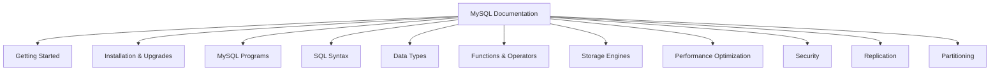
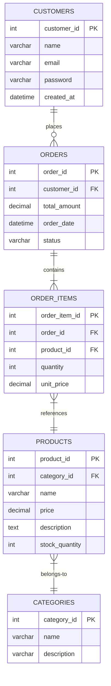

# MySQL Documentation

## Introduction

MySQL documentation is a comprehensive resource that provides detailed information about MySQL database server's functionality, features, configuration options, and best practices. As a beginner in MySQL, understanding how to navigate, read, and utilize this documentation effectively is crucial for your development journey.

Good documentation habits not only help you solve problems more efficiently but also contribute to code maintainability and team collaboration. In this guide, we'll explore how to use the official MySQL documentation and develop best practices for documenting your own MySQL implementations.

## Why MySQL Documentation Matters

Documentation serves as the backbone of any developer's workflow for several reasons:

1. **Knowledge Repository** - It provides detailed explanations of MySQL features and functionality
2. **Troubleshooting Guide** - Helps identify and resolve common issues
3. **Learning Resource** - Assists beginners in understanding complex concepts
4. **Reference Material** - Offers syntax details and examples for SQL commands
5. **Best Practices** - Guides developers toward optimal database design and performance

## Navigating the Official MySQL Documentation

### Structure of MySQL Documentation

MySQL's official documentation is structured hierarchically, covering various aspects of the database system:



### Finding Information Efficiently

To effectively use MySQL documentation:

1. **Use the Search Function** - The documentation has a powerful search tool
2. **Browse by Category** - Navigate through the hierarchical structure
3. **Check Version Specifics** - Ensure you're reading documentation for your MySQL version
4. **Bookmark Important Pages** - Save frequently referenced sections for quick access

## Key Documentation Sections for Beginners

### Getting Started Guide

The Getting Started section provides an overview of MySQL basics, including:

- Database and table creation
- Basic data operations (INSERT, SELECT, UPDATE, DELETE)
- User management and privileges
- Basic configuration

Here's an example of how to use the documentation to create your first database:

```sql
-- Example from documentation on creating a database
CREATE DATABASE my_first_db;
USE my_first_db;

-- Creating a simple table based on documentation examples
CREATE TABLE employees (
    id INT AUTO_INCREMENT PRIMARY KEY,
    first_name VARCHAR(50),
    last_name VARCHAR(50),
    hire_date DATE
);
```

### SQL Statement Syntax

The SQL Syntax section details how to structure MySQL commands properly:

```sql
-- SELECT syntax example from documentation
SELECT 
    column1, column2, ...
FROM 
    table_name
WHERE 
    condition
GROUP BY 
    column_name
HAVING 
    condition
ORDER BY 
    column_name
LIMIT 
    offset, count;
```

### Data Types

Understanding MySQL data types is crucial for efficient database design:

| Data Type | Description | Example Use Case |
|-----------|-------------|-----------------|
| INT | Integer values | IDs, counts, whole numbers |
| VARCHAR | Variable-length strings | Names, short text |
| TEXT | Longer text content | Comments, articles |
| DATE | Date values | Birth dates, event dates |
| DECIMAL | Precise decimal numbers | Financial data |
| TIMESTAMP | Date and time | Record creation/update times |

## Creating Your Own MySQL Documentation

### In-Database Documentation

MySQL provides ways to document your database schema directly:

```sql
-- Adding table comments
CREATE TABLE products (
    id INT AUTO_INCREMENT PRIMARY KEY,
    name VARCHAR(100),
    price DECIMAL(10,2),
    description TEXT,
    created_at TIMESTAMP DEFAULT CURRENT_TIMESTAMP
) COMMENT 'Stores product information including pricing and descriptions';

-- Adding column comments
ALTER TABLE products
MODIFY name VARCHAR(100) COMMENT 'Product display name, must be unique';
```

To view these comments later:

```sql
-- Retrieve table comments
SHOW TABLE STATUS WHERE Name = 'products';

-- Retrieve column comments
SHOW FULL COLUMNS FROM products;
```

### Code Comments Best Practices

When writing SQL scripts, follow these documentation practices:

```sql
-- =======================================================
-- File: inventory_management.sql
-- Author: Jane Doe
-- Created: 2023-05-15
-- Description: Handles inventory updates and reports
-- =======================================================

/*
This procedure updates inventory levels after a product sale
and generates alerts for low stock items.
Parameters:
  - p_product_id: The ID of the sold product
  - p_quantity: Quantity sold
Returns:
  - 1: Success
  - 0: Failure (with error message)
*/
DELIMITER //
CREATE PROCEDURE update_inventory_after_sale(
    IN p_product_id INT,
    IN p_quantity INT,
    OUT p_success BOOLEAN
)
BEGIN
    DECLARE current_stock INT;
    
    -- Get current stock level
    SELECT stock_quantity INTO current_stock
    FROM inventory
    WHERE product_id = p_product_id;
    
    -- Check if enough stock available
    IF current_stock >= p_quantity THEN
        -- Update inventory
        UPDATE inventory
        SET stock_quantity = stock_quantity - p_quantity
        WHERE product_id = p_product_id;
        
        -- Check if stock is below threshold
        IF (current_stock - p_quantity) < min_stock_level THEN
            INSERT INTO stock_alerts (product_id, current_level, alert_date)
            VALUES (p_product_id, (current_stock - p_quantity), NOW());
        END IF;
        
        SET p_success = TRUE;
    ELSE
        SET p_success = FALSE;
    END IF;
END //
DELIMITER ;
```

## Real-World Application: Documenting a Database Project

Let's walk through documenting a simple e-commerce database:

### 1. Project Overview Documentation

Create a README.md file that explains:

```markdown
# E-commerce Database

## Overview
This database supports an online retail store with product management, customer accounts, and order processing capabilities.

## Schema Version
1.2.3 (Last updated: 2023-06-01)

## Dependencies
- MySQL 8.0 or higher
- InnoDB storage engine

## Tables
- customers: Customer account information
- products: Product catalog with pricing and inventory
- orders: Order header information
- order_items: Line items for each order
- categories: Product categorization

## Relationships
- Each order belongs to one customer
- Each order contains multiple order_items
- Each order_item references one product
- Each product belongs to one category
```

### 2. Entity-Relationship Diagram

Include a visual representation of your schema:



### 3. Data Dictionary

Document each table in detail:

```markdown
## Data Dictionary

### customers
| Column | Type | Description | Constraints |
|--------|------|-------------|-------------|
| customer_id | INT | Unique identifier | Primary Key, Auto Increment |
| name | VARCHAR(100) | Customer's full name | Not NULL |
| email | VARCHAR(100) | Contact email | Not NULL, Unique |
| password | VARCHAR(255) | Encrypted password | Not NULL |
| created_at | DATETIME | Account creation timestamp | Default: CURRENT_TIMESTAMP |

### products
| Column | Type | Description | Constraints |
|--------|------|-------------|-------------|
| product_id | INT | Unique identifier | Primary Key, Auto Increment |
| category_id | INT | Reference to categories table | Foreign Key |
| name | VARCHAR(100) | Product name | Not NULL |
| price | DECIMAL(10,2) | Current product price | Not NULL |
| description | TEXT | Detailed product description | NULL allowed |
| stock_quantity | INT | Current inventory level | Default: 0 |
```

## Tools for MySQL Documentation

Several tools can assist in maintaining and generating MySQL documentation:

### 1. MySQL Workbench

MySQL Workbench provides built-in documentation features:

- Visual schema design with annotations
- Model documentation generation
- SQL script comments and organization

### 2. Automated Documentation Tools

Tools that can help generate documentation from your schema:

```bash
# Using SchemaSpygit
java -jar schemaspy.jar -t mysql -db your_database -host localhost -port 3306 -u username -p password -o output_directory
```

### 3. Version Control for Documentation

Track changes to your database structure and documentation:

```bash
# Example git workflow for database changes
git add schema.sql
git add README.md
git add docs/data_dictionary.md
git commit -m "Update product table with inventory tracking fields"
```

## Best Practices for MySQL Documentation

1. **Keep Documentation Current**: Update docs whenever schema changes
2. **Document the Why, Not Just the What**: Explain design decisions
3. **Use Consistent Formatting**: Maintain a uniform style throughout
4. **Include Examples**: Provide sample queries for common operations
5. **Document Indexes and Constraints**: Explain performance considerations
6. **Maintain a Changelog**: Track schema evolution over time
7. **Document Stored Procedures and Functions**: Include parameters and return values
8. **Include Diagrams**: Visual representations aid understanding

## Common Documentation Mistakes to Avoid

1. **Outdated Information**: Ensure documentation matches the current schema
2. **Missing Context**: Explain why certain design choices were made
3. **Overcomplicating**: Use clear, simple language
4. **Neglecting Edge Cases**: Document limitations and special considerations
5. **Ignoring Security Details**: Note access controls and sensitive data handling

## Summary

Effective MySQL documentation is an essential skill for database developers and administrators. By understanding how to use the official MySQL documentation and implementing best practices for documenting your own database projects, you'll create more maintainable systems and collaborate more effectively with team members.

Remember that documentation is not a one-time task but an ongoing process that evolves with your database. Investing time in proper documentation saves countless hours in the long run, especially for complex projects or when onboarding new team members.

## Additional Resources

- [Official MySQL Documentation](https://dev.mysql.com/doc/)
- [MySQL Workbench Manual](https://dev.mysql.com/doc/workbench/en/)
- [MySQL Community Forums](https://forums.mysql.com/)

## Exercises

1. Find and document three different ways to create indexes in MySQL using the official documentation.
2. Create a data dictionary for a simple blog database with users, posts, and comments tables.
3. Write properly documented stored procedures for common operations in an e-commerce database.
4. Generate an entity-relationship diagram for an existing database using MySQL Workbench.
5. Practice adding table and column comments to an existing schema and retrieving them using SQL commands.