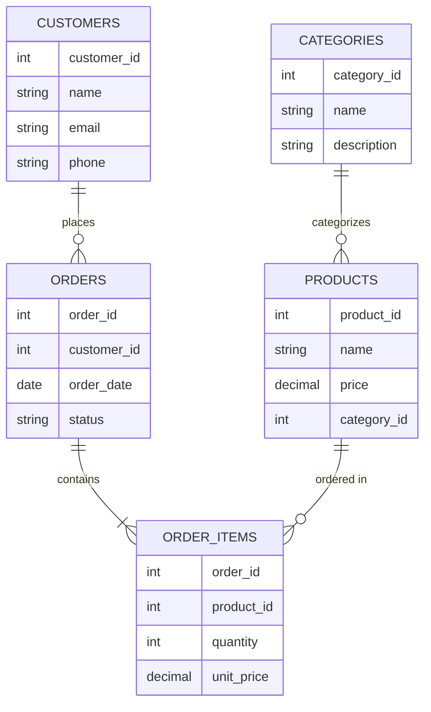

# MySQL Schema Design

A well-designed database schema forms the foundation of any efficient and scalable application. In this guide, we'll explore the principles and best practices for designing MySQL database schemas that are optimized for performance, maintainability, and data integrity.

## Introduction to Schema Design

A database schema is the blueprint of your database structure. It defines how data is organized and how the relations among them are associated. It formulates all the constraints that are to be applied on the data.

Good schema design helps you:

- Minimize data redundancy
- Ensure data consistency
- Improve query performance
- Make your database easier to maintain and scale
- Reduce storage requirements

Let's dive into the key concepts and principles of MySQL schema design.

## Database Normalization

Normalization is a systematic approach to organizing your database to reduce data redundancy and improve data integrity.

### First Normal Form (1NF)

A table is in 1NF if:

1. It has a primary key
2. Each column contains atomic (indivisible) values
3. No repeating groups

**Bad Example:**

```sql
CREATE TABLE student_courses (
  student_id INT,
  student_name VARCHAR(100),
  courses VARCHAR(255), -- Contains comma-separated values like "Math, Science, History"
  PRIMARY KEY (student_id)
);
```

**Good Example (1NF):**

```sql
CREATE TABLE students (
  student_id INT,
  student_name VARCHAR(100),
  PRIMARY KEY (student_id)
);

CREATE TABLE student_courses (
  student_id INT,
  course VARCHAR(100),
  PRIMARY KEY (student_id, course),
  FOREIGN KEY (student_id) REFERENCES students(student_id)
);
```

### Second Normal Form (2NF)

A table is in 2NF if:

1. It's in 1NF
2. All non-key attributes are fully dependent on the primary key

**Bad Example:**

```sql
CREATE TABLE orders (
  order_id INT,
  product_id INT,
  quantity INT,
  product_name VARCHAR(100), -- This depends only on product_id, not the full primary key
  customer_id INT,
  PRIMARY KEY (order_id, product_id)
);
```

**Good Example (2NF):**

```sql
CREATE TABLE orders (
  order_id INT,
  customer_id INT,
  PRIMARY KEY (order_id)
);

CREATE TABLE order_items (
  order_id INT,
  product_id INT,
  quantity INT,
  PRIMARY KEY (order_id, product_id),
  FOREIGN KEY (order_id) REFERENCES orders(order_id),
  FOREIGN KEY (product_id) REFERENCES products(product_id)
);

CREATE TABLE products (
  product_id INT,
  product_name VARCHAR(100),
  PRIMARY KEY (product_id)
);
```

### Third Normal Form (3NF)

A table is in 3NF if:

1. It's in 2NF
2. It has no transitive dependencies (non-key attributes depend only on the primary key)

**Bad Example:**

```sql
CREATE TABLE employees (
  employee_id INT,
  employee_name VARCHAR(100),
  department_id INT,
  department_name VARCHAR(100), -- This depends on department_id, not employee_id
  PRIMARY KEY (employee_id)
);
```

**Good Example (3NF):**

```sql
CREATE TABLE employees (
  employee_id INT,
  employee_name VARCHAR(100),
  department_id INT,
  PRIMARY KEY (employee_id),
  FOREIGN KEY (department_id) REFERENCES departments(department_id)
);

CREATE TABLE departments (
  department_id INT,
  department_name VARCHAR(100),
  PRIMARY KEY (department_id)
);
```

## Relationships Between Tables

Understanding how to model relationships is crucial for schema design.

### One-to-One Relationships

Each record in Table A has exactly one matching record in Table B.

```sql
CREATE TABLE users (
  user_id INT PRIMARY KEY,
  username VARCHAR(50) NOT NULL,
  email VARCHAR(100) NOT NULL
);

CREATE TABLE user_profiles (
  profile_id INT PRIMARY KEY,
  user_id INT UNIQUE,
  bio TEXT,
  avatar VARCHAR(255),
  FOREIGN KEY (user_id) REFERENCES users(user_id)
);
```

### One-to-Many Relationships

Each record in Table A can have many matching records in Table B, but a record in Table B has only one matching record in Table A.

```sql
CREATE TABLE authors (
  author_id INT PRIMARY KEY,
  author_name VARCHAR(100) NOT NULL
);

CREATE TABLE books (
  book_id INT PRIMARY KEY,
  title VARCHAR(255) NOT NULL,
  author_id INT,
  FOREIGN KEY (author_id) REFERENCES authors(author_id)
);
```

### Many-to-Many Relationships

Records in Table A can have many matching records in Table B, and vice versa. These relationships require a junction table.

```sql
CREATE TABLE students (
  student_id INT PRIMARY KEY,
  student_name VARCHAR(100) NOT NULL
);

CREATE TABLE courses (
  course_id INT PRIMARY KEY,
  course_name VARCHAR(100) NOT NULL
);

CREATE TABLE student_courses (
  student_id INT,
  course_id INT,
  enrollment_date DATE,
  PRIMARY KEY (student_id, course_id),
  FOREIGN KEY (student_id) REFERENCES students(student_id),
  FOREIGN KEY (course_id) REFERENCES courses(course_id)
);
```

## Primary and Foreign Keys

### Primary Keys

A primary key uniquely identifies each record in a table. Good primary key choices:

1. **Auto-incrementing integers** - Simple and efficient
2. **UUIDs** - Useful for distributed systems
3. **Natural keys** - When there's a naturally unique attribute

```sql
-- Auto-increment example
CREATE TABLE products (
  product_id INT AUTO_INCREMENT PRIMARY KEY,
  name VARCHAR(100) NOT NULL
);

-- UUID example
CREATE TABLE sessions (
  session_id CHAR(36) PRIMARY KEY,
  user_id INT,
  created_at TIMESTAMP DEFAULT CURRENT_TIMESTAMP
);

-- Natural key example
CREATE TABLE countries (
  country_code CHAR(2) PRIMARY KEY, -- ISO country code
  country_name VARCHAR(100) NOT NULL
);
```

### Foreign Keys

Foreign keys enforce referential integrity between tables.

```sql
CREATE TABLE orders (
  order_id INT PRIMARY KEY,
  customer_id INT NOT NULL,
  order_date DATETIME NOT NULL,
  FOREIGN KEY (customer_id) REFERENCES customers(customer_id)
);
```

Add cascade options to handle parent record deletion or updates:

```sql
CREATE TABLE order_items (
  order_item_id INT PRIMARY KEY,
  order_id INT,
  product_id INT,
  quantity INT NOT NULL,
  FOREIGN KEY (order_id) REFERENCES orders(order_id) ON DELETE CASCADE,
  FOREIGN KEY (product_id) REFERENCES products(product_id)
);
```

## Indexing Strategy

Indexes are crucial for query performance but should be used strategically.

### When to Create Indexes

1. Primary keys (automatically indexed)
2. Foreign keys
3. Columns frequently used in WHERE clauses
4. Columns used in JOIN conditions
5. Columns used in ORDER BY or GROUP BY

```sql
-- Adding index to a foreign key
CREATE INDEX idx_orders_customer_id ON orders(customer_id);

-- Adding index to a frequently filtered column
CREATE INDEX idx_products_category ON products(category_id);

-- Adding composite index for multiple columns used together
CREATE INDEX idx_first_last_name ON users(last_name, first_name);
```

### Types of Indexes

**B-Tree Index:** Default general-purpose index type.

```sql
CREATE INDEX idx_name ON users(last_name);
```

**Unique Index:** Ensures all values in the indexed column are distinct.

```sql
CREATE UNIQUE INDEX idx_email ON users(email);
```

**Full-Text Index:** Optimized for text searches.

```sql
CREATE FULLTEXT INDEX idx_product_description ON products(description);
```

## Data Types and Storage Optimization

Choosing appropriate data types impacts performance, storage, and data integrity.

### Numeric Types

- Use `TINYINT` (1 byte) for small ranges like flags
- Use `SMALLINT` (2 bytes) for medium ranges
- Use `INT` (4 bytes) for standard integers
- Use `BIGINT` (8 bytes) only when necessary
- Use `DECIMAL` for exact numeric values (money)

```sql
CREATE TABLE products (
  product_id INT AUTO_INCREMENT PRIMARY KEY,
  name VARCHAR(100) NOT NULL,
  price DECIMAL(10,2) NOT NULL,
  is_available TINYINT(1) DEFAULT 1,
  inventory_count SMALLINT UNSIGNED,
  views BIGINT UNSIGNED
);
```

### String Types

- Use `CHAR` for fixed-length strings
- Use `VARCHAR` for variable-length strings
- Use `TEXT` for large text content
- Specify length constraints to save space

```sql
CREATE TABLE users (
  user_id INT PRIMARY KEY,
  username VARCHAR(30) NOT NULL,
  password_hash CHAR(60) NOT NULL, -- For bcrypt hashes
  email VARCHAR(100) NOT NULL,
  bio TEXT
);
```

### Date and Time Types

- Use `DATE` for dates without time
- Use `TIME` for time without date
- Use `DATETIME` for date and time
- Use `TIMESTAMP` for tracking changes (auto-updates)

```sql
CREATE TABLE events (
  event_id INT PRIMARY KEY,
  title VARCHAR(100) NOT NULL,
  event_date DATE,
  start_time TIME,
  end_time TIME,
  created_at DATETIME DEFAULT CURRENT_TIMESTAMP,
  updated_at TIMESTAMP DEFAULT CURRENT_TIMESTAMP ON UPDATE CURRENT_TIMESTAMP
);
```

## Schema Visualization

Understanding your database schema visually can help in designing and communicating your design. Here's an example of a simple e-commerce schema:



## Real-World Example: Building a Blog System

Let's design a schema for a simple blog system:

```sql
-- Users table
CREATE TABLE users (
  user_id INT AUTO_INCREMENT PRIMARY KEY,
  username VARCHAR(50) NOT NULL UNIQUE,
  email VARCHAR(100) NOT NULL UNIQUE,
  password_hash CHAR(60) NOT NULL,
  full_name VARCHAR(100),
  bio TEXT,
  created_at TIMESTAMP DEFAULT CURRENT_TIMESTAMP,
  is_admin TINYINT(1) DEFAULT 0
);

-- Categories table
CREATE TABLE categories (
  category_id INT AUTO_INCREMENT PRIMARY KEY,
  name VARCHAR(50) NOT NULL UNIQUE,
  slug VARCHAR(50) NOT NULL UNIQUE,
  description TEXT
);

-- Posts table
CREATE TABLE posts (
  post_id INT AUTO_INCREMENT PRIMARY KEY,
  title VARCHAR(200) NOT NULL,
  slug VARCHAR(200) NOT NULL UNIQUE,
  content TEXT NOT NULL,
  excerpt VARCHAR(500),
  author_id INT NOT NULL,
  category_id INT,
  featured_image VARCHAR(255),
  published_at TIMESTAMP NULL,
  created_at TIMESTAMP DEFAULT CURRENT_TIMESTAMP,
  updated_at TIMESTAMP DEFAULT CURRENT_TIMESTAMP ON UPDATE CURRENT_TIMESTAMP,
  status ENUM('draft', 'published', 'archived') DEFAULT 'draft',
  
  FOREIGN KEY (author_id) REFERENCES users(user_id),
  FOREIGN KEY (category_id) REFERENCES categories(category_id)
);

-- Tags table
CREATE TABLE tags (
  tag_id INT AUTO_INCREMENT PRIMARY KEY,
  name VARCHAR(50) NOT NULL UNIQUE,
  slug VARCHAR(50) NOT NULL UNIQUE
);

-- Post_Tags junction table
CREATE TABLE post_tags (
  post_id INT,
  tag_id INT,
  PRIMARY KEY (post_id, tag_id),
  FOREIGN KEY (post_id) REFERENCES posts(post_id) ON DELETE CASCADE,
  FOREIGN KEY (tag_id) REFERENCES tags(tag_id) ON DELETE CASCADE
);

-- Comments table
CREATE TABLE comments (
  comment_id INT AUTO_INCREMENT PRIMARY KEY,
  post_id INT NOT NULL,
  user_id INT,
  parent_comment_id INT NULL,
  name VARCHAR(100), -- For guest comments
  email VARCHAR(100), -- For guest comments
  content TEXT NOT NULL,
  created_at TIMESTAMP DEFAULT CURRENT_TIMESTAMP,
  is_approved TINYINT(1) DEFAULT 0,
  
  FOREIGN KEY (post_id) REFERENCES posts(post_id) ON DELETE CASCADE,
  FOREIGN KEY (user_id) REFERENCES users(user_id) ON DELETE SET NULL,
  FOREIGN KEY (parent_comment_id) REFERENCES comments(comment_id) ON DELETE CASCADE
);

-- Add indexes
CREATE INDEX idx_posts_author ON posts(author_id);
CREATE INDEX idx_posts_category ON posts(category_id);
CREATE INDEX idx_posts_status_date ON posts(status, published_at);
CREATE INDEX idx_comments_post ON comments(post_id);
CREATE FULLTEXT INDEX idx_posts_search ON posts(title, content);
```

## Common Schema Design Anti-patterns

Avoid these common mistakes in your schema design:

1. **Entity-Attribute-Value (EAV) tables** - Makes querying complex and slow
2. **Too many JOINs** - Can impact performance
3. **Over-normalization** - Sometimes a controlled amount of denormalization improves performance
4. **No indexes** - Leads to slow queries
5. **Using NULL when you mean empty** - Use empty strings or zeros instead when appropriate
6. **Storing CSV in columns** - Violates 1NF and makes searching difficult
7. **Ignoring data types** - Use the most appropriate type for each column

## Schema Evolution and Migrations

As your application grows, your schema will need to evolve. Here are best practices:

1. **Use migration tools** - Like Flyway or Liquibase
2. **Version your schema changes** - Always script changes with up/down scripts
3. **Make additive changes** - Add columns first, then deprecate old ones
4. **Plan for backward compatibility** - Ensure old code still works with schema changes
5. **Test migrations** - On production-like data before deploying

Example migration file structure:

```
migrations/
  V1__initial_schema.sql
  V2__add_user_preferences.sql
  V3__modify_post_categories.sql
```

## Summary

Designing an effective MySQL schema requires understanding normalization, relationships, indexes, and appropriate data types. A good schema creates a solid foundation for your application and helps ensure data integrity, performance, and scalability.

Key points to remember:

1. Normalize your data to reduce redundancy and improve integrity
2. Choose appropriate primary keys and establish relationships with foreign keys
3. Use indexes strategically to improve query performance
4. Select appropriate data types to optimize storage and performance
5. Avoid common design anti-patterns
6. Plan for schema evolution as your application grows

## Additional Resources

Here are some recommended resources to deepen your understanding of MySQL schema design:

- [MySQL Documentation on Database Design](https://dev.mysql.com/doc/refman/8.0/en/database-design.html)
- "High Performance MySQL" by Baron Schwartz, Peter Zaitsev, and Vadim Tkachenko
- "Database Design for Mere Mortals" by Michael J. Hernandez

## Exercises

1. Design a schema for an online bookstore with customers, books, authors, orders, and reviews.
2. Identify normalization problems in an existing schema and refactor it.
3. Create a schema for a social media application with users, posts, friends, and messages.
4. Design a schema for a library management system with books, members, loans, and reservations.
5. Take an existing schema and optimize it by adding appropriate indexes and refining data types.

By following these principles and best practices, you'll be well on your way to creating efficient, maintainable, and scalable MySQL database schemas.