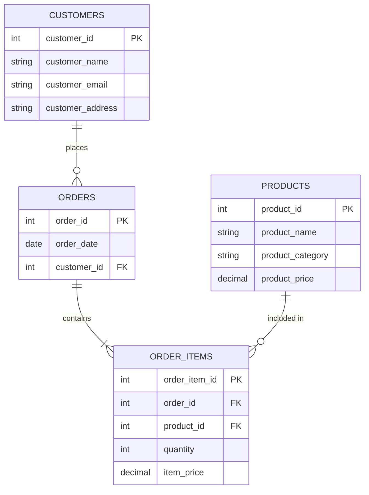

# MySQL Normalization

## Introduction

Database normalization is a fundamental process in database design that helps create efficient, organized, and redundancy-free database structures. For MySQL databases, proper normalization ensures data integrity, reduces storage requirements, and improves overall database performance.

In this tutorial, we'll explore the concept of normalization in MySQL, understanding why it's crucial and how to implement different normalization forms to create robust database designs for your applications.

## What is Database Normalization?

Normalization is the process of structuring a relational database to reduce data redundancy and improve data integrity. It involves organizing fields and tables to minimize duplication while ensuring dependencies make logical sense.

Think of normalization as a way to:

- Eliminate redundant (duplicate) data
- Ensure data dependencies make sense
- Prevent update anomalies (inconsistencies when data is modified)
- Make your database more flexible for future changes

## Why Normalize Your MySQL Database?

Before diving into the formal normalization rules, let's understand why normalization is essential:

1. **Reduced storage space**: Eliminating duplicated data means less disk space usage
2. **Better performance**: Smaller tables can be processed faster
3. **Data consistency**: Updates happen in one place, preventing inconsistencies
4. **Easier maintenance**: Well-organized tables are more straightforward to manage
5. **Future-proofing**: Properly normalized databases adapt better to changing requirements

## Database Normalization Forms

Normalization is typically described in terms of "normal forms" - progressive levels of normalization that address different types of redundancies and dependencies.

### First Normal Form (1NF)

A table is in First Normal Form when:
- It has no repeating groups or arrays
- Each column contains atomic (indivisible) values
- Each record has a unique identifier (primary key)

#### Before 1NF (Problematic Table)

```sql
CREATE TABLE students_unnormalized (
    student_id INT PRIMARY KEY,
    student_name VARCHAR(100),
    courses VARCHAR(255),  -- Storing multiple courses as "Math, Science, History"
    phone_numbers VARCHAR(255)  -- Storing multiple phone numbers as "123-456-7890, 987-654-3210"
);
```

#### After 1NF

```sql
CREATE TABLE students (
    student_id INT PRIMARY KEY,
    student_name VARCHAR(100)
);

CREATE TABLE student_courses (
    id INT PRIMARY KEY AUTO_INCREMENT,
    student_id INT,
    course VARCHAR(100),
    FOREIGN KEY (student_id) REFERENCES students(student_id)
);

CREATE TABLE student_phone_numbers (
    id INT PRIMARY KEY AUTO_INCREMENT,
    student_id INT,
    phone_number VARCHAR(20),
    FOREIGN KEY (student_id) REFERENCES students(student_id)
);
```

### Second Normal Form (2NF)

A table is in Second Normal Form when:
- It's already in 1NF
- All non-key attributes are fully functionally dependent on the primary key (not on just part of the composite key)

This mainly applies when you have composite primary keys. Let's see an example:

#### Before 2NF

```sql
CREATE TABLE enrollments_unnormalized (
    student_id INT,
    course_id INT,
    course_name VARCHAR(100),
    instructor_name VARCHAR(100),
    enrollment_date DATE,
    PRIMARY KEY (student_id, course_id)
);
```

Here, `course_name` and `instructor_name` only depend on `course_id`, not on the full composite key.

#### After 2NF

```sql
CREATE TABLE courses (
    course_id INT PRIMARY KEY,
    course_name VARCHAR(100),
    instructor_name VARCHAR(100)
);

CREATE TABLE enrollments (
    student_id INT,
    course_id INT,
    enrollment_date DATE,
    PRIMARY KEY (student_id, course_id),
    FOREIGN KEY (course_id) REFERENCES courses(course_id)
);
```

### Third Normal Form (3NF)

A table is in Third Normal Form when:
- It's already in 2NF
- It has no transitive dependencies (non-key attributes depend only on the primary key, not on other non-key attributes)

#### Before 3NF

```sql
CREATE TABLE employees_unnormalized (
    employee_id INT PRIMARY KEY,
    employee_name VARCHAR(100),
    department_id INT,
    department_name VARCHAR(100),
    department_location VARCHAR(100)
);
```

Here, `department_name` and `department_location` depend on `department_id`, not directly on `employee_id`.

#### After 3NF

```sql
CREATE TABLE departments (
    department_id INT PRIMARY KEY,
    department_name VARCHAR(100),
    department_location VARCHAR(100)
);

CREATE TABLE employees (
    employee_id INT PRIMARY KEY,
    employee_name VARCHAR(100),
    department_id INT,
    FOREIGN KEY (department_id) REFERENCES departments(department_id)
);
```

### Boyce-Codd Normal Form (BCNF)

BCNF is a slightly stronger version of 3NF. A table is in BCNF when:
- It's already in 3NF
- For every functional dependency X → Y, X must be a superkey

This sounds complex, but it addresses specific cases where a table in 3NF still might have anomalies.

### Fourth Normal Form (4NF) and Fifth Normal Form (5NF)

These are advanced normalization forms that deal with multi-valued dependencies and join dependencies. For most applications, achieving 3NF or BCNF is sufficient.

## Real-World Example: E-commerce Database

Let's look at a practical example of normalizing an e-commerce database.

### Unnormalized Version

```sql
CREATE TABLE orders_unnormalized (
    order_id INT,
    order_date DATE,
    customer_id INT,
    customer_name VARCHAR(100),
    customer_email VARCHAR(100),
    customer_address VARCHAR(255),
    product_id INT,
    product_name VARCHAR(100),
    product_category VARCHAR(100),
    product_price DECIMAL(10,2),
    quantity INT,
    total_price DECIMAL(10,2)
);
```

This design has multiple issues:
- Customer data is duplicated across orders
- Product data is duplicated across orders
- If a product name changes, we need to update multiple records
- Calculating order totals requires aggregating across multiple rows

### Normalized Version

```sql
-- Customers table (3NF)
CREATE TABLE customers (
    customer_id INT PRIMARY KEY,
    customer_name VARCHAR(100),
    customer_email VARCHAR(100),
    customer_address VARCHAR(255)
);

-- Products table (3NF)
CREATE TABLE products (
    product_id INT PRIMARY KEY,
    product_name VARCHAR(100),
    product_category VARCHAR(100),
    product_price DECIMAL(10,2)
);

-- Orders table (3NF)
CREATE TABLE orders (
    order_id INT PRIMARY KEY,
    order_date DATE,
    customer_id INT,
    FOREIGN KEY (customer_id) REFERENCES customers(customer_id)
);

-- Order items table (3NF)
CREATE TABLE order_items (
    order_item_id INT PRIMARY KEY,
    order_id INT,
    product_id INT,
    quantity INT,
    item_price DECIMAL(10,2),
    FOREIGN KEY (order_id) REFERENCES orders(order_id),
    FOREIGN KEY (product_id) REFERENCES products(product_id)
);
```

### Database Diagram



## Querying Normalized Data

Normalized databases often require joins to retrieve related information. However, MySQL's join optimization makes this efficient:

```sql
-- Get complete order information with customer and product details
SELECT 
    o.order_id, 
    o.order_date, 
    c.customer_name, 
    c.customer_email,
    p.product_name, 
    oi.quantity, 
    oi.item_price,
    (oi.quantity * oi.item_price) AS line_total
FROM 
    orders o
    JOIN customers c ON o.customer_id = c.customer_id
    JOIN order_items oi ON o.order_id = oi.order_id
    JOIN products p ON oi.product_id = p.product_id
WHERE 
    o.order_id = 1001;
```

## When to Denormalize

While normalization provides many benefits, there are cases where strategic denormalization makes sense:

1. **Read-heavy applications**: When performance is crucial and data is read much more often than written
2. **Reporting systems**: Pre-calculating aggregates can improve performance for analytics
3. **Data that rarely changes**: Static reference data might not need full normalization
4. **Specific performance bottlenecks**: Adding calculated columns or duplicating certain fields might be justifiable

Remember: denormalization should be a strategic decision, not a design shortcut.

## Best Practices for MySQL Normalization

1. **Start with full normalization**: Begin with a properly normalized design
2. **Use proper data types**: Choose appropriate MySQL data types for each column
3. **Create meaningful relationships**: Use foreign keys to enforce referential integrity
4. **Index strategically**: Add indexes on columns used in joins and WHERE clauses
5. **Consider your workload**: Balance normalization against real-world performance needs
6. **Document your design decisions**: Especially when denormalizing for specific reasons

## Common Normalization Mistakes

1. **Over-normalization**: Creating too many small tables that require excessive joins
2. **Under-normalization**: Not normalizing enough, leading to data redundancy and update anomalies
3. **Misunderstanding relationships**: Creating incorrect foreign key relationships
4. **Ignoring real-world usage patterns**: Not considering how the data will be accessed
5. **Premature denormalization**: Optimizing before understanding actual performance needs

## Summary

Database normalization is an essential skill for creating robust MySQL databases. By following normalization principles:

- You eliminate redundancy and inconsistency
- Your database structure reflects logical data relationships
- Data becomes easier to maintain and extend
- You avoid many common database design pitfalls

Remember that normalization is primarily about organizing your data correctly, not about performance optimization. A well-normalized database provides a solid foundation that can be strategically denormalized if and when specific performance requirements demand it.

## Further Learning Resources

To deepen your understanding of MySQL normalization:

1. Study the formal definitions of functional dependencies
2. Practice identifying normal forms in existing database designs
3. Analyze how normalization affects query performance in different scenarios

## Exercises

1. Take an existing unnormalized table and convert it to 3NF
2. Identify normalization issues in a sample database design
3. Create a database schema for a library management system that follows 3NF
4. Analyze when denormalization might be appropriate in a real-world application
5. Practice writing JOIN queries to retrieve information from a normalized database

By mastering MySQL normalization, you'll build more robust, maintainable, and efficient database systems that can grow with your applications.