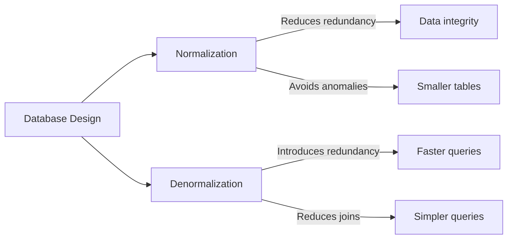

# MySQL Denormalization

## Introduction

Database normalization is a process that organizes data to reduce redundancy and improve data integrity. While normalization is a cornerstone of database design, there are situations where deliberately introducing some redundancy through **denormalization** can significantly improve query performance.

Denormalization is the process of adding redundant data to one or more tables to avoid costly joins or complex queries. In this guide, we'll explore when and how to denormalize your MySQL database, along with practical examples and best practices.

## Understanding Normalization vs. Denormalization

Before diving into denormalization, let's understand the difference between these opposing concepts:



### Normalized Database

A normalized database:
- Eliminates data redundancy
- Ensures data integrity
- Often requires complex joins for queries
- May have slower query performance

### Denormalized Database

A denormalized database:
- Contains redundant data
- Reduces the need for joins
- Features faster read operations
- Requires more careful handling of updates

## When to Consider Denormalization

Denormalization isn't always the right choice. Consider it when:

- Read operations significantly outnumber writes
- Join operations are becoming a performance bottleneck
- Query complexity is affecting application response time
- You need to optimize for specific query patterns
- The database is primarily used for reporting or analytics

## Common Denormalization Techniques

### 1. Duplicating Data

This involves storing the same data in multiple tables to reduce joins.

**Example:**

In a normalized structure, you might have:

```sql
-- Customers table
CREATE TABLE customers (
    customer_id INT PRIMARY KEY,
    customer_name VARCHAR(100),
    city VARCHAR(50),
    state VARCHAR(2)
);

-- Orders table
CREATE TABLE orders (
    order_id INT PRIMARY KEY,
    customer_id INT,
    order_date DATE,
    total DECIMAL(10,2),
    FOREIGN KEY (customer_id) REFERENCES customers(customer_id)
);
```

To retrieve orders with customer information, you'd need a join:

```sql
SELECT o.order_id, o.order_date, c.customer_name
FROM orders o
JOIN customers c ON o.customer_id = c.customer_id;
```

In a denormalized version, you might duplicate customer data in the orders table:

```sql
-- Denormalized orders table
CREATE TABLE denorm_orders (
    order_id INT PRIMARY KEY,
    customer_id INT,
    customer_name VARCHAR(100),
    city VARCHAR(50),
    order_date DATE,
    total DECIMAL(10,2),
    FOREIGN KEY (customer_id) REFERENCES customers(customer_id)
);
```

Now, retrieving order information is simpler and faster:

```sql
SELECT order_id, order_date, customer_name 
FROM denorm_orders;
```

### 2. Pre-calculated Aggregates

Store pre-calculated results of common aggregations rather than computing them on the fly.

**Example:**

Normalized approach with order items:

```sql
-- Order items table
CREATE TABLE order_items (
    item_id INT PRIMARY KEY,
    order_id INT,
    product_id INT,
    quantity INT,
    price DECIMAL(10,2),
    FOREIGN KEY (order_id) REFERENCES orders(order_id)
);
```

To get order totals, you'd aggregate:

```sql
SELECT order_id, SUM(quantity * price) as total
FROM order_items
GROUP BY order_id;
```

Denormalized approach with pre-calculated totals:

```sql
-- Orders with pre-calculated totals
CREATE TABLE orders_with_totals (
    order_id INT PRIMARY KEY,
    customer_id INT,
    order_date DATE,
    item_count INT,
    total_amount DECIMAL(10,2),
    FOREIGN KEY (customer_id) REFERENCES customers(customer_id)
);
```

Now retrieving the total is a simple select:

```sql
SELECT order_id, total_amount FROM orders_with_totals;
```

### 3. Adding Redundant Foreign Keys

Add foreign keys to tables to avoid multi-table joins.

**Example:**

Normalized structure for a blog:

```sql
CREATE TABLE blog_posts (
    post_id INT PRIMARY KEY,
    author_id INT,
    title VARCHAR(200),
    content TEXT,
    created_at DATETIME,
    FOREIGN KEY (author_id) REFERENCES authors(author_id)
);

CREATE TABLE comments (
    comment_id INT PRIMARY KEY,
    post_id INT,
    user_id INT,
    content TEXT,
    created_at DATETIME,
    FOREIGN KEY (post_id) REFERENCES blog_posts(post_id),
    FOREIGN KEY (user_id) REFERENCES users(user_id)
);
```

To get comments with author information, you'd need multiple joins:

```sql
SELECT c.comment_id, c.content, u.username, p.title, a.author_name
FROM comments c
JOIN users u ON c.user_id = u.user_id
JOIN blog_posts p ON c.post_id = p.post_id
JOIN authors a ON p.author_id = a.author_id;
```

Denormalized comments table:

```sql
CREATE TABLE denorm_comments (
    comment_id INT PRIMARY KEY,
    post_id INT,
    post_title VARCHAR(200),
    user_id INT,
    username VARCHAR(50),
    author_id INT,
    author_name VARCHAR(100),
    content TEXT,
    created_at DATETIME,
    FOREIGN KEY (post_id) REFERENCES blog_posts(post_id),
    FOREIGN KEY (user_id) REFERENCES users(user_id),
    FOREIGN KEY (author_id) REFERENCES authors(author_id)
);
```

Now the query is much simpler:

```sql
SELECT comment_id, content, username, post_title, author_name
FROM denorm_comments;
```

### 4. Creating Summary Tables

Summary tables hold aggregated data from transaction tables.

**Example:**

```sql
-- Daily sales summary table
CREATE TABLE daily_sales_summary (
    date DATE PRIMARY KEY,
    total_orders INT,
    total_revenue DECIMAL(12,2),
    avg_order_value DECIMAL(10,2),
    most_popular_product_id INT
);
```

This table would be updated daily (or on a schedule) with aggregated data from detailed sales tables.

## Real-World Application: E-commerce Product Catalog

Let's look at a practical e-commerce scenario to demonstrate denormalization.

### Normalized Schema

```sql
CREATE TABLE products (
    product_id INT PRIMARY KEY,
    name VARCHAR(100),
    description TEXT,
    base_price DECIMAL(10,2),
    category_id INT,
    FOREIGN KEY (category_id) REFERENCES categories(category_id)
);

CREATE TABLE categories (
    category_id INT PRIMARY KEY,
    name VARCHAR(50),
    parent_category_id INT,
    FOREIGN KEY (parent_category_id) REFERENCES categories(category_id)
);

CREATE TABLE product_attributes (
    attribute_id INT PRIMARY KEY,
    product_id INT,
    attribute_name VARCHAR(50),
    attribute_value VARCHAR(100),
    FOREIGN KEY (product_id) REFERENCES products(product_id)
);

CREATE TABLE inventory (
    inventory_id INT PRIMARY KEY,
    product_id INT,
    warehouse_id INT,
    quantity INT,
    FOREIGN KEY (product_id) REFERENCES products(product_id),
    FOREIGN KEY (warehouse_id) REFERENCES warehouses(warehouse_id)
);
```

### Problem

Product listing pages need to display products with their category path, attributes, and inventory status. This requires multiple joins, which can be slow for large catalogs.

### Denormalized Solution

```sql
CREATE TABLE product_catalog_view (
    product_id INT PRIMARY KEY,
    name VARCHAR(100),
    description TEXT,
    base_price DECIMAL(10,2),
    
    -- Denormalized category information
    category_id INT,
    category_name VARCHAR(50),
    category_path VARCHAR(255),
    
    -- Denormalized common attributes as columns
    color VARCHAR(30),
    size VARCHAR(10),
    material VARCHAR(50),
    
    -- Denormalized inventory information
    total_stock INT,
    is_in_stock BOOLEAN,
    
    -- Other useful pre-calculated fields
    discount_price DECIMAL(10,2),
    avg_rating DECIMAL(3,2),
    review_count INT,
    
    -- Keep references for data integrity
    FOREIGN KEY (product_id) REFERENCES products(product_id),
    FOREIGN KEY (category_id) REFERENCES categories(category_id)
);
```

Now, product listing queries are much simpler:

```sql
-- Find all in-stock products in the "Shoes" category
SELECT product_id, name, base_price, discount_price, color, size, avg_rating
FROM product_catalog_view
WHERE category_path LIKE '%/Shoes/%' AND is_in_stock = TRUE
ORDER BY avg_rating DESC;
```

### Maintaining the Denormalized Table

You'll need to keep this denormalized view up-to-date with triggers or scheduled updates:

```sql
-- Example trigger for updating product_catalog_view when a product changes
DELIMITER //
CREATE TRIGGER product_update_trigger
AFTER UPDATE ON products
FOR EACH ROW
BEGIN
    UPDATE product_catalog_view
    SET name = NEW.name,
        description = NEW.description,
        base_price = NEW.base_price
    WHERE product_id = NEW.product_id;
END//
DELIMITER ;
```

## Best Practices for Denormalization

1. **Don't denormalize prematurely**: First, ensure your tables are properly normalized, indexes are optimized, and queries are well-written.

2. **Identify bottlenecks**: Use `EXPLAIN` to analyze slow queries before deciding to denormalize:

   ```sql
   EXPLAIN SELECT p.*, c.name as category_name
   FROM products p
   JOIN categories c ON p.category_id = c.category_id
   WHERE p.base_price < 100;
   ```

3. **Monitor space requirements**: Denormalization increases storage needs.

4. **Plan for data consistency**: Implement triggers, stored procedures, or application logic to keep redundant data synchronized.

5. **Document denormalization decisions**: Keep track of which tables are denormalized and why.

6. **Implement verification processes**: Periodically verify that denormalized data matches its source.

7. **Consider materialized views**: In some databases, materialized views offer a managed approach to denormalization.

## Potential Drawbacks

1. **Increased storage**: Redundant data takes more space.

2. **Update complexity**: All copies of data must be updated to maintain consistency.

3. **Insert/update overhead**: Operations may be slower due to additional data maintenance.

4. **Higher risk of data anomalies**: Inconsistencies can arise if updates aren't properly managed.

## When to Avoid Denormalization

- When data changes frequently
- When storage is a primary concern
- When data consistency is critical (e.g., financial transactions)
- When the application has a balanced read/write ratio

## Summary

MySQL denormalization is a powerful technique for improving query performance by trading off some data normalization principles. While normalization focuses on data integrity and eliminating redundancy, denormalization strategically introduces redundancy to optimize for read operations and reduce complex joins.

Key takeaways:

- Denormalize to improve read performance, especially for complex queries
- Only denormalize after identifying specific performance bottlenecks
- Implement mechanisms to maintain data consistency
- Balance the trade-offs between performance gains and increased complexity

Remember that good database design is about making appropriate compromises based on your specific requirements. Denormalization isn't always the answer, but when applied judiciously, it can significantly boost your application's performance.

## Additional Resources

- Explore MySQL's performance schema to identify bottlenecks
- Learn about MySQL's memory storage engines for read-heavy tables
- Study indexing strategies that might provide performance benefits without denormalization

## Exercises for Practice

1. Identify a complex join in your database that could benefit from denormalization
2. Design a pre-calculated aggregates table for a reporting use case
3. Implement triggers to maintain a denormalized table
4. Compare the performance of a normalized query versus its denormalized counterpart

Remember that the best database design balances theoretical purity with practical performance needs. Denormalization is just one tool in your MySQL optimization toolkit.