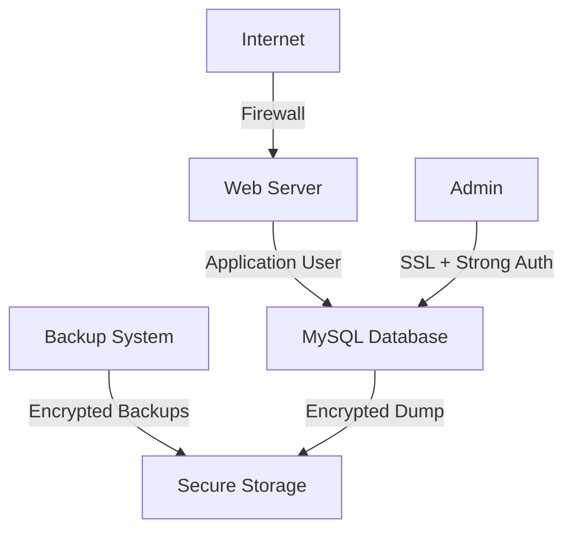

# MySQL Security Practices

## Introduction

Security is a critical aspect of database management that can't be overlooked. As your application grows and manages more sensitive data, securing your MySQL database becomes increasingly important. Security breaches can lead to data loss, unauthorized access, and potentially devastating consequences for both your application and its users.

In this guide, we'll explore essential MySQL security practices that every developer should implement. Whether you're running a small personal project or an enterprise-level application, these practices will help protect your data against common security threats.

## Why MySQL Security Matters

Database security breaches can have serious consequences:

- Exposure of sensitive user information
- Financial losses
- Legal liability
- Damage to reputation and user trust
- Service disruptions

By implementing proper security measures, you can significantly reduce these risks and protect your valuable data.

## Basic Security Practices

### 1. Secure Installation

The foundation of MySQL security begins with a proper installation:

#### Remove Test Databases and Anonymous Users

MySQL installations often come with test databases and anonymous user accounts. These should be removed in production environments:

```sql
DROP DATABASE test;
DELETE FROM mysql.user WHERE User='';
DELETE FROM mysql.user WHERE User='root' AND Host NOT IN ('localhost', '127.0.0.1', '::1');
FLUSH PRIVILEGES;
```

#### Use Strong Root Passwords

When installing MySQL, always set a strong root password:

```sql
ALTER USER 'root'@'localhost' IDENTIFIED BY 'YourStrongPasswordHere';
```

A strong password should:
- Be at least 12 characters long
- Contain uppercase and lowercase letters
- Include numbers
- Contain special characters
- Avoid common words or patterns

### 2. Network Security

Limit MySQL's exposure to the network:

#### Bind to Specific IP Address

By default, MySQL listens on all available network interfaces. Modify your `my.cnf` configuration file to bind MySQL to specific IPs:

```
[mysqld]
bind-address = 127.0.0.1
```

This configuration restricts MySQL to only accept connections from the localhost.

#### Use Firewalls

Configure your firewall to restrict access to your MySQL port (default 3306):

```bash
# Using UFW (Ubuntu firewall)
sudo ufw allow from 192.168.1.100 to any port 3306
```

This allows connections only from the IP address 192.168.1.100.

## Authentication and Access Control

### 1. User Management Best Practices

#### Create Specific Users for Applications

Never use the root account in your applications. Create dedicated users with limited privileges:

```sql
CREATE USER 'app_user'@'localhost' IDENTIFIED BY 'securepassword';
GRANT SELECT, INSERT, UPDATE, DELETE ON myapp_database.* TO 'app_user'@'localhost';
FLUSH PRIVILEGES;
```

#### Implement the Principle of Least Privilege

Only grant permissions that are absolutely necessary for each user:

```sql
# Instead of granting ALL PRIVILEGES:
GRANT SELECT, INSERT ON myapp_database.customers TO 'reporting_user'@'localhost';
```

#### Regularly Audit User Accounts and Privileges

Periodically review user accounts and their privileges:

```sql
# Show all users
SELECT User, Host FROM mysql.user;

# Show grants for specific user
SHOW GRANTS FOR 'app_user'@'localhost';
```

### 2. Advanced Authentication Methods

#### Using Plugin Authentication

MySQL supports various authentication plugins. For enhanced security, consider using:

**SHA-256 Authentication**:

```sql
ALTER USER 'app_user'@'localhost' IDENTIFIED WITH sha256_password BY 'securepassword';
```

**Two-Factor Authentication**:

For MySQL Enterprise Edition users, the MySQL Enterprise Firewall can provide additional authentication security.

## Data Protection

### 1. Encryption

#### Encrypting Data at Rest

To protect sensitive data stored in your database:

```sql
-- Create a table with encrypted columns
CREATE TABLE sensitive_data (
    id INT AUTO_INCREMENT PRIMARY KEY,
    username VARCHAR(50),
    credit_card VARCHAR(255),
    social_security VARCHAR(255)
);

-- Insert with encryption
INSERT INTO sensitive_data (username, credit_card, social_security) 
VALUES (
    'john_doe', 
    AES_ENCRYPT('1234-5678-9012-3456', 'encryption_key'), 
    AES_ENCRYPT('123-45-6789', 'encryption_key')
);

-- Query with decryption
SELECT 
    username, 
    AES_DECRYPT(credit_card, 'encryption_key') as credit_card,
    AES_DECRYPT(social_security, 'encryption_key') as social_security
FROM sensitive_data;
```

> **Note**: Store encryption keys securely outside your database.

#### Encrypting Connections

Enable SSL/TLS for client connections in your `my.cnf` file:

```
[mysqld]
ssl-ca=/path/to/ca.pem
ssl-cert=/path/to/server-cert.pem
ssl-key=/path/to/server-key.pem
require_secure_transport=ON
```

Then require SSL for specific users:

```sql
ALTER USER 'app_user'@'localhost' REQUIRE SSL;
```

Verify SSL connection:

```sql
SHOW STATUS LIKE 'Ssl_cipher';
```

### 2. Secure Database Backups

Encrypt your MySQL backups:

```bash
# Create encrypted backup
mysqldump -u root -p --all-databases | openssl enc -aes-256-cbc -salt -out backup.sql.enc

# Restore encrypted backup
openssl enc -d -aes-256-cbc -in backup.sql.enc | mysql -u root -p
```

## Monitoring and Auditing

### 1. Enable MySQL Audit Logging

For MySQL Enterprise Edition, the audit plugin provides detailed logging:

```sql
-- Enable audit plugin
INSTALL PLUGIN audit_log SONAME 'audit_log.so';
```

For Community Edition, general and slow query logs can provide some auditing capabilities:

```
[mysqld]
general_log = 1
general_log_file = /var/log/mysql/mysql.log
slow_query_log = 1
slow_query_log_file = /var/log/mysql/mysql-slow.log
long_query_time = 2
```

### 2. Monitor for Suspicious Activity

Set up monitoring for:

- Failed login attempts
- Unusual query patterns
- Excessive database resource usage
- Table/schema changes

Example of checking login failures:

```sql
SELECT * FROM mysql.general_log WHERE argument LIKE '%Access denied%';
```

## Protection Against Common Attacks

### 1. SQL Injection Prevention

SQL injection remains one of the most common attack vectors. Always use prepared statements:

```javascript
// Node.js example - Unsafe
const query = `SELECT * FROM users WHERE username = '${username}'`; // VULNERABLE!

// Node.js example - Safe with prepared statement
const query = 'SELECT * FROM users WHERE username = ?';
connection.query(query, [username], (err, results) => {
  // Handle response
});
```

```php
// PHP example - Unsafe
$query = "SELECT * FROM users WHERE username = '$username'"; // VULNERABLE!

// PHP example - Safe with prepared statement
$stmt = $pdo->prepare("SELECT * FROM users WHERE username = ?");
$stmt->execute([$username]);
```

### 2. Preventing Brute Force Attacks

Implement account lockout mechanisms:

```sql
-- Create table to track login attempts
CREATE TABLE login_attempts (
    id INT AUTO_INCREMENT PRIMARY KEY,
    username VARCHAR(50) NOT NULL,
    attempt_time DATETIME NOT NULL,
    successful BOOLEAN NOT NULL
);

-- Example trigger to limit login attempts
DELIMITER $$
CREATE TRIGGER check_login_attempts
BEFORE UPDATE ON mysql.user
FOR EACH ROW
BEGIN
    DECLARE attempts INT;
    SELECT COUNT(*) INTO attempts FROM login_attempts 
    WHERE username = NEW.User 
    AND successful = 0 
    AND attempt_time > NOW() - INTERVAL 10 MINUTE;
    
    IF attempts > 5 THEN
        SIGNAL SQLSTATE '45000'
        SET MESSAGE_TEXT = 'Account temporarily locked. Too many login attempts.';
    END IF;
END$$
DELIMITER ;
```

## Security Testing

### 1. Regular Security Assessments

Regularly test your MySQL security:

```bash
# Check for open MySQL port
nmap -p 3306 your_server_ip

# Test for weak passwords (with appropriate tools and permission)
# Example using mysqlslap for load testing
mysqlslap --concurrency=50 --iterations=10 --query="SELECT * FROM users;" --host=localhost --user=root --password
```

### 2. Vulnerability Scanning

Use specialized tools for MySQL security scanning:

- MySQL Enterprise Security Scan
- Open-source tools like MySQLTuner
- Database firewall solutions

## Real-World Security Scenario

Let's look at a practical example of setting up security for a web application:



### Implementation Steps:

1. **Set up network security**:
   ```bash
   # Configure firewall
   ufw allow from web_server_ip to any port 3306
   ```

2. **Create application database and user**:
   ```sql
   CREATE DATABASE webapp;
   CREATE USER 'webapp_user'@'web_server_ip' IDENTIFIED BY 'strong_password';
   GRANT SELECT, INSERT, UPDATE, DELETE ON webapp.* TO 'webapp_user'@'web_server_ip';
   ```

3. **Create admin user with SSL requirement**:
   ```sql
   CREATE USER 'admin'@'admin_ip' IDENTIFIED BY 'stronger_admin_password';
   GRANT ALL PRIVILEGES ON webapp.* TO 'admin'@'admin_ip' REQUIRE SSL;
   ```

4. **Set up encrypted connections**:
   ```
   [mysqld]
   ssl-ca=/path/to/ca.pem
   ssl-cert=/path/to/server-cert.pem
   ssl-key=/path/to/server-key.pem
   ```

5. **Configure encrypted backups**:
   ```bash
   # Daily encrypted backup script
   mysqldump -u backup_user -p --all-databases | 
   openssl enc -aes-256-cbc -salt -out /backup/mysql_backup_$(date +%F).sql.enc
   ```

## Summary

Securing your MySQL database is a multi-layered approach that includes:

1. **Basic security**: Strong passwords, removal of test databases and anonymous users
2. **Network security**: Firewall configuration and binding to specific IPs
3. **Authentication**: Proper user management with least privilege principles
4. **Encryption**: Protecting data at rest and in transit
5. **Monitoring**: Continuous auditing and alerting
6. **Attack prevention**: Safeguards against SQL injection and brute force attempts
7. **Regular testing**: Security assessments and vulnerability scanning

By implementing these security practices, you can significantly reduce the risk of data breaches and unauthorized access to your MySQL databases.

## Additional Resources

To deepen your knowledge of MySQL security, consider these resources:

- [MySQL Security Guide (Official Documentation)](https://dev.mysql.com/doc/refman/8.0/en/security.html)
- [OWASP Database Security Cheat Sheet](https://cheatsheetseries.owasp.org/cheatsheets/Database_Security_Cheat_Sheet.html)
- [MySQL Security Best Practices (Oracle Blog)](https://blogs.oracle.com/mysql/post/mysql-security-best-practices)

## Practice Exercises

1. Set up a MySQL server with a secure configuration.
2. Create three different user roles (admin, developer, reader) with appropriate privileges.
3. Implement SSL/TLS for MySQL connections.
4. Create a script to monitor and alert on suspicious login attempts.
5. Perform a security audit on your MySQL installation and document findings.

These exercises will help reinforce the security concepts and give you hands-on experience in implementing MySQL security measures.