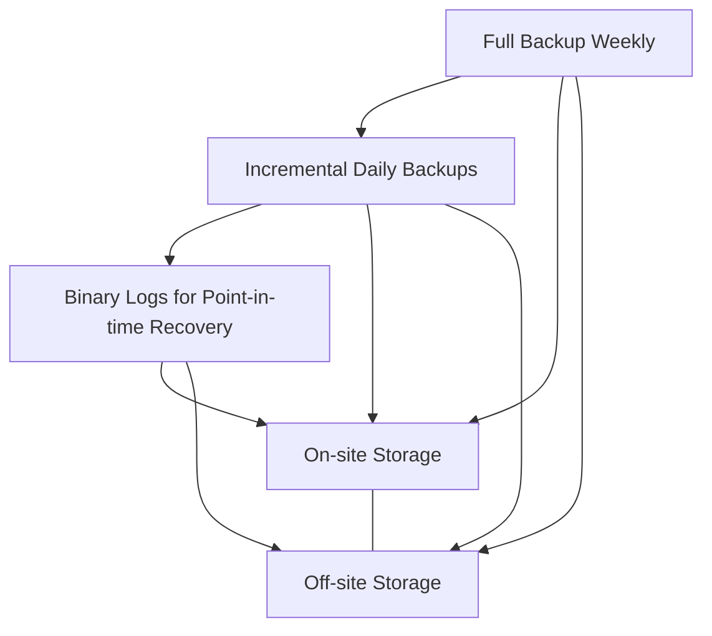
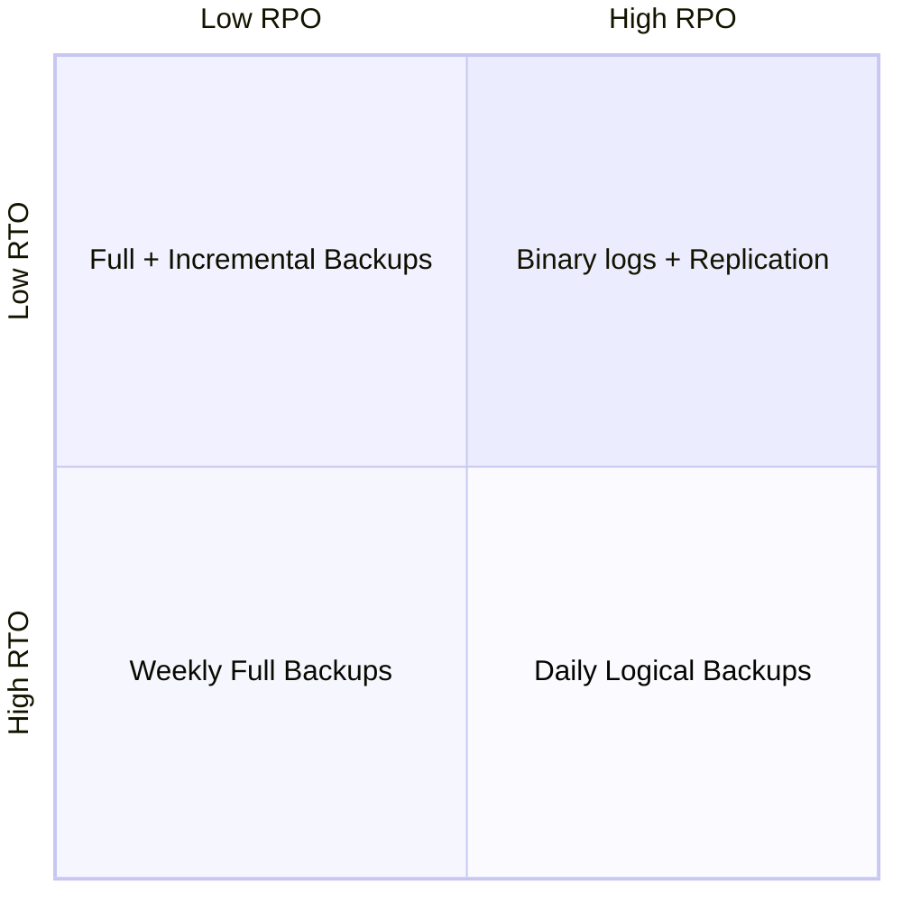

# MySQL Backup Strategies

Data loss can happen for numerous reasons - hardware failures, software bugs, human errors, or even natural disasters. Having a robust backup strategy for your MySQL database is not just good practice; it's essential for business continuity and data integrity.

## Why Database Backups Matter

Imagine spending months building a web application only to lose all your user data because you didn't have proper backups. Or consider explaining to your clients that their information is gone forever due to a server crash. These scenarios highlight why database backups are critical.

A proper backup strategy ensures:

- Protection against data loss
- Business continuity even after failures
- Compliance with data retention policies
- Historical data preservation
- Peace of mind

## Types of MySQL Backups

Before diving into specific tools and commands, let's understand the different types of backups available for MySQL databases:

### 1. Physical vs. Logical Backups

**Physical Backups**:
- Copy the actual database files
- Usually faster for restores of large databases
- Examples: File system snapshots, copying data files

**Logical Backups**:
- Extract database structure and content into SQL statements
- More portable across MySQL versions
- Examples: mysqldump, mysqlpump

### 2. Full vs. Incremental Backups

**Full Backups**:
- Complete copy of all data
- Self-contained and easier to restore
- Requires more storage space

**Incremental Backups**:
- Only copies data that changed since the last backup
- Requires less storage and time to execute
- More complex restoration process

### 3. Hot vs. Cold Backups

**Hot Backups** (Online):
- Taken while the database is running
- Minimal disruption to operations
- Might have consistency challenges without proper tools

**Cold Backups** (Offline):
- Require shutting down the database
- Perfect consistency of backup data
- Service disruption during backup process

## MySQL Backup Tools and Methods

### Method 1: Using mysqldump (Logical Backup)

`mysqldump` is the most common and straightforward backup tool that comes with MySQL. It creates SQL statements that can rebuild your database.

#### Basic mysqldump Command:

```bash
mysqldump -u [username] -p [database_name] > backup_file.sql
```

#### Example with Options:

```bash
mysqldump -u root -p --single-transaction --routines --triggers --events myapp_database > myapp_backup_$(date +%Y%m%d).sql
```

This command:
- Uses the `--single-transaction` flag for consistent backups without locking tables
- Includes stored procedures, triggers, and events
- Names the file with the current date (e.g., myapp_backup_20230601.sql)

#### Restoring from mysqldump:

```bash
mysql -u [username] -p [database_name] < backup_file.sql
```

### Method 2: MySQL Enterprise Backup (Physical Backup)

For production environments, especially with larger databases, MySQL Enterprise Backup (part of MySQL Enterprise Edition) provides robust hot backup capabilities.

```bash
mysqlbackup --user=root --password --backup-dir=/backup/path backup-and-apply-log
```

### Method 3: XtraBackup (Physical Backup)

Percona XtraBackup is a popular open-source tool for making non-blocking backups of MySQL databases.

```bash
xtrabackup --backup --target-dir=/backup/path
```

For preparing the backup to be restored:

```bash
xtrabackup --prepare --target-dir=/backup/path
```

### Method 4: Binary Log Backups

Binary logs record all changes to your database and are critical for point-in-time recovery.

Enable binary logging in your MySQL configuration file (`my.cnf` or `my.ini`):

```ini
[mysqld]
log-bin=mysql-bin
server-id=1
binlog_format=ROW
```

To back up binary logs:

```bash
mysqlbinlog mysql-bin.000001 > binlog_backup.sql
```

## Implementing a Comprehensive Backup Strategy

A robust MySQL backup strategy typically involves multiple layers:



### Sample Backup Plan for a Small to Medium Application

1. **Weekly Full Backup** (Sunday at 2 AM):
   ```bash
   mysqldump -u backup_user -p --all-databases --single-transaction --routines --triggers --events > /backup/weekly/mysql_full_$(date +\%Y\%m\%d).sql
   ```

2. **Daily Incremental Backup** (Weekdays at 2 AM) using binary logs:
   ```bash
   # Flush and copy binary logs
   mysql -u root -p -e "FLUSH BINARY LOGS;"
   cp /var/lib/mysql/mysql-bin.* /backup/daily/
   ```

3. **Hourly Binary Log Backup** (Continuous point-in-time recovery):
   ```bash
   # Script to copy latest binary log
   cp /var/lib/mysql/mysql-bin.* /backup/hourly/
   ```

### Automating Backups with Cron

Create a backup script (e.g., `mysql_backup.sh`):

```bash
#!/bin/bash

BACKUP_DIR="/backup/mysql"
DATE=$(date +%Y%m%d_%H%M%S)
MYSQL_USER="backup_user"
MYSQL_PASSWORD="secure_password"

# Create backup directory if it doesn't exist
mkdir -p $BACKUP_DIR

# Execute the backup
mysqldump -u $MYSQL_USER -p$MYSQL_PASSWORD --all-databases --single-transaction \
  --routines --triggers --events > $BACKUP_DIR/mysql_backup_$DATE.sql

# Compress the backup
gzip $BACKUP_DIR/mysql_backup_$DATE.sql

# Delete backups older than 30 days
find $BACKUP_DIR -name "mysql_backup_*.sql.gz" -type f -mtime +30 -delete
```

Add to crontab to run daily:

```bash
0 2 * * * /path/to/mysql_backup.sh >> /var/log/mysql_backup.log 2>&1
```

## Best Practices for MySQL Backups

1. **Test your backups regularly**: A backup is only good if you can restore from it.

2. **Follow the 3-2-1 rule**:
   - Keep at least 3 copies of your data
   - Store 2 copies on different media types
   - Keep 1 copy off-site

3. **Monitor backup processes**: Set up alerts for failed backups.

4. **Document your backup and restore procedures**: Ensure team members know how to restore data when needed.

5. **Encrypt sensitive backup data**: Protect backups containing sensitive information.

6. **Verify backup integrity**: Use checksums or other verification methods.

7. **Properly size your backup storage**: Account for data growth over time.

## Backup Verification and Testing

Always verify your backups by actually testing the restore process:

```bash
# Create a test database
mysql -u root -p -e "CREATE DATABASE test_restore;"

# Restore backup to test database
mysql -u root -p test_restore < backup_file.sql

# Compare data (you can use tools like mydumper/myloader for this)
# or manually verify key tables
mysql -u root -p -e "SELECT COUNT(*) FROM test_restore.important_table;"
```

## Common Backup Challenges and Solutions

| Challenge | Solution |
|-----------|----------|
| Large database size | Use compression, incremental backups |
| Minimal downtime requirements | Implement hot backups with replication |
| Limited storage space | Implement backup rotation, compression |
| Complex recovery requirements | Document and test recovery procedures |
| Backup performance impact | Schedule during off-peak hours, use replication |

## Recovery Time Objective (RTO) and Recovery Point Objective (RPO)

When designing your backup strategy, consider:

- **RTO**: How quickly you need to recover (e.g., 1 hour, 4 hours)
- **RPO**: How much data you can afford to lose (e.g., 5 minutes, 1 day)

Different backups serve different RPO/RTO needs:



## Summary

A robust MySQL backup strategy is essential for data protection and business continuity. By combining different backup methods—physical, logical, full, and incremental—you can create a comprehensive plan that meets your organization's needs for data safety, recovery time, and storage efficiency.

Remember that the best backup strategy is the one you've tested and verified. Regularly test your restore procedures to ensure they work when you need them most.

## Additional Resources

- [MySQL Documentation: Backup and Recovery](https://dev.mysql.com/doc/refman/8.0/en/backup-and-recovery.html)
- [Percona XtraBackup Documentation](https://www.percona.com/doc/percona-xtrabackup/LATEST/index.html)

## Practice Exercises

1. Set up a weekly full backup and daily incremental backup for a test database.
2. Create a backup verification script that restores to a test database.
3. Design a backup rotation scheme that optimizes storage while maintaining at least 30 days of backups.
4. Configure binary logging and practice point-in-time recovery.
5. Document a disaster recovery plan for your database including step-by-step restore procedures.

By implementing these backup strategies and following best practices, you'll ensure your MySQL databases remain safe and recoverable even in worst-case scenarios.