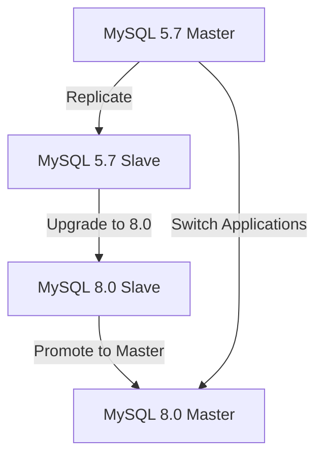

# MySQL Version Upgrades

## Introduction

Upgrading your MySQL database version is a critical maintenance task that every database administrator and developer should understand. Whether you're moving from MySQL 5.7 to 8.0 or any other version change, these upgrades provide access to new features, performance improvements, bug fixes, and security enhancements. However, database upgrades also come with potential risks that require careful planning and execution.

In this guide, we'll explore the best practices for MySQL version upgrades, including planning, testing, executing, and troubleshooting the process. By following these guidelines, you'll be able to perform upgrades with minimal downtime and risk to your data.

## Why Upgrade MySQL?

Before diving into how to upgrade, let's understand why you should consider upgrading:

1. **Security Improvements**: Newer versions patch vulnerabilities and security issues
2. **Performance Enhancements**: Each major version typically offers better performance
3. **New Features**: Access to advanced functionality like window functions, CTEs, or JSON improvements
4. **Bug Fixes**: Resolution of known issues from previous versions
5. **Extended Support**: Older versions eventually reach end-of-life status

## Understanding MySQL Version Numbering

MySQL follows a version numbering scheme that helps you understand the significance of each upgrade:

```
MySQL 8.0.28
  │ │  │
  │ │  └── Patch release (bug fixes)
  │ └──── Minor version (compatible features)
  └────── Major version (potentially breaking changes)
```

- **Major Version (8.x.x)**: May contain breaking changes and require significant planning
- **Minor Version (x.1.x)**: Usually backward compatible but may introduce new features
- **Patch Release (x.x.5)**: Contains bug fixes and security patches with minimal risk

## Pre-Upgrade Planning

### 1. Check Version Compatibility

First, determine your current MySQL version:

```sql
SELECT VERSION();
```

Example Output:
```
+-----------+
| VERSION() |
+-----------+
| 5.7.36    |
+-----------+
```

Then, review the MySQL documentation for the compatibility between your current version and the target version. Pay special attention to:

- Deprecated features or syntax
- Changes in default settings
- Removed functionality
- Data dictionary changes
- Character set or collation changes

### 2. Review System Requirements

Make sure your server meets the requirements for the new MySQL version:

```bash
# Check available RAM
free -h

# Check CPU information
lscpu

# Check disk space
df -h
```

### 3. Check Application Compatibility

Review your application code for:

1. SQL syntax that might be deprecated
2. Database features that changed between versions
3. Connection methods that might need updating
4. Performance assumptions that need revisiting

### 4. Create a Detailed Upgrade Plan

Document a step-by-step plan including:

1. Backup strategy
2. Upgrade method (in-place vs. migration)
3. Downtime window
4. Testing steps
5. Rollback procedure
6. Team responsibilities

## Backup Strategy

### Full Backup

Always create a complete backup before upgrading:

```bash
# Using mysqldump for logical backup
mysqldump --all-databases --single-transaction --routines --triggers --events > full_backup_$(date +%Y%m%d).sql

# Or using physical backup with MySQL Enterprise Backup
mysqlbackup --backup-dir=/backup/mysql --with-timestamp --compress backup-and-apply-log
```

### Binary Log Position

Record the binary log position to enable point-in-time recovery if needed:

```sql
SHOW MASTER STATUS;
```

Example Output:
```
+------------------+----------+--------------+------------------+
| File             | Position | Binlog_Do_DB | Binlog_Ignore_DB |
+------------------+----------+--------------+------------------+
| mysql-bin.000123 |     4567 |              |                  |
+------------------+----------+--------------+------------------+
```

## Upgrade Methods

### 1. In-Place Upgrade

This method upgrades MySQL in its current location, replacing the old version with the new one.

#### Steps for In-Place Upgrade:

1. Stop the MySQL service:

```bash
sudo systemctl stop mysql
```

2. Install the new MySQL version (example for Ubuntu/Debian):

```bash
# Add MySQL APT repository
wget https://dev.mysql.com/get/mysql-apt-config_0.8.22-1_all.deb
sudo dpkg -i mysql-apt-config_0.8.22-1_all.deb

# Update package information
sudo apt update

# Upgrade MySQL
sudo apt install mysql-server
```

3. Start MySQL:

```bash
sudo systemctl start mysql
```

4. Run mysql_upgrade (for versions before 8.0):

```bash
# For MySQL 5.7 and earlier
sudo mysql_upgrade -u root -p

# Note: MySQL 8.0+ performs this step automatically on startup
```

### 2. Migration Upgrade

This involves setting up a new MySQL instance and migrating data from the old one. This method often provides more safety but requires more resources.

#### Steps for Migration Upgrade:

1. Set up a new server with the target MySQL version

2. Import your backup:

```bash
mysql -u root -p < full_backup_20230101.sql
```

3. Apply any binary logs to catch up to the latest transactions:

```bash
mysqlbinlog mysql-bin.000123 --start-position=4567 | mysql -u root -p
```

4. Validate data consistency

5. Switch application connections to the new server

## Testing the Upgrade

### 1. Set Up a Test Environment

Create a test environment that mirrors your production as closely as possible:

```bash
# Clone your database to a test server
mysqldump -h production-host -u root -p --all-databases > prod_dump.sql
mysql -h test-host -u root -p < prod_dump.sql
```

### 2. Test Application Compatibility

Run your application against the test database and check for:

- Errors in logs
- Unexpected behaviors
- Performance issues
- Authentication problems

### 3. Perform SQL Syntax Validation

Use the MySQL shell to test queries, especially those that might be affected by syntax changes:

```sql
-- Check stored procedures, views, and triggers
SHOW PROCEDURE STATUS;
SHOW FUNCTION STATUS;
SHOW TRIGGERS;
SHOW FULL TABLES WHERE table_type = 'VIEW';

-- Then review the actual definitions for any that use deprecated syntax
SHOW CREATE PROCEDURE procedure_name;
SHOW CREATE FUNCTION function_name;
SHOW CREATE TRIGGER trigger_name;
SHOW CREATE VIEW view_name;
```

## Post-Upgrade Steps

### 1. Verify MySQL Service Status

```bash
sudo systemctl status mysql
```

### 2. Check Version

```sql
SELECT VERSION();
```

### 3. Review Error Logs

```bash
sudo tail -f /var/log/mysql/error.log
```

### 4. Verify Data Integrity

Run queries to count records and calculate checksums on important tables:

```sql
-- Count records in key tables
SELECT COUNT(*) FROM important_table;

-- Check table status
CHECK TABLE important_table;
```

### 5. Optimize Tables

After upgrading, it's a good practice to optimize tables:

```sql
OPTIMIZE TABLE table_name;
```

### 6. Update MySQL Configuration

Review and update your `my.cnf` file for the new version, considering:

- New optimization options
- Deprecated parameters
- Changed default values
- Memory allocation settings

## Common Upgrade Challenges

### 1. SQL Mode Changes

Different MySQL versions use different default SQL modes. Check your SQL mode:

```sql
SELECT @@sql_mode;
```

If needed, set a compatible SQL mode in your `my.cnf`:

```
[mysqld]
sql_mode = ONLY_FULL_GROUP_BY,STRICT_TRANS_TABLES,NO_ZERO_IN_DATE,NO_ZERO_DATE,ERROR_FOR_DIVISION_BY_ZERO,NO_ENGINE_SUBSTITUTION
```

### 2. Character Set and Collation

Check your current settings:

```sql
SHOW VARIABLES LIKE 'character\_set\_%';
SHOW VARIABLES LIKE 'collation\_%';
```

In MySQL 8.0, the default character set is utf8mb4 and the default collation is utf8mb4_0900_ai_ci, which might differ from your previous version.

### 3. Authentication Plugin Changes

MySQL 8.0 uses `caching_sha2_password` by default, while 5.7 used `mysql_native_password`. This can affect application connectivity. To revert for a specific user:

```sql
ALTER USER 'username'@'localhost' IDENTIFIED WITH mysql_native_password BY 'password';
```

### 4. Index Changes

Some indexes might work differently in newer versions. Test query performance after upgrading:

```sql
EXPLAIN SELECT * FROM your_table WHERE your_condition;
```

## Real-World Example: Upgrading from MySQL 5.7 to 8.0

Let's walk through a complete example of upgrading a production database from MySQL 5.7 to 8.0.

### Preparation Phase

1. Check for deprecated features:

```bash
# Install MySQL Shell if not available
sudo apt install mysql-shell

# Run the upgrade checker
mysqlsh -- util.checkForServerUpgrade('root@localhost:3306', {password: 'your_password'})
```

Example Output:
```
The following issues were encountered:
- Table 'employees.departments' uses indexes on BLOB columns
- The YEAR(2) data type is deprecated
- Found 3 tables using obsolete AUTO_INCREMENT settings
```

2. Fix issues identified by the checker

3. Create a backup:

```bash
mysqldump --all-databases --single-transaction --routines --triggers --events > mysql57_backup.sql
```

### Upgrade Process

1. Stop MySQL 5.7:

```bash
sudo systemctl stop mysql
```

2. Remove MySQL 5.7 packages but keep data:

```bash
sudo apt remove mysql-server mysql-client mysql-common
```

3. Install MySQL 8.0:

```bash
# Add MySQL APT repository
wget https://dev.mysql.com/get/mysql-apt-config_0.8.22-1_all.deb
sudo dpkg -i mysql-apt-config_0.8.22-1_all.deb

# Update packages
sudo apt update

# Install MySQL 8.0
sudo apt install mysql-server
```

4. Start MySQL and check version:

```bash
sudo systemctl start mysql
mysql -u root -p -e "SELECT VERSION();"
```

### Post-Upgrade Verification

1. Check for errors:

```bash
sudo grep -i error /var/log/mysql/error.log
```

2. Verify key database objects:

```sql
SHOW DATABASES;
USE important_database;
SHOW TABLES;
SELECT COUNT(*) FROM important_table;
```

3. Test your application functionality thoroughly

## Downtime Reduction Strategies

For production systems where downtime must be minimized:

### 1. Replication-Based Upgrade



Steps:
1. Set up a slave of your current master
2. Once replication is in sync, upgrade the slave to MySQL 8.0
3. Verify data integrity on the upgraded slave
4. Briefly stop writes to the master
5. Ensure slave has caught up with all transactions
6. Promote the MySQL 8.0 slave to be the new master
7. Point your applications to the new master

### 2. Parallel Infrastructure

Maintain parallel infrastructure during the upgrade:

1. Set up a new MySQL 8.0 environment
2. Use tools like AWS Database Migration Service, Percona XtraBackup, or custom scripts to migrate data
3. Run both systems in parallel until you're confident in the new one
4. Switch traffic to the new system during a maintenance window

## Summary

Upgrading MySQL versions is a necessary maintenance task that provides access to new features, performance improvements, and security patches. By following a systematic approach—proper planning, thorough testing, careful execution, and comprehensive verification—you can minimize risks and downtime.

Key points to remember:
- Always back up your data before upgrading
- Test the upgrade process in a non-production environment first
- Check for deprecated features and syntax that might need updating
- Consider the authentication changes in newer MySQL versions
- Verify data integrity after the upgrade
- Have a rollback plan ready in case of issues

With careful planning and execution, MySQL version upgrades can be smooth, with minimal impact on your applications and users.

## Additional Resources

- [MySQL Documentation: Upgrading MySQL](https://dev.mysql.com/doc/refman/8.0/en/upgrading.html)
- [MySQL Shell Upgrade Checker Utility](https://dev.mysql.com/doc/mysql-shell/8.0/en/mysql-shell-utilities-upgrade.html)
- [Percona MySQL Upgrade Guide](https://www.percona.com/blog/a-guide-to-upgrading-mysql/)

## Practice Exercises

1. Set up a test environment with MySQL 5.7 and practice upgrading it to MySQL 8.0
2. Create a comprehensive upgrade plan for a fictional e-commerce database
3. Write a shell script that automates the backup and verification steps of a MySQL upgrade
4. Practice using MySQL Shell's upgrade checker utility on a test database
5. Set up a replication-based upgrade scenario with minimal downtime