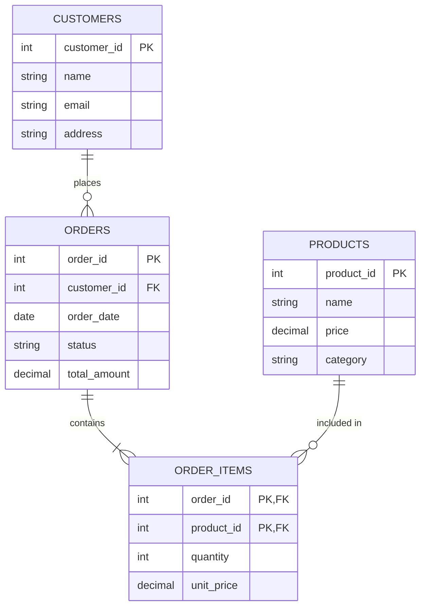

# MySQL Common Pitfalls

Working with MySQL databases can be straightforward when things are going well, but certain common mistakes can lead to performance issues, security vulnerabilities, or even data corruption. This guide will help you identify and avoid these pitfalls, making your MySQL development experience smoother and more efficient.

## Introduction

As a beginner working with MySQL, you're likely to encounter certain challenges that are common among developers. Understanding these pitfalls beforehand can save you hours of debugging and potential data issues. This guide covers the most frequent mistakes in MySQL usage and provides clear solutions to help you write better database code.

## Missing Indexes

### The Problem

One of the most common performance issues in MySQL is querying tables without proper indexes. When your database grows, queries can become significantly slower without appropriate indexing.

### Solution

Always create indexes for columns used in `WHERE`, `JOIN`, or `ORDER BY` clauses in your frequent queries.

#### Example: Before Indexing

```sql
-- Table structure without index
CREATE TABLE customers (
    id INT AUTO_INCREMENT PRIMARY KEY,
    name VARCHAR(100),
    email VARCHAR(100),
    city VARCHAR(50)
);

-- This query will perform a full table scan
EXPLAIN SELECT * FROM customers WHERE city = 'New York';
```

Output:
```
+----+-------------+-----------+------------+------+---------------+------+---------+------+------+----------+-------------+
| id | select_type | table     | partitions | type | possible_keys | key  | key_len | ref  | rows | filtered | Extra       |
+----+-------------+-----------+------------+------+---------------+------+---------+------+------+----------+-------------+
|  1 | SIMPLE      | customers | NULL       | ALL  | NULL          | NULL | NULL    | NULL | 1000 |    10.00 | Using where |
+----+-------------+-----------+------------+------+---------------+------+---------+------+------+----------+-------------+
```

#### Example: After Indexing

```sql
-- Add an index to the city column
CREATE INDEX idx_city ON customers(city);

-- Now the query will use the index
EXPLAIN SELECT * FROM customers WHERE city = 'New York';
```

Output:
```
+----+-------------+-----------+------------+------+---------------+----------+---------+-------+------+----------+-------+
| id | select_type | table     | partitions | type | possible_keys | key      | key_len | ref   | rows | filtered | Extra |
+----+-------------+-----------+------------+------+---------------+----------+---------+-------+------+----------+-------+
|  1 | SIMPLE      | customers | NULL       | ref  | idx_city      | idx_city | 153     | const |   10 |   100.00 | NULL  |
+----+-------------+-----------+------------+------+---------------+----------+---------+-------+------+----------+-------+
```

## SQL Injection Vulnerabilities

### The Problem

Building SQL queries by concatenating user input directly into your SQL string is a severe security risk that can lead to SQL injection attacks.

### Solution

Always use prepared statements or parameterized queries when dealing with user input.

#### Bad Practice (Vulnerable to SQL Injection)

```php
// PHP example with direct string concatenation (DANGEROUS!)
$username = $_POST['username'];
$query = "SELECT * FROM users WHERE username = '$username'";
$result = mysqli_query($connection, $query);
```

If a user inputs `' OR '1'='1`, the query becomes:
```sql
SELECT * FROM users WHERE username = '' OR '1'='1'
```
This would return all users, potentially exposing sensitive data.

#### Good Practice (Using Prepared Statements)

```php
// PHP example with prepared statements
$stmt = $connection->prepare("SELECT * FROM users WHERE username = ?");
$stmt->bind_param("s", $_POST['username']);
$stmt->execute();
$result = $stmt->get_result();
```

## Inefficient Data Types

### The Problem

Using inappropriate data types for columns can waste storage space and reduce query performance.

### Solution

Choose the most appropriate and efficient data type for each column based on the data it will store.

#### Example: Inefficient Data Type Choices

```sql
-- Inefficient: Using VARCHAR for a fixed-length code
CREATE TABLE products (
    id INT AUTO_INCREMENT PRIMARY KEY,
    product_code VARCHAR(10),  -- Always exactly 10 characters
    price FLOAT,               -- Not ideal for currency
    description TEXT           -- For short descriptions, this is overkill
);
```

#### Example: Optimized Data Type Choices

```sql
-- Optimized data types
CREATE TABLE products (
    id INT AUTO_INCREMENT PRIMARY KEY,
    product_code CHAR(10),      -- Fixed length, more efficient than VARCHAR
    price DECIMAL(10,2),        -- Better precision for currency
    description VARCHAR(255)    -- Enough for short descriptions, more efficient than TEXT
);
```

## Not Using Connection Pooling

### The Problem

Opening and closing database connections for each operation is resource-intensive and can severely impact performance.

### Solution

Implement connection pooling to reuse existing connections rather than creating new ones for each operation.

#### Example: Without Connection Pooling (Node.js)

```javascript
// Without connection pooling - inefficient
const mysql = require('mysql');

function getUser(userId) {
    const connection = mysql.createConnection({
        host: 'localhost',
        user: 'user',
        password: 'password',
        database: 'mydb'
    });
    
    connection.connect();
    
    connection.query('SELECT * FROM users WHERE id = ?', [userId], function (error, results) {
        // Process results
        connection.end();
    });
}
```

#### Example: With Connection Pooling (Node.js)

```javascript
// With connection pooling - more efficient
const mysql = require('mysql');

const pool = mysql.createPool({
    host: 'localhost',
    user: 'user',
    password: 'password',
    database: 'mydb',
    connectionLimit: 10
});

function getUser(userId) {
    pool.query('SELECT * FROM users WHERE id = ?', [userId], function (error, results) {
        // Process results
        // No need to close the connection, it returns to the pool
    });
}
```

## Case Sensitivity Issues

### The Problem

MySQL's default behavior regarding case sensitivity can be confusing and varies depending on the operating system, collation settings, and the specific operation.

### Solution

Be explicit about case sensitivity in your schema and queries by specifying the appropriate collation.

```sql
-- Create table with case-sensitive collation
CREATE TABLE users (
    id INT AUTO_INCREMENT PRIMARY KEY,
    username VARCHAR(50) COLLATE utf8mb4_bin,  -- Case-sensitive
    email VARCHAR(100) COLLATE utf8mb4_general_ci  -- Case-insensitive
);

-- Case-sensitive query
SELECT * FROM users WHERE username = 'JohnDoe';  -- Only matches exact case

-- Case-insensitive query
SELECT * FROM users WHERE email = 'john.doe@example.com';  -- Matches any case
```

## Not Using Transactions

### The Problem

When executing multiple related SQL statements, failing to use transactions can leave your database in an inconsistent state if an error occurs partway through.

### Solution

Use transactions for operations that require multiple statements to be executed as an atomic unit.

```sql
-- Start a transaction
START TRANSACTION;

-- Transfer money between accounts
UPDATE accounts SET balance = balance - 100 WHERE id = 1;
UPDATE accounts SET balance = balance + 100 WHERE id = 2;

-- If everything is successful, commit the changes
COMMIT;

-- If an error occurs, you would rollback instead
-- ROLLBACK;
```

## Ignoring Database Normalization

### The Problem

Poorly designed database schemas with denormalized data can lead to data redundancy, inconsistency, and update anomalies.

### Solution

Follow normalization principles appropriate for your application's needs to ensure data integrity and efficiency.

### Example: Unnormalized Table

```sql
CREATE TABLE orders (
    order_id INT PRIMARY KEY,
    customer_name VARCHAR(100),
    customer_email VARCHAR(100),
    customer_address VARCHAR(200),
    product_name VARCHAR(100),
    product_price DECIMAL(10,2),
    product_category VARCHAR(50),
    quantity INT,
    order_date DATE
);
```

The above design has several issues:
- Customer information is repeated for each order
- Product information is repeated for each order
- Changes to customer or product data must be updated in multiple places

### Example: Normalized Schema

```sql
CREATE TABLE customers (
    customer_id INT PRIMARY KEY,
    name VARCHAR(100),
    email VARCHAR(100),
    address VARCHAR(200)
);

CREATE TABLE products (
    product_id INT PRIMARY KEY,
    name VARCHAR(100),
    price DECIMAL(10,2),
    category VARCHAR(50)
);

CREATE TABLE orders (
    order_id INT PRIMARY KEY,
    customer_id INT,
    order_date DATE,
    FOREIGN KEY (customer_id) REFERENCES customers(customer_id)
);

CREATE TABLE order_items (
    order_id INT,
    product_id INT,
    quantity INT,
    PRIMARY KEY (order_id, product_id),
    FOREIGN KEY (order_id) REFERENCES orders(order_id),
    FOREIGN KEY (product_id) REFERENCES products(product_id)
);
```

## Not Using Database Constraints

### The Problem

Failing to define proper constraints like foreign keys, unique constraints, and check constraints can lead to data integrity issues.

### Solution

Use database constraints to enforce data integrity rules at the database level.

```sql
CREATE TABLE orders (
    order_id INT PRIMARY KEY,
    customer_id INT NOT NULL,
    order_date DATE NOT NULL,
    status ENUM('pending', 'processing', 'shipped', 'delivered') NOT NULL,
    total_amount DECIMAL(10,2) CHECK (total_amount >= 0),
    FOREIGN KEY (customer_id) REFERENCES customers(customer_id) ON DELETE RESTRICT
);
```

## Using `SELECT *` in Production Code

### The Problem

Using `SELECT *` retrieves all columns from a table, even when only a few are needed. This increases network traffic, memory usage, and can lead to issues when table structures change.

### Solution

Explicitly specify only the columns you need in your SELECT statements.

#### Bad Practice

```sql
-- Inefficient: Retrieves all columns when we only need a few
SELECT * FROM customers WHERE city = 'Chicago';
```

#### Good Practice

```sql
-- Efficient: Only retrieves the columns we actually need
SELECT customer_id, name, email FROM customers WHERE city = 'Chicago';
```

## Ignoring Performance Monitoring and Optimization

### The Problem

Not monitoring query performance can lead to gradually degrading application performance as data volume increases.

### Solution

Regularly monitor and optimize slow queries using tools like the slow query log, `EXPLAIN`, and performance schema.

```sql
-- Enable the slow query log
SET GLOBAL slow_query_log = 'ON';
SET GLOBAL long_query_time = 1;  -- Log queries that take more than 1 second

-- Analyze a query with EXPLAIN
EXPLAIN SELECT c.name, o.order_date, o.total_amount
FROM customers c
JOIN orders o ON c.customer_id = o.customer_id
WHERE o.order_date > '2023-01-01';
```

## Database Diagrams

Database design visualizations can help illustrate proper table relationships and avoid common pitfalls. Here's an example of how proper normalization looks:



## Summary

Avoiding these common MySQL pitfalls will help you build more robust, efficient, and secure database applications:

1. Always create appropriate indexes for frequently queried columns
2. Use prepared statements to prevent SQL injection
3. Choose efficient data types for your columns
4. Implement connection pooling for better performance
5. Be explicit about case sensitivity with proper collation settings
6. Use transactions for operations that must be atomic
7. Follow normalization principles in your database design
8. Define constraints to enforce data integrity
9. Select only the columns you need rather than using `SELECT *`
10. Regularly monitor and optimize query performance

By being aware of these common issues and following the recommended solutions, you'll avoid many of the headaches that typically plague MySQL beginners.

## Additional Resources

For further learning about MySQL best practices, consider exploring:

- MySQL's official documentation on [optimization](https://dev.mysql.com/doc/refman/8.0/en/optimization.html)
- Books like "High Performance MySQL" by Baron Schwartz
- Online courses on database design and SQL optimization

## Exercises

1. Take an existing query from your project and use `EXPLAIN` to analyze its performance.
2. Review your database schema for missing indexes on columns frequently used in WHERE clauses.
3. Check your application code for instances of SQL injection vulnerabilities and convert them to prepared statements.
4. Identify tables that could benefit from normalization and create a plan to refactor them.
5. Set up the MySQL slow query log on your development server and analyze the results after running your application for a day.