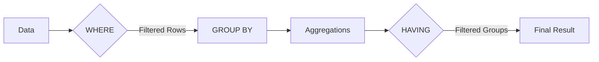

# MySQL HAVING

## Introduction

The `HAVING` clause is an essential component of MySQL queries that allows you to filter the results of grouped data. While the `WHERE` clause filters rows before they are grouped, the `HAVING` clause filters the groups after the `GROUP BY` operation has been performed. This crucial distinction makes `HAVING` particularly valuable when working with aggregate functions like `COUNT()`, `SUM()`, `AVG()`, `MAX()`, and `MIN()`.

In this tutorial, we'll explore how to use the `HAVING` clause effectively, understand its syntax, and look at practical examples to solidify your understanding.

## Basic Syntax

The basic syntax of the `HAVING` clause is:

```sql
SELECT column_name(s), aggregate_function(column_name)
FROM table_name
GROUP BY column_name(s)
HAVING condition;
```

Where:
- `aggregate_function` can be functions like `COUNT()`, `SUM()`, `AVG()`, etc.
- `condition` is the filter that will be applied to the grouped data

## `HAVING` vs `WHERE`: Understanding the Difference

Before diving deeper, it's important to understand the key difference between `HAVING` and `WHERE`:

- **`WHERE`** filters individual rows before they are grouped.
- **`HAVING`** filters groups after the rows have been grouped.

This means:
- You cannot use aggregate functions in a `WHERE` clause
- You should use `HAVING` when you need to filter based on the results of an aggregate function



## Basic Examples

### Example 1: Filtering with Aggregate Functions

Let's say we have a `sales` table with the following structure:

```sql
CREATE TABLE sales (
    id INT AUTO_INCREMENT PRIMARY KEY,
    salesperson_id INT,
    amount DECIMAL(10, 2),
    sale_date DATE
);
```

If we want to find salespeople who have made more than $10,000 in sales:

```sql
SELECT 
    salesperson_id, 
    SUM(amount) as total_sales
FROM 
    sales
GROUP BY 
    salesperson_id
HAVING 
    SUM(amount) > 10000;
```

**Output:**
```
+-----------------+-------------+
| salesperson_id  | total_sales |
+-----------------+-------------+
| 1               | 15000.00    |
| 3               | 12500.75    |
| 7               | 10200.50    |
+-----------------+-------------+
```

### Example 2: Using Both `WHERE` and `HAVING`

We can combine `WHERE` and `HAVING` in the same query. For example, if we want to find salespeople who made more than $5,000 in sales during 2023:

```sql
SELECT 
    salesperson_id, 
    SUM(amount) as total_sales
FROM 
    sales
WHERE 
    YEAR(sale_date) = 2023
GROUP BY 
    salesperson_id
HAVING 
    SUM(amount) > 5000;
```

**Output:**
```
+-----------------+-------------+
| salesperson_id  | total_sales |
+-----------------+-------------+
| 1               | 8500.00     |
| 2               | 6200.25     |
| 5               | 7100.50     |
+-----------------+-------------+
```

## Advanced Examples

### Example 3: Multiple Conditions in HAVING

You can use multiple conditions in a `HAVING` clause with logical operators like `AND` and `OR`.

```sql
SELECT 
    category, 
    COUNT(*) as product_count,
    AVG(price) as avg_price
FROM 
    products
GROUP BY 
    category
HAVING 
    COUNT(*) > 10 AND AVG(price) < 500;
```

This query returns categories that have more than 10 products and an average price less than $500.

### Example 4: Using HAVING with JOIN Operations

`HAVING` can be used with joined tables as well:

```sql
SELECT 
    c.customer_name,
    COUNT(o.order_id) as order_count,
    SUM(o.total_amount) as total_spent
FROM 
    customers c
JOIN 
    orders o ON c.customer_id = o.customer_id
GROUP BY 
    c.customer_id, c.customer_name
HAVING 
    COUNT(o.order_id) >= 3 AND SUM(o.total_amount) > 1000;
```

This query finds customers who have placed at least 3 orders and spent more than $1,000 in total.

## Real-world Applications

### Customer Segmentation

Businesses often need to segment customers based on their purchase behavior:

```sql
SELECT 
    customer_id,
    COUNT(order_id) as order_count,
    SUM(order_amount) as total_spent,
    AVG(order_amount) as avg_order_value
FROM 
    orders
GROUP BY 
    customer_id
HAVING 
    COUNT(order_id) >= 5 AND total_spent > 5000;
```

This query identifies high-value customers who have placed at least 5 orders and spent more than $5,000.

### Product Performance Analysis

To analyze which product categories are underperforming:

```sql
SELECT 
    p.category_name,
    COUNT(s.sale_id) as sale_count,
    SUM(s.quantity) as units_sold,
    SUM(s.quantity * p.price) as revenue
FROM 
    products p
JOIN 
    sales s ON p.product_id = s.product_id
WHERE 
    s.sale_date BETWEEN '2023-01-01' AND '2023-12-31'
GROUP BY 
    p.category_name
HAVING 
    units_sold < 100 OR revenue < 5000;
```

This query identifies product categories that sold fewer than 100 units or generated less than $5,000 in revenue during 2023.

### Identifying Busy Time Periods

For a hotel or restaurant business:

```sql
SELECT 
    DATE_FORMAT(booking_date, '%Y-%m') as month,
    COUNT(*) as booking_count
FROM 
    bookings
GROUP BY 
    DATE_FORMAT(booking_date, '%Y-%m')
HAVING 
    booking_count > (SELECT AVG(booking_count) FROM 
        (SELECT DATE_FORMAT(booking_date, '%Y-%m') as month, COUNT(*) as booking_count 
         FROM bookings 
         GROUP BY month) as avg_bookings);
```

This query identifies months that had above-average booking counts, which could help with resource planning.

## Common Mistakes and Best Practices

### Mistakes to Avoid:

1. **Using aggregate functions in WHERE clause**:
   ```sql
   -- Incorrect
   SELECT product_id, SUM(sales)
   FROM sales
   WHERE SUM(sales) > 1000  -- This will cause an error
   GROUP BY product_id;

   -- Correct
   SELECT product_id, SUM(sales)
   FROM sales
   GROUP BY product_id
   HAVING SUM(sales) > 1000;
   ```

2. **Forgetting to include grouped columns in SELECT**:
   ```sql
   -- Problematic (not standard SQL)
   SELECT SUM(amount)
   FROM sales
   GROUP BY salesperson_id
   HAVING COUNT(*) > 5;

   -- Better practice
   SELECT salesperson_id, SUM(amount)
   FROM sales
   GROUP BY salesperson_id
   HAVING COUNT(*) > 5;
   ```

### Best Practices:

1. **Use WHERE to filter as much data as possible before grouping**:
   ```sql
   SELECT category, COUNT(*)
   FROM products
   WHERE price > 100  -- Filter before grouping for better performance
   GROUP BY category
   HAVING COUNT(*) > 10;
   ```

2. **Use column aliases**:
   ```sql
   SELECT 
       category, 
       COUNT(*) as product_count
   FROM 
       products
   GROUP BY 
       category
   HAVING 
       product_count > 10;  -- Using the alias makes the query more readable
   ```

3. **Always include the columns you're grouping by in your SELECT statement** (for better readability and compliance with SQL standards)

## Summary

The MySQL `HAVING` clause is a powerful tool that allows you to filter grouped data based on aggregate function results. Key points to remember:

- Use `WHERE` to filter individual rows before grouping
- Use `HAVING` to filter groups after the `GROUP BY` operation
- `HAVING` works with aggregate functions like `COUNT()`, `SUM()`, `AVG()`, etc.
- You can combine `HAVING` with other clauses like `WHERE`, `JOIN`, and `ORDER BY`

By mastering the `HAVING` clause, you'll be able to create more sophisticated queries that provide valuable insights from your data.

## Practice Exercises

To solidify your understanding, try the following exercises:

1. Create a query that shows departments that have more than 5 employees and an average salary greater than $50,000.
2. Find customers who placed orders in at least 3 different months and spent more than $1,000 in total.
3. Identify products that have been ordered more than 10 times but have generated less than $500 in revenue.
4. Find suppliers who provide more than 5 different products with an average price below the overall average product price.

## Additional Resources

- [MySQL Official Documentation on GROUP BY and HAVING](https://dev.mysql.com/doc/refman/8.0/en/group-by-modifiers.html)
- [SQL Aggregation Functions](https://dev.mysql.com/doc/refman/8.0/en/aggregate-functions.html)
- [MySQL Query Optimization Tips](https://dev.mysql.com/doc/refman/8.0/en/optimization.html)

By completing this tutorial, you should now have a solid understanding of how to use the MySQL `HAVING` clause to filter grouped data effectively in your queries.