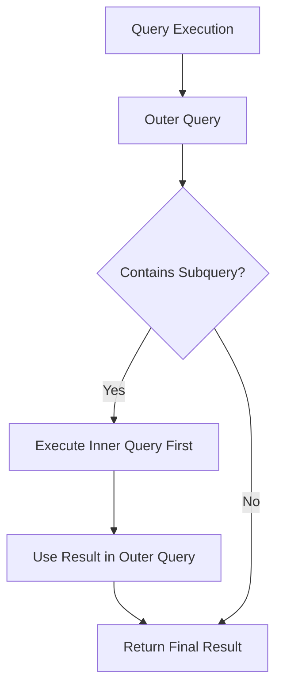

# MySQL Subqueries

## Introduction

Subqueries, also known as nested queries or inner queries, are powerful SQL constructs that allow you to use the results of one query within another query. They enable you to perform complex operations that would otherwise require multiple separate queries or complex joins.

In this tutorial, you'll learn:
- What subqueries are and how they work
- Different types of subqueries in MySQL
- When and how to use subqueries effectively
- Common subquery patterns and best practices

Mastering subqueries will significantly enhance your ability to retrieve and manipulate data in MySQL databases.

## What Are Subqueries?

A subquery is a query nested inside another query. The inner query executes first and produces a result that is then used by the outer query to complete its execution.

Here's the basic structure:

```sql
SELECT column_name(s)
FROM table_name
WHERE column_name OPERATOR (SELECT column_name FROM table_name WHERE condition);
```

The subquery (inner query) is enclosed in parentheses and typically appears on the right side of a comparison operator.

## Types of Subqueries in MySQL

MySQL supports several types of subqueries, each with different characteristics and use cases:

### 1. Scalar Subqueries

A scalar subquery returns a single value (one row, one column) and can be used anywhere a single value is expected.

**Example:**

```sql
SELECT product_name, price
FROM products
WHERE price > (SELECT AVG(price) FROM products);
```

In this example, the subquery `(SELECT AVG(price) FROM products)` returns a single value—the average price of all products. The outer query then returns all products with prices greater than this average.

**Output:**
```
+------------------+--------+
| product_name     | price  |
+------------------+--------+
| Premium Laptop   | 1200.00|
| Gaming Console   | 499.99 |
| DSLR Camera      | 899.50 |
+------------------+--------+
```

### 2. Row Subqueries

A row subquery returns a single row with multiple columns and can be used with row constructors.

**Example:**

```sql
SELECT * 
FROM employees
WHERE (department_id, salary) = 
      (SELECT department_id, MAX(salary) 
       FROM employees 
       WHERE department_id = 3);
```

This query finds employees who have the same department_id and salary as the employee with the highest salary in department 3.

### 3. Column Subqueries

A column subquery returns a single column with multiple rows. These are often used with the IN, ANY, or ALL operators.

**Example:**

```sql
SELECT product_name, category_id
FROM products
WHERE category_id IN (SELECT category_id FROM categories WHERE parent_category = 'Electronics');
```

This query finds all products in categories that belong to the 'Electronics' parent category.

**Output:**
```
+-------------------+-------------+
| product_name      | category_id |
+-------------------+-------------+
| Premium Laptop    | 1           |
| Smartphone        | 1           |
| Wireless Earbuds  | 2           |
| LED TV            | 3           |
+-------------------+-------------+
```

### 4. Table Subqueries

A table subquery returns multiple columns and multiple rows, essentially acting as a derived table.

**Example:**

```sql
SELECT o.order_id, c.customer_name, o.order_date
FROM orders o
JOIN (
    SELECT customer_id, customer_name
    FROM customers
    WHERE country = 'USA'
) c ON o.customer_id = c.customer_id;
```

In this example, the subquery creates a temporary table of USA-based customers that is then joined with the orders table.

## Subquery Locations in SQL Statements

Subqueries can appear in different parts of a SQL statement:

### 1. In the WHERE Clause

```sql
SELECT product_name, unit_price
FROM products
WHERE unit_price > (SELECT AVG(unit_price) FROM products);
```

### 2. In the FROM Clause (Derived Tables)

```sql
SELECT avg_prices.category_id, avg_prices.avg_price, p.product_name
FROM (
    SELECT category_id, AVG(unit_price) as avg_price
    FROM products
    GROUP BY category_id
) avg_prices
JOIN products p ON p.category_id = avg_prices.category_id;
```

### 3. In the SELECT Clause

```sql
SELECT 
    employee_name,
    salary,
    (SELECT AVG(salary) FROM employees) as avg_company_salary,
    salary - (SELECT AVG(salary) FROM employees) as salary_difference
FROM employees;
```

**Output:**
```
+--------------+--------+-------------------+------------------+
| employee_name| salary | avg_company_salary| salary_difference|
+--------------+--------+-------------------+------------------+
| John Smith   | 60000  | 55000             | 5000             |
| Jane Doe     | 70000  | 55000             | 15000            |
| Bob Johnson  | 45000  | 55000             | -10000           |
| Alice Brown  | 55000  | 55000             | 0                |
| Mike Wilson  | 45000  | 55000             | -10000           |
+--------------+--------+-------------------+------------------+
```

### 4. In the HAVING Clause

```sql
SELECT category_id, AVG(unit_price) as avg_price
FROM products
GROUP BY category_id
HAVING AVG(unit_price) > (
    SELECT AVG(unit_price) FROM products
);
```

## Subquery Operators

MySQL offers several operators specifically designed to work with subqueries:

### IN Operator

Checks if a value matches any value in the subquery result.

```sql
SELECT product_name, unit_price
FROM products
WHERE category_id IN (
    SELECT category_id 
    FROM categories 
    WHERE category_name LIKE '%Beverages%'
);
```

### NOT IN Operator

Checks if a value does not match any value in the subquery result.

```sql
SELECT product_name
FROM products
WHERE supplier_id NOT IN (
    SELECT supplier_id
    FROM suppliers
    WHERE country = 'Germany'
);
```

### EXISTS Operator

Checks if the subquery returns any rows.

```sql
SELECT customer_name
FROM customers c
WHERE EXISTS (
    SELECT 1 
    FROM orders o
    WHERE o.customer_id = c.customer_id AND o.order_date >= '2023-01-01'
);
```

This query returns customers who have placed at least one order since January 1, 2023.

### ANY and SOME Operators

Returns TRUE if the comparison is TRUE for ANY of the values in the subquery.

```sql
SELECT product_name, unit_price
FROM products
WHERE unit_price > ANY (
    SELECT unit_price
    FROM products
    WHERE category_id = 2
);
```

This query finds products with a unit price greater than at least one product in category 2.

### ALL Operator

Returns TRUE if the comparison is TRUE for ALL values in the subquery.

```sql
SELECT product_name, unit_price
FROM products
WHERE unit_price > ALL (
    SELECT unit_price
    FROM products
    WHERE category_id = 3
);
```

This query finds products with a unit price greater than all products in category 3.

## Correlated Subqueries

A correlated subquery is a subquery that depends on the outer query for its values. The subquery is executed once for each row processed by the outer query.

**Example:**

```sql
SELECT e1.employee_id, e1.employee_name, e1.salary
FROM employees e1
WHERE e1.salary > (
    SELECT AVG(e2.salary)
    FROM employees e2
    WHERE e2.department_id = e1.department_id
);
```

This query finds employees who earn more than the average salary in their department. Notice how the inner query references a column (`e1.department_id`) from the outer query.

## Practical Examples

### Example 1: Finding Top Customers

Find customers who have placed orders with a total value higher than the average order value:

```sql
SELECT c.customer_id, c.customer_name, SUM(o.total_amount) as total_spent
FROM customers c
JOIN orders o ON c.customer_id = o.customer_id
GROUP BY c.customer_id, c.customer_name
HAVING SUM(o.total_amount) > (
    SELECT AVG(total_amount)
    FROM orders
)
ORDER BY total_spent DESC;
```

### Example 2: Finding Products that Have Never Been Ordered

```sql
SELECT p.product_id, p.product_name
FROM products p
WHERE NOT EXISTS (
    SELECT 1
    FROM order_details od
    WHERE od.product_id = p.product_id
);
```

### Example 3: Finding Departments with Above-Average Salary Expenses

```sql
SELECT d.department_name, SUM(e.salary) as total_salary
FROM departments d
JOIN employees e ON d.department_id = e.department_id
GROUP BY d.department_name
HAVING SUM(e.salary) > (
    SELECT AVG(dept_salary)
    FROM (
        SELECT SUM(salary) as dept_salary
        FROM employees
        GROUP BY department_id
    ) as avg_dept_salaries
);
```

## Best Practices and Performance Considerations

1. **Use EXISTS for checking existence**: When you just need to check if records exist, use EXISTS instead of IN as it's often more efficient.

2. **Avoid subqueries in loops**: Subqueries that run repeatedly inside a loop can severely impact performance.

3. **Consider alternatives**: In many cases, JOINs can be used instead of subqueries and may offer better performance.

4. **Limit the scope**: Keep your subqueries as focused as possible to improve performance.

5. **Index key columns**: Ensure that columns used in the subquery conditions are properly indexed.

6. **Consider query rewrites**: Sometimes rewriting a query with a subquery as a join can improve performance.

7. **Test and compare**: Always test different approaches to see which one performs better with your specific data.



## Summary

Subqueries are powerful tools that enable you to write complex, flexible SQL queries in MySQL. They can be used in various parts of SQL statements, including SELECT, FROM, WHERE, and HAVING clauses.

Key points to remember:
- Subqueries execute inside out—inner queries execute before outer queries
- They can return scalar values, rows, columns, or tables
- Correlated subqueries reference the outer query and run once per outer query row
- Various operators like IN, EXISTS, ANY, and ALL can be used with subqueries
- While powerful, consider performance implications, especially with large datasets

By mastering subqueries, you'll significantly expand your ability to extract meaningful information from your MySQL databases.

## Exercises

1. Write a query to find all products that are more expensive than the average price in their respective categories.

2. Write a query to find customers who have placed more orders than the average number of orders per customer.

3. Write a query using EXISTS to find suppliers who supply at least one product with a unit price greater than $100.

4. Write a query to find employees who earn more than their department manager.

5. Write a query to find categories that have no products.

## Additional Resources

- [MySQL Official Documentation on Subqueries](https://dev.mysql.com/doc/refman/8.0/en/subqueries.html)
- [MySQL Query Optimization for Subqueries](https://dev.mysql.com/doc/refman/8.0/en/subquery-optimization.html)

Happy querying!