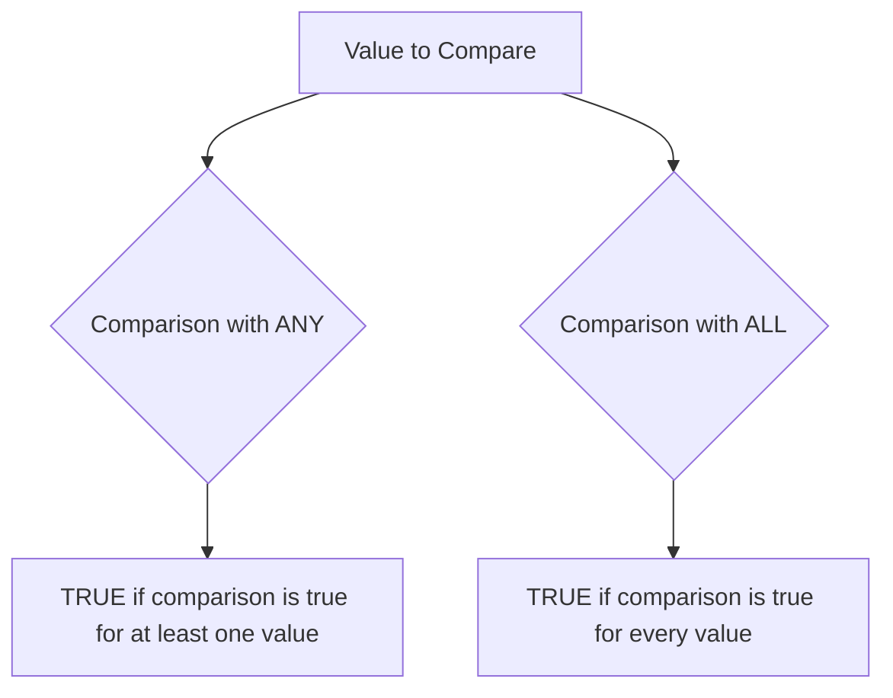

# MySQL ANY and ALL Operators

In MySQL, when working with subqueries, you'll often need to compare values against multiple results returned by a subquery. This is where the `ANY` and `ALL` operators become invaluable tools in your SQL toolkit. These operators allow you to perform comparisons between a value and a range of values produced by a subquery, enabling more complex and powerful query conditions.

## Introduction to ANY and ALL

The `ANY` and `ALL` operators are used in combination with comparison operators (`=`, `<>`, `>`, `>=`, `<`, `<=`) to compare a value with a set of values returned by a subquery.

- **ANY**: Returns TRUE if any of the subquery values meet the condition
- **ALL**: Returns TRUE only if all of the subquery values meet the condition

The `SOME` operator is a synonym for `ANY`, meaning they function identically in MySQL.

## The ANY Operator

The `ANY` operator returns TRUE if the comparison is true for ANY of the values in the subquery result set.

### Syntax

```sql
expression comparison_operator ANY (subquery)
```

### How ANY Works

Consider this scenario: You want to find employees who earn more than at least one employee in the Marketing department.

```sql
SELECT employee_name, salary 
FROM employees 
WHERE salary > ANY (
    SELECT salary 
    FROM employees 
    WHERE department = 'Marketing'
);
```

This query returns employees whose salary is greater than at least one salary in the Marketing department.

### ANY with Different Comparison Operators

The behavior of `ANY` changes depending on the comparison operator used:

1. **`= ANY`**: Equivalent to `IN` operator
2. **`<> ANY`**: TRUE if the value doesn't equal at least one value in the subquery
3. **`> ANY`**: TRUE if the value is greater than at least one value in the subquery
4. **`< ANY`**: TRUE if the value is less than at least one value in the subquery
5. **`>= ANY`** and **`<= ANY`**: Similar logic applies

### Practical Example: Product Pricing

Let's say you have a products table and want to find all products that cost more than at least one product in the 'Electronics' category:

```sql
SELECT product_name, price
FROM products
WHERE price > ANY (
    SELECT price
    FROM products
    WHERE category = 'Electronics'
)
AND category <> 'Electronics';
```

**Output:**
```
+---------------+--------+
| product_name  | price  |
+---------------+--------+
| Leather Sofa  | 1200.00|
| Diamond Ring  | 3500.00|
| Smart Watch   | 450.00 |
+---------------+--------+
```

## The ALL Operator

The `ALL` operator returns TRUE only if the comparison is true for ALL of the values in the subquery result set.

### Syntax

```sql
expression comparison_operator ALL (subquery)
```

### How ALL Works

Let's say you want to find employees who earn more than everyone in the Marketing department:

```sql
SELECT employee_name, salary 
FROM employees 
WHERE salary > ALL (
    SELECT salary 
    FROM employees 
    WHERE department = 'Marketing'
);
```

This query returns employees whose salary exceeds every single salary in the Marketing department.

### ALL with Different Comparison Operators

1. **`= ALL`**: TRUE only if the value equals all values in the subquery (rare in practice)
2. **`<> ALL`**: TRUE if the value differs from all values in the subquery
3. **`> ALL`**: TRUE if the value exceeds all values in the subquery
4. **`< ALL`**: TRUE if the value is less than all values in the subquery
5. **`>= ALL`** and **`<= ALL`**: Similar logic applies

### Practical Example: Top Performers

Find all sales representatives who have made more sales than all junior sales representatives:

```sql
SELECT employee_name, sales_amount
FROM sales_data
WHERE sales_amount > ALL (
    SELECT sales_amount
    FROM sales_data
    WHERE position = 'Junior Sales Representative'
)
AND position = 'Sales Representative';
```

**Output:**
```
+-------------------+-------------+
| employee_name     | sales_amount|
+-------------------+-------------+
| Sarah Johnson     | 85000.00    |
| Michael Robertson | 92500.00    |
| Lisa Chen         | 78500.00    |
+-------------------+-------------+
```

## ANY vs. ALL: Understanding the Differences

To understand the difference between `ANY` and `ALL`, let's visualize how they work with the same comparison operator:



### Example: Numerical Comparison

Consider a subquery that returns these values: [10, 20, 30]

| Expression | Result | Explanation |
|------------|--------|-------------|
| x > ANY(10,20,30) | TRUE if x > 10 | x only needs to be greater than the minimum value |
| x > ALL(10,20,30) | TRUE if x > 30 | x must be greater than the maximum value |
| x < ANY(10,20,30) | TRUE if x < 30 | x only needs to be less than the maximum value |
| x < ALL(10,20,30) | TRUE if x < 10 | x must be less than the minimum value |

## Common Use Cases

### 1. Comparing Against Dynamic Thresholds

Find products that are more expensive than the average price in each category:

```sql
SELECT p1.product_name, p1.category, p1.price
FROM products p1
WHERE p1.price > ALL (
    SELECT AVG(p2.price)
    FROM products p2
    WHERE p2.category = p1.category
    GROUP BY p2.category
);
```

### 2. Finding Exceptional Values

Find orders that are larger than any order placed in December 2023:

```sql
SELECT order_id, customer_name, order_amount
FROM orders
WHERE order_amount > ANY (
    SELECT order_amount
    FROM orders
    WHERE MONTH(order_date) = 12 AND YEAR(order_date) = 2023
);
```

### 3. Finding Non-matching Records

Find products that don't match any product description in the discontinued products table:

```sql
SELECT product_name
FROM current_products
WHERE product_description <> ALL (
    SELECT product_description
    FROM discontinued_products
);
```

## Performance Considerations

When using `ANY` and `ALL` operators:

1. **Indexing**: Ensure that columns used in the subquery conditions are properly indexed
2. **Alternatives**: In some cases, using `MIN`, `MAX`, or `EXISTS` might be more efficient
3. **Query Optimization**: MySQL's optimizer might rewrite your query internally for better performance

For example, instead of `> ALL`, you might use:

```sql
WHERE value > (SELECT MAX(column) FROM table WHERE condition)
```

And instead of `= ANY`, you could use:

```sql
WHERE value IN (SELECT column FROM table WHERE condition)
```

## Common Errors and Troubleshooting

1. **Empty Subquery Results**:
   - `value > ALL()` returns TRUE (since there are no values to be less than or equal to the comparison value)
   - `value > ANY()` returns FALSE (since there are no values to be greater than)

2. **NULL Values**:
   - If the subquery returns NULL values, comparisons against NULL follow MySQL's NULL handling rules
   - Consider using `IS NULL` / `IS NOT NULL` where appropriate

3. **Subquery Returns Multiple Columns**:
   - Ensure your subquery returns only one column for use with ANY/ALL operators

## Summary

The `ANY` and `ALL` operators are powerful tools for comparing values against sets of values returned by subqueries:

- Use `ANY` when you need a condition to be true for at least one value in a result set
- Use `ALL` when you need a condition to be true for every value in a result set
- `= ANY` is equivalent to the `IN` operator
- The behavior varies based on which comparison operator is used
- These operators enhance your ability to write advanced, flexible queries

## Practice Exercises

1. Write a query to find all products with a price higher than the cheapest product in the 'Luxury' category.

2. Find all employees who joined the company before all employees in the 'Finance' department.

3. Find all customers who have placed orders with totals greater than all orders placed on Black Friday.

4. Find all suppliers who supply all the products in a specific category.

5. Find all students who scored higher on at least one test than the average score of 'Advanced' level students.

## Additional Resources

- [MySQL Official Documentation on Subquery Syntax](https://dev.mysql.com/doc/refman/8.0/en/subqueries.html)
- [MySQL Comparison Operators](https://dev.mysql.com/doc/refman/8.0/en/comparison-operators.html)
- For more advanced query techniques, explore Common Table Expressions (CTEs) and window functions, which can sometimes provide alternatives to subqueries.

Happy querying!