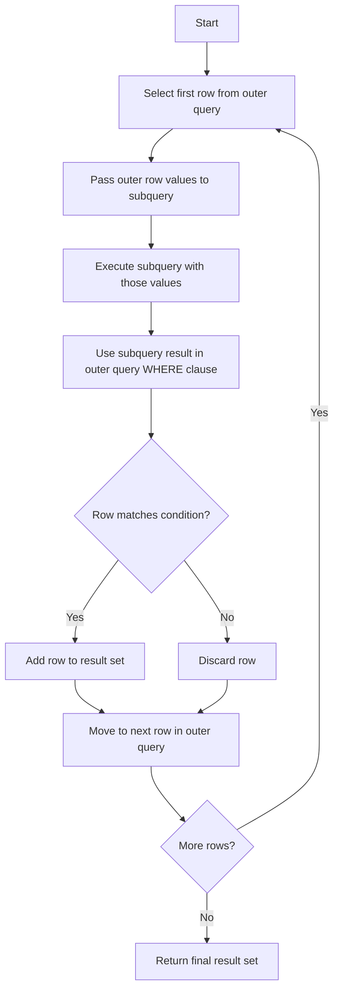

# MySQL Correlated Subqueries

## Introduction

In MySQL, a correlated subquery is a special type of subquery that references columns from the outer query. Unlike regular subqueries that execute once and return results to the outer query, correlated subqueries run once for each row processed by the outer query. This creates a powerful mechanism for complex data manipulation and filtering.

Think of a correlated subquery as a dependent query - one that cannot stand on its own because it needs information from the outer query to execute properly.

## Basic Concept of Correlated Subqueries

A correlated subquery follows this basic pattern:

```sql
SELECT column1, column2, ...
FROM table1 t1
WHERE column1 operator (
    SELECT expression
    FROM table2 t2
    WHERE t2.some_column = t1.other_column
);
```

The key distinction is that the subquery references the outer query's table (typically through table aliases like `t1` and `t2`). This "correlation" between the queries gives this technique its name.

## Why Use Correlated Subqueries?

Correlated subqueries allow you to:

1. Compare values between related tables
2. Find records that meet conditions based on related data
3. Perform row-by-row operations that depend on conditions
4. Solve problems that can't be addressed with simple JOINs or regular subqueries

## Basic Example

Let's start with a simple example. Imagine we have two tables: `employees` and `departments`:

```sql
-- Create sample tables
CREATE TABLE departments (
    department_id INT PRIMARY KEY,
    department_name VARCHAR(100),
    location VARCHAR(100)
);

CREATE TABLE employees (
    employee_id INT PRIMARY KEY,
    first_name VARCHAR(50),
    last_name VARCHAR(50),
    salary DECIMAL(10, 2),
    department_id INT,
    FOREIGN KEY (department_id) REFERENCES departments(department_id)
);

-- Insert sample data
INSERT INTO departments VALUES
(1, 'HR', 'Building A'),
(2, 'IT', 'Building B'),
(3, 'Finance', 'Building A'),
(4, 'Marketing', 'Building C');

INSERT INTO employees VALUES
(101, 'John', 'Doe', 55000, 2),
(102, 'Jane', 'Smith', 60000, 2),
(103, 'Alice', 'Johnson', 65000, 1),
(104, 'Bob', 'Williams', 70000, 3),
(105, 'Charlie', 'Brown', 50000, 3),
(106, 'Diana', 'Miller', 75000, 2),
(107, 'Edward', 'Davis', 62000, 1),
(108, 'Fiona', 'Wilson', 58000, 4);
```

Now, let's say we want to find employees who earn more than the average salary in their department:

```sql
SELECT e.employee_id, e.first_name, e.last_name, e.salary, e.department_id
FROM employees e
WHERE e.salary > (
    SELECT AVG(e2.salary)
    FROM employees e2
    WHERE e2.department_id = e.department_id
);
```

### How This Works:

1. For each row in the outer query (each employee), the subquery executes
2. The subquery calculates the average salary for the current employee's department
3. The outer query compares the employee's salary to this average
4. Only employees with salaries above their department average are returned

### Expected Output:

```
employee_id | first_name | last_name | salary  | department_id
------------|------------|-----------|---------|-------------
102         | Jane       | Smith     | 60000.00| 2
103         | Alice      | Johnson   | 65000.00| 1
104         | Bob        | Williams  | 70000.00| 3
106         | Diana      | Miller    | 75000.00| 2
107         | Edward     | Davis     | 62000.00| 1
```

## How MySQL Processes Correlated Subqueries

To understand correlated subqueries better, let's examine how MySQL processes them:



This execution pattern explains why correlated subqueries can sometimes be slower than other solutions—they execute repeatedly for each row processed by the outer query.

## Practical Examples

### Example 1: Finding Products That Exceed Category Average Price

This example identifies products with prices higher than the average price for their category:

```sql
-- Create sample tables
CREATE TABLE categories (
    category_id INT PRIMARY KEY,
    category_name VARCHAR(100)
);

CREATE TABLE products (
    product_id INT PRIMARY KEY,
    product_name VARCHAR(100),
    price DECIMAL(10, 2),
    category_id INT,
    FOREIGN KEY (category_id) REFERENCES categories(category_id)
);

-- Insert sample data
INSERT INTO categories VALUES
(1, 'Electronics'),
(2, 'Clothing'),
(3, 'Books');

INSERT INTO products VALUES
(1, 'Laptop', 1200, 1),
(2, 'Smartphone', 800, 1),
(3, 'Headphones', 150, 1),
(4, 'T-shirt', 25, 2),
(5, 'Jeans', 45, 2),
(6, 'Jacket', 120, 2),
(7, 'Novel', 15, 3),
(8, 'Textbook', 80, 3),
(9, 'Comic Book', 10, 3);

-- Correlated subquery
SELECT p.product_id, p.product_name, p.price, c.category_name,
    (SELECT AVG(price) FROM products WHERE category_id = p.category_id) AS avg_category_price
FROM products p
JOIN categories c ON p.category_id = c.category_id
WHERE p.price > (
    SELECT AVG(price)
    FROM products p2
    WHERE p2.category_id = p.category_id
)
ORDER BY c.category_name, p.price DESC;
```

### Expected Output:

```
product_id | product_name | price    | category_name | avg_category_price
-----------|--------------|----------|---------------|------------------
1          | Laptop       | 1200.00  | Electronics   | 716.67
2          | Smartphone   | 800.00   | Electronics   | 716.67
6          | Jacket       | 120.00   | Clothing      | 63.33
5          | Jeans        | 45.00    | Clothing      | 63.33
8          | Textbook     | 80.00    | Books         | 35.00
```

### Example 2: Finding Employees Without Orders

In this example, we'll identify employees who haven't processed any orders:

```sql
-- Create sample tables
CREATE TABLE employees_sales (
    employee_id INT PRIMARY KEY,
    employee_name VARCHAR(100),
    department VARCHAR(50)
);

CREATE TABLE orders (
    order_id INT PRIMARY KEY,
    customer_name VARCHAR(100),
    order_date DATE,
    employee_id INT,
    FOREIGN KEY (employee_id) REFERENCES employees_sales(employee_id)
);

-- Insert sample data
INSERT INTO employees_sales VALUES
(1, 'John Smith', 'Sales'),
(2, 'Mary Johnson', 'Sales'),
(3, 'Robert Brown', 'Sales'),
(4, 'Patricia Davis', 'Support');

INSERT INTO orders VALUES
(101, 'Customer A', '2023-01-15', 1),
(102, 'Customer B', '2023-01-20', 2),
(103, 'Customer C', '2023-01-25', 1),
(104, 'Customer D', '2023-02-05', 3);

-- Correlated subquery to find employees without orders
SELECT e.employee_id, e.employee_name, e.department
FROM employees_sales e
WHERE NOT EXISTS (
    SELECT 1
    FROM orders o
    WHERE o.employee_id = e.employee_id
);
```

### Expected Output:

```
employee_id | employee_name  | department
------------|----------------|----------
4           | Patricia Davis | Support
```

In this example, the `NOT EXISTS` operator works with a correlated subquery to find rows in the outer query that have no corresponding rows in the subquery.

### Example 3: Updating Data Using Correlated Subqueries

Correlated subqueries can also be used in UPDATE statements to modify data based on complex conditions:

```sql
-- Create sample tables
CREATE TABLE employees_salaries (
    employee_id INT PRIMARY KEY,
    employee_name VARCHAR(100),
    salary DECIMAL(10, 2),
    performance_rating INT
);

CREATE TABLE performance_bonuses (
    rating INT,
    bonus_percentage DECIMAL(5, 2)
);

-- Insert sample data
INSERT INTO employees_salaries VALUES
(1, 'John', 50000, 3),
(2, 'Jane', 60000, 5),
(3, 'Bob', 55000, 4),
(4, 'Alice', 65000, 2);

INSERT INTO performance_bonuses VALUES
(1, 2.00),
(2, 3.50),
(3, 5.00),
(4, 7.50),
(5, 10.00);

-- Use a correlated subquery to update employee salaries based on their performance rating
UPDATE employees_salaries e
SET salary = salary * (1 + (
    SELECT bonus_percentage / 100
    FROM performance_bonuses pb
    WHERE pb.rating = e.performance_rating
));

-- Check the updated salaries
SELECT * FROM employees_salaries;
```

### Expected Output After Update:

```
employee_id | employee_name | salary    | performance_rating
------------|---------------|-----------|------------------
1           | John          | 52500.00  | 3
2           | Jane          | 66000.00  | 5
3           | Bob           | 59125.00  | 4
4           | Alice         | 67275.00  | 2
```

## EXISTS and NOT EXISTS with Correlated Subqueries

The `EXISTS` and `NOT EXISTS` operators are especially powerful when used with correlated subqueries. They check whether any rows in the subquery satisfy the condition.

### EXISTS Example: Find Departments with At Least One Employee Making More Than $60,000

```sql
SELECT d.department_id, d.department_name
FROM departments d
WHERE EXISTS (
    SELECT 1
    FROM employees e
    WHERE e.department_id = d.department_id
    AND e.salary > 60000
);
```

### Expected Output:

```
department_id | department_name
-------------|---------------
1            | HR
2            | IT
3            | Finance
```

## Common Pitfalls and Optimization Tips

### Potential Issues:

1. **Performance concerns**: Correlated subqueries can be slow since they execute once for each row in the outer query
2. **Logical errors**: It's easy to create incorrect conditions when correlating queries
3. **NULL handling**: Be careful with NULL values when using correlated subqueries

### Optimization Tips:

1. **Use indexes**: Ensure columns referenced in the correlation condition are indexed
2. **Consider alternatives**: Sometimes JOINs, window functions, or non-correlated subqueries can be more efficient
3. **Limit outer query**: If possible, reduce the number of rows processed by the outer query
4. **Test and EXPLAIN**: Use the EXPLAIN statement to analyze query execution plans

```sql
EXPLAIN SELECT e.employee_id, e.first_name, e.salary
FROM employees e
WHERE e.salary > (
    SELECT AVG(e2.salary)
    FROM employees e2
    WHERE e2.department_id = e.department_id
);
```

## When to Use Correlated Subqueries vs. Alternatives

| Scenario | Correlated Subquery | JOIN | Regular Subquery |
|----------|---------------------|------|------------------|
| Filtering based on aggregates within groups | ✓ | ⨯ | ⨯ |
| Exists/not exists checks | ✓ | Possible but complex | ⨯ |
| Comparison with grouped values | ✓ | Possible but complex | ⨯ |
| Simple relation lookups | ⨯ | ✓ | ✓ |
| Performance with large datasets | Slower | Usually faster | Usually faster |

## Summary

Correlated subqueries are a powerful feature in MySQL that allows you to create complex queries by referencing the outer query within a subquery. They are particularly useful for:

- Comparing values between related tables
- Finding records that meet complex conditions
- Performing row-by-row operations based on related data
- Implementing EXISTS and NOT EXISTS logic

While correlated subqueries can sometimes be less efficient than alternatives like JOINs or window functions, they provide elegant solutions to complex problems that would otherwise require multiple queries or complex temporary tables.

## Additional Resources and Exercises

### Exercises

1. Write a correlated subquery to find customers who have placed more orders than the average number of orders placed by all customers.

2. Create a query using a correlated subquery to find products that have never been ordered.

3. Write an UPDATE statement with a correlated subquery to increase the credit limit of customers who have placed more than 5 orders by 10%.

### Further Reading

- MySQL Documentation on [Subqueries](https://dev.mysql.com/doc/refman/8.0/en/subqueries.html)
- Window functions as an alternative to some correlated subqueries
- Query optimization techniques for complex queries

Mastering correlated subqueries takes practice, but they are an invaluable tool in your MySQL toolkit for solving complex data problems elegantly and efficiently.