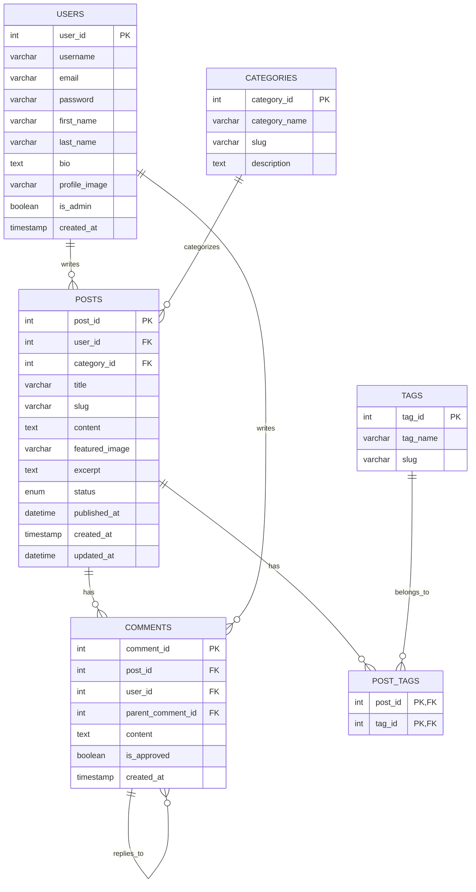

# MySQL CREATE TABLE

## Introduction

In MySQL, tables are fundamental structures that store data in an organized manner. Tables consist of rows and columns, where each column holds a specific type of data, and each row represents a single record. The `CREATE TABLE` statement is one of the essential commands in MySQL, as it allows you to define the structure of your database tables.

In this tutorial, you'll learn how to:
- Create basic and complex tables in MySQL
- Define columns with appropriate data types
- Apply constraints to ensure data integrity
- Work with primary keys, foreign keys, and indexes
- Use advanced table creation options

## Basic Syntax

The basic syntax for creating a table in MySQL is:

```sql
CREATE TABLE table_name (
    column1 datatype constraints,
    column2 datatype constraints,
    column3 datatype constraints,
    ...
    table_constraints
);
```

Let's break down each component:

- `table_name`: The name you want to give your table
- `column1, column2, ...`: Names of the columns in your table
- `datatype`: The type of data the column will store (e.g., INT, VARCHAR, DATE)
- `constraints`: Rules that restrict what data can be stored (e.g., NOT NULL, UNIQUE)
- `table_constraints`: Constraints that apply to the entire table (e.g., PRIMARY KEY, FOREIGN KEY)

## Creating Your First Table

Let's start with a simple example - creating a table to store basic user information:

```sql
CREATE TABLE users (
    id INT AUTO_INCREMENT PRIMARY KEY,
    username VARCHAR(50) NOT NULL UNIQUE,
    email VARCHAR(100) NOT NULL UNIQUE,
    password VARCHAR(255) NOT NULL,
    created_at TIMESTAMP DEFAULT CURRENT_TIMESTAMP
);
```

When you execute this command, MySQL creates a table named `users` with five columns:

- `id`: An integer that automatically increments and serves as the primary key
- `username`: A variable character field that must be unique and cannot be null
- `email`: A variable character field that must be unique and cannot be null
- `password`: A variable character field that cannot be null
- `created_at`: A timestamp that defaults to the current time when a record is created

MySQL will respond with a message like:

```
Query OK, 0 rows affected (0.05 sec)
```

## MySQL Data Types

Choosing the right data type is crucial for efficient database design. Here are the most common data types in MySQL:

### Numeric Types

```sql
CREATE TABLE product (
    id INT AUTO_INCREMENT PRIMARY KEY,
    price DECIMAL(10,2) NOT NULL,
    quantity SMALLINT UNSIGNED NOT NULL,
    rating FLOAT,
    is_available BOOLEAN
);
```

- `INT`: Whole numbers (-2,147,483,648 to 2,147,483,647)
- `DECIMAL(10,2)`: Precise decimal numbers with 10 total digits and 2 decimal places
- `SMALLINT`: Smaller range whole numbers (-32,768 to 32,767)
- `UNSIGNED`: Makes a numeric type only positive
- `FLOAT`: Approximate decimal numbers
- `BOOLEAN`/`BOOL`: True or false values (stored as 0 or 1)

### String Types

```sql
CREATE TABLE content (
    id INT AUTO_INCREMENT PRIMARY KEY,
    title VARCHAR(255) NOT NULL,
    description TEXT,
    code_snippet BLOB,
    tag CHAR(3)
);
```

- `VARCHAR(n)`: Variable-length string up to n characters
- `CHAR(n)`: Fixed-length string of exactly n characters
- `TEXT`: Large variable-length string (up to 65,535 characters)
- `BLOB`: Binary data (for files, images, etc.)

### Date and Time Types

```sql
CREATE TABLE events (
    id INT AUTO_INCREMENT PRIMARY KEY,
    event_name VARCHAR(100) NOT NULL,
    event_date DATE NOT NULL,
    start_time TIME NOT NULL,
    end_time TIME NOT NULL,
    created_at TIMESTAMP DEFAULT CURRENT_TIMESTAMP,
    updated_at DATETIME DEFAULT CURRENT_TIMESTAMP ON UPDATE CURRENT_TIMESTAMP
);
```

- `DATE`: Date values (YYYY-MM-DD)
- `TIME`: Time values (HH:MM:SS)
- `DATETIME`: Combined date and time values (YYYY-MM-DD HH:MM:SS)
- `TIMESTAMP`: Similar to DATETIME but stored as seconds since the Unix epoch

## Column Constraints

Constraints are rules applied to columns to maintain data integrity:

### NOT NULL

Ensures a column cannot have NULL values:

```sql
CREATE TABLE employees (
    id INT AUTO_INCREMENT PRIMARY KEY,
    first_name VARCHAR(50) NOT NULL,
    last_name VARCHAR(50) NOT NULL,
    email VARCHAR(100)
);
```

### UNIQUE

Ensures all values in a column are different:

```sql
CREATE TABLE departments (
    id INT AUTO_INCREMENT PRIMARY KEY,
    dept_code VARCHAR(10) UNIQUE,
    dept_name VARCHAR(100) NOT NULL UNIQUE
);
```

### PRIMARY KEY

Uniquely identifies each record in a table:

```sql
CREATE TABLE products (
    product_id INT AUTO_INCREMENT PRIMARY KEY,
    product_name VARCHAR(100) NOT NULL
);
```

You can also define a composite primary key (multiple columns):

```sql
CREATE TABLE order_items (
    order_id INT,
    product_id INT,
    quantity INT NOT NULL,
    price DECIMAL(10,2) NOT NULL,
    PRIMARY KEY (order_id, product_id)
);
```

### FOREIGN KEY

Creates a link between two tables:

```sql
CREATE TABLE orders (
    order_id INT AUTO_INCREMENT PRIMARY KEY,
    customer_id INT NOT NULL,
    order_date DATETIME NOT NULL,
    FOREIGN KEY (customer_id) REFERENCES customers(customer_id)
);
```

### DEFAULT

Sets a default value for a column:

```sql
CREATE TABLE articles (
    article_id INT AUTO_INCREMENT PRIMARY KEY,
    title VARCHAR(200) NOT NULL,
    content TEXT,
    is_published BOOLEAN DEFAULT FALSE,
    view_count INT DEFAULT 0,
    published_date DATE DEFAULT NULL
);
```

### CHECK

Ensures that values in a column meet a specific condition:

```sql
CREATE TABLE products (
    product_id INT AUTO_INCREMENT PRIMARY KEY,
    product_name VARCHAR(100) NOT NULL,
    price DECIMAL(10,2) CHECK (price > 0),
    stock INT CHECK (stock >= 0)
);
```

*Note: The CHECK constraint was added in MySQL 8.0.16. In earlier versions, the syntax is accepted but ignored.*

## Advanced Table Creation

### Creating a Table with a Foreign Key Constraint

Let's create two related tables - a `customers` table and an `orders` table:

```sql
-- First create the parent table
CREATE TABLE customers (
    customer_id INT AUTO_INCREMENT PRIMARY KEY,
    first_name VARCHAR(50) NOT NULL,
    last_name VARCHAR(50) NOT NULL,
    email VARCHAR(100) NOT NULL UNIQUE,
    phone VARCHAR(15),
    created_at TIMESTAMP DEFAULT CURRENT_TIMESTAMP
);

-- Then create the child table with a foreign key
CREATE TABLE orders (
    order_id INT AUTO_INCREMENT PRIMARY KEY,
    customer_id INT NOT NULL,
    order_date DATETIME NOT NULL DEFAULT CURRENT_TIMESTAMP,
    total_amount DECIMAL(10,2) NOT NULL,
    status ENUM('pending', 'processing', 'shipped', 'delivered', 'cancelled') DEFAULT 'pending',
    FOREIGN KEY (customer_id) REFERENCES customers(customer_id) ON DELETE RESTRICT ON UPDATE CASCADE
);
```

In this example:
- The `orders` table has a foreign key `customer_id` that references the `customer_id` column in the `customers` table
- `ON DELETE RESTRICT` prevents deletion of a customer who has orders
- `ON UPDATE CASCADE` means if a customer's ID changes, the change propagates to the orders table

### Creating a Table with an Index

Indexes improve query performance:

```sql
CREATE TABLE products (
    product_id INT AUTO_INCREMENT PRIMARY KEY,
    product_name VARCHAR(100) NOT NULL,
    category VARCHAR(50) NOT NULL,
    price DECIMAL(10,2) NOT NULL,
    created_at TIMESTAMP DEFAULT CURRENT_TIMESTAMP,
    INDEX idx_category (category),
    INDEX idx_price (price)
);
```

This creates indexes on the `category` and `price` columns to speed up queries filtering or sorting by these columns.

### Creating a Table Based on Another Table

You can create a new table using the structure and data from an existing table:

```sql
-- Create a table with the same structure
CREATE TABLE products_backup LIKE products;

-- Create a table with structure and copy data
CREATE TABLE archived_products AS SELECT * FROM products WHERE created_at < '2023-01-01';
```

### Temporary Tables

Temporary tables exist only for the duration of a session:

```sql
CREATE TEMPORARY TABLE temp_calculations (
    calculation_id INT AUTO_INCREMENT PRIMARY KEY,
    result DECIMAL(10,2) NOT NULL,
    calculation_date TIMESTAMP DEFAULT CURRENT_TIMESTAMP
);
```

## Real-World Examples

### Example 1: E-commerce Database Tables

Let's create a simplified e-commerce database structure:

```sql
-- Create categories table
CREATE TABLE categories (
    category_id INT AUTO_INCREMENT PRIMARY KEY,
    category_name VARCHAR(50) NOT NULL UNIQUE,
    description TEXT
);

-- Create products table
CREATE TABLE products (
    product_id INT AUTO_INCREMENT PRIMARY KEY,
    category_id INT NOT NULL,
    product_name VARCHAR(100) NOT NULL,
    description TEXT,
    price DECIMAL(10,2) NOT NULL,
    stock INT NOT NULL DEFAULT 0,
    is_active BOOLEAN DEFAULT TRUE,
    created_at TIMESTAMP DEFAULT CURRENT_TIMESTAMP,
    FOREIGN KEY (category_id) REFERENCES categories(category_id)
);

-- Create customers table
CREATE TABLE customers (
    customer_id INT AUTO_INCREMENT PRIMARY KEY,
    first_name VARCHAR(50) NOT NULL,
    last_name VARCHAR(50) NOT NULL,
    email VARCHAR(100) NOT NULL UNIQUE,
    password VARCHAR(255) NOT NULL,
    address TEXT,
    city VARCHAR(50),
    postal_code VARCHAR(20),
    country VARCHAR(50),
    phone VARCHAR(20),
    created_at TIMESTAMP DEFAULT CURRENT_TIMESTAMP
);

-- Create orders table
CREATE TABLE orders (
    order_id INT AUTO_INCREMENT PRIMARY KEY,
    customer_id INT NOT NULL,
    order_date DATETIME DEFAULT CURRENT_TIMESTAMP,
    total_amount DECIMAL(10,2) NOT NULL,
    status ENUM('pending', 'processing', 'shipped', 'delivered', 'cancelled') DEFAULT 'pending',
    shipping_address TEXT NOT NULL,
    payment_method VARCHAR(50) NOT NULL,
    FOREIGN KEY (customer_id) REFERENCES customers(customer_id)
);

-- Create order_items table
CREATE TABLE order_items (
    order_id INT,
    product_id INT,
    quantity INT NOT NULL,
    unit_price DECIMAL(10,2) NOT NULL,
    PRIMARY KEY (order_id, product_id),
    FOREIGN KEY (order_id) REFERENCES orders(order_id),
    FOREIGN KEY (product_id) REFERENCES products(product_id)
);
```

This example demonstrates a relational database design for an e-commerce platform with tables for products, categories, customers, orders, and order items.

### Example 2: Blog Database Structure

Let's create a database structure for a simple blogging platform:

```sql
-- Create users table
CREATE TABLE users (
    user_id INT AUTO_INCREMENT PRIMARY KEY,
    username VARCHAR(50) NOT NULL UNIQUE,
    email VARCHAR(100) NOT NULL UNIQUE,
    password VARCHAR(255) NOT NULL,
    first_name VARCHAR(50),
    last_name VARCHAR(50),
    bio TEXT,
    profile_image VARCHAR(255),
    is_admin BOOLEAN DEFAULT FALSE,
    created_at TIMESTAMP DEFAULT CURRENT_TIMESTAMP
);

-- Create categories table
CREATE TABLE categories (
    category_id INT AUTO_INCREMENT PRIMARY KEY,
    category_name VARCHAR(50) NOT NULL UNIQUE,
    slug VARCHAR(50) NOT NULL UNIQUE,
    description TEXT
);

-- Create posts table
CREATE TABLE posts (
    post_id INT AUTO_INCREMENT PRIMARY KEY,
    user_id INT NOT NULL,
    category_id INT NOT NULL,
    title VARCHAR(200) NOT NULL,
    slug VARCHAR(200) NOT NULL UNIQUE,
    content TEXT NOT NULL,
    featured_image VARCHAR(255),
    excerpt TEXT,
    status ENUM('draft', 'published', 'archived') DEFAULT 'draft',
    published_at DATETIME,
    created_at TIMESTAMP DEFAULT CURRENT_TIMESTAMP,
    updated_at DATETIME DEFAULT CURRENT_TIMESTAMP ON UPDATE CURRENT_TIMESTAMP,
    FOREIGN KEY (user_id) REFERENCES users(user_id),
    FOREIGN KEY (category_id) REFERENCES categories(category_id)
);

-- Create comments table
CREATE TABLE comments (
    comment_id INT AUTO_INCREMENT PRIMARY KEY,
    post_id INT NOT NULL,
    user_id INT NOT NULL,
    parent_comment_id INT,
    content TEXT NOT NULL,
    is_approved BOOLEAN DEFAULT FALSE,
    created_at TIMESTAMP DEFAULT CURRENT_TIMESTAMP,
    FOREIGN KEY (post_id) REFERENCES posts(post_id) ON DELETE CASCADE,
    FOREIGN KEY (user_id) REFERENCES users(user_id),
    FOREIGN KEY (parent_comment_id) REFERENCES comments(comment_id) ON DELETE CASCADE
);

-- Create tags table
CREATE TABLE tags (
    tag_id INT AUTO_INCREMENT PRIMARY KEY,
    tag_name VARCHAR(50) NOT NULL UNIQUE,
    slug VARCHAR(50) NOT NULL UNIQUE
);

-- Create post_tags table (many-to-many relationship)
CREATE TABLE post_tags (
    post_id INT,
    tag_id INT,
    PRIMARY KEY (post_id, tag_id),
    FOREIGN KEY (post_id) REFERENCES posts(post_id) ON DELETE CASCADE,
    FOREIGN KEY (tag_id) REFERENCES tags(tag_id) ON DELETE CASCADE
);
```

This example shows how to create a blog database with users, posts, categories, comments, and tags, including many-to-many relationships.

## Database Schema Diagram

Let's visualize the blog database structure:



## Best Practices

1. **Use Appropriate Data Types**: Choose the most efficient data type that accommodates your data requirements. For example, use `TINYINT` for small integers or `VARCHAR` instead of `CHAR` for variable-length strings.

2. **Be Consistent with Naming**: Use consistent naming conventions for tables and columns. Common approaches include:
   - `snake_case` (e.g., `user_id`, `order_items`)
   - `camelCase` (e.g., `userId`, `orderItems`)

3. **Always Define Primary Keys**: Every table should have a primary key for uniquely identifying records.

4. **Consider Adding Indexes**: Add indexes to columns frequently used in `WHERE`, `JOIN`, and `ORDER BY` clauses, but don't overuse them as they slow down write operations.

5. **Use Foreign Keys**: Implement foreign key constraints to maintain referential integrity between related tables.

6. **Include Timestamp Columns**: Add `created_at` and `updated_at` columns to track when records are created and modified.

7. **Plan for Growth**: Consider how your tables might grow and evolve over time. Choose data types that allow for future expansion.

8. **Document Your Schema**: Add comments to your CREATE TABLE statements to explain the purpose of tables and columns:

```sql
CREATE TABLE orders (
    order_id INT AUTO_INCREMENT PRIMARY KEY COMMENT 'Unique identifier for each order',
    customer_id INT NOT NULL COMMENT 'References customers table',
    total_amount DECIMAL(10,2) NOT NULL COMMENT 'Total order amount including taxes'
    -- other columns
);
```

## Common Errors and Solutions

### Error: Duplicate column name

```
ERROR 1060 (42S21): Duplicate column name 'id'
```

**Solution**: Ensure each column name is unique within the table.

### Error: Specified key was too long

```
ERROR 1071 (42000): Specified key was too long; max key length is 3072 bytes
```

**Solution**: Reduce the size of indexed varchar columns or use a prefix index.

### Error: Cannot add foreign key constraint

```
ERROR 1215 (HY000): Cannot add foreign key constraint
```

**Solutions**: 
- Ensure the referenced column is a primary key or has a unique index
- Make sure both columns have the same data type and size
- Check that the referenced table exists

### Error: Table already exists

```
ERROR 1050 (42S01): Table 'tablename' already exists
```

**Solution**: Use `CREATE TABLE IF NOT EXISTS` or drop the table first.

## Summary

The `CREATE TABLE` statement is fundamental to MySQL database design. In this tutorial, you've learned:

- The basic syntax for creating tables in MySQL
- How to choose appropriate data types for your columns
- How to apply constraints like NOT NULL, UNIQUE, and PRIMARY KEY
- How to create relationships between tables using FOREIGN KEY constraints
- How to implement indexes for better query performance
- Best practices for database table design

By mastering these concepts, you can create well-structured databases that efficiently store and manage your application's data.

## Exercises

1. Create a `students` table with columns for student_id, first_name, last_name, email, date_of_birth, and enrollment_date.

2. Create a `courses` table and a `student_courses` junction table to model a many-to-many relationship between students and courses.

3. Create a `employees` table with a self-referencing foreign key to represent a management hierarchy.

4. Create a `library` database with tables for books, authors, members, and loans.

5. Add appropriate indexes to the tables you created in the previous exercises.

## Additional Resources

- [MySQL Documentation - CREATE TABLE Statement](https://dev.mysql.com/doc/refman/8.0/en/create-table.html)
- [MySQL Data Types](https://dev.mysql.com/doc/refman/8.0/en/data-types.html)
- [MySQL Constraints](https://dev.mysql.com/doc/refman/8.0/en/constraints.html)
- [MySQL Indexing Best Practices](https://dev.mysql.com/doc/refman/8.0/en/optimization-indexes.html)