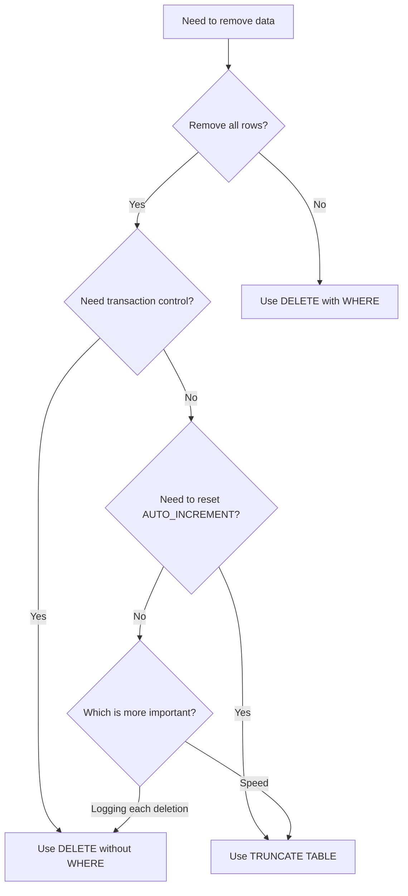

# MySQL TRUNCATE TABLE

Managing data in databases often requires not just adding information, but sometimes completely removing all data from tables while keeping the table structure intact. MySQL's `TRUNCATE TABLE` statement provides an efficient way to accomplish this task.

## Introduction to TRUNCATE TABLE

`TRUNCATE TABLE` is a DDL (Data Definition Language) statement that quickly removes all rows from a table without logging individual row deletions. This statement resets a table to its initial state after creation, while preserving the table structure, columns, constraints, indexes, and other properties.

The basic syntax is straightforward:

```sql
TRUNCATE TABLE table_name;
```

## How TRUNCATE TABLE Works

When you execute a `TRUNCATE TABLE` statement, MySQL performs the following operations:

1. Removes all rows from the table
2. Resets any AUTO_INCREMENT counter to its starting value (typically 1)
3. Deallocates the data pages used by the table
4. Creates new, empty data pages

This process is much faster than deleting rows one by one, especially for large tables.

## TRUNCATE TABLE vs. DELETE Statement

While both `TRUNCATE TABLE` and `DELETE` remove data from tables, they have significant differences:

| Feature | TRUNCATE TABLE | DELETE |
| --- | --- | --- |
| **Speed** | Very fast (drops and recreates the table) | Slower (removes rows one by one) |
| **Transaction Logs** | Minimal logging | Each row deletion is logged |
| **WHERE Clause** | Not supported | Supported |
| **AUTO_INCREMENT** | Reset to initial value | Counter preserved |
| **Triggers** | Doesn't activate triggers | Activates DELETE triggers |
| **Transaction Control** | Cannot be rolled back in most cases | Can be rolled back |
| **Statement Type** | DDL (Data Definition Language) | DML (Data Manipulation Language) |

## Basic TRUNCATE TABLE Examples

### Example 1: Simple Truncation

Let's create a sample table and then truncate it:

```sql
-- Create a products table
CREATE TABLE products (
    product_id INT AUTO_INCREMENT PRIMARY KEY,
    product_name VARCHAR(100) NOT NULL,
    price DECIMAL(10, 2),
    stock_quantity INT
);

-- Insert some sample data
INSERT INTO products (product_name, price, stock_quantity) 
VALUES 
('Laptop', 999.99, 25),
('Smartphone', 699.99, 50),
('Headphones', 149.99, 100),
('Tablet', 399.99, 30);

-- Check the records
SELECT * FROM products;
```

Output:
```
+------------+-------------+--------+----------------+
| product_id | product_name | price  | stock_quantity |
+------------+-------------+--------+----------------+
| 1          | Laptop      | 999.99 | 25             |
| 2          | Smartphone  | 699.99 | 50             |
| 3          | Headphones  | 149.99 | 100            |
| 4          | Tablet      | 399.99 | 30             |
+------------+-------------+--------+----------------+
```

Now, let's truncate the table:

```sql
-- Truncate the products table
TRUNCATE TABLE products;

-- Check the records again
SELECT * FROM products;
```

Output:
```
Empty set (0.00 sec)
```

### Example 2: AUTO_INCREMENT Reset

Demonstrating how `TRUNCATE TABLE` resets the AUTO_INCREMENT counter:

```sql
-- Insert a new record after truncation
INSERT INTO products (product_name, price, stock_quantity) 
VALUES ('Monitor', 299.99, 20);

-- Check what product_id was assigned
SELECT * FROM products;
```

Output:
```
+------------+-------------+--------+----------------+
| product_id | product_name | price  | stock_quantity |
+------------+-------------+--------+----------------+
| 1          | Monitor     | 299.99 | 20             |
+------------+-------------+--------+----------------+
```

Notice that the AUTO_INCREMENT value was reset to 1 after the truncate operation.

## Practical Applications

### Scenario 1: Resetting Test Data

When developing applications, you often need to reset test data:

```sql
-- Test scenario preparation
TRUNCATE TABLE user_test_data;
TRUNCATE TABLE order_test_data;

-- Insert fresh test data
INSERT INTO user_test_data (username, email) VALUES 
('testuser1', 'test1@example.com'),
('testuser2', 'test2@example.com');

-- Run tests with clean data...
```

### Scenario 2: Monthly Data Cleanup

For logging or temporary data storage that needs regular cleanup:

```sql
-- Procedure to reset monthly statistics
DELIMITER //
CREATE PROCEDURE reset_monthly_stats()
BEGIN
    -- Save summary data if needed
    INSERT INTO stats_archive (month, year, visitor_count)
    SELECT MONTH(NOW()), YEAR(NOW()), COUNT(*) FROM visitor_logs;
    
    -- Then truncate the logs
    TRUNCATE TABLE visitor_logs;
    
    -- Output message
    SELECT 'Monthly visitor logs have been archived and reset' AS message;
END //
DELIMITER ;

-- Call the procedure at the beginning of each month
CALL reset_monthly_stats();
```

### Scenario 3: Truncating Multiple Tables

When you need to reset related tables while maintaining referential integrity:

```sql
-- First disable foreign key checks
SET FOREIGN_KEY_CHECKS = 0;

-- Truncate multiple related tables
TRUNCATE TABLE order_details;
TRUNCATE TABLE orders;
TRUNCATE TABLE customer_cart;

-- Re-enable foreign key checks
SET FOREIGN_KEY_CHECKS = 1;
```

## Important Considerations and Limitations

### 1. Foreign Key Constraints

By default, MySQL prevents truncating tables that have foreign key relationships to protect data integrity. You have options:

- Temporarily disable foreign key checks as shown above
- Truncate tables in the correct order (child tables first, then parent tables)
- Use `ON DELETE CASCADE` in your table design if appropriate

### 2. Permissions Required

`TRUNCATE TABLE` requires the `DROP` privilege on the table, unlike `DELETE` which only requires the `DELETE` privilege.

### 3. Storage Engine Implications

- InnoDB: `TRUNCATE TABLE` is transaction-safe under certain conditions
- MyISAM: Always drops and recreates the table

### 4. Transaction Behavior

For InnoDB tables, `TRUNCATE TABLE` is generally not transaction-safe and commits immediately, even within an active transaction. This means:

```sql
START TRANSACTION;

-- This will execute immediately and cannot be rolled back
TRUNCATE TABLE sample_table;

-- Even if you issue ROLLBACK, the table remains truncated
ROLLBACK;
```

## Best Practices

1. **Backup before truncating**: Always back up your data before performing `TRUNCATE TABLE` operations.

2. **Use in development environments**: Exercise extreme caution when using in production environments.

3. **Consider alternatives for partial data removal**: If you need to remove only some rows, use `DELETE WITH WHERE` instead.

4. **Check for dependencies**: Be aware of any triggers, foreign keys, or application dependencies before truncating.

5. **Verify privileges**: Ensure your database user has the proper permissions.

## Flowchart: Decision Making for Data Removal



## Summary

`TRUNCATE TABLE` is a powerful MySQL statement that offers a high-performance way to remove all data from a table while preserving the table structure. It's significantly faster than `DELETE` for complete data removal, but comes with important differences regarding transaction control, trigger activation, and AUTO_INCREMENT behavior.

Understanding when to use `TRUNCATE TABLE` versus `DELETE` is crucial for efficient database operations. Generally, use `TRUNCATE TABLE` when you need to completely reset a table quickly, and use `DELETE` when you need transaction control or need to remove specific rows based on conditions.

## Additional Resources and Exercises

### Exercises

1. Create a table called `practice_truncate` with at least 3 columns including an AUTO_INCREMENT primary key. Insert 5 rows, verify the data, truncate the table, and insert 1 new row to verify the AUTO_INCREMENT reset.

2. Create two related tables with a foreign key constraint. Try to truncate the parent table and observe the error. Then truncate both tables in the correct order.

3. Compare the execution time of `TRUNCATE TABLE` versus `DELETE FROM table` on a large table (you can create one with thousands of rows using a loop in a stored procedure).

4. Write a stored procedure that safely truncates a set of related tables by first disabling foreign key checks and then re-enabling them.