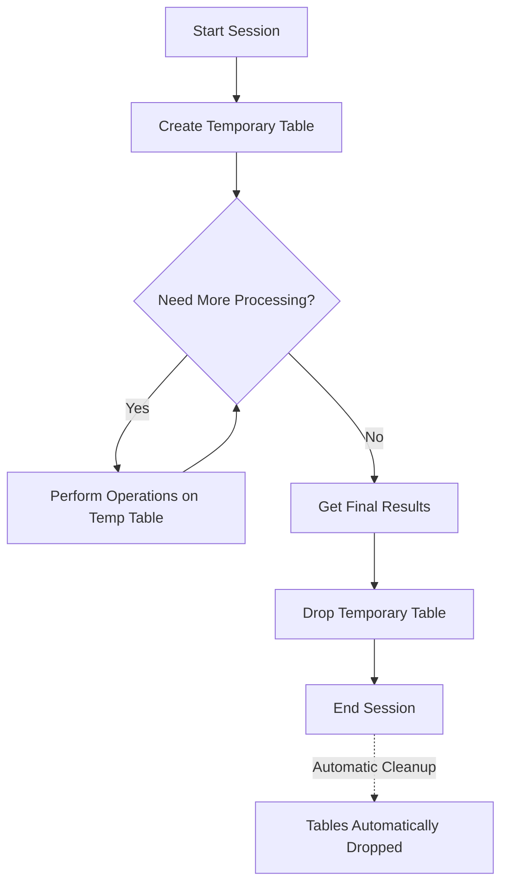

# MySQL Temporary Tables

## Introduction

Temporary tables in MySQL are special tables that allow you to store data temporarily during a session. They are particularly useful when you need to manipulate complex sets of data and store intermediate results. Unlike regular tables, temporary tables are automatically dropped (deleted) when the session ends or when you explicitly drop them, making them perfect for operations where you need provisional storage without cluttering your database.

In this tutorial, you'll learn:
- What temporary tables are and why they're useful
- How to create and manage temporary tables
- Best practices and common use cases
- Performance considerations when working with temporary tables

## Understanding Temporary Tables

### What Are Temporary Tables?

Temporary tables exist only during the current session and are visible only to the connection that created them. Once the session ends or the connection is closed, MySQL automatically removes these tables.

Key characteristics of temporary tables include:

- They're session-specific (only visible to the connection that created them)
- They have the same functionality as regular tables
- They can have indexes, foreign keys, and other table attributes
- They're automatically dropped when the session ends
- They can share the same name as permanent tables without causing conflicts

### Why Use Temporary Tables?

Temporary tables are particularly useful when:

1. You need to store intermediate results from complex queries
2. You're performing multiple operations on the same dataset
3. You want to break down a complex query into simpler steps
4. You need to join data that isn't easily joinable in a single query
5. You're performing operations that require multiple stages of data transformation

## Creating Temporary Tables

### Basic Syntax

To create a temporary table, you simply add the `TEMPORARY` keyword to your `CREATE TABLE` statement:

```sql
CREATE TEMPORARY TABLE table_name (
    column1 datatype,
    column2 datatype,
    ...
);
```

### Example: Creating a Simple Temporary Table

Let's create a temporary table to store employee performance data:

```sql
CREATE TEMPORARY TABLE employee_performance (
    emp_id INT,
    name VARCHAR(100),
    performance_score DECIMAL(3,1),
    review_date DATE
);

-- Insert some data
INSERT INTO employee_performance VALUES
(101, 'John Doe', 8.5, '2023-05-15'),
(102, 'Jane Smith', 9.2, '2023-05-16'),
(103, 'Mike Johnson', 7.8, '2023-05-17');

-- View the data
SELECT * FROM employee_performance;
```

Output:
```
+--------+--------------+------------------+-------------+
| emp_id | name         | performance_score| review_date |
+--------+--------------+------------------+-------------+
| 101    | John Doe     | 8.5              | 2023-05-15  |
| 102    | Jane Smith   | 9.2              | 2023-05-16  |
| 103    | Mike Johnson | 7.8              | 2023-05-17  |
+--------+--------------+------------------+-------------+
```

### Creating a Temporary Table from SELECT Results

A common use case is to create a temporary table from the results of a SELECT query:

```sql
CREATE TEMPORARY TABLE high_performers
SELECT emp_id, name, performance_score 
FROM employee_performance 
WHERE performance_score > 8.0;

-- View the new temporary table
SELECT * FROM high_performers;
```

Output:
```
+--------+------------+------------------+
| emp_id | name       | performance_score|
+--------+------------+------------------+
| 101    | John Doe   | 8.5              |
| 102    | Jane Smith | 9.2              |
+--------+------------+------------------+
```

## Working with Temporary Tables

### Modifying Temporary Tables

You can modify temporary tables just like regular tables:

```sql
-- Add a new column
ALTER TABLE employee_performance 
ADD COLUMN department VARCHAR(50);

-- Update records
UPDATE employee_performance 
SET department = 'Engineering' 
WHERE emp_id IN (101, 103);

UPDATE employee_performance 
SET department = 'Marketing' 
WHERE emp_id = 102;

-- View updated table
SELECT * FROM employee_performance;
```

Output:
```
+--------+--------------+------------------+-------------+-------------+
| emp_id | name         | performance_score| review_date | department  |
+--------+--------------+------------------+-------------+-------------+
| 101    | John Doe     | 8.5              | 2023-05-15  | Engineering |
| 102    | Jane Smith   | 9.2              | 2023-05-16  | Marketing   |
| 103    | Mike Johnson | 7.8              | 2023-05-17  | Engineering |
+--------+--------------+------------------+-------------+-------------+
```

### Explicitly Dropping Temporary Tables

Although temporary tables are automatically dropped when the session ends, you can explicitly drop them when they are no longer needed:

```sql
DROP TEMPORARY TABLE high_performers;
```

## Practical Use Cases

### Use Case 1: Multi-step Data Analysis

When analyzing data that requires multiple transformations, temporary tables can make your code more readable and efficient:

```sql
-- Create a sample sales table
CREATE TABLE sales (
    id INT PRIMARY KEY,
    product_id INT,
    sale_date DATE,
    quantity INT,
    price DECIMAL(10,2)
);

-- Insert some data
INSERT INTO sales VALUES 
(1, 101, '2023-01-15', 5, 25.99),
(2, 102, '2023-01-15', 3, 15.50),
(3, 101, '2023-01-16', 2, 25.99),
(4, 103, '2023-01-16', 1, 50.75),
(5, 102, '2023-01-17', 4, 15.50);

-- Step 1: Calculate daily sales
CREATE TEMPORARY TABLE daily_sales
SELECT sale_date, SUM(quantity * price) as daily_total
FROM sales
GROUP BY sale_date;

-- Step 2: Find days with sales above average
CREATE TEMPORARY TABLE above_average_days
SELECT *
FROM daily_sales
WHERE daily_total > (SELECT AVG(daily_total) FROM daily_sales);

-- Step 3: Get the final result
SELECT * FROM above_average_days
ORDER BY daily_total DESC;
```

Output:
```
+------------+-------------+
| sale_date  | daily_total |
+------------+-------------+
| 2023-01-15 | 176.45      |
| 2023-01-16 | 102.73      |
+------------+-------------+
```

### Use Case 2: Simplifying Complex Joins

Temporary tables can help break down complex queries with multiple joins:

```sql
-- Create sample tables
CREATE TABLE customers (
    customer_id INT PRIMARY KEY,
    name VARCHAR(100)
);

CREATE TABLE orders (
    order_id INT PRIMARY KEY,
    customer_id INT,
    order_date DATE,
    total_amount DECIMAL(10,2)
);

-- Insert sample data
INSERT INTO customers VALUES (1, 'Alice'), (2, 'Bob'), (3, 'Charlie');

INSERT INTO orders VALUES 
(101, 1, '2023-05-10', 150.00),
(102, 1, '2023-06-15', 89.99),
(103, 2, '2023-05-20', 45.50),
(104, 3, '2023-06-05', 200.25),
(105, 3, '2023-06-20', 120.75);

-- Step 1: Create a temporary table with customer orders
CREATE TEMPORARY TABLE customer_orders AS
SELECT c.customer_id, c.name, o.order_id, o.order_date, o.total_amount
FROM customers c
JOIN orders o ON c.customer_id = o.customer_id;

-- Step 2: Calculate customer spending for June 2023
CREATE TEMPORARY TABLE june_spending AS
SELECT customer_id, name, SUM(total_amount) as june_total
FROM customer_orders
WHERE order_date BETWEEN '2023-06-01' AND '2023-06-30'
GROUP BY customer_id, name;

-- Get final results
SELECT * FROM june_spending
ORDER BY june_total DESC;
```

Output:
```
+-------------+---------+------------+
| customer_id | name    | june_total |
+-------------+---------+------------+
| 3           | Charlie | 321.00     |
| 1           | Alice   | 89.99      |
+-------------+---------+------------+
```

## Performance Considerations

When working with temporary tables, keep these performance considerations in mind:

1. **Memory Usage**: Temporary tables are stored in memory by default (using the MEMORY storage engine) but can switch to disk storage (MyISAM) if they grow too large. This can impact performance.

2. **Indexes**: Create indexes on your temporary tables when you plan to run queries on them, especially for larger datasets.

    ```sql
    CREATE TEMPORARY TABLE indexed_temp_table (
        id INT,
        name VARCHAR(100),
        INDEX (id)
    );
    ```

3. **Storage Engine**: You can explicitly specify a storage engine when creating a temporary table:

    ```sql
    CREATE TEMPORARY TABLE innodb_temp_table (
        id INT,
        value VARCHAR(100)
    ) ENGINE=InnoDB;
    ```

4. **Clean Up**: Explicitly drop temporary tables when they're no longer needed to free up resources:

    ```sql
    DROP TEMPORARY TABLE IF EXISTS your_temp_table;
    ```

## Limitations and Considerations

- **Storage Engine Support**: Not all storage engine features are supported for temporary tables
- **No Nesting**: You cannot create a temporary table inside a stored procedure and then access it from another procedure
- **No Replication**: Temporary tables aren't replicated in MySQL replication by default
- **Session Scope**: Remember that temporary tables are only visible within the session that created them



## Summary

Temporary tables in MySQL provide an efficient way to store and manipulate intermediate results during complex database operations. They offer the same functionality as regular tables but are automatically removed when the session ends, making them ideal for multi-step data processing and analysis tasks.

Key takeaways:
- Create temporary tables using the `TEMPORARY` keyword
- Temporary tables exist only during the current session
- They're great for breaking down complex queries into simpler steps
- Remember performance considerations like indexing and explicit cleanup
- Use them to improve code readability and maintainability

## Exercises

1. Create a temporary table that contains products with above-average prices from a product catalog.
2. Write a query that uses temporary tables to find customers who have placed orders in three consecutive months.
3. Create a temporary table with department-wise average salaries, then use it to identify employees who earn more than 15% above their department average.
4. Design a query using temporary tables to find the top 3 selling products for each month in 2023.

## Additional Resources

- MySQL Official Documentation on [CREATE TEMPORARY TABLE](https://dev.mysql.com/doc/refman/8.0/en/create-temporary-table.html)
- Learn about different storage engines for temporary tables
- Explore how temporary tables interact with transactions in MySQL

Happy coding with MySQL temporary tables!