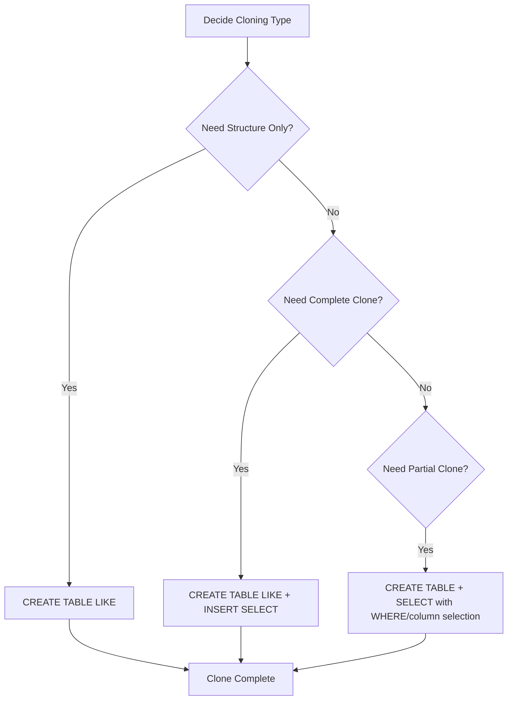

# MySQL Clone Tables

When working with databases, you'll often need to create copies of existing tables. Whether you're creating a backup before making changes, setting up a testing environment, or reproducing an issue, knowing how to clone tables in MySQL is an essential skill for any database developer.

## Introduction to Table Cloning

Table cloning is the process of creating a copy of an existing table. In MySQL, you can clone:
- Just the table structure (without data)
- The complete table (structure and data)
- A partial copy (selected columns or filtered rows)

Let's explore the different techniques for cloning tables in MySQL.

## Creating an Exact Duplicate of a Table

When you need an exact copy of a table (structure and all data), you can use the `CREATE TABLE ... SELECT` statement.

### Basic Syntax

```sql
CREATE TABLE new_table_name 
SELECT * FROM original_table_name;
```

### Example with Output

Let's say we have a `customers` table:

```sql
-- Creating and populating our example table
CREATE TABLE customers (
  id INT AUTO_INCREMENT PRIMARY KEY,
  name VARCHAR(100) NOT NULL,
  email VARCHAR(100) UNIQUE,
  created_at TIMESTAMP DEFAULT CURRENT_TIMESTAMP
);

INSERT INTO customers (name, email) VALUES
('John Smith', 'john@example.com'),
('Jane Doe', 'jane@example.com'),
('Mike Johnson', 'mike@example.com');

-- View the original table
SELECT * FROM customers;
```

Output:
```
+----+-------------+------------------+---------------------+
| id | name        | email            | created_at          |
+----+-------------+------------------+---------------------+
|  1 | John Smith  | john@example.com | 2023-11-15 14:22:31 |
|  2 | Jane Doe    | jane@example.com | 2023-11-15 14:22:31 |
|  3 | Mike Johnson| mike@example.com | 2023-11-15 14:22:31 |
+----+-------------+------------------+---------------------+
```

Now, let's clone this table:

```sql
-- Create an exact duplicate with data
CREATE TABLE customers_backup
SELECT * FROM customers;

-- View the cloned table
SELECT * FROM customers_backup;
```

Output:
```
+----+-------------+------------------+---------------------+
| id | name        | email            | created_at          |
+----+-------------+------------------+---------------------+
|  1 | John Smith  | john@example.com | 2023-11-15 14:22:31 |
|  2 | Jane Doe    | jane@example.com | 2023-11-15 14:22:31 |
|  3 | Mike Johnson| mike@example.com | 2023-11-15 14:22:31 |
+----+-------------+------------------+---------------------+
```

### Important Note About Constraints

One critical limitation of the simple `CREATE TABLE ... SELECT` approach is that it doesn't copy certain table attributes:

1. It doesn't preserve PRIMARY KEY constraints
2. It doesn't copy FOREIGN KEY constraints
3. It doesn't maintain AUTO_INCREMENT properties
4. It doesn't copy indexes

To verify this, let's check the table structure:

```sql
DESCRIBE customers;
```

Output:
```
+------------+--------------+------+-----+-------------------+----------------+
| Field      | Type         | Null | Key | Default           | Extra          |
+------------+--------------+------+-----+-------------------+----------------+
| id         | int          | NO   | PRI | NULL              | auto_increment |
| name       | varchar(100) | NO   |     | NULL              |                |
| email      | varchar(100) | YES  | UNI | NULL              |                |
| created_at | timestamp    | YES  |     | CURRENT_TIMESTAMP |                |
+------------+--------------+------+-----+-------------------+----------------+
```

```sql
DESCRIBE customers_backup;
```

Output:
```
+------------+--------------+------+-----+-------------------+-------+
| Field      | Type         | Null | Key | Default           | Extra |
+------------+--------------+------+-----+-------------------+-------+
| id         | int          | NO   |     | NULL              |       |
| name       | varchar(100) | NO   |     | NULL              |       |
| email      | varchar(100) | YES  |     | NULL              |       |
| created_at | timestamp    | YES  |     | CURRENT_TIMESTAMP |       |
+------------+--------------+------+-----+-------------------+-------+
```

Notice that the `id` column in the backup isn't a primary key and doesn't have the auto_increment property.

## Cloning Table Structure Only (Without Data)

Often, you'll want to create a copy of a table's structure without copying any data.

### Using CREATE TABLE LIKE

```sql
CREATE TABLE new_table_name LIKE original_table_name;
```

This command copies the entire table structure including:
- All columns with their data types and attributes
- All indexes
- PRIMARY KEY constraints
- UNIQUE constraints
- AUTO_INCREMENT properties

However, it does not copy FOREIGN KEY constraints.

### Example

```sql
-- Create a copy of just the structure
CREATE TABLE customers_structure LIKE customers;

-- Verify the structure was copied
DESCRIBE customers_structure;
```

Output:
```
+------------+--------------+------+-----+-------------------+----------------+
| Field      | Type         | Null | Key | Default           | Extra          |
+------------+--------------+------+-----+-------------------+----------------+
| id         | int          | NO   | PRI | NULL              | auto_increment |
| name       | varchar(100) | NO   |     | NULL              |                |
| email      | varchar(100) | YES  | UNI | NULL              |                |
| created_at | timestamp    | YES  |     | CURRENT_TIMESTAMP |                |
+------------+--------------+------+-----+-------------------+----------------+
```

```sql
-- Check that the new table is empty
SELECT COUNT(*) FROM customers_structure;
```

Output:
```
+----------+
| COUNT(*) |
+----------+
|        0 |
+----------+
```

## Complete Table Cloning (Structure and Data with All Attributes)

To create a perfect clone with both structure and data, we can combine the approaches:

```sql
-- Step 1: Clone the structure
CREATE TABLE complete_customers_clone LIKE customers;

-- Step 2: Copy the data
INSERT INTO complete_customers_clone
SELECT * FROM customers;

-- Verify the clone
SELECT * FROM complete_customers_clone;
```

Output:
```
+----+-------------+------------------+---------------------+
| id | name        | email            | created_at          |
+----+-------------+------------------+---------------------+
|  1 | John Smith  | john@example.com | 2023-11-15 14:22:31 |
|  2 | Jane Doe    | jane@example.com | 2023-11-15 14:22:31 |
|  3 | Mike Johnson| mike@example.com | 2023-11-15 14:22:31 |
+----+-------------+------------------+---------------------+
```

```sql
-- Check that structure is preserved
DESCRIBE complete_customers_clone;
```

Output:
```
+------------+--------------+------+-----+-------------------+----------------+
| Field      | Type         | Null | Key | Default           | Extra          |
+------------+--------------+------+-----+-------------------+----------------+
| id         | int          | NO   | PRI | NULL              | auto_increment |
| name       | varchar(100) | NO   |     | NULL              |                |
| email      | varchar(100) | YES  | UNI | NULL              |                |
| created_at | timestamp    | YES  |     | CURRENT_TIMESTAMP |                |
+------------+--------------+------+-----+-------------------+----------------+
```

## Creating Partial Clones

Sometimes you only need specific columns or rows from an existing table.

### Cloning with Selected Columns

```sql
CREATE TABLE customers_names_only
SELECT id, name FROM customers;
```

### Cloning with Filtered Data

```sql
-- Create a clone with only certain records
CREATE TABLE recent_customers
SELECT * FROM customers 
WHERE created_at > '2023-01-01';
```

## Practical Real-World Examples

### Example 1: Creating a Backup Before Schema Changes

Before modifying a critical table structure, it's a good practice to create a backup:

```sql
-- Create a timestamped backup
CREATE TABLE customers_backup_20231115 LIKE customers;
INSERT INTO customers_backup_20231115 SELECT * FROM customers;

-- Now you can safely alter the original table
ALTER TABLE customers ADD COLUMN phone_number VARCHAR(20);
```

### Example 2: Setting Up a Testing Environment

When testing new features, you might want to use real data but in a separate table:

```sql
-- Create a test table with real structure but limited data
CREATE TABLE customers_test LIKE customers;
INSERT INTO customers_test 
SELECT * FROM customers 
ORDER BY RAND() 
LIMIT 100;  -- Only copy 100 random records for testing
```

### Example 3: Creating a Table for Archiving

When archiving old data, you might want to move records to an archive table:

```sql
-- Create an archive table
CREATE TABLE customers_archive LIKE customers;

-- Move inactive customers to the archive
INSERT INTO customers_archive
SELECT * FROM customers
WHERE last_activity_date < DATE_SUB(NOW(), INTERVAL 1 YEAR);

-- Remove the archived records from the main table
DELETE FROM customers 
WHERE last_activity_date < DATE_SUB(NOW(), INTERVAL 1 YEAR);
```

## Advanced Clone Operations

### Cloning with a Different Auto-Increment Value

```sql
-- Clone structure
CREATE TABLE new_customers LIKE customers;

-- Set a different auto-increment start value
ALTER TABLE new_customers AUTO_INCREMENT = 1000;

-- Copy the data
INSERT INTO new_customers SELECT * FROM customers;
```

### Cloning to a Different Database

You can also clone tables across different databases:

```sql
CREATE TABLE development.customers LIKE production.customers;
INSERT INTO development.customers SELECT * FROM production.customers;
```

## Temporary Table Clones

For operations that require a temporary copy that will be automatically removed when your session ends:

```sql
-- Create a temporary clone
CREATE TEMPORARY TABLE temp_customers
SELECT * FROM customers;

-- Work with the temp table...
-- When your session ends, this table will be automatically dropped
```

## Process Flow for Table Cloning



## Common Issues and Solutions

### Primary Key Conflicts

When copying data to a table that already has records:

```sql
-- Using INSERT IGNORE to skip records that would cause conflicts
INSERT IGNORE INTO customers_backup SELECT * FROM customers;

-- Or using REPLACE to overwrite existing records
REPLACE INTO customers_backup SELECT * FROM customers;
```

### Handling Foreign Keys

When you need to preserve foreign keys:

```sql
-- Get the foreign key definition
SHOW CREATE TABLE customers;

-- Manually add the foreign key after cloning
ALTER TABLE customers_clone 
ADD CONSTRAINT fk_customer_order 
FOREIGN KEY (order_id) REFERENCES orders(id);
```

## Summary

Cloning tables in MySQL is a versatile operation that can be done in several ways depending on your needs:

1. **`CREATE TABLE ... SELECT`** - Creates a table and populates it with data, but doesn't preserve all constraints.
2. **`CREATE TABLE LIKE`** - Copies the table structure including indexes and constraints, but without data.
3. **Combined approach** - Using both commands to get a complete clone with all constraints and data.
4. **Partial clones** - Creating tables with only specific columns or filtered data.

Choose the right approach based on your specific requirements, whether you need a complete duplicate, just the structure, or a subset of the data.

## Exercises

1. Create a backup of a table that preserves all constraints and contains only the data from the past month.
2. Clone a table structure but modify one column's data type in the process.
3. Create a table that combines columns from two different existing tables.
4. Create a temporary clone of a table and use it to test a complex UPDATE operation before running it on the real table.

## Additional Resources

- [MySQL Documentation on CREATE TABLE](https://dev.mysql.com/doc/refman/8.0/en/create-table.html)
- [MySQL Documentation on INSERT](https://dev.mysql.com/doc/refman/8.0/en/insert.html)
- Practice more complex table operations by setting up test environments where you can experiment safely with cloning operations.

Remember that for production environments, always ensure you have proper backups before performing extensive table operations, as cloning large tables can impact database performance.