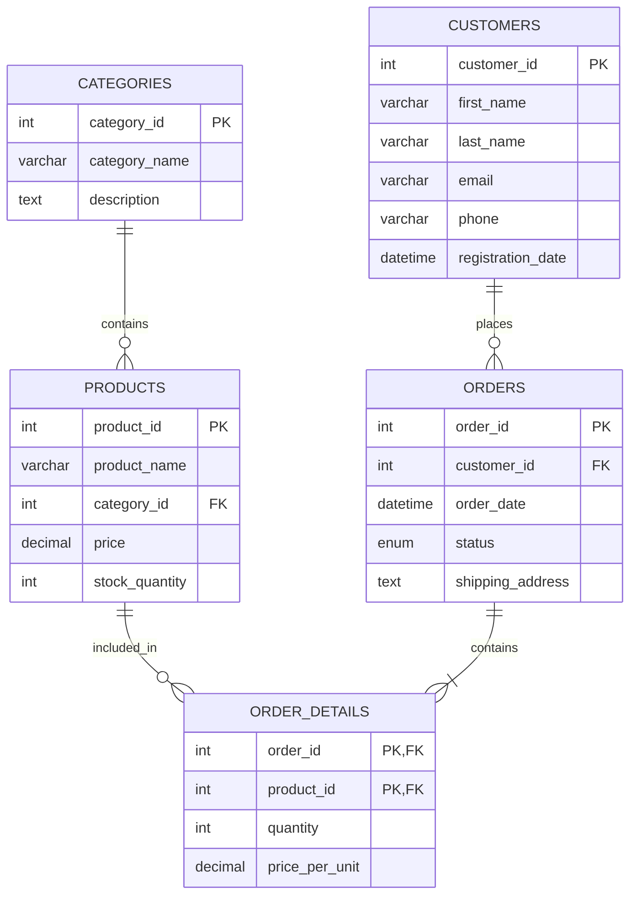

# MySQL Constraints

When designing a database, ensuring data integrity is crucial. MySQL constraints provide rules for the data in a table, helping maintain accuracy and reliability in your database. This guide will walk you through the various constraints available in MySQL and how to implement them effectively.

## Introduction to Constraints

Constraints are rules enforced on data columns in tables. They limit the type of data that can be stored in a table, ensuring the accuracy and reliability of the data. Think of constraints as guardrails that keep your data clean and consistent.

When a constraint is violated, the action that caused the violation is aborted, preventing corrupt data from entering your database.

## Types of MySQL Constraints

MySQL supports several types of constraints that you can apply when creating or modifying tables:

1. NOT NULL
2. UNIQUE
3. PRIMARY KEY
4. FOREIGN KEY
5. CHECK
6. DEFAULT
7. AUTO_INCREMENT

Let's explore each of these constraints in detail.

## NOT NULL Constraint

The `NOT NULL` constraint ensures that a column cannot have a NULL value. This is useful for columns that must contain a value.

### Syntax

```sql
CREATE TABLE table_name (
    column_name data_type NOT NULL,
    ...
);
```

### Example

```sql
CREATE TABLE employees (
    id INT NOT NULL,
    first_name VARCHAR(50) NOT NULL,
    last_name VARCHAR(50) NOT NULL,
    email VARCHAR(100)
);
```

In this example, the `id`, `first_name`, and `last_name` columns cannot be NULL, but the `email` column can.

### Adding a NOT NULL constraint to an existing column

```sql
ALTER TABLE employees
MODIFY email VARCHAR(100) NOT NULL;
```

This command modifies the `email` column to make it NOT NULL. Note that this will fail if the column already contains NULL values.

## UNIQUE Constraint

The `UNIQUE` constraint ensures all values in a column are distinct. This prevents duplicate values in a column.

### Syntax

```sql
CREATE TABLE table_name (
    column_name data_type UNIQUE,
    ...
);
```

### Example

```sql
CREATE TABLE users (
    id INT NOT NULL,
    username VARCHAR(50) UNIQUE,
    email VARCHAR(100) UNIQUE
);
```

In this example, both `username` and `email` columns must have unique values across all rows.

### Creating a UNIQUE constraint on multiple columns

```sql
CREATE TABLE orders (
    order_id INT,
    product_id INT,
    customer_id INT,
    UNIQUE (order_id, product_id)
);
```

This creates a constraint that ensures the combination of `order_id` and `product_id` is unique across the table.

### Adding a UNIQUE constraint to an existing table

```sql
ALTER TABLE users
ADD UNIQUE (username);
```

## PRIMARY KEY Constraint

A `PRIMARY KEY` is a column or set of columns that uniquely identifies each row in a table. It combines both `NOT NULL` and `UNIQUE` constraints.

### Syntax

```sql
CREATE TABLE table_name (
    column_name data_type PRIMARY KEY,
    ...
);
```

### Example

```sql
CREATE TABLE products (
    product_id INT PRIMARY KEY,
    product_name VARCHAR(100) NOT NULL,
    price DECIMAL(10, 2)
);
```

### Composite primary key

```sql
CREATE TABLE order_details (
    order_id INT,
    product_id INT,
    quantity INT NOT NULL,
    price DECIMAL(10, 2) NOT NULL,
    PRIMARY KEY (order_id, product_id)
);
```

This creates a primary key that consists of both the `order_id` and `product_id` columns.

### Adding a PRIMARY KEY to an existing table

```sql
ALTER TABLE products
ADD PRIMARY KEY (product_id);
```

## FOREIGN KEY Constraint

A `FOREIGN KEY` is a field in a table that refers to the PRIMARY KEY in another table. It maintains referential integrity by ensuring values in one table match values in another table.

### Syntax

```sql
CREATE TABLE table_name (
    column_name data_type,
    ...
    FOREIGN KEY (column_name) REFERENCES referenced_table(referenced_column)
);
```

### Example

```sql
CREATE TABLE orders (
    order_id INT PRIMARY KEY,
    customer_id INT,
    order_date DATE,
    FOREIGN KEY (customer_id) REFERENCES customers(customer_id)
);
```

In this example, the `customer_id` in the `orders` table must exist in the `customers` table.

### ON DELETE and ON UPDATE actions

You can specify what happens when the referenced row is deleted or updated:

```sql
CREATE TABLE orders (
    order_id INT PRIMARY KEY,
    customer_id INT,
    order_date DATE,
    FOREIGN KEY (customer_id) 
    REFERENCES customers(customer_id)
    ON DELETE CASCADE
    ON UPDATE CASCADE
);
```

Available actions include:
- `CASCADE`: Delete or update the row from the child table when the row from the parent table is deleted or updated
- `SET NULL`: Set the foreign key column(s) to NULL when the referenced row is deleted or updated
- `RESTRICT`: Prevent deletion or updating of the parent row if there is a related child row
- `NO ACTION`: Similar to RESTRICT
- `SET DEFAULT`: Set the foreign key column(s) to their default values

### Adding a FOREIGN KEY to an existing table

```sql
ALTER TABLE orders
ADD FOREIGN KEY (customer_id) REFERENCES customers(customer_id);
```

## CHECK Constraint

The `CHECK` constraint ensures that all values in a column satisfy certain conditions.

### Syntax

```sql
CREATE TABLE table_name (
    column_name data_type,
    CHECK (condition)
);
```

### Example

```sql
CREATE TABLE products (
    product_id INT PRIMARY KEY,
    product_name VARCHAR(100),
    price DECIMAL(10, 2),
    CHECK (price > 0)
);
```

In this example, the `price` column must always have a value greater than 0.

### Adding a CHECK constraint to an existing table

```sql
ALTER TABLE products
ADD CONSTRAINT price_check CHECK (price > 0);
```

## DEFAULT Constraint

The `DEFAULT` constraint provides a default value for a column when no value is specified.

### Syntax

```sql
CREATE TABLE table_name (
    column_name data_type DEFAULT default_value,
    ...
);
```

### Example

```sql
CREATE TABLE orders (
    order_id INT PRIMARY KEY,
    customer_id INT,
    order_date DATE DEFAULT CURRENT_DATE(),
    status VARCHAR(20) DEFAULT 'Pending'
);
```

In this example, if no values are provided for `order_date` and `status`, they will default to the current date and 'Pending' respectively.

### Adding a DEFAULT constraint to an existing column

```sql
ALTER TABLE orders
ALTER status SET DEFAULT 'Pending';
```

## AUTO_INCREMENT Constraint

The `AUTO_INCREMENT` constraint automatically generates a unique number when a new record is inserted into a table. This is typically used for primary key fields.

### Syntax

```sql
CREATE TABLE table_name (
    column_name data_type AUTO_INCREMENT PRIMARY KEY,
    ...
);
```

### Example

```sql
CREATE TABLE customers (
    customer_id INT AUTO_INCREMENT PRIMARY KEY,
    first_name VARCHAR(50),
    last_name VARCHAR(50),
    email VARCHAR(100)
);
```

When inserting a new record, you don't need to specify a value for the `customer_id`:

```sql
INSERT INTO customers (first_name, last_name, email)
VALUES ('John', 'Doe', 'john.doe@example.com');
```

The `customer_id` will be automatically assigned the next available integer.

### Modifying the AUTO_INCREMENT value

```sql
ALTER TABLE customers AUTO_INCREMENT = 1000;
```

This sets the next auto-incremented value to 1000.

## Real-World Application: E-commerce Database

Let's design a simple but realistic e-commerce database schema that uses various constraints:

```sql
-- Customers table
CREATE TABLE customers (
    customer_id INT AUTO_INCREMENT PRIMARY KEY,
    first_name VARCHAR(50) NOT NULL,
    last_name VARCHAR(50) NOT NULL,
    email VARCHAR(100) NOT NULL UNIQUE,
    phone VARCHAR(15),
    registration_date DATETIME DEFAULT CURRENT_TIMESTAMP
);

-- Product categories
CREATE TABLE categories (
    category_id INT AUTO_INCREMENT PRIMARY KEY,
    category_name VARCHAR(50) NOT NULL UNIQUE,
    description TEXT
);

-- Products table
CREATE TABLE products (
    product_id INT AUTO_INCREMENT PRIMARY KEY,
    product_name VARCHAR(100) NOT NULL,
    category_id INT,
    price DECIMAL(10, 2) NOT NULL,
    stock_quantity INT NOT NULL DEFAULT 0,
    FOREIGN KEY (category_id) REFERENCES categories(category_id) ON DELETE SET NULL,
    CHECK (price > 0),
    CHECK (stock_quantity >= 0)
);

-- Orders table
CREATE TABLE orders (
    order_id INT AUTO_INCREMENT PRIMARY KEY,
    customer_id INT NOT NULL,
    order_date DATETIME DEFAULT CURRENT_TIMESTAMP,
    status ENUM('Pending', 'Processing', 'Shipped', 'Delivered', 'Cancelled') DEFAULT 'Pending',
    shipping_address TEXT NOT NULL,
    FOREIGN KEY (customer_id) REFERENCES customers(customer_id) ON DELETE CASCADE
);

-- Order details table
CREATE TABLE order_details (
    order_id INT,
    product_id INT,
    quantity INT NOT NULL,
    price_per_unit DECIMAL(10, 2) NOT NULL,
    PRIMARY KEY (order_id, product_id),
    FOREIGN KEY (order_id) REFERENCES orders(order_id) ON DELETE CASCADE,
    FOREIGN KEY (product_id) REFERENCES products(product_id) ON DELETE CASCADE,
    CHECK (quantity > 0),
    CHECK (price_per_unit > 0)
);
```

This schema demonstrates the use of various constraints:
- `AUTO_INCREMENT` for IDs
- `PRIMARY KEY` constraints (both single-column and composite)
- `FOREIGN KEY` constraints with different actions
- `NOT NULL` constraints for required fields
- `UNIQUE` constraints for fields like email and category name
- `DEFAULT` constraints for dates and status fields
- `CHECK` constraints to ensure valid values (prices and quantities)

## Database Diagram

Here's a visual representation of the schema:



## Managing Constraints

### Dropping Constraints

You can remove constraints from a table when they're no longer needed:

```sql
-- Drop a foreign key constraint
ALTER TABLE orders
DROP FOREIGN KEY fk_constraint_name;

-- Drop a primary key
ALTER TABLE products
DROP PRIMARY KEY;

-- Drop a unique constraint
ALTER TABLE customers
DROP INDEX email;

-- Drop a check constraint (MySQL 8.0+)
ALTER TABLE products
DROP CHECK price_check;
```

### Finding Constraint Names

To find the names of constraints in your database:

```sql
-- Get constraint names for a table
SELECT CONSTRAINT_NAME, CONSTRAINT_TYPE
FROM INFORMATION_SCHEMA.TABLE_CONSTRAINTS
WHERE TABLE_NAME = 'table_name';

-- Get foreign key constraints
SELECT CONSTRAINT_NAME, TABLE_NAME, REFERENCED_TABLE_NAME
FROM INFORMATION_SCHEMA.REFERENTIAL_CONSTRAINTS
WHERE CONSTRAINT_SCHEMA = 'database_name';
```

## Best Practices for Using Constraints

1. **Always use a primary key**: Every table should have a primary key to uniquely identify each row.

2. **Define foreign keys properly**: Foreign keys help maintain referential integrity. Choose the appropriate ON DELETE and ON UPDATE actions.

3. **Use NOT NULL for required fields**: If a column should always have a value, make it NOT NULL.

4. **Use UNIQUE for unique data**: Apply UNIQUE constraints to columns that should not have duplicate values, like email addresses.

5. **Apply CHECK constraints for validation**: Use CHECK constraints to enforce business rules on data values.

6. **Set DEFAULT values when appropriate**: Use DEFAULT constraints to provide default values for columns when no value is specified.

7. **Consider constraint impacts on performance**: Some constraints, especially complex CHECK constraints, might impact performance.

## Summary

MySQL constraints are powerful tools for ensuring data integrity in your database. They enforce rules on the data being stored, preventing common errors and ensuring consistency. The main constraints in MySQL include NOT NULL, UNIQUE, PRIMARY KEY, FOREIGN KEY, CHECK, DEFAULT, and AUTO_INCREMENT.

By properly implementing these constraints, you can build a robust database structure that maintains clean, reliable data while enforcing business rules automatically at the database level.

## Exercises

1. Create a table for a library database with appropriate constraints for books, members, and loans.

2. Modify an existing table to add a UNIQUE constraint on a combination of first name and last name columns.

3. Set up a parent-child relationship between two tables using FOREIGN KEY constraints with appropriate ON DELETE and ON UPDATE actions.

4. Create a table with a CHECK constraint that ensures a date field is always in the future.

5. Design a database schema for a simple blog with users, posts, and comments tables, using all the constraint types discussed.

## Additional Resources

- [MySQL Documentation on Constraints](https://dev.mysql.com/doc/refman/8.0/en/constraints.html)
- [Understanding Database Normalization](https://dev.mysql.com/doc/refman/8.0/en/normalization.html)
- [MySQL Data Types](https://dev.mysql.com/doc/refman/8.0/en/data-types.html)

Happy coding and database designing!