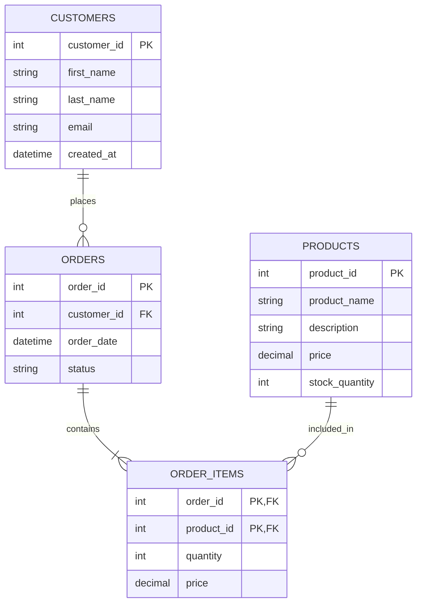

# MySQL Primary Keys

Primary keys are one of the most fundamental concepts in database design. In this tutorial, you'll learn what primary keys are in MySQL, why they're essential, and how to implement them effectively in your database tables.

## What is a Primary Key?

A primary key is a column or set of columns that uniquely identifies each row in a table. It serves as a unique identifier for records in your database.

Key characteristics of primary keys:

- Each value must be **unique** within the table
- Cannot contain **NULL** values
- A table can have **only one** primary key
- Optimized for **lookups** and **joins**

## Why Use Primary Keys?

Primary keys are crucial for several reasons:

1. They **ensure data integrity** by preventing duplicate records
2. They provide a **fast way to find records** (MySQL creates an index for the primary key)
3. They establish **relationships between tables** (foreign keys reference primary keys)
4. They help **organize data** in a logical manner

## Creating Tables with Primary Keys

Let's look at how to create a table with a primary key in MySQL.

### Basic Syntax

```sql
CREATE TABLE table_name (
    column1 datatype PRIMARY KEY,
    column2 datatype,
    column3 datatype,
    ...
);
```

### Single-Column Primary Key

Here's an example of creating a table with a single-column primary key:

```sql
CREATE TABLE products (
    product_id INT PRIMARY KEY,
    product_name VARCHAR(100) NOT NULL,
    price DECIMAL(10,2),
    stock_quantity INT
);
```

When you run this command, MySQL creates a table with `product_id` as the primary key. This ensures each product will have a unique identifier.

### Composite Primary Key

Sometimes, a single column isn't enough to uniquely identify rows. In such cases, you can create a composite primary key using multiple columns:

```sql
CREATE TABLE order_items (
    order_id INT,
    product_id INT,
    quantity INT,
    price DECIMAL(10,2),
    PRIMARY KEY (order_id, product_id)
);
```

In this example, the combination of `order_id` and `product_id` forms a unique identifier for each row.

## Adding Primary Keys to Existing Tables

If you've already created a table without a primary key, you can add one using the ALTER TABLE command:

```sql
ALTER TABLE customers 
ADD PRIMARY KEY (customer_id);
```

## Auto-Increment Primary Keys

One of the most common practices in MySQL is to use auto-incrementing primary keys. This lets MySQL automatically generate a unique value for each new record.

```sql
CREATE TABLE users (
    user_id INT AUTO_INCREMENT PRIMARY KEY,
    username VARCHAR(50) NOT NULL UNIQUE,
    email VARCHAR(100) NOT NULL,
    registration_date DATETIME DEFAULT CURRENT_TIMESTAMP
);
```

Now when you insert a new user, you don't have to specify the `user_id`:

```sql
INSERT INTO users (username, email) VALUES ('john_doe', 'john@example.com');
```

MySQL will automatically assign the next available integer as the `user_id`.

## Removing Primary Keys

To remove a primary key from a table:

```sql
ALTER TABLE table_name
DROP PRIMARY KEY;
```

Be careful when removing primary keys, as it might affect foreign key relationships and database integrity.

## Real-World Example: Online Store Database

Let's create a simplified version of an online store database with properly defined primary keys:

```sql
-- Customers table with auto-increment primary key
CREATE TABLE customers (
    customer_id INT AUTO_INCREMENT PRIMARY KEY,
    first_name VARCHAR(50) NOT NULL,
    last_name VARCHAR(50) NOT NULL,
    email VARCHAR(100) NOT NULL UNIQUE,
    created_at DATETIME DEFAULT CURRENT_TIMESTAMP
);

-- Products table with auto-increment primary key
CREATE TABLE products (
    product_id INT AUTO_INCREMENT PRIMARY KEY,
    product_name VARCHAR(100) NOT NULL,
    description TEXT,
    price DECIMAL(10,2) NOT NULL,
    stock_quantity INT NOT NULL DEFAULT 0
);

-- Orders table with auto-increment primary key and foreign key
CREATE TABLE orders (
    order_id INT AUTO_INCREMENT PRIMARY KEY,
    customer_id INT NOT NULL,
    order_date DATETIME DEFAULT CURRENT_TIMESTAMP,
    status VARCHAR(20) DEFAULT 'pending',
    FOREIGN KEY (customer_id) REFERENCES customers(customer_id)
);

-- Order items table with composite primary key
CREATE TABLE order_items (
    order_id INT,
    product_id INT,
    quantity INT NOT NULL,
    price DECIMAL(10,2) NOT NULL,
    PRIMARY KEY (order_id, product_id),
    FOREIGN KEY (order_id) REFERENCES orders(order_id),
    FOREIGN KEY (product_id) REFERENCES products(product_id)
);
```

In this example:
- Each customer has a unique `customer_id`
- Each product has a unique `product_id`
- Each order has a unique `order_id`
- Order items are uniquely identified by the combination of `order_id` and `product_id`

This structure allows for efficient data storage and retrieval while maintaining data integrity through relationships between tables.

## Database Relationship Diagram

Here's a simple diagram showing the relationships between these tables:



## Best Practices for Primary Keys

1. **Choose the right column(s)**: Select columns that will remain unique and won't change over time
2. **Use AUTO_INCREMENT**: For most tables, an auto-incrementing integer primary key is optimal
3. **Keep it simple**: Simple primary keys are easier to work with and more efficient
4. **Consider UUID**: For distributed systems, UUID can be a good alternative to integers
5. **Be cautious with composite keys**: While useful in some cases, composite keys can complicate queries and relationships

## Common Mistakes to Avoid

1. **Using changeable business data as primary keys**: Business data (like email addresses) might change over time
2. **Creating unnecessarily complex composite keys**: The more columns in a primary key, the more overhead
3. **Not using primary keys at all**: Every table should have a primary key for data integrity
4. **Using string columns for primary keys**: While possible, this is less efficient than numeric keys

## Advanced Primary Key Techniques

### Using UUIDs as Primary Keys

For distributed systems or when you need globally unique identifiers:

```sql
CREATE TABLE sessions (
    session_id CHAR(36) PRIMARY KEY,
    user_id INT NOT NULL,
    login_time DATETIME DEFAULT CURRENT_TIMESTAMP,
    expiry_time DATETIME,
    ip_address VARCHAR(45)
);

-- Insert using UUID function
INSERT INTO sessions (session_id, user_id, expiry_time, ip_address) 
VALUES (UUID(), 1001, DATE_ADD(NOW(), INTERVAL 24 HOUR), '192.168.1.1');
```

### Managing Auto-Increment Values

To see the next auto-increment value for a table:

```sql
SHOW TABLE STATUS LIKE 'table_name';
```

To reset the auto-increment value:

```sql
ALTER TABLE table_name AUTO_INCREMENT = 1000;
```

## Summary

Primary keys are essential for database design and data integrity. They uniquely identify each record in a table and enable relationships between tables. When designing databases:

- Every table should have a primary key
- Auto-increment integer columns make excellent primary keys for most use cases
- Primary keys should be chosen carefully to ensure they remain unique and don't change
- Composite primary keys can handle complex unique constraints but should be used judiciously

Understanding primary keys is fundamental to creating well-structured, efficient, and reliable database systems.

## Practice Exercises

1. Create a `students` table with appropriate fields and a primary key
2. Create an `courses` table and an `enrollments` table with a composite primary key
3. Add a primary key to an existing table named `legacy_data`
4. Design a database schema for a library system with at least four tables, ensuring all tables have appropriate primary keys
5. Try working with UUID primary keys by creating a table that uses them instead of integers

## Additional Resources

- [MySQL Official Documentation on Primary Keys](https://dev.mysql.com/doc/refman/8.0/en/primary-key-optimization.html)
- [Database Indexing Strategies](https://dev.mysql.com/doc/refman/8.0/en/optimization-indexes.html)
- [Normalization and Database Design Principles](https://dev.mysql.com/doc/refman/8.0/en/normalization.html)

Now that you understand primary keys, you're on your way to designing robust database schemas that efficiently store and manage your application's data!